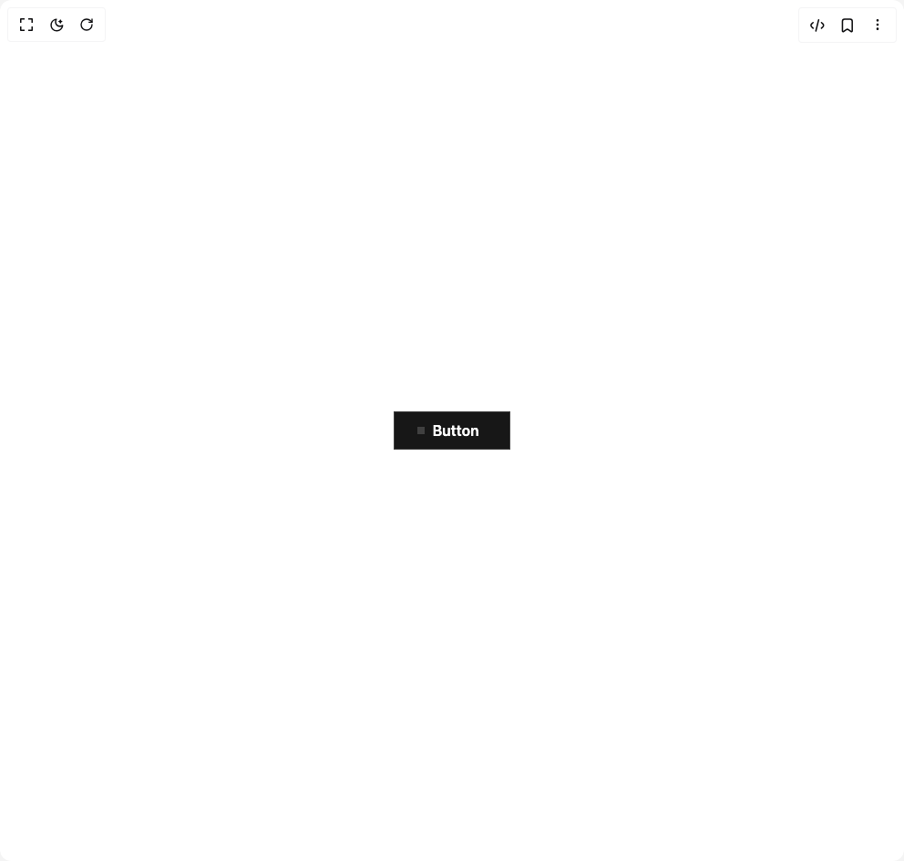

# Build Hover Button 1 in BuilderStudio

> Build this component in our Agentic IDE: [BuilderStudio](https://builderstudio.dev).
>
> Join the BuilderStudio community on [Discord](https://discord.gg/QdWeSGCqfe) and [Reddit](https://reddit.com/r/builderstudio).



## Component

- Author group: `rubenerik`
- Component: `hover-button-1`
- Variant: `default`
- Rendered HTML snapshot: [`rendered.html`](rendered.html)

## BuilderStudio prompt

You are implementing a React component based on a component reference.

## Component identity

- Author: rubenerik
- Component slug: hover-button-1
- Demo slug: default
- Title: hover-button-1
- Description: 

## Goal

Recreate this component in a React + TypeScript + Tailwind CSS project. Preserve the visual layout, spacing, colors, border radius, shadows, interaction behavior, animation behavior, responsive behavior, and dark mode behavior shown in the rendered demo.

## Implementation requirements

- Use React and TypeScript.
- Use Tailwind CSS classes whenever possible.
- Keep the component self-contained unless the source files require helper components.
- If the source uses CSS variables, custom CSS, animations, or keyframes, include them.
- If the source uses external packages, list and use the required packages.
- Preserve accessibility attributes, button semantics, links, keyboard behavior, and ARIA attributes when visible in the source.
- Do not replace the component with a simplified placeholder.
- Return complete production-ready code.

## Dependencies

No reference metadata available.

## Rendered DOM snapshot

This is the rendered demo HTML extracted from the live preview. Use it to verify structure, class names, visible content, and layout.

```html
<div id="root"><div class="w-screen min-h-screen flex justify-center items-center"><div class="w-screen min-h-screen flex justify-center items-center"><div class="group relative w-32 cursor-pointer overflow-hidden border border-neutral-700 bg-neutral-900 p-2 text-center font-semibold text-white"><span class="inline-block translate-x-1 transition-all duration-300 group-hover:translate-x-12 group-hover:opacity-0">Button</span><div class="absolute top-0 z-10 flex h-full w-full translate-x-12 items-center justify-center gap-2 opacity-0 transition-all duration-300 group-hover:-translate-x-1 group-hover:opacity-100"><span>Button</span><svg xmlns="http://www.w3.org/2000/svg" width="24" height="24" viewBox="0 0 24 24" fill="none" stroke="currentColor" stroke-width="2" stroke-linecap="round" stroke-linejoin="round" class="lucide lucide-arrow-right" aria-hidden="true"><path d="M5 12h14"></path><path d="m12 5 7 7-7 7"></path></svg></div><div class="absolute left-[20%] top-[40%] h-2 w-2 scale-[1] bg-neutral-700 transition-all duration-300 group-hover:left-[0%] group-hover:top-[0%] group-hover:h-full group-hover:w-full group-hover:scale-[1.8] group-hover:bg-fuchsia-500 dark:group-hover:bg-fuchsia-700"></div></div></div></div></div>
```

## Reference source files

No reference source files were available.
