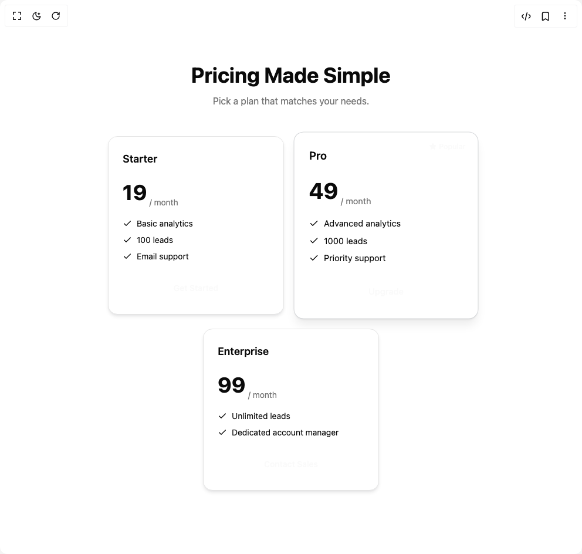

# Build Pricing Card Component in BuilderStudio

> Build this component in our Agentic IDE: [BuilderStudio](https://builderstudio.dev).
>
> Join the BuilderStudio community on [Discord](https://discord.gg/QdWeSGCqfe) and [Reddit](https://reddit.com/r/builderstudio).



## Component

- Author group: `rubenerik`
- Component: `pricing-card-component`
- Variant: `default`
- Rendered HTML snapshot: [`rendered.html`](rendered.html)

## BuilderStudio prompt

You are implementing a React component based on a component reference.

## Component identity

- Author: rubenerik
- Component slug: pricing-card-component
- Demo slug: default
- Title: pricing-card-component
- Description: 

## Goal

Recreate this component in a React + TypeScript + Tailwind CSS project. Preserve the visual layout, spacing, colors, border radius, shadows, interaction behavior, animation behavior, responsive behavior, and dark mode behavior shown in the rendered demo.

## Implementation requirements

- Use React and TypeScript.
- Use Tailwind CSS classes whenever possible.
- Keep the component self-contained unless the source files require helper components.
- If the source uses CSS variables, custom CSS, animations, or keyframes, include them.
- If the source uses external packages, list and use the required packages.
- Preserve accessibility attributes, button semantics, links, keyboard behavior, and ARIA attributes when visible in the source.
- Do not replace the component with a simplified placeholder.
- Return complete production-ready code.

## Dependencies

No reference metadata available.

## Rendered DOM snapshot

This is the rendered demo HTML extracted from the live preview. Use it to verify structure, class names, visible content, and layout.

```html
<div id="root"><div class="w-screen min-h-screen flex justify-center items-center"><div class="w-screen min-h-screen flex justify-center items-center"><section class="container py-20"><div class="mb-12 text-center space-y-3"><h2 class="text-4xl font-bold">Pricing Made Simple</h2><p class="text-muted-foreground">Pick a plan that matches your needs.</p></div><div class="flex flex-wrap justify-center gap-6"><div class="relative flex w-[300px] flex-col rounded-2xl border p-6 shadow-md bg-card transition"><h3 class="font-semibold text-lg">Starter</h3><div class="mt-4 flex items-end gap-1"><number-flow-react class="text-4xl font-bold"></number-flow-react><span class="text-sm text-muted-foreground">/ month</span></div><ul class="mt-4 space-y-2 text-sm text-left"><li class="flex items-center gap-2"><svg xmlns="http://www.w3.org/2000/svg" width="24" height="24" viewBox="0 0 24 24" fill="none" stroke="currentColor" stroke-width="2" stroke-linecap="round" stroke-linejoin="round" class="lucide lucide-check h-4 w-4 text-primary" aria-hidden="true"><path d="M20 6 9 17l-5-5"></path></svg> Basic analytics</li><li class="flex items-center gap-2"><svg xmlns="http://www.w3.org/2000/svg" width="24" height="24" viewBox="0 0 24 24" fill="none" stroke="currentColor" stroke-width="2" stroke-linecap="round" stroke-linejoin="round" class="lucide lucide-check h-4 w-4 text-primary" aria-hidden="true"><path d="M20 6 9 17l-5-5"></path></svg> 100 leads</li><li class="flex items-center gap-2"><svg xmlns="http://www.w3.org/2000/svg" width="24" height="24" viewBox="0 0 24 24" fill="none" stroke="currentColor" stroke-width="2" stroke-linecap="round" stroke-linejoin="round" class="lucide lucide-check h-4 w-4 text-primary" aria-hidden="true"><path d="M20 6 9 17l-5-5"></path></svg> Email support</li></ul><a href="#" class="inline-flex items-center justify-center whitespace-nowrap rounded-md text-sm font-medium ring-offset-background transition-colors focus-visible:outline-none focus-visible:ring-2 focus-visible:ring-ring focus-visible:ring-offset-2 disabled:pointer-events-none disabled:opacity-50 bg-primary text-primary-foreground hover:bg-primary/90 h-10 px-4 py-2 mt-6 w-full">Get Started</a></div><div class="relative flex w-[300px] flex-col rounded-2xl border p-6 bg-card transition border-primary shadow-lg scale-105"><span class="absolute right-3 top-3 flex items-center rounded bg-primary px-2 py-0.5 text-xs text-primary-foreground"><svg xmlns="http://www.w3.org/2000/svg" width="24" height="24" viewBox="0 0 24 24" fill="none" stroke="currentColor" stroke-width="2" stroke-linecap="round" stroke-linejoin="round" class="lucide lucide-star mr-1 h-3 w-3 fill-current" aria-hidden="true"><path d="M11.525 2.295a.53.53 0 0 1 .95 0l2.31 4.679a2.123 2.123 0 0 0 1.595 1.16l5.166.756a.53.53 0 0 1 .294.904l-3.736 3.638a2.123 2.123 0 0 0-.611 1.878l.882 5.14a.53.53 0 0 1-.771.56l-4.618-2.428a2.122 2.122 0 0 0-1.973 0L6.396 21.01a.53.53 0 0 1-.77-.56l.881-5.139a2.122 2.122 0 0 0-.611-1.879L2.16 9.795a.53.53 0 0 1 .294-.906l5.165-.755a2.122 2.122 0 0 0 1.597-1.16z"></path></svg> Popular</span><h3 class="font-semibold text-lg">Pro</h3><div class="mt-4 flex items-end gap-1"><number-flow-react class="text-4xl font-bold"></number-flow-react><span class="text-sm text-muted-foreground">/ month</span></div><ul class="mt-4 space-y-2 text-sm text-left"><li class="flex items-center gap-2"><svg xmlns="http://www.w3.org/2000/svg" width="24" height="24" viewBox="0 0 24 24" fill="none" stroke="currentColor" stroke-width="2" stroke-linecap="round" stroke-linejoin="round" class="lucide lucide-check h-4 w-4 text-primary" aria-hidden="true"><path d="M20 6 9 17l-5-5"></path></svg> Advanced analytics</li><li class="flex items-center gap-2"><svg xmlns="http://www.w3.org/2000/svg" width="24" height="24" viewBox="0 0 24 24" fill="none" stroke="currentColor" stroke-width="2" stroke-linecap="round" stroke-linejoin="round" class="lucide lucide-check h-4 w-4 text-primary" aria-hidden="true"><path d="M20 6 9 17l-5-5"></path></svg> 1000 leads</li><li class="flex items-center gap-2"><svg xmlns="http://www.w3.org/2000/svg" width="24" height="24" viewBox="0 0 24 24" fill="none" stroke="currentColor" stroke-width="2" stroke-linecap="round" stroke-linejoin="round" class="lucide lucide-check h-4 w-4 text-primary" aria-hidden="true"><path d="M20 6 9 17l-5-5"></path></svg> Priority support</li></ul><a href="#" class="inline-flex items-center justify-center whitespace-nowrap rounded-md text-sm font-medium ring-offset-background transition-colors focus-visible:outline-none focus-visible:ring-2 focus-visible:ring-ring focus-visible:ring-offset-2 disabled:pointer-events-none disabled:opacity-50 bg-primary text-primary-foreground hover:bg-primary/90 h-10 px-4 py-2 mt-6 w-full">Upgrade</a></div><div class="relative flex w-[300px] flex-col rounded-2xl border p-6 shadow-md bg-card transition"><h3 class="font-semibold text-lg">Enterprise</h3><div class="mt-4 flex items-end gap-1"><number-flow-react class="text-4xl font-bold"></number-flow-react><span class="text-sm text-muted-foreground">/ month</span></div><ul class="mt-4 space-y-2 text-sm text-left"><li class="flex items-center gap-2"><svg xmlns="http://www.w3.org/2000/svg" width="24" height="24" viewBox="0 0 24 24" fill="none" stroke="currentColor" stroke-width="2" stroke-linecap="round" stroke-linejoin="round" class="lucide lucide-check h-4 w-4 text-primary" aria-hidden="true"><path d="M20 6 9 17l-5-5"></path></svg> Unlimited leads</li><li class="flex items-center gap-2"><svg xmlns="http://www.w3.org/2000/svg" width="24" height="24" viewBox="0 0 24 24" fill="none" stroke="currentColor" stroke-width="2" stroke-linecap="round" stroke-linejoin="round" class="lucide lucide-check h-4 w-4 text-primary" aria-hidden="true"><path d="M20 6 9 17l-5-5"></path></svg> Dedicated account manager</li></ul><a href="#" class="inline-flex items-center justify-center whitespace-nowrap rounded-md text-sm font-medium ring-offset-background transition-colors focus-visible:outline-none focus-visible:ring-2 focus-visible:ring-ring focus-visible:ring-offset-2 disabled:pointer-events-none disabled:opacity-50 bg-primary text-primary-foreground hover:bg-primary/90 h-10 px-4 py-2 mt-6 w-full">Contact Sales</a></div></div></section></div></div></div>
```

## Reference source files

No reference source files were available.
