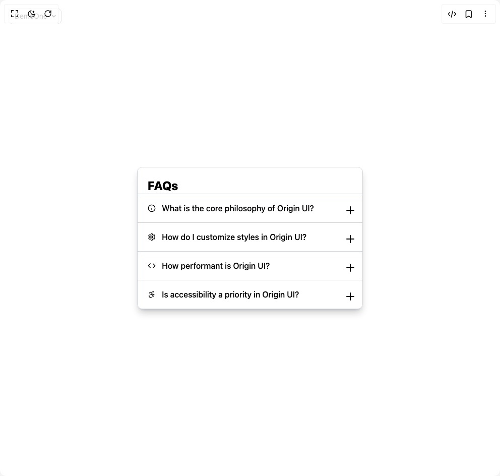

# Build Accordian in BuilderStudio

> Build this component in our Agentic IDE: [BuilderStudio](https://builderstudio.dev).
>
> Join the BuilderStudio community on [Discord](https://discord.gg/QdWeSGCqfe) and [Reddit](https://reddit.com/r/builderstudio).



## Component

- Author group: `ruixenui`
- Component: `accordian`
- Variant: `default`
- Rendered HTML snapshot: [`rendered.html`](rendered.html)

## BuilderStudio prompt

You are implementing a React component based on a component reference.

## Component identity

- Author: ruixenui
- Component slug: accordian
- Demo slug: default
- Title: accordian
- Description: 

## Goal

Recreate this component in a React + TypeScript + Tailwind CSS project. Preserve the visual layout, spacing, colors, border radius, shadows, interaction behavior, animation behavior, responsive behavior, and dark mode behavior shown in the rendered demo.

## Implementation requirements

- Use React and TypeScript.
- Use Tailwind CSS classes whenever possible.
- Keep the component self-contained unless the source files require helper components.
- If the source uses CSS variables, custom CSS, animations, or keyframes, include them.
- If the source uses external packages, list and use the required packages.
- Preserve accessibility attributes, button semantics, links, keyboard behavior, and ARIA attributes when visible in the source.
- Do not replace the component with a simplified placeholder.
- Return complete production-ready code.

## Dependencies

No reference metadata available.

## Rendered DOM snapshot

This is the rendered demo HTML extracted from the live preview. Use it to verify structure, class names, visible content, and layout.

```html
<div id="root"><div class="fixed top-4 left-4 z-10"><select class="appearance-none h-8 max-w-[200px] text-sm leading-tight rounded-lg pl-3 pr-7 py-0 border bg-background focus:outline-none focus:ring-0"><option value="named_DemoOne_DemoOne">DemoOne</option></select><div class="absolute top-1/2 transform -translate-y-1/2 right-2 pointer-events-none"><svg class="w-4 h-4 fill-current" viewBox="0 0 20 20"><path d="M5.516 7.548c.436-.446 1.043-.48 1.576 0L10 10.405l2.908-2.857c.533-.48 1.14-.446 1.576 0 .436.445.408 1.197 0 1.615l-3.734 3.705c-.533.534-1.39.534-1.923 0l-3.734-3.705c-.408-.418-.436-1.17 0-1.615z"></path></svg></div></div><div class="w-screen min-h-screen flex justify-center items-center"><div class="
        max-w-md
        bg-white/30 dark:bg-black/30
        backdrop-blur-md
        border border-gray-300 dark:border-gray-700
        rounded-lg
        shadow-lg shadow-black/20 dark:shadow-white/10
        transition-colors duration-500
      "><h2 class="text-2xl font-extrabold text-black dark:text-white px-5 pt-5 select-none">FAQs</h2><div><div class="border-t border-gray-300 dark:border-gray-700 last:border-b-0"><button aria-expanded="false" class="
                                    flex items-center justify-between w-full
                                    px-5 py-4
                                    text-black dark:text-white
                                    text-base font-medium
                                    cursor-pointer
                                    bg-transparent
                                    transition-colors duration-300
                                    hover:bg-black/5 dark:hover:bg-white/10
                                    select-none
                                    focus:outline-none
                                    "><div class="flex items-center gap-3"><svg xmlns="http://www.w3.org/2000/svg" width="24" height="24" viewBox="0 0 24 24" fill="none" stroke="currentColor" stroke-width="2" stroke-linecap="round" stroke-linejoin="round" class="lucide lucide-info w-4 h-4 text-black dark:text-white" aria-hidden="true"><circle cx="12" cy="12" r="10"></circle><path d="M12 16v-4"></path><path d="M12 8h.01"></path></svg><span>What is the core philosophy of Origin UI?</span></div><div class="relative w-4 h-4 flex-shrink-0"><svg xmlns="http://www.w3.org/2000/svg" width="24" height="24" viewBox="0 0 24 24" fill="none" stroke="currentColor" stroke-width="2" stroke-linecap="round" stroke-linejoin="round" class="lucide lucide-plus absolute inset-0 text-black dark:text-white transition-opacity duration-300 opacity-100" aria-hidden="true"><path d="M5 12h14"></path><path d="M12 5v14"></path></svg><svg xmlns="http://www.w3.org/2000/svg" width="24" height="24" viewBox="0 0 24 24" fill="none" stroke="currentColor" stroke-width="2" stroke-linecap="round" stroke-linejoin="round" class="lucide lucide-minus absolute inset-0 text-black dark:text-white transition-opacity duration-300 opacity-0" aria-hidden="true"><path d="M5 12h14"></path></svg></div></button><div style="overflow: hidden; height: 0px; opacity: 0;"><div class="px-5 pb-5 text-gray-700 dark:text-gray-300 text-sm leading-relaxed select-text">Origin UI emphasizes developer experience by offering lightweight, accessible components with strong TypeScript support and excellent documentation.</div></div></div><div class="border-t border-gray-300 dark:border-gray-700 last:border-b-0"><button aria-expanded="false" class="
                                    flex items-center justify-between w-full
                                    px-5 py-4
                                    text-black dark:text-white
                                    text-base font-medium
                                    cursor-pointer
                                    bg-transparent
                                    transition-colors duration-300
                                    hover:bg-black/5 dark:hover:bg-white/10
                                    select-none
                                    focus:outline-none
                                    "><div class="flex items-center gap-3"><svg xmlns="http://www.w3.org/2000/svg" width="24" height="24" viewBox="0 0 24 24" fill="none" stroke="currentColor" stroke-width="2" stroke-linecap="round" stroke-linejoin="round" class="lucide lucide-settings w-4 h-4 text-black dark:text-white" aria-hidden="true"><path d="M12.22 2h-.44a2 2 0 0 0-2 2v.18a2 2 0 0 1-1 1.73l-.43.25a2 2 0 0 1-2 0l-.15-.08a2 2 0 0 0-2.73.73l-.22.38a2 2 0 0 0 .73 2.73l.15.1a2 2 0 0 1 1 1.72v.51a2 2 0 0 1-1 1.74l-.15.09a2 2 0 0 0-.73 2.73l.22.38a2 2 0 0 0 2.73.73l.15-.08a2 2 0 0 1 2 0l.43.25a2 2 0 0 1 1 1.73V20a2 2 0 0 0 2 2h.44a2 2 0 0 0 2-2v-.18a2 2 0 0 1 1-1.73l.43-.25a2 2 0 0 1 2 0l.15.08a2 2 0 0 0 2.73-.73l.22-.39a2 2 0 0 0-.73-2.73l-.15-.08a2 2 0 0 1-1-1.74v-.5a2 2 0 0 1 1-1.74l.15-.09a2 2 0 0 0 .73-2.73l-.22-.38a2 2 0 0 0-2.73-.73l-.15.08a2 2 0 0 1-2 0l-.43-.25a2 2 0 0 1-1-1.73V4a2 2 0 0 0-2-2z"></path><circle cx="12" cy="12" r="3"></circle></svg><span>How do I customize styles in Origin UI?</span></div><div class="relative w-4 h-4 flex-shrink-0"><svg xmlns="http://www.w3.org/2000/svg" width="24" height="24" viewBox="0 0 24 24" fill="none" stroke="currentColor" stroke-width="2" stroke-linecap="round" stroke-linejoin="round" class="lucide lucide-plus absolute inset-0 text-black dark:text-white transition-opacity duration-300 opacity-100" aria-hidden="true"><path d="M5 12h14"></path><path d="M12 5v14"></path></svg><svg xmlns="http://www.w3.org/2000/svg" width="24" height="24" viewBox="0 0 24 24" fill="none" stroke="currentColor" stroke-width="2" stroke-linecap="round" stroke-linejoin="round" class="lucide lucide-minus absolute inset-0 text-black dark:text-white transition-opacity duration-300 opacity-0" aria-hidden="true"><path d="M5 12h14"></path></svg></div></button><div style="overflow: hidden; height: 0px; opacity: 0;"><div class="px-5 pb-5 text-gray-700 dark:text-gray-300 text-sm leading-relaxed select-text">You can easily customize styles using CSS variables, Tailwind, or traditional CSS by overriding classNames or using the style prop.</div></div></div><div class="border-t border-gray-300 dark:border-gray-700 last:border-b-0"><button aria-expanded="false" class="
                                    flex items-center justify-between w-full
                                    px-5 py-4
                                    text-black dark:text-white
                                    text-base font-medium
                                    cursor-pointer
                                    bg-transparent
                                    transition-colors duration-300
                                    hover:bg-black/5 dark:hover:bg-white/10
                                    select-none
                                    focus:outline-none
                                    "><div class="flex items-center gap-3"><svg xmlns="http://www.w3.org/2000/svg" width="24" height="24" viewBox="0 0 24 24" fill="none" stroke="currentColor" stroke-width="2" stroke-linecap="round" stroke-linejoin="round" class="lucide lucide-code w-4 h-4 text-black dark:text-white" aria-hidden="true"><polyline points="16 18 22 12 16 6"></polyline><polyline points="8 6 2 12 8 18"></polyline></svg><span>How performant is Origin UI?</span></div><div class="relative w-4 h-4 flex-shrink-0"><svg xmlns="http://www.w3.org/2000/svg" width="24" height="24" viewBox="0 0 24 24" fill="none" stroke="currentColor" stroke-width="2" stroke-linecap="round" stroke-linejoin="round" class="lucide lucide-plus absolute inset-0 text-black dark:text-white transition-opacity duration-300 opacity-100" aria-hidden="true"><path d="M5 12h14"></path><path d="M12 5v14"></path></svg><svg xmlns="http://www.w3.org/2000/svg" width="24" height="24" viewBox="0 0 24 24" fill="none" stroke="currentColor" stroke-width="2" stroke-linecap="round" stroke-linejoin="round" class="lucide lucide-minus absolute inset-0 text-black dark:text-white transition-opacity duration-300 opacity-0" aria-hidden="true"><path d="M5 12h14"></path></svg></div></button><div style="overflow: hidden; height: 0px; opacity: 0;"><div class="px-5 pb-5 text-gray-700 dark:text-gray-300 text-sm leading-relaxed select-text">Optimized for performance with minimal bundle size, tree shaking, and fast rendering to keep your apps light and fast.</div></div></div><div class="border-t border-gray-300 dark:border-gray-700 last:border-b-0"><button aria-expanded="false" class="
                                    flex items-center justify-between w-full
                                    px-5 py-4
                                    text-black dark:text-white
                                    text-base font-medium
                                    cursor-pointer
                                    bg-transparent
                                    transition-colors duration-300
                                    hover:bg-black/5 dark:hover:bg-white/10
                                    select-none
                                    focus:outline-none
                                    "><div class="flex items-center gap-3"><svg xmlns="http://www.w3.org/2000/svg" width="24" height="24" viewBox="0 0 24 24" fill="none" stroke="currentColor" stroke-width="2" stroke-linecap="round" stroke-linejoin="round" class="lucide lucide-accessibility w-4 h-4 text-black dark:text-white" aria-hidden="true"><circle cx="16" cy="4" r="1"></circle><path d="m18 19 1-7-6 1"></path><path d="m5 8 3-3 5.5 3-2.36 3.5"></path><path d="M4.24 14.5a5 5 0 0 0 6.88 6"></path><path d="M13.76 17.5a5 5 0 0 0-6.88-6"></path></svg><span>Is accessibility a priority in Origin UI?</span></div><div class="relative w-4 h-4 flex-shrink-0"><svg xmlns="http://www.w3.org/2000/svg" width="24" height="24" viewBox="0 0 24 24" fill="none" stroke="currentColor" stroke-width="2" stroke-linecap="round" stroke-linejoin="round" class="lucide lucide-plus absolute inset-0 text-black dark:text-white transition-opacity duration-300 opacity-100" aria-hidden="true"><path d="M5 12h14"></path><path d="M12 5v14"></path></svg><svg xmlns="http://www.w3.org/2000/svg" width="24" height="24" viewBox="0 0 24 24" fill="none" stroke="currentColor" stroke-width="2" stroke-linecap="round" stroke-linejoin="round" class="lucide lucide-minus absolute inset-0 text-black dark:text-white transition-opacity duration-300 opacity-0" aria-hidden="true"><path d="M5 12h14"></path></svg></div></button><div style="overflow: hidden; height: 0px; opacity: 0;"><div class="px-5 pb-5 text-gray-700 dark:text-gray-300 text-sm leading-relaxed select-text">Absolutely! All components follow WAI-ARIA guidelines and support keyboard navigation and screen readers out of the box.</div></div></div></div></div></div></div>
```

## Reference source files

No reference source files were available.
