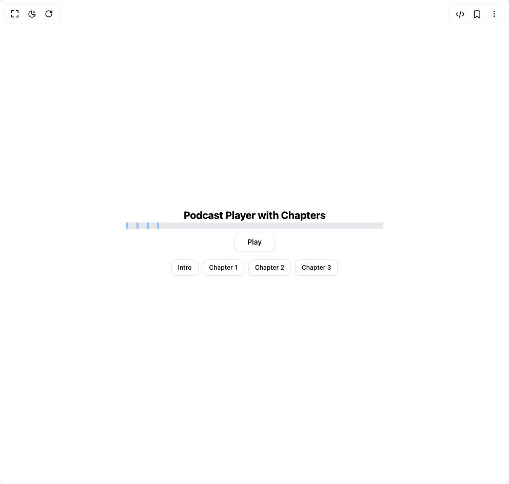

# Build Audio Timeline With Chapters in BuilderStudio

> Build this component in our Agentic IDE: [BuilderStudio](https://builderstudio.dev).
>
> Join the BuilderStudio community on [Discord](https://discord.gg/QdWeSGCqfe) and [Reddit](https://reddit.com/r/builderstudio).



## Component

- Author group: `ruixenui`
- Component: `audio-timeline-with-chapters`
- Variant: `default`
- Rendered HTML snapshot: [`rendered.html`](rendered.html)

## BuilderStudio prompt

You are implementing a React component based on a component reference.

## Component identity

- Author: ruixenui
- Component slug: audio-timeline-with-chapters
- Demo slug: default
- Title: audio-timeline-with-chapters
- Description: 

## Goal

Recreate this component in a React + TypeScript + Tailwind CSS project. Preserve the visual layout, spacing, colors, border radius, shadows, interaction behavior, animation behavior, responsive behavior, and dark mode behavior shown in the rendered demo.

## Implementation requirements

- Use React and TypeScript.
- Use Tailwind CSS classes whenever possible.
- Keep the component self-contained unless the source files require helper components.
- If the source uses CSS variables, custom CSS, animations, or keyframes, include them.
- If the source uses external packages, list and use the required packages.
- Preserve accessibility attributes, button semantics, links, keyboard behavior, and ARIA attributes when visible in the source.
- Do not replace the component with a simplified placeholder.
- Return complete production-ready code.

## Dependencies

No reference metadata available.

## Rendered DOM snapshot

This is the rendered demo HTML extracted from the live preview. Use it to verify structure, class names, visible content, and layout.

```html
<div id="root"><div class="w-screen min-h-screen flex justify-center items-center"><div class="w-screen min-h-screen flex justify-center items-center"><div class="flex flex-col items-center justify-center"><h2 class="text-xl font-bold text-black dark:text-white">Podcast Player with Chapters</h2><div class="flex flex-col items-center gap-2"><div class="relative w-full h-3 bg-gray-200 dark:bg-gray-700  cursor-pointer" style="width: 500px;"><div class="absolute top-0 left-0 h-full bg-gray-600 dark:bg-white" style="width: 0%;"></div><div class="absolute top-0 w-1 h-3 bg-blue-300 cursor-pointer" title="Intro" style="left: 0%;"></div><div class="absolute top-0 w-1 h-3 bg-blue-300 cursor-pointer" title="Chapter 1" style="left: 4.02452%;"></div><div class="absolute top-0 w-1 h-3 bg-blue-300 cursor-pointer" title="Chapter 2" style="left: 8.04904%;"></div><div class="absolute top-0 w-1 h-3 bg-blue-300 cursor-pointer" title="Chapter 3" style="left: 12.0736%;"></div></div><button class="inline-flex items-center justify-center whitespace-nowrap rounded-lg font-medium transition-colors outline-offset-2 focus-visible:outline-2 focus-visible:outline-ring/70 disabled:pointer-events-none disabled:opacity-50 [&amp;_svg]:pointer-events-none [&amp;_svg]:shrink-0 border border-input bg-background shadow-sm shadow-black/5 hover:bg-accent hover:text-accent-foreground h-9 w-20 text-sm px-2 py-1">Play</button><div class="flex flex-wrap justify-center gap-2 mt-2"><button class="inline-flex items-center justify-center whitespace-nowrap font-medium transition-colors outline-offset-2 focus-visible:outline-2 focus-visible:outline-ring/70 disabled:pointer-events-none disabled:opacity-50 [&amp;_svg]:pointer-events-none [&amp;_svg]:shrink-0 border border-input bg-background shadow-sm shadow-black/5 hover:bg-accent hover:text-accent-foreground h-8 rounded-lg px-3 text-xs">Intro</button><button class="inline-flex items-center justify-center whitespace-nowrap font-medium transition-colors outline-offset-2 focus-visible:outline-2 focus-visible:outline-ring/70 disabled:pointer-events-none disabled:opacity-50 [&amp;_svg]:pointer-events-none [&amp;_svg]:shrink-0 border border-input bg-background shadow-sm shadow-black/5 hover:bg-accent hover:text-accent-foreground h-8 rounded-lg px-3 text-xs">Chapter 1</button><button class="inline-flex items-center justify-center whitespace-nowrap font-medium transition-colors outline-offset-2 focus-visible:outline-2 focus-visible:outline-ring/70 disabled:pointer-events-none disabled:opacity-50 [&amp;_svg]:pointer-events-none [&amp;_svg]:shrink-0 border border-input bg-background shadow-sm shadow-black/5 hover:bg-accent hover:text-accent-foreground h-8 rounded-lg px-3 text-xs">Chapter 2</button><button class="inline-flex items-center justify-center whitespace-nowrap font-medium transition-colors outline-offset-2 focus-visible:outline-2 focus-visible:outline-ring/70 disabled:pointer-events-none disabled:opacity-50 [&amp;_svg]:pointer-events-none [&amp;_svg]:shrink-0 border border-input bg-background shadow-sm shadow-black/5 hover:bg-accent hover:text-accent-foreground h-8 rounded-lg px-3 text-xs">Chapter 3</button></div></div></div></div></div></div>
```

## Reference source files

No reference source files were available.
