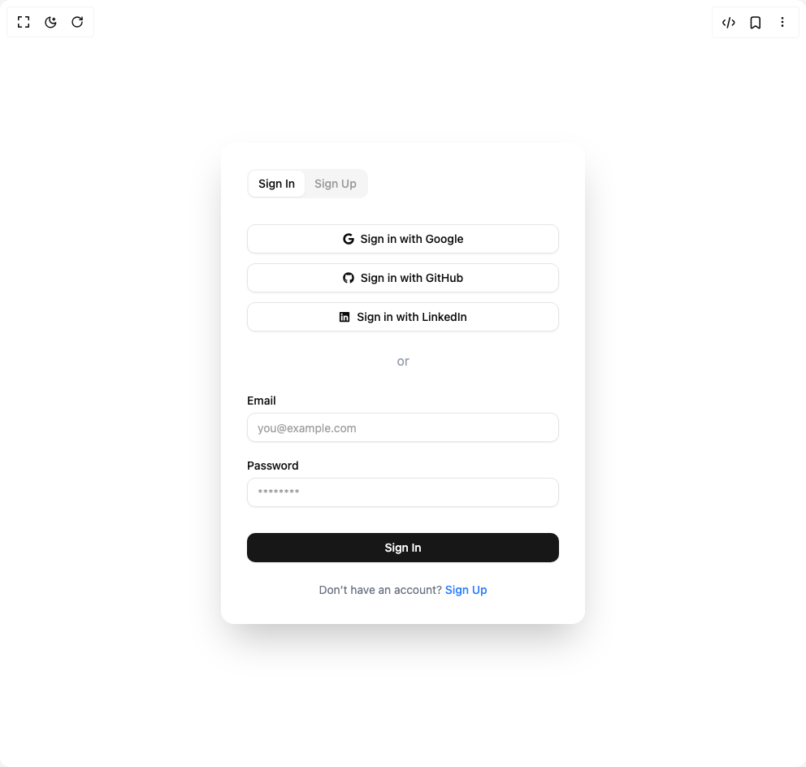

# Build Auth Tabs Card in BuilderStudio

> Build this component in our Agentic IDE: [BuilderStudio](https://builderstudio.dev).
>
> Join the BuilderStudio community on [Discord](https://discord.gg/QdWeSGCqfe) and [Reddit](https://reddit.com/r/builderstudio).



## Component

- Author group: `ruixenui`
- Component: `auth-tabs-card`
- Variant: `default`
- Rendered HTML snapshot: [`rendered.html`](rendered.html)

## BuilderStudio prompt

You are implementing a React component based on a component reference.

## Component identity

- Author: ruixenui
- Component slug: auth-tabs-card
- Demo slug: default
- Title: auth-tabs-card
- Description: 

## Goal

Recreate this component in a React + TypeScript + Tailwind CSS project. Preserve the visual layout, spacing, colors, border radius, shadows, interaction behavior, animation behavior, responsive behavior, and dark mode behavior shown in the rendered demo.

## Implementation requirements

- Use React and TypeScript.
- Use Tailwind CSS classes whenever possible.
- Keep the component self-contained unless the source files require helper components.
- If the source uses CSS variables, custom CSS, animations, or keyframes, include them.
- If the source uses external packages, list and use the required packages.
- Preserve accessibility attributes, button semantics, links, keyboard behavior, and ARIA attributes when visible in the source.
- Do not replace the component with a simplified placeholder.
- Return complete production-ready code.

## Dependencies

No reference metadata available.

## Rendered DOM snapshot

This is the rendered demo HTML extracted from the live preview. Use it to verify structure, class names, visible content, and layout.

```html
<div id="root"><div class="w-screen min-h-screen flex justify-center items-center"><div class="w-screen min-h-screen flex justify-center items-center"><div class="flex items-center justify-center"><div class="w-md bg-white dark:bg-gray-800 rounded-2xl shadow-2xl p-8"><div dir="ltr" data-orientation="horizontal" class="w-full"><div role="tablist" aria-orientation="horizontal" class="inline-flex items-center justify-center rounded-lg bg-muted p-0.5 text-muted-foreground/70 mb-6" tabindex="0" data-orientation="horizontal" style="outline: none;"><button type="button" role="tab" aria-selected="true" aria-controls="radix-«r0»-content-sign-in" data-state="active" id="radix-«r0»-trigger-sign-in" class="inline-flex items-center justify-center whitespace-nowrap rounded-md px-3 py-1.5 text-sm font-medium outline-offset-2 transition-all hover:text-muted-foreground focus-visible:outline-2 focus-visible:outline-ring/70 disabled:pointer-events-none disabled:opacity-50 data-[state=active]:bg-background data-[state=active]:text-foreground data-[state=active]:shadow-sm data-[state=active]:shadow-black/5" tabindex="-1" data-orientation="horizontal" data-radix-collection-item="">Sign In</button><button type="button" role="tab" aria-selected="false" aria-controls="radix-«r0»-content-sign-up" data-state="inactive" id="radix-«r0»-trigger-sign-up" class="inline-flex items-center justify-center whitespace-nowrap rounded-md px-3 py-1.5 text-sm font-medium outline-offset-2 transition-all hover:text-muted-foreground focus-visible:outline-2 focus-visible:outline-ring/70 disabled:pointer-events-none disabled:opacity-50 data-[state=active]:bg-background data-[state=active]:text-foreground data-[state=active]:shadow-sm data-[state=active]:shadow-black/5" tabindex="-1" data-orientation="horizontal" data-radix-collection-item="">Sign Up</button></div><div data-state="active" data-orientation="horizontal" role="tabpanel" aria-labelledby="radix-«r0»-trigger-sign-in" id="radix-«r0»-content-sign-in" tabindex="0" class="mt-2 outline-offset-2 focus-visible:outline-2 focus-visible:outline-ring/70" style="animation-duration: 0s;"><div class="flex flex-col gap-4"><div class="flex flex-col gap-3"><button class="whitespace-nowrap rounded-lg text-sm font-medium transition-colors outline-offset-2 focus-visible:outline-2 focus-visible:outline-ring/70 disabled:pointer-events-none disabled:opacity-50 [&amp;_svg]:pointer-events-none [&amp;_svg]:shrink-0 border border-input bg-background shadow-sm shadow-black/5 hover:bg-accent hover:text-accent-foreground h-9 px-4 py-2 flex items-center justify-center gap-2"><svg stroke="currentColor" fill="currentColor" stroke-width="0" viewBox="0 0 488 512" height="1em" width="1em" xmlns="http://www.w3.org/2000/svg"><path d="M488 261.8C488 403.3 391.1 504 248 504 110.8 504 0 393.2 0 256S110.8 8 248 8c66.8 0 123 24.5 166.3 64.9l-67.5 64.9C258.5 52.6 94.3 116.6 94.3 256c0 86.5 69.1 156.6 153.7 156.6 98.2 0 135-70.4 140.8-106.9H248v-85.3h236.1c2.3 12.7 3.9 24.9 3.9 41.4z"></path></svg> Sign in with Google</button><button class="whitespace-nowrap rounded-lg text-sm font-medium transition-colors outline-offset-2 focus-visible:outline-2 focus-visible:outline-ring/70 disabled:pointer-events-none disabled:opacity-50 [&amp;_svg]:pointer-events-none [&amp;_svg]:shrink-0 border border-input bg-background shadow-sm shadow-black/5 hover:bg-accent hover:text-accent-foreground h-9 px-4 py-2 flex items-center justify-center gap-2"><svg stroke="currentColor" fill="currentColor" stroke-width="0" viewBox="0 0 496 512" height="1em" width="1em" xmlns="http://www.w3.org/2000/svg"><path d="M165.9 397.4c0 2-2.3 3.6-5.2 3.6-3.3.3-5.6-1.3-5.6-3.6 0-2 2.3-3.6 5.2-3.6 3-.3 5.6 1.3 5.6 3.6zm-31.1-4.5c-.7 2 1.3 4.3 4.3 4.9 2.6 1 5.6 0 6.2-2s-1.3-4.3-4.3-5.2c-2.6-.7-5.5.3-6.2 2.3zm44.2-1.7c-2.9.7-4.9 2.6-4.6 4.9.3 2 2.9 3.3 5.9 2.6 2.9-.7 4.9-2.6 4.6-4.6-.3-1.9-3-3.2-5.9-2.9zM244.8 8C106.1 8 0 113.3 0 252c0 110.9 69.8 205.8 169.5 239.2 12.8 2.3 17.3-5.6 17.3-12.1 0-6.2-.3-40.4-.3-61.4 0 0-70 15-84.7-29.8 0 0-11.4-29.1-27.8-36.6 0 0-22.9-15.7 1.6-15.4 0 0 24.9 2 38.6 25.8 21.9 38.6 58.6 27.5 72.9 20.9 2.3-16 8.8-27.1 16-33.7-55.9-6.2-112.3-14.3-112.3-110.5 0-27.5 7.6-41.3 23.6-58.9-2.6-6.5-11.1-33.3 2.6-67.9 20.9-6.5 69 27 69 27 20-5.6 41.5-8.5 62.8-8.5s42.8 2.9 62.8 8.5c0 0 48.1-33.6 69-27 13.7 34.7 5.2 61.4 2.6 67.9 16 17.7 25.8 31.5 25.8 58.9 0 96.5-58.9 104.2-114.8 110.5 9.2 7.9 17 22.9 17 46.4 0 33.7-.3 75.4-.3 83.6 0 6.5 4.6 14.4 17.3 12.1C428.2 457.8 496 362.9 496 252 496 113.3 383.5 8 244.8 8zM97.2 352.9c-1.3 1-1 3.3.7 5.2 1.6 1.6 3.9 2.3 5.2 1 1.3-1 1-3.3-.7-5.2-1.6-1.6-3.9-2.3-5.2-1zm-10.8-8.1c-.7 1.3.3 2.9 2.3 3.9 1.6 1 3.6.7 4.3-.7.7-1.3-.3-2.9-2.3-3.9-2-.6-3.6-.3-4.3.7zm32.4 35.6c-1.6 1.3-1 4.3 1.3 6.2 2.3 2.3 5.2 2.6 6.5 1 1.3-1.3.7-4.3-1.3-6.2-2.2-2.3-5.2-2.6-6.5-1zm-11.4-14.7c-1.6 1-1.6 3.6 0 5.9 1.6 2.3 4.3 3.3 5.6 2.3 1.6-1.3 1.6-3.9 0-6.2-1.4-2.3-4-3.3-5.6-2z"></path></svg> Sign in with GitHub</button><button class="whitespace-nowrap rounded-lg text-sm font-medium transition-colors outline-offset-2 focus-visible:outline-2 focus-visible:outline-ring/70 disabled:pointer-events-none disabled:opacity-50 [&amp;_svg]:pointer-events-none [&amp;_svg]:shrink-0 border border-input bg-background shadow-sm shadow-black/5 hover:bg-accent hover:text-accent-foreground h-9 px-4 py-2 flex items-center justify-center gap-2"><svg stroke="currentColor" fill="currentColor" stroke-width="0" viewBox="0 0 448 512" height="1em" width="1em" xmlns="http://www.w3.org/2000/svg"><path d="M416 32H31.9C14.3 32 0 46.5 0 64.3v383.4C0 465.5 14.3 480 31.9 480H416c17.6 0 32-14.5 32-32.3V64.3c0-17.8-14.4-32.3-32-32.3zM135.4 416H69V202.2h66.5V416zm-33.2-243c-21.3 0-38.5-17.3-38.5-38.5S80.9 96 102.2 96c21.2 0 38.5 17.3 38.5 38.5 0 21.3-17.2 38.5-38.5 38.5zm282.1 243h-66.4V312c0-24.8-.5-56.7-34.5-56.7-34.6 0-39.9 27-39.9 54.9V416h-66.4V202.2h63.7v29.2h.9c8.9-16.8 30.6-34.5 62.9-34.5 67.2 0 79.7 44.3 79.7 101.9V416z"></path></svg> Sign in with LinkedIn</button></div><div class="flex items-center justify-center my-2 text-gray-400 dark:text-gray-300">or</div><div><label class="text-sm font-medium leading-4 text-foreground peer-disabled:cursor-not-allowed peer-disabled:opacity-70" for="signin-email">Email</label><input class="flex h-9 w-full rounded-lg border border-input bg-background px-3 py-2 text-sm text-foreground shadow-sm shadow-black/5 transition-shadow placeholder:text-muted-foreground/70 focus-visible:border-ring focus-visible:outline-none focus-visible:ring-[3px] focus-visible:ring-ring/20 disabled:cursor-not-allowed disabled:opacity-50 mt-1" id="signin-email" placeholder="you@example.com" type="email"></div><div><label class="text-sm font-medium leading-4 text-foreground peer-disabled:cursor-not-allowed peer-disabled:opacity-70" for="signin-password">Password</label><input class="flex h-9 w-full rounded-lg border border-input bg-background px-3 py-2 text-sm text-foreground shadow-sm shadow-black/5 transition-shadow placeholder:text-muted-foreground/70 focus-visible:border-ring focus-visible:outline-none focus-visible:ring-[3px] focus-visible:ring-ring/20 disabled:cursor-not-allowed disabled:opacity-50 mt-1" id="signin-password" placeholder="********" type="password"></div><button class="inline-flex items-center justify-center whitespace-nowrap rounded-lg text-sm font-medium transition-colors outline-offset-2 focus-visible:outline-2 focus-visible:outline-ring/70 disabled:pointer-events-none disabled:opacity-50 [&amp;_svg]:pointer-events-none [&amp;_svg]:shrink-0 bg-primary text-primary-foreground shadow-sm shadow-black/5 hover:bg-primary/90 h-9 px-4 py-2 mt-4 w-full">Sign In</button><p class="text-center text-sm text-gray-500 dark:text-gray-300 mt-2">Don’t have an account? <span class="font-medium text-blue-500 cursor-pointer hover:underline">Sign Up</span></p></div></div><div data-state="inactive" data-orientation="horizontal" role="tabpanel" aria-labelledby="radix-«r0»-trigger-sign-up" hidden="" id="radix-«r0»-content-sign-up" tabindex="0" class="mt-2 outline-offset-2 focus-visible:outline-2 focus-visible:outline-ring/70"></div></div></div></div></div></div></div>
```

## Reference source files

No reference source files were available.
