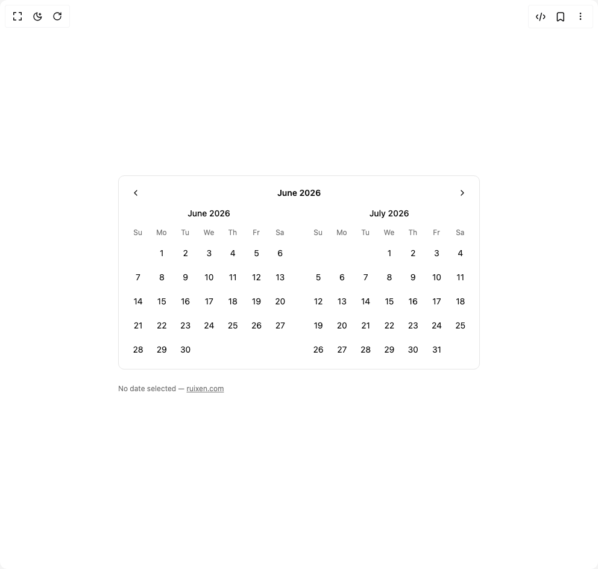

# Build Calendar Twin in BuilderStudio

> Build this component in our Agentic IDE: [BuilderStudio](https://builderstudio.dev).
>
> Join the BuilderStudio community on [Discord](https://discord.gg/QdWeSGCqfe) and [Reddit](https://reddit.com/r/builderstudio).



## Component

- Author group: `ruixenui`
- Component: `calendar-twin`
- Variant: `default`
- Rendered HTML snapshot: [`rendered.html`](rendered.html)

## BuilderStudio prompt

You are implementing a React component based on a component reference.

## Component identity

- Author: ruixenui
- Component slug: calendar-twin
- Demo slug: default
- Title: calendar-twin
- Description: 

## Goal

Recreate this component in a React + TypeScript + Tailwind CSS project. Preserve the visual layout, spacing, colors, border radius, shadows, interaction behavior, animation behavior, responsive behavior, and dark mode behavior shown in the rendered demo.

## Implementation requirements

- Use React and TypeScript.
- Use Tailwind CSS classes whenever possible.
- Keep the component self-contained unless the source files require helper components.
- If the source uses CSS variables, custom CSS, animations, or keyframes, include them.
- If the source uses external packages, list and use the required packages.
- Preserve accessibility attributes, button semantics, links, keyboard behavior, and ARIA attributes when visible in the source.
- Do not replace the component with a simplified placeholder.
- Return complete production-ready code.

## Dependencies

No reference metadata available.

## Rendered DOM snapshot

This is the rendered demo HTML extracted from the live preview. Use it to verify structure, class names, visible content, and layout.

```html
<div id="root"><div class="w-screen min-h-screen flex justify-center items-center"><div class="w-screen min-h-screen flex justify-center items-center"><div class="p-8 flex flex-col items-start space-y-4"><div class="rounded-lg border bg-background p-3 w-[600px]"><div class="flex items-center justify-between mb-2"><button class="inline-flex items-center justify-center whitespace-nowrap rounded-lg text-sm font-medium transition-colors outline-offset-2 focus-visible:outline-2 focus-visible:outline-ring/70 disabled:pointer-events-none disabled:opacity-50 [&amp;_svg]:pointer-events-none [&amp;_svg]:shrink-0 hover:bg-accent hover:text-accent-foreground h-8 w-8"><svg xmlns="http://www.w3.org/2000/svg" width="24" height="24" viewBox="0 0 24 24" fill="none" stroke="currentColor" stroke-width="2" stroke-linecap="round" stroke-linejoin="round" class="lucide lucide-chevron-left h-4 w-4" aria-hidden="true"><path d="m15 18-6-6 6-6"></path></svg></button><button class="text-sm font-semibold hover:underline">June 2026</button><button class="inline-flex items-center justify-center whitespace-nowrap rounded-lg text-sm font-medium transition-colors outline-offset-2 focus-visible:outline-2 focus-visible:outline-ring/70 disabled:pointer-events-none disabled:opacity-50 [&amp;_svg]:pointer-events-none [&amp;_svg]:shrink-0 hover:bg-accent hover:text-accent-foreground h-8 w-8"><svg xmlns="http://www.w3.org/2000/svg" width="24" height="24" viewBox="0 0 24 24" fill="none" stroke="currentColor" stroke-width="2" stroke-linecap="round" stroke-linejoin="round" class="lucide lucide-chevron-right h-4 w-4" aria-hidden="true"><path d="m9 18 6-6-6-6"></path></svg></button></div><div class="flex gap-6"><div class="w-full"><div class="mb-2 text-center text-sm font-medium">June 2026</div><div class="grid grid-cols-7 text-xs text-muted-foreground"><div class="h-7 flex items-center justify-center">Su</div><div class="h-7 flex items-center justify-center">Mo</div><div class="h-7 flex items-center justify-center">Tu</div><div class="h-7 flex items-center justify-center">We</div><div class="h-7 flex items-center justify-center">Th</div><div class="h-7 flex items-center justify-center">Fr</div><div class="h-7 flex items-center justify-center">Sa</div></div><div class="grid grid-cols-7"><div class="h-9"></div><button class="h-9 w-9 m-0.5 flex items-center justify-center rounded-md text-sm transition-colors hover:bg-accent hover:text-foreground">1</button><button class="h-9 w-9 m-0.5 flex items-center justify-center rounded-md text-sm transition-colors hover:bg-accent hover:text-foreground">2</button><button class="h-9 w-9 m-0.5 flex items-center justify-center rounded-md text-sm transition-colors hover:bg-accent hover:text-foreground">3</button><button class="h-9 w-9 m-0.5 flex items-center justify-center rounded-md text-sm transition-colors hover:bg-accent hover:text-foreground">4</button><button class="h-9 w-9 m-0.5 flex items-center justify-center rounded-md text-sm transition-colors hover:bg-accent hover:text-foreground">5</button><button class="h-9 w-9 m-0.5 flex items-center justify-center rounded-md text-sm transition-colors hover:bg-accent hover:text-foreground">6</button><button class="h-9 w-9 m-0.5 flex items-center justify-center rounded-md text-sm transition-colors hover:bg-accent hover:text-foreground">7</button><button class="h-9 w-9 m-0.5 flex items-center justify-center rounded-md text-sm transition-colors hover:bg-accent hover:text-foreground">8</button><button class="h-9 w-9 m-0.5 flex items-center justify-center rounded-md text-sm transition-colors hover:bg-accent hover:text-foreground">9</button><button class="h-9 w-9 m-0.5 flex items-center justify-center rounded-md text-sm transition-colors hover:bg-accent hover:text-foreground">10</button><button class="h-9 w-9 m-0.5 flex items-center justify-center rounded-md text-sm transition-colors hover:bg-accent hover:text-foreground">11</button><button class="h-9 w-9 m-0.5 flex items-center justify-center rounded-md text-sm transition-colors hover:bg-accent hover:text-foreground">12</button><button class="h-9 w-9 m-0.5 flex items-center justify-center rounded-md text-sm transition-colors hover:bg-accent hover:text-foreground">13</button><button class="h-9 w-9 m-0.5 flex items-center justify-center rounded-md text-sm transition-colors hover:bg-accent hover:text-foreground">14</button><button class="h-9 w-9 m-0.5 flex items-center justify-center rounded-md text-sm transition-colors hover:bg-accent hover:text-foreground">15</button><button class="h-9 w-9 m-0.5 flex items-center justify-center rounded-md text-sm transition-colors hover:bg-accent hover:text-foreground">16</button><button class="h-9 w-9 m-0.5 flex items-center justify-center rounded-md text-sm transition-colors hover:bg-accent hover:text-foreground">17</button><button class="h-9 w-9 m-0.5 flex items-center justify-center rounded-md text-sm transition-colors hover:bg-accent hover:text-foreground">18</button><button class="h-9 w-9 m-0.5 flex items-center justify-center rounded-md text-sm transition-colors hover:bg-accent hover:text-foreground">19</button><button class="h-9 w-9 m-0.5 flex items-center justify-center rounded-md text-sm transition-colors hover:bg-accent hover:text-foreground">20</button><button class="h-9 w-9 m-0.5 flex items-center justify-center rounded-md text-sm transition-colors hover:bg-accent hover:text-foreground">21</button><button class="h-9 w-9 m-0.5 flex items-center justify-center rounded-md text-sm transition-colors hover:bg-accent hover:text-foreground">22</button><button class="h-9 w-9 m-0.5 flex items-center justify-center rounded-md text-sm transition-colors hover:bg-accent hover:text-foreground">23</button><button class="h-9 w-9 m-0.5 flex items-center justify-center rounded-md text-sm transition-colors hover:bg-accent hover:text-foreground">24</button><button class="h-9 w-9 m-0.5 flex items-center justify-center rounded-md text-sm transition-colors hover:bg-accent hover:text-foreground">25</button><button class="h-9 w-9 m-0.5 flex items-center justify-center rounded-md text-sm transition-colors hover:bg-accent hover:text-foreground">26</button><button class="h-9 w-9 m-0.5 flex items-center justify-center rounded-md text-sm transition-colors hover:bg-accent hover:text-foreground">27</button><button class="h-9 w-9 m-0.5 flex items-center justify-center rounded-md text-sm transition-colors hover:bg-accent hover:text-foreground">28</button><button class="h-9 w-9 m-0.5 flex items-center justify-center rounded-md text-sm transition-colors hover:bg-accent hover:text-foreground">29</button><button class="h-9 w-9 m-0.5 flex items-center justify-center rounded-md text-sm transition-colors hover:bg-accent hover:text-foreground">30</button></div></div><div class="w-full"><div class="mb-2 text-center text-sm font-medium">July 2026</div><div class="grid grid-cols-7 text-xs text-muted-foreground"><div class="h-7 flex items-center justify-center">Su</div><div class="h-7 flex items-center justify-center">Mo</div><div class="h-7 flex items-center justify-center">Tu</div><div class="h-7 flex items-center justify-center">We</div><div class="h-7 flex items-center justify-center">Th</div><div class="h-7 flex items-center justify-center">Fr</div><div class="h-7 flex items-center justify-center">Sa</div></div><div class="grid grid-cols-7"><div class="h-9"></div><div class="h-9"></div><div class="h-9"></div><button class="h-9 w-9 m-0.5 flex items-center justify-center rounded-md text-sm transition-colors hover:bg-accent hover:text-foreground">1</button><button class="h-9 w-9 m-0.5 flex items-center justify-center rounded-md text-sm transition-colors hover:bg-accent hover:text-foreground">2</button><button class="h-9 w-9 m-0.5 flex items-center justify-center rounded-md text-sm transition-colors hover:bg-accent hover:text-foreground">3</button><button class="h-9 w-9 m-0.5 flex items-center justify-center rounded-md text-sm transition-colors hover:bg-accent hover:text-foreground">4</button><button class="h-9 w-9 m-0.5 flex items-center justify-center rounded-md text-sm transition-colors hover:bg-accent hover:text-foreground">5</button><button class="h-9 w-9 m-0.5 flex items-center justify-center rounded-md text-sm transition-colors hover:bg-accent hover:text-foreground">6</button><button class="h-9 w-9 m-0.5 flex items-center justify-center rounded-md text-sm transition-colors hover:bg-accent hover:text-foreground">7</button><button class="h-9 w-9 m-0.5 flex items-center justify-center rounded-md text-sm transition-colors hover:bg-accent hover:text-foreground">8</button><button class="h-9 w-9 m-0.5 flex items-center justify-center rounded-md text-sm transition-colors hover:bg-accent hover:text-foreground">9</button><button class="h-9 w-9 m-0.5 flex items-center justify-center rounded-md text-sm transition-colors hover:bg-accent hover:text-foreground">10</button><button class="h-9 w-9 m-0.5 flex items-center justify-center rounded-md text-sm transition-colors hover:bg-accent hover:text-foreground">11</button><button class="h-9 w-9 m-0.5 flex items-center justify-center rounded-md text-sm transition-colors hover:bg-accent hover:text-foreground">12</button><button class="h-9 w-9 m-0.5 flex items-center justify-center rounded-md text-sm transition-colors hover:bg-accent hover:text-foreground">13</button><button class="h-9 w-9 m-0.5 flex items-center justify-center rounded-md text-sm transition-colors hover:bg-accent hover:text-foreground">14</button><button class="h-9 w-9 m-0.5 flex items-center justify-center rounded-md text-sm transition-colors hover:bg-accent hover:text-foreground">15</button><button class="h-9 w-9 m-0.5 flex items-center justify-center rounded-md text-sm transition-colors hover:bg-accent hover:text-foreground">16</button><button class="h-9 w-9 m-0.5 flex items-center justify-center rounded-md text-sm transition-colors hover:bg-accent hover:text-foreground">17</button><button class="h-9 w-9 m-0.5 flex items-center justify-center rounded-md text-sm transition-colors hover:bg-accent hover:text-foreground">18</button><button class="h-9 w-9 m-0.5 flex items-center justify-center rounded-md text-sm transition-colors hover:bg-accent hover:text-foreground">19</button><button class="h-9 w-9 m-0.5 flex items-center justify-center rounded-md text-sm transition-colors hover:bg-accent hover:text-foreground">20</button><button class="h-9 w-9 m-0.5 flex items-center justify-center rounded-md text-sm transition-colors hover:bg-accent hover:text-foreground">21</button><button class="h-9 w-9 m-0.5 flex items-center justify-center rounded-md text-sm transition-colors hover:bg-accent hover:text-foreground">22</button><button class="h-9 w-9 m-0.5 flex items-center justify-center rounded-md text-sm transition-colors hover:bg-accent hover:text-foreground">23</button><button class="h-9 w-9 m-0.5 flex items-center justify-center rounded-md text-sm transition-colors hover:bg-accent hover:text-foreground">24</button><button class="h-9 w-9 m-0.5 flex items-center justify-center rounded-md text-sm transition-colors hover:bg-accent hover:text-foreground">25</button><button class="h-9 w-9 m-0.5 flex items-center justify-center rounded-md text-sm transition-colors hover:bg-accent hover:text-foreground">26</button><button class="h-9 w-9 m-0.5 flex items-center justify-center rounded-md text-sm transition-colors hover:bg-accent hover:text-foreground">27</button><button class="h-9 w-9 m-0.5 flex items-center justify-center rounded-md text-sm transition-colors hover:bg-accent hover:text-foreground">28</button><button class="h-9 w-9 m-0.5 flex items-center justify-center rounded-md text-sm transition-colors hover:bg-accent hover:text-foreground">29</button><button class="h-9 w-9 m-0.5 flex items-center justify-center rounded-md text-sm transition-colors hover:bg-accent hover:text-foreground">30</button><button class="h-9 w-9 m-0.5 flex items-center justify-center rounded-md text-sm transition-colors hover:bg-accent hover:text-foreground">31</button></div></div></div></div><p class="text-xs text-muted-foreground mt-2">No date selected — <a href="https://www.ruixen.com/" target="_blank" rel="noopener noreferrer" class="underline">ruixen.com</a></p></div></div></div></div>
```

## Reference source files

No reference source files were available.
