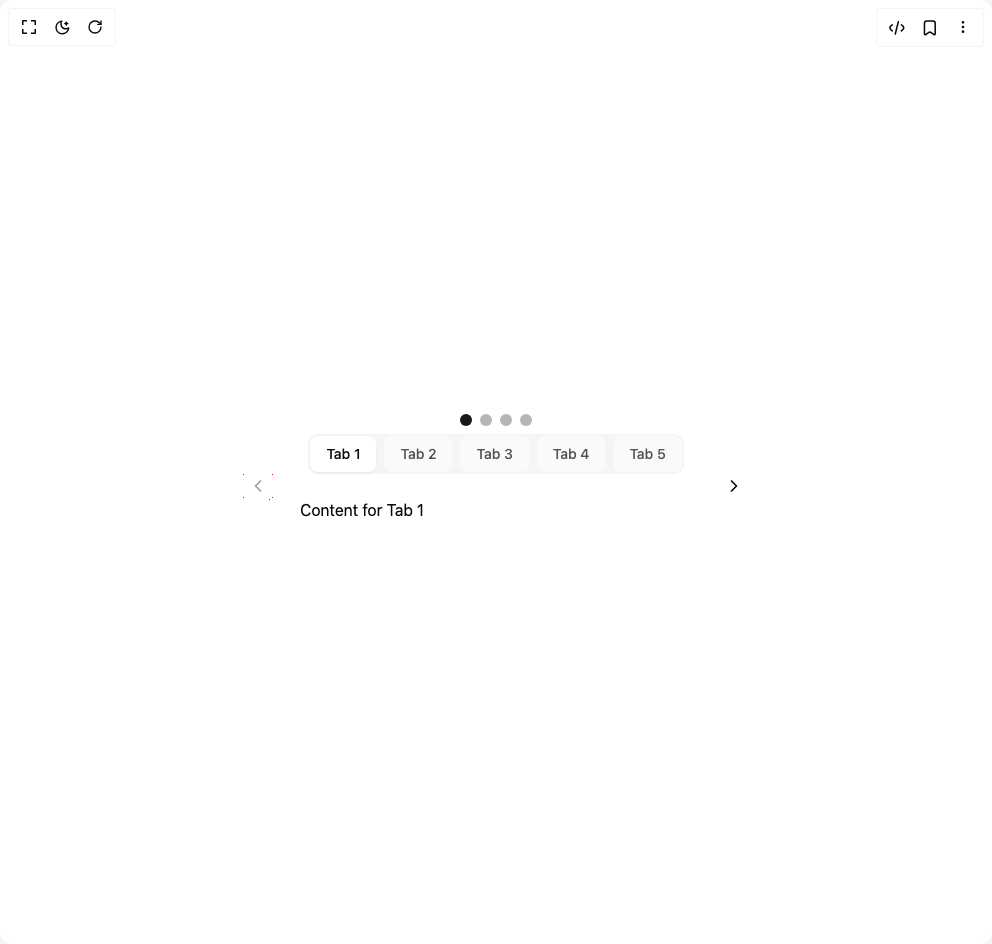

# Build Capsule Tabs in BuilderStudio

> Build this component in our Agentic IDE: [BuilderStudio](https://builderstudio.dev).
>
> Join the BuilderStudio community on [Discord](https://discord.gg/QdWeSGCqfe) and [Reddit](https://reddit.com/r/builderstudio).



## Component

- Author group: `ruixenui`
- Component: `capsule-tabs`
- Variant: `default`
- Rendered HTML snapshot: [`rendered.html`](rendered.html)

## BuilderStudio prompt

You are implementing a React component based on a component reference.

## Component identity

- Author: ruixenui
- Component slug: capsule-tabs
- Demo slug: default
- Title: capsule-tabs
- Description: 

## Goal

Recreate this component in a React + TypeScript + Tailwind CSS project. Preserve the visual layout, spacing, colors, border radius, shadows, interaction behavior, animation behavior, responsive behavior, and dark mode behavior shown in the rendered demo.

## Implementation requirements

- Use React and TypeScript.
- Use Tailwind CSS classes whenever possible.
- Keep the component self-contained unless the source files require helper components.
- If the source uses CSS variables, custom CSS, animations, or keyframes, include them.
- If the source uses external packages, list and use the required packages.
- Preserve accessibility attributes, button semantics, links, keyboard behavior, and ARIA attributes when visible in the source.
- Do not replace the component with a simplified placeholder.
- Return complete production-ready code.

## Dependencies

No reference metadata available.

## Rendered DOM snapshot

This is the rendered demo HTML extracted from the live preview. Use it to verify structure, class names, visible content, and layout.

```html
<div id="root"><div class="w-screen min-h-screen flex justify-center items-center"><div class="w-screen min-h-screen flex justify-center items-center"><div class="flex flex-col items-center w-full"><div class="flex gap-2 my-2"><span class="w-3 h-3 rounded-full cursor-pointer transition-colors bg-primary"></span><span class="w-3 h-3 rounded-full cursor-pointer transition-colors bg-foreground/30"></span><span class="w-3 h-3 rounded-full cursor-pointer transition-colors bg-foreground/30"></span><span class="w-3 h-3 rounded-full cursor-pointer transition-colors bg-foreground/30"></span></div><div class="flex items-center gap-2 w-full max-w-lg"><button class="inline-flex items-center justify-center whitespace-nowrap text-sm font-medium transition-colors outline-offset-2 focus-visible:outline-2 focus-visible:outline-ring/70 disabled:pointer-events-none [&amp;_svg]:pointer-events-none [&amp;_svg]:shrink-0 h-9 p-2 rounded-full bg-background/50 hover:bg-background/70 disabled:opacity-40" disabled=""><svg xmlns="http://www.w3.org/2000/svg" width="24" height="24" viewBox="0 0 24 24" fill="none" stroke="currentColor" stroke-width="2" stroke-linecap="round" stroke-linejoin="round" class="lucide lucide-chevron-left w-5 h-5" aria-hidden="true"><path d="m15 18-6-6 6-6"></path></svg></button><div dir="ltr" data-orientation="horizontal" class="flex-1 flex   flex-col"><div role="tablist" aria-orientation="horizontal" class="items-center rounded-lg bg-muted p-0.5 text-muted-foreground/70 flex gap-2 w-fit mx-auto justify-center" tabindex="0" data-orientation="horizontal" style="outline: none;"><button class="inline-flex items-center justify-center whitespace-nowrap rounded-md px-3 py-1.5 text-sm font-medium outline-offset-2 transition-all hover:text-muted-foreground focus-visible:outline-2 focus-visible:outline-ring/70 disabled:pointer-events-none disabled:opacity-50 data-[state=active]:bg-background data-[state=active]:text-foreground data-[state=active]:shadow-sm data-[state=active]:shadow-black/5 px-4 py-2 rounded-full whitespace-nowrap text-sm font-medium transition-all bg-primary text-white shadow-md" type="button" role="tab" aria-selected="true" aria-controls="radix-«r0»-content-tab1" data-state="active" id="radix-«r0»-trigger-tab1" tabindex="-1" data-orientation="horizontal" data-radix-collection-item="">Tab 1</button><button class="inline-flex items-center justify-center whitespace-nowrap rounded-md px-3 py-1.5 text-sm font-medium outline-offset-2 transition-all hover:text-muted-foreground focus-visible:outline-2 focus-visible:outline-ring/70 disabled:pointer-events-none disabled:opacity-50 data-[state=active]:bg-background data-[state=active]:text-foreground data-[state=active]:shadow-sm data-[state=active]:shadow-black/5 px-4 py-2 rounded-full whitespace-nowrap text-sm font-medium transition-all bg-background/50 text-foreground/70" type="button" role="tab" aria-selected="false" aria-controls="radix-«r0»-content-tab2" data-state="inactive" id="radix-«r0»-trigger-tab2" tabindex="-1" data-orientation="horizontal" data-radix-collection-item="">Tab 2</button><button class="inline-flex items-center justify-center whitespace-nowrap rounded-md px-3 py-1.5 text-sm font-medium outline-offset-2 transition-all hover:text-muted-foreground focus-visible:outline-2 focus-visible:outline-ring/70 disabled:pointer-events-none disabled:opacity-50 data-[state=active]:bg-background data-[state=active]:text-foreground data-[state=active]:shadow-sm data-[state=active]:shadow-black/5 px-4 py-2 rounded-full whitespace-nowrap text-sm font-medium transition-all bg-background/50 text-foreground/70" type="button" role="tab" aria-selected="false" aria-controls="radix-«r0»-content-tab3" data-state="inactive" id="radix-«r0»-trigger-tab3" tabindex="-1" data-orientation="horizontal" data-radix-collection-item="">Tab 3</button><button class="inline-flex items-center justify-center whitespace-nowrap rounded-md px-3 py-1.5 text-sm font-medium outline-offset-2 transition-all hover:text-muted-foreground focus-visible:outline-2 focus-visible:outline-ring/70 disabled:pointer-events-none disabled:opacity-50 data-[state=active]:bg-background data-[state=active]:text-foreground data-[state=active]:shadow-sm data-[state=active]:shadow-black/5 px-4 py-2 rounded-full whitespace-nowrap text-sm font-medium transition-all bg-background/50 text-foreground/70" type="button" role="tab" aria-selected="false" aria-controls="radix-«r0»-content-tab4" data-state="inactive" id="radix-«r0»-trigger-tab4" tabindex="-1" data-orientation="horizontal" data-radix-collection-item="">Tab 4</button><button class="inline-flex items-center justify-center whitespace-nowrap rounded-md px-3 py-1.5 text-sm font-medium outline-offset-2 transition-all hover:text-muted-foreground focus-visible:outline-2 focus-visible:outline-ring/70 disabled:pointer-events-none disabled:opacity-50 data-[state=active]:bg-background data-[state=active]:text-foreground data-[state=active]:shadow-sm data-[state=active]:shadow-black/5 px-4 py-2 rounded-full whitespace-nowrap text-sm font-medium transition-all bg-background/50 text-foreground/70" type="button" role="tab" aria-selected="false" aria-controls="radix-«r0»-content-tab5" data-state="inactive" id="radix-«r0»-trigger-tab5" tabindex="-1" data-orientation="horizontal" data-radix-collection-item="">Tab 5</button></div><div data-state="active" data-orientation="horizontal" role="tabpanel" aria-labelledby="radix-«r0»-trigger-tab1" id="radix-«r0»-content-tab1" tabindex="0" class="mt-2 outline-offset-2 focus-visible:outline-2 focus-visible:outline-ring/70" style="animation-duration: 0s;"><div class="p-4 bg-card">Content for Tab 1</div></div><div data-state="inactive" data-orientation="horizontal" role="tabpanel" aria-labelledby="radix-«r0»-trigger-tab2" hidden="" id="radix-«r0»-content-tab2" tabindex="0" class="mt-2 outline-offset-2 focus-visible:outline-2 focus-visible:outline-ring/70"></div><div data-state="inactive" data-orientation="horizontal" role="tabpanel" aria-labelledby="radix-«r0»-trigger-tab3" hidden="" id="radix-«r0»-content-tab3" tabindex="0" class="mt-2 outline-offset-2 focus-visible:outline-2 focus-visible:outline-ring/70"></div><div data-state="inactive" data-orientation="horizontal" role="tabpanel" aria-labelledby="radix-«r0»-trigger-tab4" hidden="" id="radix-«r0»-content-tab4" tabindex="0" class="mt-2 outline-offset-2 focus-visible:outline-2 focus-visible:outline-ring/70"></div><div data-state="inactive" data-orientation="horizontal" role="tabpanel" aria-labelledby="radix-«r0»-trigger-tab5" hidden="" id="radix-«r0»-content-tab5" tabindex="0" class="mt-2 outline-offset-2 focus-visible:outline-2 focus-visible:outline-ring/70"></div><div data-state="inactive" data-orientation="horizontal" role="tabpanel" aria-labelledby="radix-«r0»-trigger-tab6" hidden="" id="radix-«r0»-content-tab6" tabindex="0" class="mt-2 outline-offset-2 focus-visible:outline-2 focus-visible:outline-ring/70"></div><div data-state="inactive" data-orientation="horizontal" role="tabpanel" aria-labelledby="radix-«r0»-trigger-tab7" hidden="" id="radix-«r0»-content-tab7" tabindex="0" class="mt-2 outline-offset-2 focus-visible:outline-2 focus-visible:outline-ring/70"></div><div data-state="inactive" data-orientation="horizontal" role="tabpanel" aria-labelledby="radix-«r0»-trigger-tab8" hidden="" id="radix-«r0»-content-tab8" tabindex="0" class="mt-2 outline-offset-2 focus-visible:outline-2 focus-visible:outline-ring/70"></div><div data-state="inactive" data-orientation="horizontal" role="tabpanel" aria-labelledby="radix-«r0»-trigger-tab9" hidden="" id="radix-«r0»-content-tab9" tabindex="0" class="mt-2 outline-offset-2 focus-visible:outline-2 focus-visible:outline-ring/70"></div><div data-state="inactive" data-orientation="horizontal" role="tabpanel" aria-labelledby="radix-«r0»-trigger-tab10" hidden="" id="radix-«r0»-content-tab10" tabindex="0" class="mt-2 outline-offset-2 focus-visible:outline-2 focus-visible:outline-ring/70"></div><div data-state="inactive" data-orientation="horizontal" role="tabpanel" aria-labelledby="radix-«r0»-trigger-tab11" hidden="" id="radix-«r0»-content-tab11" tabindex="0" class="mt-2 outline-offset-2 focus-visible:outline-2 focus-visible:outline-ring/70"></div><div data-state="inactive" data-orientation="horizontal" role="tabpanel" aria-labelledby="radix-«r0»-trigger-tab12" hidden="" id="radix-«r0»-content-tab12" tabindex="0" class="mt-2 outline-offset-2 focus-visible:outline-2 focus-visible:outline-ring/70"></div><div data-state="inactive" data-orientation="horizontal" role="tabpanel" aria-labelledby="radix-«r0»-trigger-tab13" hidden="" id="radix-«r0»-content-tab13" tabindex="0" class="mt-2 outline-offset-2 focus-visible:outline-2 focus-visible:outline-ring/70"></div><div data-state="inactive" data-orientation="horizontal" role="tabpanel" aria-labelledby="radix-«r0»-trigger-tab14" hidden="" id="radix-«r0»-content-tab14" tabindex="0" class="mt-2 outline-offset-2 focus-visible:outline-2 focus-visible:outline-ring/70"></div><div data-state="inactive" data-orientation="horizontal" role="tabpanel" aria-labelledby="radix-«r0»-trigger-tab15" hidden="" id="radix-«r0»-content-tab15" tabindex="0" class="mt-2 outline-offset-2 focus-visible:outline-2 focus-visible:outline-ring/70"></div><div data-state="inactive" data-orientation="horizontal" role="tabpanel" aria-labelledby="radix-«r0»-trigger-tab16" hidden="" id="radix-«r0»-content-tab16" tabindex="0" class="mt-2 outline-offset-2 focus-visible:outline-2 focus-visible:outline-ring/70"></div><div data-state="inactive" data-orientation="horizontal" role="tabpanel" aria-labelledby="radix-«r0»-trigger-tab17" hidden="" id="radix-«r0»-content-tab17" tabindex="0" class="mt-2 outline-offset-2 focus-visible:outline-2 focus-visible:outline-ring/70"></div><div data-state="inactive" data-orientation="horizontal" role="tabpanel" aria-labelledby="radix-«r0»-trigger-tab18" hidden="" id="radix-«r0»-content-tab18" tabindex="0" class="mt-2 outline-offset-2 focus-visible:outline-2 focus-visible:outline-ring/70"></div><div data-state="inactive" data-orientation="horizontal" role="tabpanel" aria-labelledby="radix-«r0»-trigger-tab19" hidden="" id="radix-«r0»-content-tab19" tabindex="0" class="mt-2 outline-offset-2 focus-visible:outline-2 focus-visible:outline-ring/70"></div><div data-state="inactive" data-orientation="horizontal" role="tabpanel" aria-labelledby="radix-«r0»-trigger-tab20" hidden="" id="radix-«r0»-content-tab20" tabindex="0" class="mt-2 outline-offset-2 focus-visible:outline-2 focus-visible:outline-ring/70"></div></div><button class="inline-flex items-center justify-center whitespace-nowrap text-sm font-medium transition-colors outline-offset-2 focus-visible:outline-2 focus-visible:outline-ring/70 disabled:pointer-events-none [&amp;_svg]:pointer-events-none [&amp;_svg]:shrink-0 h-9 p-2 rounded-full bg-background/50 hover:bg-background/70 disabled:opacity-40"><svg xmlns="http://www.w3.org/2000/svg" width="24" height="24" viewBox="0 0 24 24" fill="none" stroke="currentColor" stroke-width="2" stroke-linecap="round" stroke-linejoin="round" class="lucide lucide-chevron-right w-5 h-5" aria-hidden="true"><path d="m9 18 6-6-6-6"></path></svg></button></div></div></div></div></div>
```

## Reference source files

No reference source files were available.
