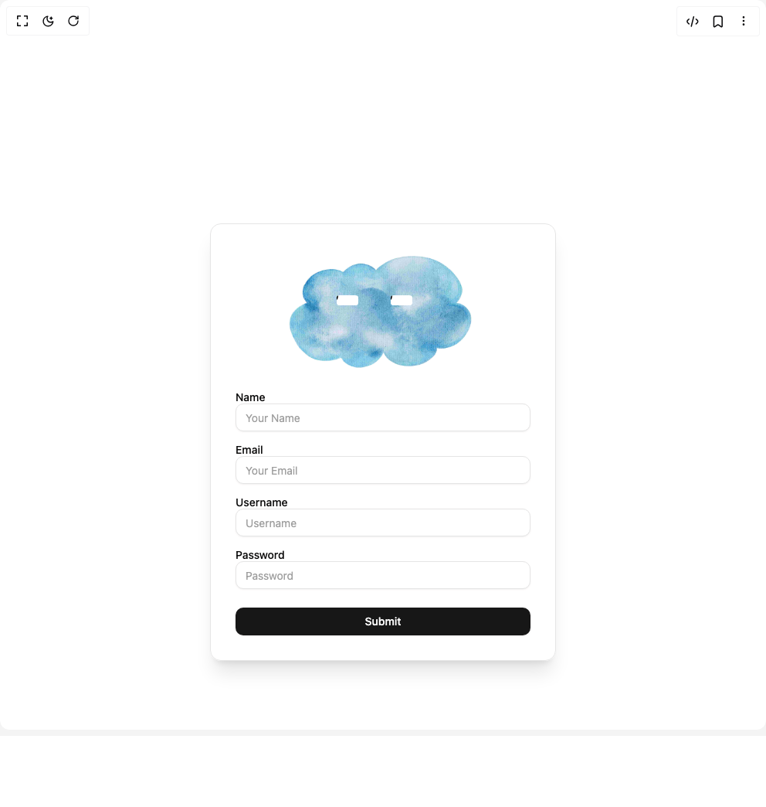

# Build Cloud Watch Form in BuilderStudio

> Build this component in our Agentic IDE: [BuilderStudio](https://builderstudio.dev).
>
> Join the BuilderStudio community on [Discord](https://discord.gg/QdWeSGCqfe) and [Reddit](https://reddit.com/r/builderstudio).



## Component

- Author group: `ruixenui`
- Component: `cloud-watch-form`
- Variant: `default`
- Rendered HTML snapshot: [`rendered.html`](rendered.html)

## BuilderStudio prompt

You are implementing a React component based on a component reference.

## Component identity

- Author: ruixenui
- Component slug: cloud-watch-form
- Demo slug: default
- Title: cloud-watch-form
- Description: 

## Goal

Recreate this component in a React + TypeScript + Tailwind CSS project. Preserve the visual layout, spacing, colors, border radius, shadows, interaction behavior, animation behavior, responsive behavior, and dark mode behavior shown in the rendered demo.

## Implementation requirements

- Use React and TypeScript.
- Use Tailwind CSS classes whenever possible.
- Keep the component self-contained unless the source files require helper components.
- If the source uses CSS variables, custom CSS, animations, or keyframes, include them.
- If the source uses external packages, list and use the required packages.
- Preserve accessibility attributes, button semantics, links, keyboard behavior, and ARIA attributes when visible in the source.
- Do not replace the component with a simplified placeholder.
- Return complete production-ready code.

## Dependencies

No reference metadata available.

## Rendered DOM snapshot

This is the rendered demo HTML extracted from the live preview. Use it to verify structure, class names, visible content, and layout.

```html
<div id="root"><div class="w-screen min-h-screen flex justify-center items-center"><div class="w-screen min-h-screen flex justify-center items-center"><div style="display: flex; justify-content: center; margin-top: 100px;"><div class="flex items-center justify-center min-h-screen p-4"><div class="bg-white/30 backdrop-blur-md rounded-xl shadow-xl p-8 flex flex-col items-center gap-6 w-md border"><div class="relative w-70 h-40"><div class="absolute flex justify-center items-end overflow-hidden" style="top: 60px; left: 80px; width: 28px; height: 6px; border-radius: 2px; background-color: white; transition: 0.15s;"><div class="bg-black" style="width: 16px; height: 16px; border-radius: 50%; margin-bottom: 4px; transform: translate(-20px, 0px); transition: 0.1s;"></div></div><div class="absolute flex justify-center items-end overflow-hidden" style="top: 60px; left: 150px; width: 28px; height: 6px; border-radius: 2px; background-color: white; transition: 0.15s;"><div class="bg-black" style="width: 16px; height: 16px; border-radius: 50%; margin-bottom: 4px; transform: translate(-20px, 0px); transition: 0.1s;"></div></div></div><div class="w-full flex flex-col gap-4"><div class="flex flex-col"><label class="text-sm font-medium leading-4 text-foreground peer-disabled:cursor-not-allowed peer-disabled:opacity-70">Name</label><input class="flex h-9 w-full rounded-lg border border-input bg-background px-3 py-2 text-sm text-foreground shadow-sm shadow-black/5 transition-shadow placeholder:text-muted-foreground/70 focus-visible:border-ring focus-visible:outline-none focus-visible:ring-[3px] focus-visible:ring-ring/20 disabled:cursor-not-allowed disabled:opacity-50" placeholder="Your Name"></div><div class="flex flex-col"><label class="text-sm font-medium leading-4 text-foreground peer-disabled:cursor-not-allowed peer-disabled:opacity-70">Email</label><input class="flex h-9 w-full rounded-lg border border-input bg-background px-3 py-2 text-sm text-foreground shadow-sm shadow-black/5 transition-shadow placeholder:text-muted-foreground/70 focus-visible:border-ring focus-visible:outline-none focus-visible:ring-[3px] focus-visible:ring-ring/20 disabled:cursor-not-allowed disabled:opacity-50" placeholder="Your Email" type="email"></div><div class="flex flex-col"><label class="text-sm font-medium leading-4 text-foreground peer-disabled:cursor-not-allowed peer-disabled:opacity-70">Username</label><input class="flex h-9 w-full rounded-lg border border-input bg-background px-3 py-2 text-sm text-foreground shadow-sm shadow-black/5 transition-shadow placeholder:text-muted-foreground/70 focus-visible:border-ring focus-visible:outline-none focus-visible:ring-[3px] focus-visible:ring-ring/20 disabled:cursor-not-allowed disabled:opacity-50" placeholder="Username"></div><div class="flex flex-col"><label class="text-sm font-medium leading-4 text-foreground peer-disabled:cursor-not-allowed peer-disabled:opacity-70">Password</label><input class="flex h-9 w-full rounded-lg border border-input bg-background px-3 py-2 text-sm text-foreground shadow-sm shadow-black/5 transition-shadow placeholder:text-muted-foreground/70 focus-visible:border-ring focus-visible:outline-none focus-visible:ring-[3px] focus-visible:ring-ring/20 disabled:cursor-not-allowed disabled:opacity-50" placeholder="Password" type="password"></div><button class="inline-flex items-center justify-center whitespace-nowrap rounded-lg text-sm font-medium transition-colors outline-offset-2 focus-visible:outline-2 focus-visible:outline-ring/70 disabled:pointer-events-none disabled:opacity-50 [&amp;_svg]:pointer-events-none [&amp;_svg]:shrink-0 bg-primary text-primary-foreground shadow-sm shadow-black/5 hover:bg-primary/90 h-9 px-4 py-2 mt-2 w-full">Submit</button></div></div></div></div></div></div></div>
```

## Reference source files

No reference source files were available.
