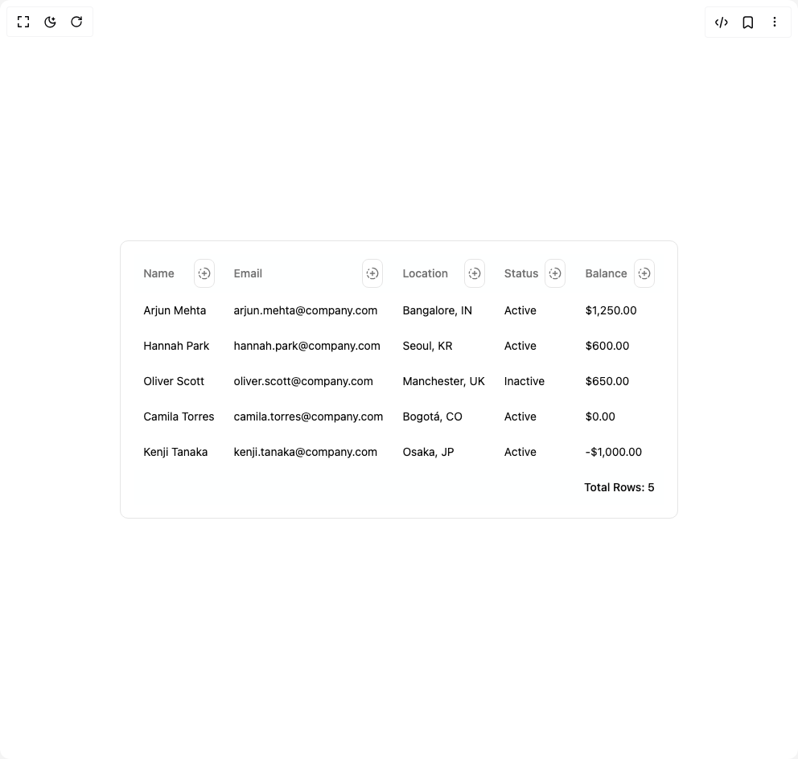

# Build Column Collaboration Table in BuilderStudio

> Build this component in our Agentic IDE: [BuilderStudio](https://builderstudio.dev).
>
> Join the BuilderStudio community on [Discord](https://discord.gg/QdWeSGCqfe) and [Reddit](https://reddit.com/r/builderstudio).



## Component

- Author group: `ruixenui`
- Component: `column-collaboration-table`
- Variant: `default`
- Rendered HTML snapshot: [`rendered.html`](rendered.html)

## BuilderStudio prompt

You are implementing a React component based on a component reference.

## Component identity

- Author: ruixenui
- Component slug: column-collaboration-table
- Demo slug: default
- Title: column-collaboration-table
- Description: 

## Goal

Recreate this component in a React + TypeScript + Tailwind CSS project. Preserve the visual layout, spacing, colors, border radius, shadows, interaction behavior, animation behavior, responsive behavior, and dark mode behavior shown in the rendered demo.

## Implementation requirements

- Use React and TypeScript.
- Use Tailwind CSS classes whenever possible.
- Keep the component self-contained unless the source files require helper components.
- If the source uses CSS variables, custom CSS, animations, or keyframes, include them.
- If the source uses external packages, list and use the required packages.
- Preserve accessibility attributes, button semantics, links, keyboard behavior, and ARIA attributes when visible in the source.
- Do not replace the component with a simplified placeholder.
- Return complete production-ready code.

## Dependencies

No reference metadata available.

## Rendered DOM snapshot

This is the rendered demo HTML extracted from the live preview. Use it to verify structure, class names, visible content, and layout.

```html
<div id="root"><div class="w-screen min-h-screen flex justify-center items-center"><div class="w-screen min-h-screen flex justify-center items-center"><div class="bg-background p-4 rounded-lg border"><div dir="ltr" class="relative overflow-hidden max-h-[400px]" style="position: relative; --radix-scroll-area-corner-width: 0px; --radix-scroll-area-corner-height: 0px;"><style>[data-radix-scroll-area-viewport]{scrollbar-width:none;-ms-overflow-style:none;-webkit-overflow-scrolling:touch;}[data-radix-scroll-area-viewport]::-webkit-scrollbar{display:none}</style><div data-radix-scroll-area-viewport="" class="h-full w-full rounded-[inherit]" style="overflow: hidden scroll;"><div style="min-width: 100%; display: table;"><div class="relative w-full overflow-auto"><table class="caption-bottom text-sm w-full border-separate border-spacing-0"><thead class="sticky top-0 bg-background/90 backdrop-blur-sm z-10"><tr class="border-b border-border transition-colors hover:bg-muted/50 data-[state=selected]:bg-muted"><th class="h-12 px-3 text-left align-middle font-medium text-muted-foreground [&amp;:has([role=checkbox])]:w-px [&amp;:has([role=checkbox])]:pr-0 [&amp;&gt;[role=checkbox]]:translate-y-0.5 relative"><div class="flex items-center justify-between">Name<button class="inline-flex items-center justify-center whitespace-nowrap text-sm font-medium ring-offset-background transition-colors focus-visible:outline-none focus-visible:ring-2 focus-visible:ring-ring focus-visible:ring-offset-2 disabled:pointer-events-none disabled:opacity-50 border border-input bg-background hover:bg-accent hover:text-accent-foreground h-9 rounded-md ml-2 p-1" type="button" aria-haspopup="dialog" aria-expanded="false" aria-controls="radix-«r0»" data-state="closed"><svg xmlns="http://www.w3.org/2000/svg" width="24" height="24" viewBox="0 0 24 24" fill="none" stroke="currentColor" stroke-width="2" stroke-linecap="round" stroke-linejoin="round" class="lucide lucide-circle-fading-plus w-4 h-4" aria-hidden="true"><path d="M12 2a10 10 0 0 1 7.38 16.75"></path><path d="M12 8v8"></path><path d="M16 12H8"></path><path d="M2.5 8.875a10 10 0 0 0-.5 3"></path><path d="M2.83 16a10 10 0 0 0 2.43 3.4"></path><path d="M4.636 5.235a10 10 0 0 1 .891-.857"></path><path d="M8.644 21.42a10 10 0 0 0 7.631-.38"></path></svg></button></div></th><th class="h-12 px-3 text-left align-middle font-medium text-muted-foreground [&amp;:has([role=checkbox])]:w-px [&amp;:has([role=checkbox])]:pr-0 [&amp;&gt;[role=checkbox]]:translate-y-0.5 relative"><div class="flex items-center justify-between">Email<button class="inline-flex items-center justify-center whitespace-nowrap text-sm font-medium ring-offset-background transition-colors focus-visible:outline-none focus-visible:ring-2 focus-visible:ring-ring focus-visible:ring-offset-2 disabled:pointer-events-none disabled:opacity-50 border border-input bg-background hover:bg-accent hover:text-accent-foreground h-9 rounded-md ml-2 p-1" type="button" aria-haspopup="dialog" aria-expanded="false" aria-controls="radix-«r1»" data-state="closed"><svg xmlns="http://www.w3.org/2000/svg" width="24" height="24" viewBox="0 0 24 24" fill="none" stroke="currentColor" stroke-width="2" stroke-linecap="round" stroke-linejoin="round" class="lucide lucide-circle-fading-plus w-4 h-4" aria-hidden="true"><path d="M12 2a10 10 0 0 1 7.38 16.75"></path><path d="M12 8v8"></path><path d="M16 12H8"></path><path d="M2.5 8.875a10 10 0 0 0-.5 3"></path><path d="M2.83 16a10 10 0 0 0 2.43 3.4"></path><path d="M4.636 5.235a10 10 0 0 1 .891-.857"></path><path d="M8.644 21.42a10 10 0 0 0 7.631-.38"></path></svg></button></div></th><th class="h-12 px-3 text-left align-middle font-medium text-muted-foreground [&amp;:has([role=checkbox])]:w-px [&amp;:has([role=checkbox])]:pr-0 [&amp;&gt;[role=checkbox]]:translate-y-0.5 relative"><div class="flex items-center justify-between">Location<button class="inline-flex items-center justify-center whitespace-nowrap text-sm font-medium ring-offset-background transition-colors focus-visible:outline-none focus-visible:ring-2 focus-visible:ring-ring focus-visible:ring-offset-2 disabled:pointer-events-none disabled:opacity-50 border border-input bg-background hover:bg-accent hover:text-accent-foreground h-9 rounded-md ml-2 p-1" type="button" aria-haspopup="dialog" aria-expanded="false" aria-controls="radix-«r2»" data-state="closed"><svg xmlns="http://www.w3.org/2000/svg" width="24" height="24" viewBox="0 0 24 24" fill="none" stroke="currentColor" stroke-width="2" stroke-linecap="round" stroke-linejoin="round" class="lucide lucide-circle-fading-plus w-4 h-4" aria-hidden="true"><path d="M12 2a10 10 0 0 1 7.38 16.75"></path><path d="M12 8v8"></path><path d="M16 12H8"></path><path d="M2.5 8.875a10 10 0 0 0-.5 3"></path><path d="M2.83 16a10 10 0 0 0 2.43 3.4"></path><path d="M4.636 5.235a10 10 0 0 1 .891-.857"></path><path d="M8.644 21.42a10 10 0 0 0 7.631-.38"></path></svg></button></div></th><th class="h-12 px-3 text-left align-middle font-medium text-muted-foreground [&amp;:has([role=checkbox])]:w-px [&amp;:has([role=checkbox])]:pr-0 [&amp;&gt;[role=checkbox]]:translate-y-0.5 relative"><div class="flex items-center justify-between">Status<button class="inline-flex items-center justify-center whitespace-nowrap text-sm font-medium ring-offset-background transition-colors focus-visible:outline-none focus-visible:ring-2 focus-visible:ring-ring focus-visible:ring-offset-2 disabled:pointer-events-none disabled:opacity-50 border border-input bg-background hover:bg-accent hover:text-accent-foreground h-9 rounded-md ml-2 p-1" type="button" aria-haspopup="dialog" aria-expanded="false" aria-controls="radix-«r3»" data-state="closed"><svg xmlns="http://www.w3.org/2000/svg" width="24" height="24" viewBox="0 0 24 24" fill="none" stroke="currentColor" stroke-width="2" stroke-linecap="round" stroke-linejoin="round" class="lucide lucide-circle-fading-plus w-4 h-4" aria-hidden="true"><path d="M12 2a10 10 0 0 1 7.38 16.75"></path><path d="M12 8v8"></path><path d="M16 12H8"></path><path d="M2.5 8.875a10 10 0 0 0-.5 3"></path><path d="M2.83 16a10 10 0 0 0 2.43 3.4"></path><path d="M4.636 5.235a10 10 0 0 1 .891-.857"></path><path d="M8.644 21.42a10 10 0 0 0 7.631-.38"></path></svg></button></div></th><th class="h-12 px-3 text-left align-middle font-medium text-muted-foreground [&amp;:has([role=checkbox])]:w-px [&amp;:has([role=checkbox])]:pr-0 [&amp;&gt;[role=checkbox]]:translate-y-0.5 relative"><div class="flex items-center justify-between">Balance<button class="inline-flex items-center justify-center whitespace-nowrap text-sm font-medium ring-offset-background transition-colors focus-visible:outline-none focus-visible:ring-2 focus-visible:ring-ring focus-visible:ring-offset-2 disabled:pointer-events-none disabled:opacity-50 border border-input bg-background hover:bg-accent hover:text-accent-foreground h-9 rounded-md ml-2 p-1" type="button" aria-haspopup="dialog" aria-expanded="false" aria-controls="radix-«r4»" data-state="closed"><svg xmlns="http://www.w3.org/2000/svg" width="24" height="24" viewBox="0 0 24 24" fill="none" stroke="currentColor" stroke-width="2" stroke-linecap="round" stroke-linejoin="round" class="lucide lucide-circle-fading-plus w-4 h-4" aria-hidden="true"><path d="M12 2a10 10 0 0 1 7.38 16.75"></path><path d="M12 8v8"></path><path d="M16 12H8"></path><path d="M2.5 8.875a10 10 0 0 0-.5 3"></path><path d="M2.83 16a10 10 0 0 0 2.43 3.4"></path><path d="M4.636 5.235a10 10 0 0 1 .891-.857"></path><path d="M8.644 21.42a10 10 0 0 0 7.631-.38"></path></svg></button></div></th></tr></thead><tbody class="[&amp;_tr:last-child]:border-0"><tr class="border-b border-border transition-colors hover:bg-muted/50 data-[state=selected]:bg-muted"><td class="p-3 align-middle [&amp;:has([role=checkbox])]:pr-0 [&amp;&gt;[role=checkbox]]:translate-y-0.5">Arjun Mehta</td><td class="p-3 align-middle [&amp;:has([role=checkbox])]:pr-0 [&amp;&gt;[role=checkbox]]:translate-y-0.5">arjun.mehta@company.com</td><td class="p-3 align-middle [&amp;:has([role=checkbox])]:pr-0 [&amp;&gt;[role=checkbox]]:translate-y-0.5">Bangalore, IN</td><td class="p-3 align-middle [&amp;:has([role=checkbox])]:pr-0 [&amp;&gt;[role=checkbox]]:translate-y-0.5">Active</td><td class="p-3 align-middle [&amp;:has([role=checkbox])]:pr-0 [&amp;&gt;[role=checkbox]]:translate-y-0.5">$1,250.00</td></tr><tr class="border-b border-border transition-colors hover:bg-muted/50 data-[state=selected]:bg-muted"><td class="p-3 align-middle [&amp;:has([role=checkbox])]:pr-0 [&amp;&gt;[role=checkbox]]:translate-y-0.5">Hannah Park</td><td class="p-3 align-middle [&amp;:has([role=checkbox])]:pr-0 [&amp;&gt;[role=checkbox]]:translate-y-0.5">hannah.park@company.com</td><td class="p-3 align-middle [&amp;:has([role=checkbox])]:pr-0 [&amp;&gt;[role=checkbox]]:translate-y-0.5">Seoul, KR</td><td class="p-3 align-middle [&amp;:has([role=checkbox])]:pr-0 [&amp;&gt;[role=checkbox]]:translate-y-0.5">Active</td><td class="p-3 align-middle [&amp;:has([role=checkbox])]:pr-0 [&amp;&gt;[role=checkbox]]:translate-y-0.5">$600.00</td></tr><tr class="border-b border-border transition-colors hover:bg-muted/50 data-[state=selected]:bg-muted"><td class="p-3 align-middle [&amp;:has([role=checkbox])]:pr-0 [&amp;&gt;[role=checkbox]]:translate-y-0.5">Oliver Scott</td><td class="p-3 align-middle [&amp;:has([role=checkbox])]:pr-0 [&amp;&gt;[role=checkbox]]:translate-y-0.5">oliver.scott@company.com</td><td class="p-3 align-middle [&amp;:has([role=checkbox])]:pr-0 [&amp;&gt;[role=checkbox]]:translate-y-0.5">Manchester, UK</td><td class="p-3 align-middle [&amp;:has([role=checkbox])]:pr-0 [&amp;&gt;[role=checkbox]]:translate-y-0.5">Inactive</td><td class="p-3 align-middle [&amp;:has([role=checkbox])]:pr-0 [&amp;&gt;[role=checkbox]]:translate-y-0.5">$650.00</td></tr><tr class="border-b border-border transition-colors hover:bg-muted/50 data-[state=selected]:bg-muted"><td class="p-3 align-middle [&amp;:has([role=checkbox])]:pr-0 [&amp;&gt;[role=checkbox]]:translate-y-0.5">Camila Torres</td><td class="p-3 align-middle [&amp;:has([role=checkbox])]:pr-0 [&amp;&gt;[role=checkbox]]:translate-y-0.5">camila.torres@company.com</td><td class="p-3 align-middle [&amp;:has([role=checkbox])]:pr-0 [&amp;&gt;[role=checkbox]]:translate-y-0.5">Bogotá, CO</td><td class="p-3 align-middle [&amp;:has([role=checkbox])]:pr-0 [&amp;&gt;[role=checkbox]]:translate-y-0.5">Active</td><td class="p-3 align-middle [&amp;:has([role=checkbox])]:pr-0 [&amp;&gt;[role=checkbox]]:translate-y-0.5">$0.00</td></tr><tr class="border-b border-border transition-colors hover:bg-muted/50 data-[state=selected]:bg-muted"><td class="p-3 align-middle [&amp;:has([role=checkbox])]:pr-0 [&amp;&gt;[role=checkbox]]:translate-y-0.5">Kenji Tanaka</td><td class="p-3 align-middle [&amp;:has([role=checkbox])]:pr-0 [&amp;&gt;[role=checkbox]]:translate-y-0.5">kenji.tanaka@company.com</td><td class="p-3 align-middle [&amp;:has([role=checkbox])]:pr-0 [&amp;&gt;[role=checkbox]]:translate-y-0.5">Osaka, JP</td><td class="p-3 align-middle [&amp;:has([role=checkbox])]:pr-0 [&amp;&gt;[role=checkbox]]:translate-y-0.5">Active</td><td class="p-3 align-middle [&amp;:has([role=checkbox])]:pr-0 [&amp;&gt;[role=checkbox]]:translate-y-0.5">-$1,000.00</td></tr></tbody><tfoot class="border-t border-border font-medium [&amp;&gt;tr]:last:border-b-0 bg-background/50 sticky bottom-0 backdrop-blur-sm"><tr class="border-b border-border transition-colors hover:bg-muted/50 data-[state=selected]:bg-muted"><td class="p-3 align-middle [&amp;:has([role=checkbox])]:pr-0 [&amp;&gt;[role=checkbox]]:translate-y-0.5 text-right font-medium" colspan="5">Total Rows: 5</td></tr></tfoot></table></div></div></div></div></div></div></div></div>
```

## Reference source files

No reference source files were available.
