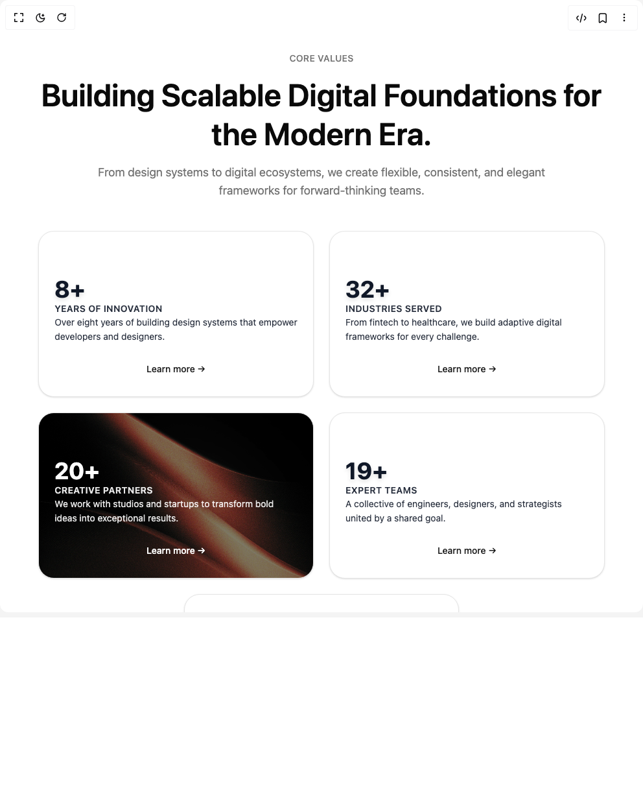

# Build Core Value Stats in BuilderStudio

> Build this component in our Agentic IDE: [BuilderStudio](https://builderstudio.dev).
>
> Join the BuilderStudio community on [Discord](https://discord.gg/QdWeSGCqfe) and [Reddit](https://reddit.com/r/builderstudio).



## Component

- Author group: `ruixenui`
- Component: `core-value-stats`
- Variant: `default`
- Rendered HTML snapshot: [`rendered.html`](rendered.html)

## BuilderStudio prompt

You are implementing a React component based on a component reference.

## Component identity

- Author: ruixenui
- Component slug: core-value-stats
- Demo slug: default
- Title: core-value-stats
- Description: 

## Goal

Recreate this component in a React + TypeScript + Tailwind CSS project. Preserve the visual layout, spacing, colors, border radius, shadows, interaction behavior, animation behavior, responsive behavior, and dark mode behavior shown in the rendered demo.

## Implementation requirements

- Use React and TypeScript.
- Use Tailwind CSS classes whenever possible.
- Keep the component self-contained unless the source files require helper components.
- If the source uses CSS variables, custom CSS, animations, or keyframes, include them.
- If the source uses external packages, list and use the required packages.
- Preserve accessibility attributes, button semantics, links, keyboard behavior, and ARIA attributes when visible in the source.
- Do not replace the component with a simplified placeholder.
- Return complete production-ready code.

## Dependencies

No reference metadata available.

## Rendered DOM snapshot

This is the rendered demo HTML extracted from the live preview. Use it to verify structure, class names, visible content, and layout.

```html
<div id="root"><div class="w-screen min-h-screen flex justify-center items-center"><div class="w-screen min-h-screen flex justify-center items-center"><section class="max-w-7xl mx-auto py-20 px-6 text-center"><div class="space-y-4 mb-12"><p class="text-sm font-medium tracking-wide text-muted-foreground uppercase">Core Values</p><h2 class="text-3xl md:text-5xl font-semibold leading-tight text-foreground">Building Scalable Digital Foundations for the Modern Era.</h2><p class="text-lg text-muted-foreground max-w-3xl mx-auto">From design systems to digital ecosystems, we create flexible, consistent, and elegant frameworks for forward-thinking teams.</p></div><div class="flex flex-nowrap overflow-x-auto gap-6 mt-10 sm:flex-wrap sm:justify-center"><div class="flex-shrink-0 w-[280px] sm:w-[45%] md:w-[45%] lg:w-[280px]" style="opacity: 1; transform: none;"><div class="bg-card relative h-64 overflow-hidden border shadow-sm hover:shadow-lg transition text-gray-900 dark:text-white rounded-3xl"><div class="relative z-10 p-6 space-y-3 text-left flex flex-col justify-end h-full"><div><h3 class="text-4xl font-bold drop-shadow-md">8+</h3><p class="text-sm font-semibold uppercase tracking-wide opacity-90">Years of Innovation</p><p class="text-sm leading-relaxed opacity-90">Over eight years of building design systems that empower developers and designers.</p></div><button class="inline-flex items-center justify-center whitespace-nowrap rounded-lg transition-colors outline-offset-2 focus-visible:outline-2 focus-visible:outline-ring/70 disabled:pointer-events-none disabled:opacity-50 [&amp;_svg]:pointer-events-none [&amp;_svg]:shrink-0 underline-offset-4 hover:underline h-9 py-2 px-0 text-sm font-medium mt-2 text-primary dark:text-primary">Learn more →</button></div></div></div><div class="flex-shrink-0 w-[280px] sm:w-[45%] md:w-[45%] lg:w-[280px]" style="opacity: 1; transform: none;"><div class="bg-card relative h-64 overflow-hidden border shadow-sm hover:shadow-lg transition text-gray-900 dark:text-white rounded-3xl"><div class="relative z-10 p-6 space-y-3 text-left flex flex-col justify-end h-full"><div><h3 class="text-4xl font-bold drop-shadow-md">32+</h3><p class="text-sm font-semibold uppercase tracking-wide opacity-90">Industries Served</p><p class="text-sm leading-relaxed opacity-90">From fintech to healthcare, we build adaptive digital frameworks for every challenge.</p></div><button class="inline-flex items-center justify-center whitespace-nowrap rounded-lg transition-colors outline-offset-2 focus-visible:outline-2 focus-visible:outline-ring/70 disabled:pointer-events-none disabled:opacity-50 [&amp;_svg]:pointer-events-none [&amp;_svg]:shrink-0 underline-offset-4 hover:underline h-9 py-2 px-0 text-sm font-medium mt-2 text-primary dark:text-primary">Learn more →</button></div></div></div><div class="flex-shrink-0 w-[280px] sm:w-[45%] md:w-[45%] lg:w-[280px] perspective-1000" style="opacity: 1; transform: none;"><div class="bg-card relative h-64 overflow-hidden border shadow-sm hover:shadow-lg transition text-white rounded-3xl"><div class="absolute inset-0 bg-black/50"></div><div class="relative z-10 p-6 space-y-3 text-left flex flex-col justify-end h-full"><div><h3 class="text-4xl font-bold drop-shadow-md">20+</h3><p class="text-sm font-semibold uppercase tracking-wide opacity-90">Creative Partners</p><p class="text-sm leading-relaxed opacity-90">We work with studios and startups to transform bold ideas into exceptional results.</p></div><button class="inline-flex items-center justify-center whitespace-nowrap rounded-lg transition-colors outline-offset-2 focus-visible:outline-2 focus-visible:outline-ring/70 disabled:pointer-events-none disabled:opacity-50 [&amp;_svg]:pointer-events-none [&amp;_svg]:shrink-0 underline-offset-4 hover:underline h-9 py-2 px-0 text-sm font-medium mt-2 text-white hover:text-gray-200">Learn more →</button></div></div></div><div class="flex-shrink-0 w-[280px] sm:w-[45%] md:w-[45%] lg:w-[280px]" style="opacity: 1; transform: none;"><div class="bg-card relative h-64 overflow-hidden border shadow-sm hover:shadow-lg transition text-gray-900 dark:text-white rounded-3xl"><div class="relative z-10 p-6 space-y-3 text-left flex flex-col justify-end h-full"><div><h3 class="text-4xl font-bold drop-shadow-md">19+</h3><p class="text-sm font-semibold uppercase tracking-wide opacity-90">Expert Teams</p><p class="text-sm leading-relaxed opacity-90">A collective of engineers, designers, and strategists united by a shared goal.</p></div><button class="inline-flex items-center justify-center whitespace-nowrap rounded-lg transition-colors outline-offset-2 focus-visible:outline-2 focus-visible:outline-ring/70 disabled:pointer-events-none disabled:opacity-50 [&amp;_svg]:pointer-events-none [&amp;_svg]:shrink-0 underline-offset-4 hover:underline h-9 py-2 px-0 text-sm font-medium mt-2 text-primary dark:text-primary">Learn more →</button></div></div></div><div class="flex-shrink-0 w-[280px] sm:w-[45%] md:w-[45%] lg:w-[280px]" style="opacity: 1; transform: none;"><div class="bg-card relative h-64 overflow-hidden border shadow-sm hover:shadow-lg transition text-gray-900 dark:text-white rounded-3xl"><div class="relative z-10 p-6 space-y-3 text-left flex flex-col justify-end h-full"><div><h3 class="text-4xl font-bold drop-shadow-md">100+</h3><p class="text-sm font-semibold uppercase tracking-wide opacity-90">Delivered Projects</p><p class="text-sm leading-relaxed opacity-90">Every launch is proof of our dedication to craft, performance, and seamless user experience.</p></div><button class="inline-flex items-center justify-center whitespace-nowrap rounded-lg transition-colors outline-offset-2 focus-visible:outline-2 focus-visible:outline-ring/70 disabled:pointer-events-none disabled:opacity-50 [&amp;_svg]:pointer-events-none [&amp;_svg]:shrink-0 underline-offset-4 hover:underline h-9 py-2 px-0 text-sm font-medium mt-2 text-primary dark:text-primary">Learn more →</button></div></div></div></div></section></div></div></div>
```

## Reference source files

No reference source files were available.
