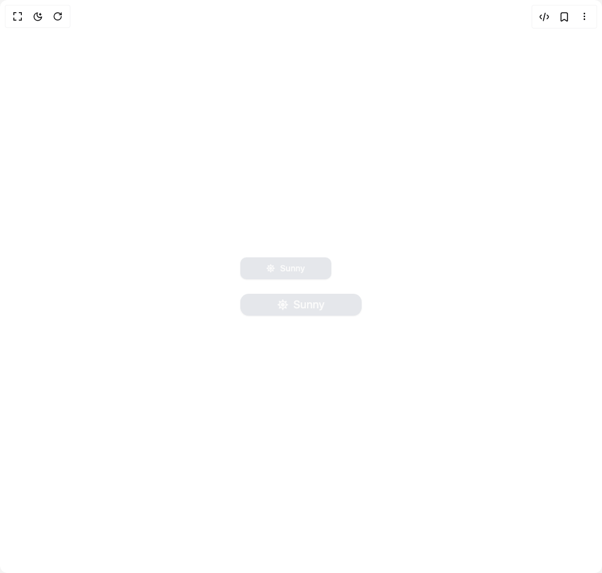

# Build Dynamic Status Button in BuilderStudio

> Build this component in our Agentic IDE: [BuilderStudio](https://builderstudio.dev).
>
> Join the BuilderStudio community on [Discord](https://discord.gg/QdWeSGCqfe) and [Reddit](https://reddit.com/r/builderstudio).



## Component

- Author group: `ruixenui`
- Component: `dynamic-status-button`
- Variant: `default`
- Rendered HTML snapshot: [`rendered.html`](rendered.html)

## BuilderStudio prompt

You are implementing a React component based on a component reference.

## Component identity

- Author: ruixenui
- Component slug: dynamic-status-button
- Demo slug: default
- Title: dynamic-status-button
- Description: 

## Goal

Recreate this component in a React + TypeScript + Tailwind CSS project. Preserve the visual layout, spacing, colors, border radius, shadows, interaction behavior, animation behavior, responsive behavior, and dark mode behavior shown in the rendered demo.

## Implementation requirements

- Use React and TypeScript.
- Use Tailwind CSS classes whenever possible.
- Keep the component self-contained unless the source files require helper components.
- If the source uses CSS variables, custom CSS, animations, or keyframes, include them.
- If the source uses external packages, list and use the required packages.
- Preserve accessibility attributes, button semantics, links, keyboard behavior, and ARIA attributes when visible in the source.
- Do not replace the component with a simplified placeholder.
- Return complete production-ready code.

## Dependencies

No reference metadata available.

## Rendered DOM snapshot

This is the rendered demo HTML extracted from the live preview. Use it to verify structure, class names, visible content, and layout.

```html
<div id="root"><div class="w-screen min-h-screen flex justify-center items-center"><div class="w-screen min-h-screen flex justify-center items-center"><div class="p-6 flex flex-col gap-6"><button class="whitespace-nowrap rounded-lg text-sm font-medium outline-offset-2 focus-visible:outline-2 focus-visible:outline-ring/70 disabled:pointer-events-none disabled:opacity-50 [&amp;_svg]:pointer-events-none [&amp;_svg]:shrink-0 bg-primary text-primary-foreground shadow-sm shadow-black/5 hover:bg-primary/90 h-9 px-4 py-2 relative flex items-center justify-center overflow-hidden transition-colors duration-300" style="width: 150px; background-color: rgb(229, 231, 235);"><div class="flex items-center gap-2 font-medium #111827" style="opacity: 1; transform: none;"><svg stroke="currentColor" fill="currentColor" stroke-width="0" viewBox="0 0 512 512" height="1em" width="1em" xmlns="http://www.w3.org/2000/svg"><path d="M256 160c-52.9 0-96 43.1-96 96s43.1 96 96 96 96-43.1 96-96-43.1-96-96-96zm246.4 80.5l-94.7-47.3 33.5-100.4c4.5-13.6-8.4-26.5-21.9-21.9l-100.4 33.5-47.4-94.8c-6.4-12.8-24.6-12.8-31 0l-47.3 94.7L92.7 70.8c-13.6-4.5-26.5 8.4-21.9 21.9l33.5 100.4-94.7 47.4c-12.8 6.4-12.8 24.6 0 31l94.7 47.3-33.5 100.5c-4.5 13.6 8.4 26.5 21.9 21.9l100.4-33.5 47.3 94.7c6.4 12.8 24.6 12.8 31 0l47.3-94.7 100.4 33.5c13.6 4.5 26.5-8.4 21.9-21.9l-33.5-100.4 94.7-47.3c13-6.5 13-24.7.2-31.1zm-155.9 106c-49.9 49.9-131.1 49.9-181 0-49.9-49.9-49.9-131.1 0-181 49.9-49.9 131.1-49.9 181 0 49.9 49.9 49.9 131.1 0 181z"></path></svg>Sunny</div></button><button class="whitespace-nowrap font-medium outline-offset-2 focus-visible:outline-2 focus-visible:outline-ring/70 disabled:pointer-events-none disabled:opacity-50 [&amp;_svg]:pointer-events-none [&amp;_svg]:shrink-0 bg-primary text-primary-foreground shadow-sm shadow-black/5 hover:bg-primary/90 h-9 px-4 py-2 relative flex items-center justify-center overflow-hidden transition-colors duration-300 rounded-xl text-lg" style="width: 200px; background-color: rgb(229, 231, 235);"><div class="flex items-center gap-2 font-medium #111827" style="opacity: 1; transform: none;"><svg stroke="currentColor" fill="currentColor" stroke-width="0" viewBox="0 0 512 512" height="1em" width="1em" xmlns="http://www.w3.org/2000/svg"><path d="M256 160c-52.9 0-96 43.1-96 96s43.1 96 96 96 96-43.1 96-96-43.1-96-96-96zm246.4 80.5l-94.7-47.3 33.5-100.4c4.5-13.6-8.4-26.5-21.9-21.9l-100.4 33.5-47.4-94.8c-6.4-12.8-24.6-12.8-31 0l-47.3 94.7L92.7 70.8c-13.6-4.5-26.5 8.4-21.9 21.9l33.5 100.4-94.7 47.4c-12.8 6.4-12.8 24.6 0 31l94.7 47.3-33.5 100.5c-4.5 13.6 8.4 26.5 21.9 21.9l100.4-33.5 47.3 94.7c6.4 12.8 24.6 12.8 31 0l47.3-94.7 100.4 33.5c13.6 4.5 26.5-8.4 21.9-21.9l-33.5-100.4 94.7-47.3c13-6.5 13-24.7.2-31.1zm-155.9 106c-49.9 49.9-131.1 49.9-181 0-49.9-49.9-49.9-131.1 0-181 49.9-49.9 131.1-49.9 181 0 49.9 49.9 49.9 131.1 0 181z"></path></svg>Sunny</div></button></div></div></div></div>
```

## Reference source files

No reference source files were available.
