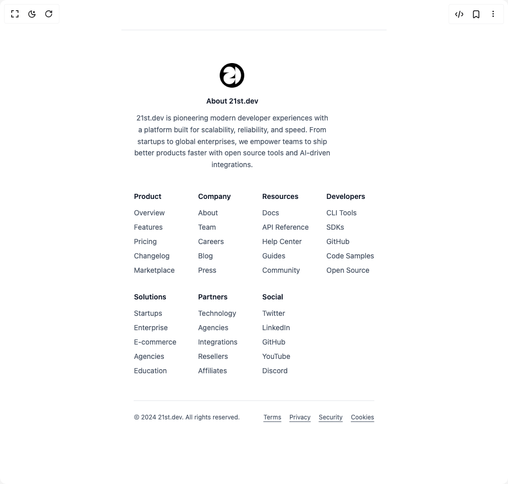

# Build Feature Section 1 in BuilderStudio

> Build this component in our Agentic IDE: [BuilderStudio](https://builderstudio.dev).
>
> Join the BuilderStudio community on [Discord](https://discord.gg/QdWeSGCqfe) and [Reddit](https://reddit.com/r/builderstudio).



## Component

- Author group: `ruixenui`
- Component: `feature-section-1`
- Variant: `default`
- Rendered HTML snapshot: [`rendered.html`](rendered.html)

## BuilderStudio prompt

You are implementing a React component based on a component reference.

## Component identity

- Author: ruixenui
- Component slug: feature-section-1
- Demo slug: default
- Title: feature-section-1
- Description: 

## Goal

Recreate this component in a React + TypeScript + Tailwind CSS project. Preserve the visual layout, spacing, colors, border radius, shadows, interaction behavior, animation behavior, responsive behavior, and dark mode behavior shown in the rendered demo.

## Implementation requirements

- Use React and TypeScript.
- Use Tailwind CSS classes whenever possible.
- Keep the component self-contained unless the source files require helper components.
- If the source uses CSS variables, custom CSS, animations, or keyframes, include them.
- If the source uses external packages, list and use the required packages.
- Preserve accessibility attributes, button semantics, links, keyboard behavior, and ARIA attributes when visible in the source.
- Do not replace the component with a simplified placeholder.
- Return complete production-ready code.

## Dependencies

No reference metadata available.

## Rendered DOM snapshot

This is the rendered demo HTML extracted from the live preview. Use it to verify structure, class names, visible content, and layout.

```html
<div id="root"><div class="w-screen min-h-screen flex justify-center items-center"><div class="w-screen min-h-screen flex justify-center items-center"><footer class="bg-white dark:bg-gray-950 py-16 border-t border-gray-200 dark:border-gray-800"><div class="container mx-auto px-6"><div class="flex flex-col lg:flex-row lg:justify-between lg:items-start gap-10"><div class="max-w-sm text-center lg:text-left"><div class="lg:col-span-2"><h3 class="mb-3 text-sm font-semibold text-gray-900 dark:text-gray-100">About BuilderStudio</h3><p class="text-sm text-gray-600 dark:text-gray-400 leading-relaxed">BuilderStudio is pioneering modern developer experiences with a platform built for scalability, reliability, and speed. From startups to global enterprises, we empower teams to ship better products faster with open source tools and AI-driven integrations.</p></div></div><div class="grid grid-cols-2 sm:grid-cols-3 md:grid-cols-4 lg:grid-cols-7 gap-8 flex-1"><div><h3 class="mb-3 text-sm font-semibold text-gray-900 dark:text-gray-100">Product</h3><ul class="space-y-2 text-sm text-gray-600 dark:text-gray-400"><li class="hover:text-primary transition-colors"><a href="#">Overview</a></li><li class="hover:text-primary transition-colors"><a href="#">Features</a></li><li class="hover:text-primary transition-colors"><a href="#">Pricing</a></li><li class="hover:text-primary transition-colors"><a href="#">Changelog</a></li><li class="hover:text-primary transition-colors"><a href="#">Marketplace</a></li></ul></div><div><h3 class="mb-3 text-sm font-semibold text-gray-900 dark:text-gray-100">Company</h3><ul class="space-y-2 text-sm text-gray-600 dark:text-gray-400"><li class="hover:text-primary transition-colors"><a href="#">About</a></li><li class="hover:text-primary transition-colors"><a href="#">Team</a></li><li class="hover:text-primary transition-colors"><a href="#">Careers</a></li><li class="hover:text-primary transition-colors"><a href="#">Blog</a></li><li class="hover:text-primary transition-colors"><a href="#">Press</a></li></ul></div><div><h3 class="mb-3 text-sm font-semibold text-gray-900 dark:text-gray-100">Resources</h3><ul class="space-y-2 text-sm text-gray-600 dark:text-gray-400"><li class="hover:text-primary transition-colors"><a href="#">Docs</a></li><li class="hover:text-primary transition-colors"><a href="#">API Reference</a></li><li class="hover:text-primary transition-colors"><a href="#">Help Center</a></li><li class="hover:text-primary transition-colors"><a href="#">Guides</a></li><li class="hover:text-primary transition-colors"><a href="#">Community</a></li></ul></div><div><h3 class="mb-3 text-sm font-semibold text-gray-900 dark:text-gray-100">Developers</h3><ul class="space-y-2 text-sm text-gray-600 dark:text-gray-400"><li class="hover:text-primary transition-colors"><a href="#">CLI Tools</a></li><li class="hover:text-primary transition-colors"><a href="#">SDKs</a></li><li class="hover:text-primary transition-colors"><a href="#">GitHub</a></li><li class="hover:text-primary transition-colors"><a href="#">Code Samples</a></li><li class="hover:text-primary transition-colors"><a href="#">Open Source</a></li></ul></div><div><h3 class="mb-3 text-sm font-semibold text-gray-900 dark:text-gray-100">Solutions</h3><ul class="space-y-2 text-sm text-gray-600 dark:text-gray-400"><li class="hover:text-primary transition-colors"><a href="#">Startups</a></li><li class="hover:text-primary transition-colors"><a href="#">Enterprise</a></li><li class="hover:text-primary transition-colors"><a href="#">E-commerce</a></li><li class="hover:text-primary transition-colors"><a href="#">Agencies</a></li><li class="hover:text-primary transition-colors"><a href="#">Education</a></li></ul></div><div><h3 class="mb-3 text-sm font-semibold text-gray-900 dark:text-gray-100">Partners</h3><ul class="space-y-2 text-sm text-gray-600 dark:text-gray-400"><li class="hover:text-primary transition-colors"><a href="#">Technology</a></li><li class="hover:text-primary transition-colors"><a href="#">Agencies</a></li><li class="hover:text-primary transition-colors"><a href="#">Integrations</a></li><li class="hover:text-primary transition-colors"><a href="#">Resellers</a></li><li class="hover:text-primary transition-colors"><a href="#">Affiliates</a></li></ul></div><div><h3 class="mb-3 text-sm font-semibold text-gray-900 dark:text-gray-100">Social</h3><ul class="space-y-2 text-sm text-gray-600 dark:text-gray-400"><li class="hover:text-primary transition-colors"><a href="#">Twitter</a></li><li class="hover:text-primary transition-colors"><a href="#">LinkedIn</a></li><li class="hover:text-primary transition-colors"><a href="#">GitHub</a></li><li class="hover:text-primary transition-colors"><a href="#">YouTube</a></li><li class="hover:text-primary transition-colors"><a href="#">Discord</a></li></ul></div></div></div><div class="border-t border-gray-200 dark:border-gray-800 mt-12 pt-6 flex flex-col md:flex-row justify-between items-center text-xs text-gray-600 dark:text-gray-400 gap-4"><p>© 2024 BuilderStudio. All rights reserved.</p><ul class="flex flex-wrap gap-4"><li class="hover:text-primary underline underline-offset-4 transition-colors"><a href="#">Terms</a></li><li class="hover:text-primary underline underline-offset-4 transition-colors"><a href="#">Privacy</a></li><li class="hover:text-primary underline underline-offset-4 transition-colors"><a href="#">Security</a></li><li class="hover:text-primary underline underline-offset-4 transition-colors"><a href="#">Cookies</a></li></ul></div></div></footer></div></div></div>
```

## Reference source files

No reference source files were available.
