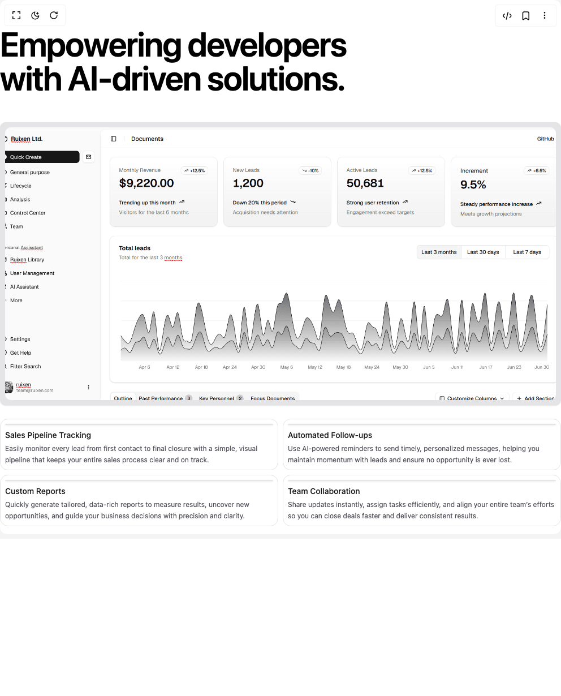

# Build Featured Crm Demo Section in BuilderStudio

> Build this component in our Agentic IDE: [BuilderStudio](https://builderstudio.dev).
>
> Join the BuilderStudio community on [Discord](https://discord.gg/QdWeSGCqfe) and [Reddit](https://reddit.com/r/builderstudio).



## Component

- Author group: `ruixenui`
- Component: `featured-crm-demo-section`
- Variant: `default`
- Rendered HTML snapshot: [`rendered.html`](rendered.html)

## BuilderStudio prompt

You are implementing a React component based on a component reference.

## Component identity

- Author: ruixenui
- Component slug: featured-crm-demo-section
- Demo slug: default
- Title: featured-crm-demo-section
- Description: 

## Goal

Recreate this component in a React + TypeScript + Tailwind CSS project. Preserve the visual layout, spacing, colors, border radius, shadows, interaction behavior, animation behavior, responsive behavior, and dark mode behavior shown in the rendered demo.

## Implementation requirements

- Use React and TypeScript.
- Use Tailwind CSS classes whenever possible.
- Keep the component self-contained unless the source files require helper components.
- If the source uses CSS variables, custom CSS, animations, or keyframes, include them.
- If the source uses external packages, list and use the required packages.
- Preserve accessibility attributes, button semantics, links, keyboard behavior, and ARIA attributes when visible in the source.
- Do not replace the component with a simplified placeholder.
- Return complete production-ready code.

## Dependencies

No reference metadata available.

## Rendered DOM snapshot

This is the rendered demo HTML extracted from the live preview. Use it to verify structure, class names, visible content, and layout.

```html
<div id="root"><div class="w-screen min-h-screen flex justify-center items-center"><div class="w-screen min-h-screen flex justify-center items-center"><div class=" max-w-7xl mx-auto bg-white text-black dark:bg-zinc-900 dark:text-white"><header class="text-left py-12"><h1 class="text-6xl font-semibold tracking-tight">Empowering developers  <br>with AI-driven solutions.</h1></header><section class="grid grid-cols-1 lg:grid-cols-3 gap-2 h-full"><div class="rounded-lg border text-card-foreground shadow-sm lg:col-span-2 bg-zinc-200 dark:bg-zinc-800 p-2 overflow-hidden relative mb-4 lg:mb-0 flex flex-col min-h-[500px]"><div class="p-0 relative flex-grow group"><button class="absolute inset-0 flex items-center justify-center opacity-0 group-hover:opacity-100 transition-opacity"><svg xmlns="http://www.w3.org/2000/svg" width="24" height="24" viewBox="0 0 24 24" fill="none" stroke="currentColor" stroke-width="2" stroke-linecap="round" stroke-linejoin="round" class="lucide lucide-circle-play w-12 h-12 sm:w-16 sm:h-16 text-white drop-shadow-lg" aria-hidden="true"><circle cx="12" cy="12" r="10"></circle><polygon points="10 8 16 12 10 16 10 8"></polygon></svg></button></div></div><div class="grid grid-cols-1 sm:grid-cols-2 lg:grid-cols-2 gap-2 h-full"><div class="flex flex-col border border-zinc-200 dark:border-zinc-800 rounded-xl p-2 hover:shadow-lg cursor-pointer transition-shadow"><div class="border text-card-foreground shadow-sm bg-zinc-200 dark:bg-zinc-800 flex-grow rounded-lg p-0"></div><div class="mt-2"><h3 class="text-sm font-medium text-zinc-900 dark:text-zinc-100 mb-1">Sales Pipeline Tracking</h3><p class="text-xs text-zinc-600 dark:text-zinc-400 leading-relaxed">Easily monitor every lead from first contact to final closure with a simple, visual pipeline that keeps your entire sales process clear and on track.</p></div></div><div class="flex flex-col border border-zinc-200 dark:border-zinc-800 rounded-xl p-2 hover:shadow-lg cursor-pointer transition-shadow"><div class="border text-card-foreground shadow-sm bg-zinc-200 dark:bg-zinc-800 flex-grow rounded-lg p-0"></div><div class="mt-2"><h3 class="text-sm font-medium text-zinc-900 dark:text-zinc-100 mb-1">Automated Follow-ups</h3><p class="text-xs text-zinc-600 dark:text-zinc-400 leading-relaxed">Use AI-powered reminders to send timely, personalized messages, helping you maintain momentum with leads and ensure no opportunity is ever lost.</p></div></div><div class="flex flex-col border border-zinc-200 dark:border-zinc-800 rounded-xl p-2 hover:shadow-lg cursor-pointer transition-shadow"><div class="border text-card-foreground shadow-sm bg-zinc-200 dark:bg-zinc-800 flex-grow rounded-lg p-0"></div><div class="mt-2"><h3 class="text-sm font-medium text-zinc-900 dark:text-zinc-100 mb-1">Custom Reports</h3><p class="text-xs text-zinc-600 dark:text-zinc-400 leading-relaxed">Quickly generate tailored, data-rich reports to measure results, uncover new opportunities, and guide your business decisions with precision and clarity.</p></div></div><div class="flex flex-col border border-zinc-200 dark:border-zinc-800 rounded-xl p-2 hover:shadow-lg cursor-pointer transition-shadow"><div class="border text-card-foreground shadow-sm bg-zinc-200 dark:bg-zinc-800 flex-grow rounded-lg p-0"></div><div class="mt-2"><h3 class="text-sm font-medium text-zinc-900 dark:text-zinc-100 mb-1">Team Collaboration</h3><p class="text-xs text-zinc-600 dark:text-zinc-400 leading-relaxed">Share updates instantly, assign tasks efficiently, and align your entire team’s efforts so you can close deals faster and deliver consistent results.</p></div></div></div></section><section class="mt-12 grid grid-cols-2 md:grid-cols-4 gap-1 text-sm"><div class="p-3 flex items-center gap-3 hover:bg-zinc-50 dark:hover:bg-zinc-600 rounded-xl transition"><div><div class="font-normal">Salesforce</div><div class="text-xs text-gray-500 dark:text-gray-400">Enterprise CRM platform</div></div></div><div class="p-3 flex items-center gap-3 hover:bg-zinc-50 dark:hover:bg-zinc-600 rounded-xl transition"><div><div class="font-normal">HubSpot CRM</div><div class="text-xs text-gray-500 dark:text-gray-400">Inbound marketing &amp; sales</div></div></div><div class="p-3 flex items-center gap-3 hover:bg-zinc-50 dark:hover:bg-zinc-600 rounded-xl transition"><div><div class="font-normal">Zoho CRM</div><div class="text-xs text-gray-500 dark:text-gray-400">Affordable CRM solution</div></div></div><div class="p-3 flex items-center gap-3 hover:bg-zinc-50 dark:hover:bg-zinc-600 rounded-xl transition"><div><div class="font-normal">Pipedrive</div><div class="text-xs text-gray-500 dark:text-gray-400">Sales pipeline management</div></div></div><div class="p-3 flex items-center gap-3 hover:bg-zinc-50 dark:hover:bg-zinc-600 rounded-xl transition"><div><div class="font-normal">Freshsales</div><div class="text-xs text-gray-500 dark:text-gray-400">Freshworks sales CRM</div></div></div><div class="p-3 flex items-center gap-3 hover:bg-zinc-50 dark:hover:bg-zinc-600 rounded-xl transition"><div><div class="font-normal">Microsoft Dynamics 365</div><div class="text-xs text-gray-500 dark:text-gray-400">Microsoft business suite</div></div></div><div class="p-3 flex items-center gap-3 hover:bg-zinc-50 dark:hover:bg-zinc-600 rounded-xl transition"><div><div class="font-normal">Copper CRM</div><div class="text-xs text-gray-500 dark:text-gray-400">Google Workspace CRM</div></div></div><div class="p-3 flex items-center gap-3 hover:bg-zinc-50 dark:hover:bg-zinc-600 rounded-xl transition"><div><div class="font-normal">Insightly</div><div class="text-xs text-gray-500 dark:text-gray-400">Project &amp; CRM management</div></div></div></section><footer class="text-center py-12"><div>Browse your fit </div></footer></div></div></div></div>
```

## Reference source files

No reference source files were available.
