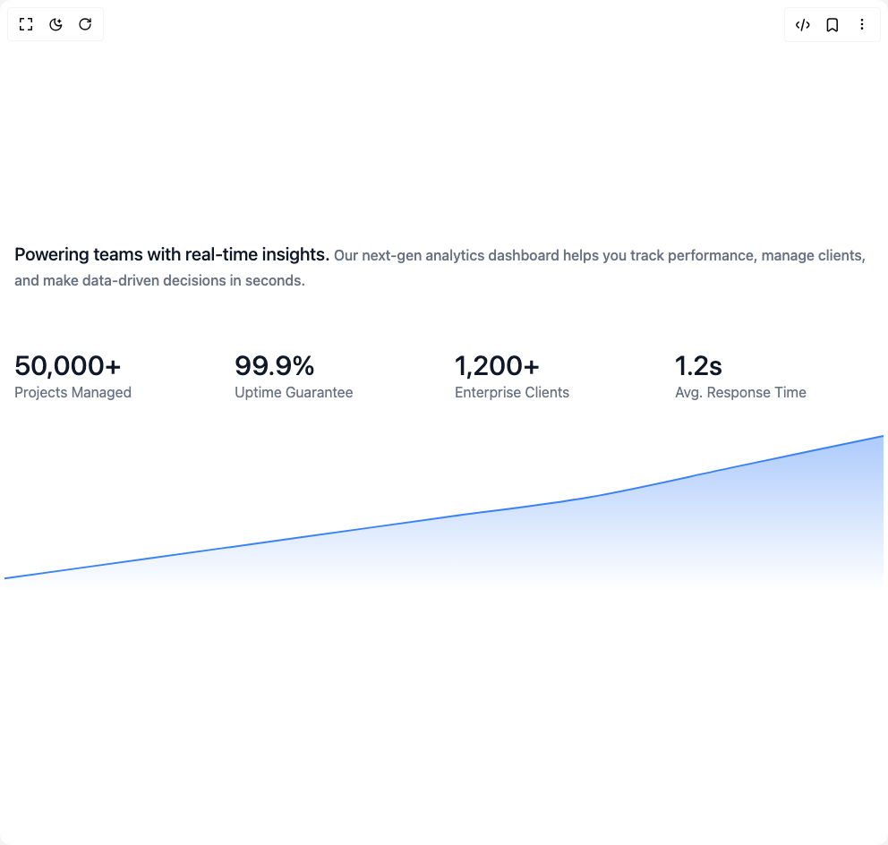

# Build Featured Section Stats in BuilderStudio

> Build this component in our Agentic IDE: [BuilderStudio](https://builderstudio.dev).
>
> Join the BuilderStudio community on [Discord](https://discord.gg/QdWeSGCqfe) and [Reddit](https://reddit.com/r/builderstudio).



## Component

- Author group: `ruixenui`
- Component: `featured-section-stats`
- Variant: `default`
- Rendered HTML snapshot: [`rendered.html`](rendered.html)

## BuilderStudio prompt

You are implementing a React component based on a component reference.

## Component identity

- Author: ruixenui
- Component slug: featured-section-stats
- Demo slug: default
- Title: featured-section-stats
- Description: 

## Goal

Recreate this component in a React + TypeScript + Tailwind CSS project. Preserve the visual layout, spacing, colors, border radius, shadows, interaction behavior, animation behavior, responsive behavior, and dark mode behavior shown in the rendered demo.

## Implementation requirements

- Use React and TypeScript.
- Use Tailwind CSS classes whenever possible.
- Keep the component self-contained unless the source files require helper components.
- If the source uses CSS variables, custom CSS, animations, or keyframes, include them.
- If the source uses external packages, list and use the required packages.
- Preserve accessibility attributes, button semantics, links, keyboard behavior, and ARIA attributes when visible in the source.
- Do not replace the component with a simplified placeholder.
- Return complete production-ready code.

## Dependencies

No reference metadata available.

## Rendered DOM snapshot

This is the rendered demo HTML extracted from the live preview. Use it to verify structure, class names, visible content, and layout.

```html
<div id="root"><div class="w-screen min-h-screen flex justify-center items-center"><div class="w-screen min-h-screen flex justify-center items-center"><section class="w-full max-w-6xl mx-auto text-left py-32"><div class="px-4"><h3 class="text-lg sm:text-xl lg:text-4xl font-medium text-gray-900 dark:text-white mb-16">Powering teams with real-time insights. <span class="text-gray-500 dark:text-gray-400 text-sm sm:text-base lg:text-4xl">Our next-gen analytics dashboard helps you track performance, manage clients, and make data-driven decisions in seconds.</span></h3><div class="grid grid-cols-2 sm:grid-cols-4 gap-6 mt-8"><div><p class="text-3xl font-medium text-gray-900">50,000+</p><p class="text-gray-500 text-md">Projects Managed</p></div><div><p class="text-3xl font-medium text-gray-900">99.9%</p><p class="text-gray-500 text-md">Uptime Guarantee</p></div><div><p class="text-3xl font-medium text-gray-900">1,200+</p><p class="text-gray-500 text-md">Enterprise Clients</p></div><div><p class="text-3xl font-medium text-gray-900">1.2s</p><p class="text-gray-500 text-md">Avg. Response Time</p></div></div></div><div class="w-full h-48 mt-8"><div class="recharts-responsive-container" style="width: 100%; height: 100%; min-width: 0px;"><div style="width: 0px; height: 0px; overflow: visible;"><div class="recharts-wrapper" style="position: relative; cursor: default; width: 992px; height: 192px;"><div xmlns="http://www.w3.org/1999/xhtml" tabindex="-1" class="recharts-tooltip-wrapper" style="visibility: hidden; pointer-events: none; position: absolute; top: 0px; left: 0px;"><div class="recharts-default-tooltip" role="status" aria-live="assertive" style="margin: 0px; padding: 10px; background-color: rgb(255, 255, 255); border: 1px solid rgb(204, 204, 204); white-space: nowrap;"><p class="recharts-tooltip-label" style="margin: 0px;"></p></div></div><svg role="application" tabindex="0" class="recharts-surface" width="992" height="192" viewBox="0 0 992 192" style="width: 100%; height: 100%;"><title></title><desc></desc><defs><clipPath id="recharts1-clip"><rect x="5" y="5" height="182" width="982"></rect></clipPath></defs><defs><linearGradient id="colorBlue" x1="0" y1="0" x2="0" y2="1"><stop offset="5%" stop-color="#3b82f6" stop-opacity="0.4"></stop><stop offset="95%" stop-color="#3b82f6" stop-opacity="0"></stop></linearGradient></defs><g class="recharts-layer recharts-area"><g class="recharts-layer"><path stroke-width="2" fill="url(#colorBlue)" fill-opacity="1" height="182" stroke="none" width="982" id="recharts-area-«r0»" class="recharts-curve recharts-area-area" d="M5,164.25C59.556,156.667,114.111,149.083,168.667,141.5C223.222,133.917,277.778,126.333,332.333,118.75C386.889,111.167,441.444,103.583,496,96C550.556,88.417,605.111,82.729,659.667,73.25C714.222,63.771,768.778,50.5,823.333,39.125C877.889,27.75,932.444,16.375,987,5L987,187C932.444,187,877.889,187,823.333,187C768.778,187,714.222,187,659.667,187C605.111,187,550.556,187,496,187C441.444,187,386.889,187,332.333,187C277.778,187,223.222,187,168.667,187C114.111,187,59.556,187,5,187Z"></path><path stroke-width="2" fill="none" fill-opacity="1" height="182" stroke="#3b82f6" width="982" class="recharts-curve recharts-area-curve" d="M5,164.25C59.556,156.667,114.111,149.083,168.667,141.5C223.222,133.917,277.778,126.333,332.333,118.75C386.889,111.167,441.444,103.583,496,96C550.556,88.417,605.111,82.729,659.667,73.25C714.222,63.771,768.778,50.5,823.333,39.125C877.889,27.75,932.444,16.375,987,5"></path></g></g></svg></div></div></div></div></section></div></div></div>
```

## Reference source files

No reference source files were available.
