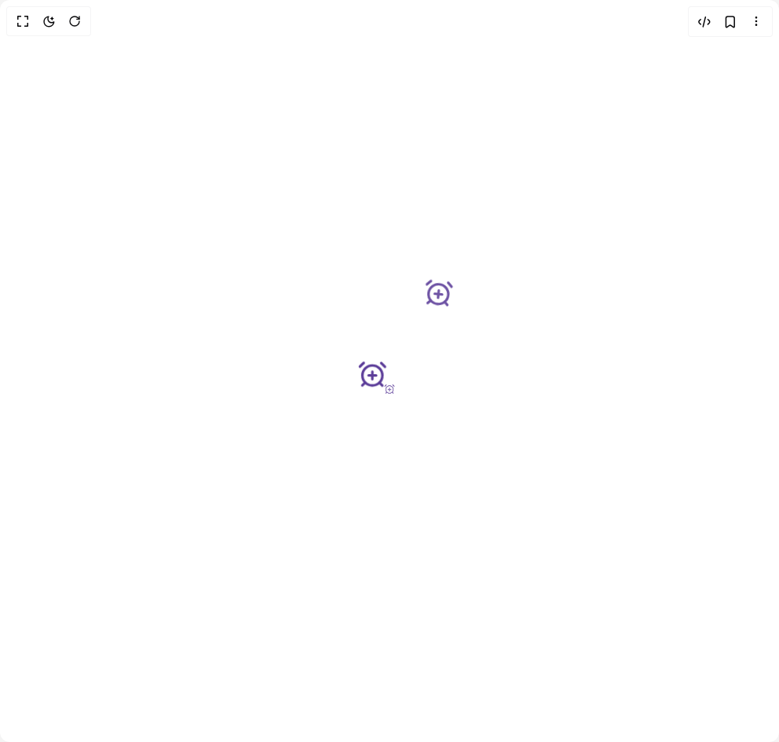

# Build Floating Icons Loader in BuilderStudio

> Build this component in our Agentic IDE: [BuilderStudio](https://builderstudio.dev).
>
> Join the BuilderStudio community on [Discord](https://discord.gg/QdWeSGCqfe) and [Reddit](https://reddit.com/r/builderstudio).



## Component

- Author group: `ruixenui`
- Component: `floating-icons-loader`
- Variant: `default`
- Rendered HTML snapshot: [`rendered.html`](rendered.html)

## BuilderStudio prompt

You are implementing a React component based on a component reference.

## Component identity

- Author: ruixenui
- Component slug: floating-icons-loader
- Demo slug: default
- Title: floating-icons-loader
- Description: 

## Goal

Recreate this component in a React + TypeScript + Tailwind CSS project. Preserve the visual layout, spacing, colors, border radius, shadows, interaction behavior, animation behavior, responsive behavior, and dark mode behavior shown in the rendered demo.

## Implementation requirements

- Use React and TypeScript.
- Use Tailwind CSS classes whenever possible.
- Keep the component self-contained unless the source files require helper components.
- If the source uses CSS variables, custom CSS, animations, or keyframes, include them.
- If the source uses external packages, list and use the required packages.
- Preserve accessibility attributes, button semantics, links, keyboard behavior, and ARIA attributes when visible in the source.
- Do not replace the component with a simplified placeholder.
- Return complete production-ready code.

## Dependencies

No reference metadata available.

## Rendered DOM snapshot

This is the rendered demo HTML extracted from the live preview. Use it to verify structure, class names, visible content, and layout.

```html
<div id="root"><div class="w-screen min-h-screen flex justify-center items-center"><div class="w-screen min-h-screen flex justify-center items-center"><div class="min-h-screen flex flex-col items-center justify-center space-y-8"><div class="relative w-32 h-32 mx-auto"><div class="absolute w-full h-full flex justify-center items-center animate-flowe-one" style="animation-delay: 0s;"><svg xmlns="http://www.w3.org/2000/svg" width="40" height="40" viewBox="0 0 24 24" fill="none" stroke="#5c3d99" stroke-width="2" stroke-linecap="round" stroke-linejoin="round" class="lucide lucide-alarm-clock-plus" aria-hidden="true"><circle cx="12" cy="13" r="8"></circle><path d="M5 3 2 6"></path><path d="m22 6-3-3"></path><path d="M6.38 18.7 4 21"></path><path d="M17.64 18.67 20 21"></path><path d="M12 10v6"></path><path d="M9 13h6"></path></svg></div><div class="absolute w-full h-full flex justify-center items-center animate-flowe-two" style="animation-delay: 0.3s;"><svg xmlns="http://www.w3.org/2000/svg" width="40" height="40" viewBox="0 0 24 24" fill="none" stroke="#5c3d99" stroke-width="2" stroke-linecap="round" stroke-linejoin="round" class="lucide lucide-alarm-clock-plus" aria-hidden="true"><circle cx="12" cy="13" r="8"></circle><path d="M5 3 2 6"></path><path d="m22 6-3-3"></path><path d="M6.38 18.7 4 21"></path><path d="M17.64 18.67 20 21"></path><path d="M12 10v6"></path><path d="M9 13h6"></path></svg></div><div class="absolute w-full h-full flex justify-center items-center animate-flowe-three" style="animation-delay: 0.6s;"><svg xmlns="http://www.w3.org/2000/svg" width="40" height="40" viewBox="0 0 24 24" fill="none" stroke="#5c3d99" stroke-width="2" stroke-linecap="round" stroke-linejoin="round" class="lucide lucide-alarm-clock-plus" aria-hidden="true"><circle cx="12" cy="13" r="8"></circle><path d="M5 3 2 6"></path><path d="m22 6-3-3"></path><path d="M6.38 18.7 4 21"></path><path d="M17.64 18.67 20 21"></path><path d="M12 10v6"></path><path d="M9 13h6"></path></svg></div><style>
        @keyframes flowe-one {
          0% { transform: scale(0.5) translateY(-200px); opacity:0; }
          25% { transform: scale(0.75) translateY(-100px); opacity:1; }
          50% { transform: scale(1) translateY(0); opacity:1; }
          75% { transform: scale(0.5) translateY(50px); opacity:1; }
          100% { transform: scale(0) translateY(100px); opacity:0; }
        }
        @keyframes flowe-two {
          0% { transform: scale(0.5) rotate(-10deg) translateY(-200px) translateX(-100px); opacity:0; }
          25% { transform: scale(1) rotate(-5deg) translateY(-100px) translateX(-50px); opacity:1; }
          50% { transform: scale(1) rotate(0deg) translateY(0) translateX(-25px); opacity:1; }
          75% { transform: scale(0.5) rotate(5deg) translateY(50px) translateX(0); opacity:1; }
          100% { transform: scale(0) rotate(10deg) translateY(100px) translateX(25px); opacity:0; }
        }
        @keyframes flowe-three {
          0% { transform: scale(0.5) rotate(10deg) translateY(-200px) translateX(100px); opacity:0; }
          25% { transform: scale(1) rotate(5deg) translateY(-100px) translateX(50px); opacity:1; }
          50% { transform: scale(1) rotate(0deg) translateY(0) translateX(25px); opacity:1; }
          75% { transform: scale(0.5) rotate(-5deg) translateY(50px) translateX(0); opacity:1; }
          100% { transform: scale(0) rotate(-10deg) translateY(100px) translateX(-25px); opacity:0; }
        }

        .animate-flowe-one { animation: flowe-one 1s linear infinite; }
        .animate-flowe-two { animation: flowe-two 1s linear infinite; }
        .animate-flowe-three { animation: flowe-three 1s linear infinite; }
      </style></div></div></div></div></div>
```

## Reference source files

No reference source files were available.
