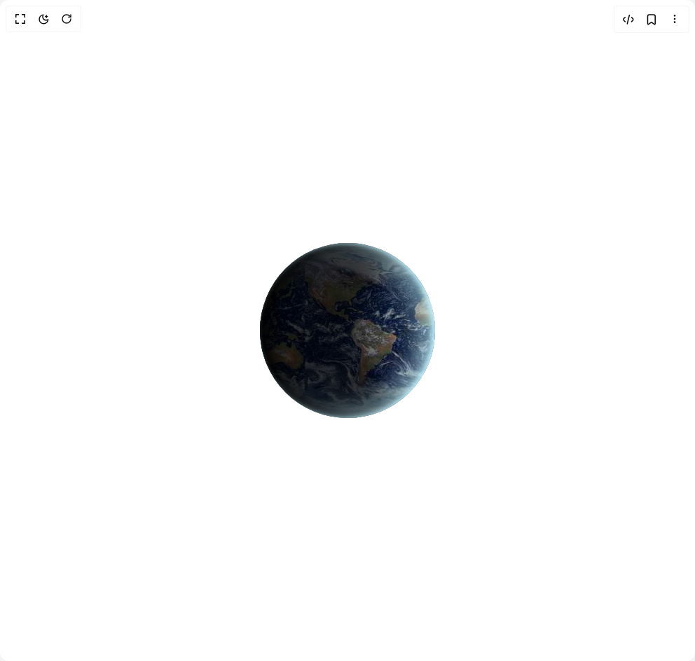

# Build Globe in BuilderStudio

> Build this component in our Agentic IDE: [BuilderStudio](https://builderstudio.dev).
>
> Join the BuilderStudio community on [Discord](https://discord.gg/QdWeSGCqfe) and [Reddit](https://reddit.com/r/builderstudio).



## Component

- Author group: `ruixenui`
- Component: `globe`
- Variant: `default`
- Rendered HTML snapshot: [`rendered.html`](rendered.html)

## BuilderStudio prompt

You are implementing a React component based on a component reference.

## Component identity

- Author: ruixenui
- Component slug: globe
- Demo slug: default
- Title: globe
- Description: 

## Goal

Recreate this component in a React + TypeScript + Tailwind CSS project. Preserve the visual layout, spacing, colors, border radius, shadows, interaction behavior, animation behavior, responsive behavior, and dark mode behavior shown in the rendered demo.

## Implementation requirements

- Use React and TypeScript.
- Use Tailwind CSS classes whenever possible.
- Keep the component self-contained unless the source files require helper components.
- If the source uses CSS variables, custom CSS, animations, or keyframes, include them.
- If the source uses external packages, list and use the required packages.
- Preserve accessibility attributes, button semantics, links, keyboard behavior, and ARIA attributes when visible in the source.
- Do not replace the component with a simplified placeholder.
- Return complete production-ready code.

## Dependencies

No reference metadata available.

## Rendered DOM snapshot

This is the rendered demo HTML extracted from the live preview. Use it to verify structure, class names, visible content, and layout.

```html
<div id="root"><div class="w-screen min-h-screen flex justify-center items-center"><div class="w-screen min-h-screen flex justify-center items-center"><style>
          @keyframes earthRotate {
            0% { background-position: 0 0; }
            100% { background-position: 400px 0; }
          }
          @keyframes twinkling { 0%,100% { opacity:0.1; } 50% { opacity:1; } }
          @keyframes twinkling-slow { 0%,100% { opacity:0.1; } 50% { opacity:1; } }
          @keyframes twinkling-long { 0%,100% { opacity:0.1; } 50% { opacity:1; } }
          @keyframes twinkling-fast { 0%,100% { opacity:0.1; } 50% { opacity:1; } }
        </style><div class="flex items-center justify-center h-screen"><div class="relative w-[250px] h-[250px] rounded-full overflow-hidden shadow-[0_0_20px_rgba(255,255,255,0.2),-5px_0_8px_#c3f4ff_inset,15px_2px_25px_#000_inset,-24px_-2px_34px_#c3f4ff99_inset,250px_0_44px_#00000066_inset,150px_0_38px_#000000aa_inset]" style="background-image: url(&quot;https://pub-940ccf6255b54fa799a9b01050e6c227.r2.dev/globe.jpeg&quot;); background-size: cover; background-position: left center; animation: 30s linear 0s infinite normal none running earthRotate;"><div class="absolute left-[-20px] w-1 h-1 bg-white rounded-full" style="animation: 3s ease 0s infinite normal none running twinkling;"></div><div class="absolute left-[-40px] top-[30px] w-1 h-1 bg-white rounded-full" style="animation: 2s ease 0s infinite normal none running twinkling-slow;"></div><div class="absolute left-[350px] top-[90px] w-1 h-1 bg-white rounded-full" style="animation: 4s ease 0s infinite normal none running twinkling-long;"></div><div class="absolute left-[200px] top-[290px] w-1 h-1 bg-white rounded-full" style="animation: 3s ease 0s infinite normal none running twinkling;"></div><div class="absolute left-[50px] top-[270px] w-1 h-1 bg-white rounded-full" style="animation: 1.5s ease 0s infinite normal none running twinkling-fast;"></div><div class="absolute left-[250px] top-[-50px] w-1 h-1 bg-white rounded-full" style="animation: 4s ease 0s infinite normal none running twinkling-long;"></div><div class="absolute left-[290px] top-[60px] w-1 h-1 bg-white rounded-full" style="animation: 2s ease 0s infinite normal none running twinkling-slow;"></div></div></div></div></div></div>
```

## Reference source files

No reference source files were available.
