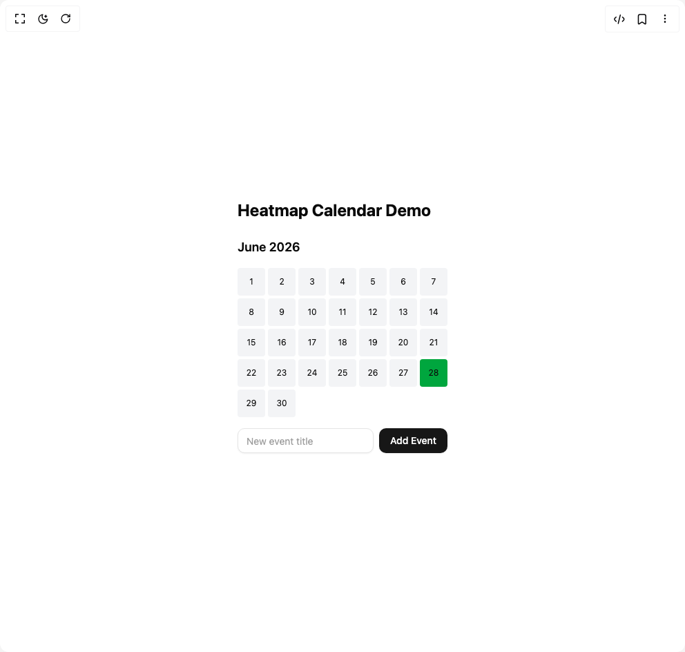

# Build Heatmap Calendar in BuilderStudio

> Build this component in our Agentic IDE: [BuilderStudio](https://builderstudio.dev).
>
> Join the BuilderStudio community on [Discord](https://discord.gg/QdWeSGCqfe) and [Reddit](https://reddit.com/r/builderstudio).



## Component

- Author group: `ruixenui`
- Component: `heatmap-calendar`
- Variant: `default`
- Rendered HTML snapshot: [`rendered.html`](rendered.html)

## BuilderStudio prompt

You are implementing a React component based on a component reference.

## Component identity

- Author: ruixenui
- Component slug: heatmap-calendar
- Demo slug: default
- Title: heatmap-calendar
- Description: 

## Goal

Recreate this component in a React + TypeScript + Tailwind CSS project. Preserve the visual layout, spacing, colors, border radius, shadows, interaction behavior, animation behavior, responsive behavior, and dark mode behavior shown in the rendered demo.

## Implementation requirements

- Use React and TypeScript.
- Use Tailwind CSS classes whenever possible.
- Keep the component self-contained unless the source files require helper components.
- If the source uses CSS variables, custom CSS, animations, or keyframes, include them.
- If the source uses external packages, list and use the required packages.
- Preserve accessibility attributes, button semantics, links, keyboard behavior, and ARIA attributes when visible in the source.
- Do not replace the component with a simplified placeholder.
- Return complete production-ready code.

## Dependencies

No reference metadata available.

## Rendered DOM snapshot

This is the rendered demo HTML extracted from the live preview. Use it to verify structure, class names, visible content, and layout.

```html
<div id="root"><div class="w-screen min-h-screen flex justify-center items-center"><div class="w-screen min-h-screen flex justify-center items-center"><div class="p-6 space-y-6"><h1 class="text-2xl font-bold">Heatmap Calendar Demo</h1><div class="space-y-4"><h2 class="text-lg font-semibold">June 2026</h2><div class="grid grid-cols-7 gap-1 mt-2"><div class="w-10 h-10 rounded cursor-pointer flex items-center justify-center bg-gray-100 dark:bg-gray-700" type="button" aria-haspopup="dialog" aria-expanded="false" aria-controls="radix-«r0»" data-state="closed"><span class="text-xs">1</span></div><div class="w-10 h-10 rounded cursor-pointer flex items-center justify-center bg-gray-100 dark:bg-gray-700" type="button" aria-haspopup="dialog" aria-expanded="false" aria-controls="radix-«r1»" data-state="closed"><span class="text-xs">2</span></div><div class="w-10 h-10 rounded cursor-pointer flex items-center justify-center bg-gray-100 dark:bg-gray-700" type="button" aria-haspopup="dialog" aria-expanded="false" aria-controls="radix-«r2»" data-state="closed"><span class="text-xs">3</span></div><div class="w-10 h-10 rounded cursor-pointer flex items-center justify-center bg-gray-100 dark:bg-gray-700" type="button" aria-haspopup="dialog" aria-expanded="false" aria-controls="radix-«r3»" data-state="closed"><span class="text-xs">4</span></div><div class="w-10 h-10 rounded cursor-pointer flex items-center justify-center bg-gray-100 dark:bg-gray-700" type="button" aria-haspopup="dialog" aria-expanded="false" aria-controls="radix-«r4»" data-state="closed"><span class="text-xs">5</span></div><div class="w-10 h-10 rounded cursor-pointer flex items-center justify-center bg-gray-100 dark:bg-gray-700" type="button" aria-haspopup="dialog" aria-expanded="false" aria-controls="radix-«r5»" data-state="closed"><span class="text-xs">6</span></div><div class="w-10 h-10 rounded cursor-pointer flex items-center justify-center bg-gray-100 dark:bg-gray-700" type="button" aria-haspopup="dialog" aria-expanded="false" aria-controls="radix-«r6»" data-state="closed"><span class="text-xs">7</span></div><div class="w-10 h-10 rounded cursor-pointer flex items-center justify-center bg-gray-100 dark:bg-gray-700" type="button" aria-haspopup="dialog" aria-expanded="false" aria-controls="radix-«r7»" data-state="closed"><span class="text-xs">8</span></div><div class="w-10 h-10 rounded cursor-pointer flex items-center justify-center bg-gray-100 dark:bg-gray-700" type="button" aria-haspopup="dialog" aria-expanded="false" aria-controls="radix-«r8»" data-state="closed"><span class="text-xs">9</span></div><div class="w-10 h-10 rounded cursor-pointer flex items-center justify-center bg-gray-100 dark:bg-gray-700" type="button" aria-haspopup="dialog" aria-expanded="false" aria-controls="radix-«r9»" data-state="closed"><span class="text-xs">10</span></div><div class="w-10 h-10 rounded cursor-pointer flex items-center justify-center bg-gray-100 dark:bg-gray-700" type="button" aria-haspopup="dialog" aria-expanded="false" aria-controls="radix-«ra»" data-state="closed"><span class="text-xs">11</span></div><div class="w-10 h-10 rounded cursor-pointer flex items-center justify-center bg-gray-100 dark:bg-gray-700" type="button" aria-haspopup="dialog" aria-expanded="false" aria-controls="radix-«rb»" data-state="closed"><span class="text-xs">12</span></div><div class="w-10 h-10 rounded cursor-pointer flex items-center justify-center bg-gray-100 dark:bg-gray-700" type="button" aria-haspopup="dialog" aria-expanded="false" aria-controls="radix-«rc»" data-state="closed"><span class="text-xs">13</span></div><div class="w-10 h-10 rounded cursor-pointer flex items-center justify-center bg-gray-100 dark:bg-gray-700" type="button" aria-haspopup="dialog" aria-expanded="false" aria-controls="radix-«rd»" data-state="closed"><span class="text-xs">14</span></div><div class="w-10 h-10 rounded cursor-pointer flex items-center justify-center bg-gray-100 dark:bg-gray-700" type="button" aria-haspopup="dialog" aria-expanded="false" aria-controls="radix-«re»" data-state="closed"><span class="text-xs">15</span></div><div class="w-10 h-10 rounded cursor-pointer flex items-center justify-center bg-gray-100 dark:bg-gray-700" type="button" aria-haspopup="dialog" aria-expanded="false" aria-controls="radix-«rf»" data-state="closed"><span class="text-xs">16</span></div><div class="w-10 h-10 rounded cursor-pointer flex items-center justify-center bg-gray-100 dark:bg-gray-700" type="button" aria-haspopup="dialog" aria-expanded="false" aria-controls="radix-«rg»" data-state="closed"><span class="text-xs">17</span></div><div class="w-10 h-10 rounded cursor-pointer flex items-center justify-center bg-gray-100 dark:bg-gray-700" type="button" aria-haspopup="dialog" aria-expanded="false" aria-controls="radix-«rh»" data-state="closed"><span class="text-xs">18</span></div><div class="w-10 h-10 rounded cursor-pointer flex items-center justify-center bg-gray-100 dark:bg-gray-700" type="button" aria-haspopup="dialog" aria-expanded="false" aria-controls="radix-«ri»" data-state="closed"><span class="text-xs">19</span></div><div class="w-10 h-10 rounded cursor-pointer flex items-center justify-center bg-gray-100 dark:bg-gray-700" type="button" aria-haspopup="dialog" aria-expanded="false" aria-controls="radix-«rj»" data-state="closed"><span class="text-xs">20</span></div><div class="w-10 h-10 rounded cursor-pointer flex items-center justify-center bg-gray-100 dark:bg-gray-700" type="button" aria-haspopup="dialog" aria-expanded="false" aria-controls="radix-«rk»" data-state="closed"><span class="text-xs">21</span></div><div class="w-10 h-10 rounded cursor-pointer flex items-center justify-center bg-gray-100 dark:bg-gray-700" type="button" aria-haspopup="dialog" aria-expanded="false" aria-controls="radix-«rl»" data-state="closed"><span class="text-xs">22</span></div><div class="w-10 h-10 rounded cursor-pointer flex items-center justify-center bg-gray-100 dark:bg-gray-700" type="button" aria-haspopup="dialog" aria-expanded="false" aria-controls="radix-«rm»" data-state="closed"><span class="text-xs">23</span></div><div class="w-10 h-10 rounded cursor-pointer flex items-center justify-center bg-gray-100 dark:bg-gray-700" type="button" aria-haspopup="dialog" aria-expanded="false" aria-controls="radix-«rn»" data-state="closed"><span class="text-xs">24</span></div><div class="w-10 h-10 rounded cursor-pointer flex items-center justify-center bg-gray-100 dark:bg-gray-700" type="button" aria-haspopup="dialog" aria-expanded="false" aria-controls="radix-«ro»" data-state="closed"><span class="text-xs">25</span></div><div class="w-10 h-10 rounded cursor-pointer flex items-center justify-center bg-gray-100 dark:bg-gray-700" type="button" aria-haspopup="dialog" aria-expanded="false" aria-controls="radix-«rp»" data-state="closed"><span class="text-xs">26</span></div><div class="w-10 h-10 rounded cursor-pointer flex items-center justify-center bg-gray-100 dark:bg-gray-700" type="button" aria-haspopup="dialog" aria-expanded="false" aria-controls="radix-«rq»" data-state="closed"><span class="text-xs">27</span></div><div class="w-10 h-10 rounded cursor-pointer flex items-center justify-center bg-green-600 dark:bg-green-600" type="button" aria-haspopup="dialog" aria-expanded="false" aria-controls="radix-«rr»" data-state="closed"><span class="text-xs">28</span></div><div class="w-10 h-10 rounded cursor-pointer flex items-center justify-center bg-gray-100 dark:bg-gray-700" type="button" aria-haspopup="dialog" aria-expanded="false" aria-controls="radix-«rs»" data-state="closed"><span class="text-xs">29</span></div><div class="w-10 h-10 rounded cursor-pointer flex items-center justify-center bg-gray-100 dark:bg-gray-700" type="button" aria-haspopup="dialog" aria-expanded="false" aria-controls="radix-«rt»" data-state="closed"><span class="text-xs">30</span></div></div><div class="flex gap-2 mt-4 items-center"><input class="flex h-9 w-full rounded-lg border border-input bg-background px-3 py-2 text-sm text-foreground shadow-sm shadow-black/5 transition-shadow placeholder:text-muted-foreground/70 focus-visible:border-ring focus-visible:outline-none focus-visible:ring-[3px] focus-visible:ring-ring/20 disabled:cursor-not-allowed disabled:opacity-50" placeholder="New event title" value=""><button class="inline-flex items-center justify-center whitespace-nowrap rounded-lg text-sm font-medium transition-colors outline-offset-2 focus-visible:outline-2 focus-visible:outline-ring/70 disabled:pointer-events-none disabled:opacity-50 [&amp;_svg]:pointer-events-none [&amp;_svg]:shrink-0 bg-primary text-primary-foreground shadow-sm shadow-black/5 hover:bg-primary/90 h-9 px-4 py-2">Add Event</button></div></div></div></div></div></div>
```

## Reference source files

No reference source files were available.
