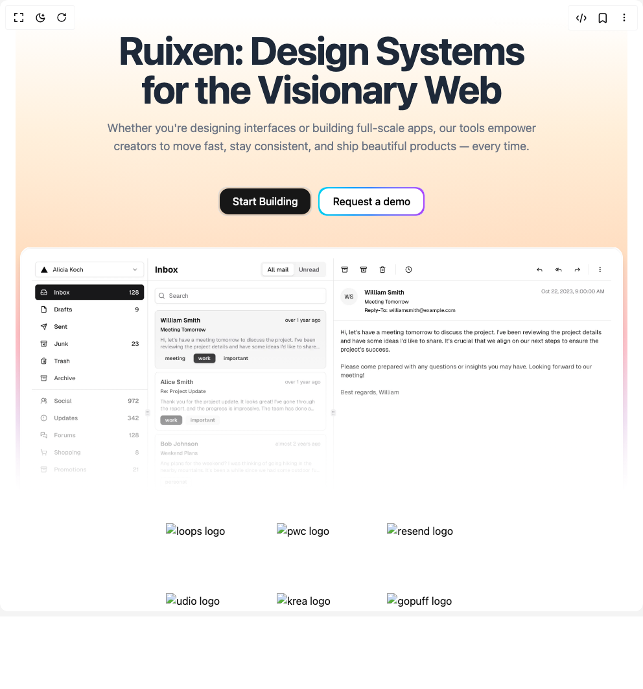

# Build Hero Section With Gradient in BuilderStudio

> Build this component in our Agentic IDE: [BuilderStudio](https://builderstudio.dev).
>
> Join the BuilderStudio community on [Discord](https://discord.gg/QdWeSGCqfe) and [Reddit](https://reddit.com/r/builderstudio).



## Component

- Author group: `ruixenui`
- Component: `hero-section-with-gradient`
- Variant: `default`
- Rendered HTML snapshot: [`rendered.html`](rendered.html)

## BuilderStudio prompt

You are implementing a React component based on a component reference.

## Component identity

- Author: ruixenui
- Component slug: hero-section-with-gradient
- Demo slug: default
- Title: hero-section-with-gradient
- Description: 

## Goal

Recreate this component in a React + TypeScript + Tailwind CSS project. Preserve the visual layout, spacing, colors, border radius, shadows, interaction behavior, animation behavior, responsive behavior, and dark mode behavior shown in the rendered demo.

## Implementation requirements

- Use React and TypeScript.
- Use Tailwind CSS classes whenever possible.
- Keep the component self-contained unless the source files require helper components.
- If the source uses CSS variables, custom CSS, animations, or keyframes, include them.
- If the source uses external packages, list and use the required packages.
- Preserve accessibility attributes, button semantics, links, keyboard behavior, and ARIA attributes when visible in the source.
- Do not replace the component with a simplified placeholder.
- Return complete production-ready code.

## Dependencies

No reference metadata available.

## Rendered DOM snapshot

This is the rendered demo HTML extracted from the live preview. Use it to verify structure, class names, visible content, and layout.

```html
<div id="root"><div class="w-screen min-h-screen flex justify-center items-center"><div class="w-screen min-h-screen flex justify-center items-center"><div class="p-6 overflow-hidden rounded-xl"><div class="relative w-full"><div class="absolute inset-0 -z-10 transition-colors duration-700 dark:bg-black max-h-[90vh] rounded-2xl" style="background-image: linear-gradient(rgb(255, 255, 255) 0%, rgb(255, 237, 213) 25%, rgb(255, 218, 185) 50%, rgb(255, 182, 193) 70%, rgb(224, 187, 228) 85%, rgb(243, 229, 245) 100%), radial-gradient(at 20% 30%, rgba(255, 255, 255, 0.2) 0%, transparent 60%), radial-gradient(at 80% 70%, rgba(243, 229, 245, 0.2) 0%, transparent 70%); background-blend-mode: overlay, screen; backdrop-filter: blur(40px); translate: none; rotate: none; scale: none; transform: translate(0px, 0px); opacity: 1;"></div><div class="pt-4 pb-10 sm:pt-6 sm:pb-12 text-center"><div class="relative max-w-2xl mx-auto"><h1 class="text-3xl sm:text-5xl md:text-6xl text-gray-800 dark:text-gray-200 font-bold tracking-tight">Ruixen: Design Systems for the Visionary Web</h1><p class="mt-4 text-lg text-gray-500 dark:text-gray-400">Whether you're designing interfaces or building full-scale apps, our tools empower creators to move fast, stay consistent, and ship beautiful products — every time.</p><div class="mt-12 flex flex-col items-center justify-center gap-2 md:flex-row"><div style="opacity: 1; filter: blur(0px); transform: none;"><div class="bg-foreground/10 rounded-[14px] border p-0.5"><span class="inline-flex items-center justify-center whitespace-nowrap font-medium transition-colors outline-offset-2 focus-visible:outline-2 focus-visible:outline-ring/70 disabled:pointer-events-none disabled:opacity-50 [&amp;_svg]:pointer-events-none [&amp;_svg]:shrink-0 bg-primary text-primary-foreground shadow-sm shadow-black/5 hover:bg-primary/90 h-10 rounded-xl px-5 text-base text-nowrap">Start Building</span></div></div><div style="opacity: 1; filter: blur(0px); transform: none;"><div class="bg-gradient-to-r from-cyan-400 via-blue-500 to-purple-500 rounded-[14px] border p-0.5"><span class="inline-flex items-center justify-center whitespace-nowrap font-medium transition-colors outline-offset-2 focus-visible:outline-2 focus-visible:outline-ring/70 disabled:pointer-events-none disabled:opacity-50 [&amp;_svg]:pointer-events-none [&amp;_svg]:shrink-0 shadow-sm shadow-black/5 h-10 rounded-xl px-5 text-base bg-white text-black hover:bg-black hover:text-white text-nowrap">Request a demo</span></div></div></div></div></div><div class=""><div style="opacity: 1; filter: blur(0px); transform: none;"><div class="relative overflow-hidden px-2"><div aria-hidden="true" class="bg-gradient-to-b from-background to-background absolute inset-0 z-10 from-transparent from-35%"></div><div class="inset-shadow-2xs max-h-[40vh] ring-background dark:inset-shadow-white/20 bg-background relative mx-auto max-w-5xl overflow-hidden rounded-t-2xl border border-gray-50 border-b-0 p-4 shadow-lg shadow-zinc-950/15 ring-1"><a href="https://ruixen.com?utm_source=BuilderStudio&amp;utm_medium=hero_section_05&amp;utm_campaign=ruixen" target="_blank"></a></div></div></div></div></div><div class="py-8"><div class="max-w-5xl mx-auto px-4"><div class="max-w-xs mx-auto grid grid-cols-2 items-center md:grid-cols-3 md:max-w-lg lg:grid-cols-6 lg:max-w-3xl"><div class="flex items-center justify-center p-4"><div class="relative h-[76px] w-full"></div></div><div class="flex items-center justify-center p-4"><div class="relative h-[76px] w-full"></div></div><div class="flex items-center justify-center p-4"><div class="relative h-[76px] w-full"></div></div><div class="flex items-center justify-center p-4"><div class="relative h-[76px] w-full"></div></div><div class="flex items-center justify-center p-4"><div class="relative h-[76px] w-full"></div></div><div class="flex items-center justify-center p-4"><div class="relative h-[76px] w-full"></div></div></div></div></div></div></div></div></div>
```

## Reference source files

No reference source files were available.
