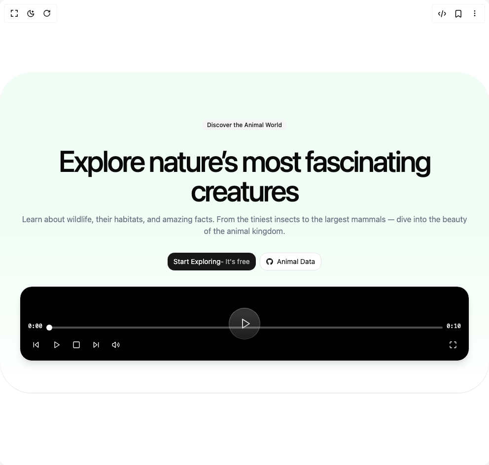

# Build Hero in BuilderStudio

> Build this component in our Agentic IDE: [BuilderStudio](https://builderstudio.dev).
>
> Join the BuilderStudio community on [Discord](https://discord.gg/QdWeSGCqfe) and [Reddit](https://reddit.com/r/builderstudio).



## Component

- Author group: `ruixenui`
- Component: `hero`
- Variant: `default`
- Rendered HTML snapshot: [`rendered.html`](rendered.html)

## BuilderStudio prompt

You are implementing a React component based on a component reference.

## Component identity

- Author: ruixenui
- Component slug: hero
- Demo slug: default
- Title: hero
- Description: 

## Goal

Recreate this component in a React + TypeScript + Tailwind CSS project. Preserve the visual layout, spacing, colors, border radius, shadows, interaction behavior, animation behavior, responsive behavior, and dark mode behavior shown in the rendered demo.

## Implementation requirements

- Use React and TypeScript.
- Use Tailwind CSS classes whenever possible.
- Keep the component self-contained unless the source files require helper components.
- If the source uses CSS variables, custom CSS, animations, or keyframes, include them.
- If the source uses external packages, list and use the required packages.
- Preserve accessibility attributes, button semantics, links, keyboard behavior, and ARIA attributes when visible in the source.
- Do not replace the component with a simplified placeholder.
- Return complete production-ready code.

## Dependencies

No reference metadata available.

## Rendered DOM snapshot

This is the rendered demo HTML extracted from the live preview. Use it to verify structure, class names, visible content, and layout.

```html
<div id="root"><div class="w-screen min-h-screen flex justify-center items-center"><div class="w-screen min-h-screen flex justify-center items-center"><section class="relative flex flex-col max-w-6xl mx-auto items-center justify-center gap-8 px-10 text-center py-16 pt-24 
        bg-gradient-to-b from-green-50 via-green-100/40 to-white 
        rounded-[4rem] shadow-sm"><div class="flex items-center justify-center gap-4 flex-col"><div class="inline-flex items-center border px-2.5 py-0.5 text-xs transition-colors focus:outline-none focus:ring-2 focus:ring-ring focus:ring-offset-2 border-transparent bg-secondary text-secondary-foreground hover:bg-secondary/80 rounded-full cursor-pointer font-medium">Discover the Animal World</div></div><div class="flex items-center justify-center gap-4 flex-col"><h1 class="text-6xl max-sm:text-4xl font-medium tracking-tighter">Explore nature’s most fascinating creatures</h1><p class="max-sm:text-sm text-gray-500">Learn about wildlife, their habitats, and amazing facts. From the tiniest insects to the largest mammals — dive into the beauty of the animal kingdom.</p></div><div class="flex items-center justify-center gap-2 flex-wrap"><a href="/docs/ui/getting-started/introduction" class="inline-flex items-center justify-center whitespace-nowrap text-sm font-medium ring-offset-background transition-colors focus-visible:outline-none focus-visible:ring-2 focus-visible:ring-ring focus-visible:ring-offset-2 disabled:pointer-events-none disabled:opacity-50 bg-primary text-primary-foreground hover:bg-primary/90 h-9 px-3 grow rounded-xl font-normal">Start Exploring <span class="opacity-70">- It's free</span></a><a href="https://ruixen.com/components" class="inline-flex items-center justify-center whitespace-nowrap text-sm font-medium ring-offset-background transition-colors focus-visible:outline-none focus-visible:ring-2 focus-visible:ring-ring focus-visible:ring-offset-2 disabled:pointer-events-none disabled:opacity-50 border border-input bg-background hover:bg-accent hover:text-accent-foreground h-9 px-3 grow rounded-xl font-normal flex items-center justify-between gap-2"><span class="flex items-center gap-2"><svg stroke="currentColor" fill="currentColor" stroke-width="0" viewBox="0 0 496 512" height="1em" width="1em" xmlns="http://www.w3.org/2000/svg"><path d="M165.9 397.4c0 2-2.3 3.6-5.2 3.6-3.3.3-5.6-1.3-5.6-3.6 0-2 2.3-3.6 5.2-3.6 3-.3 5.6 1.3 5.6 3.6zm-31.1-4.5c-.7 2 1.3 4.3 4.3 4.9 2.6 1 5.6 0 6.2-2s-1.3-4.3-4.3-5.2c-2.6-.7-5.5.3-6.2 2.3zm44.2-1.7c-2.9.7-4.9 2.6-4.6 4.9.3 2 2.9 3.3 5.9 2.6 2.9-.7 4.9-2.6 4.6-4.6-.3-1.9-3-3.2-5.9-2.9zM244.8 8C106.1 8 0 113.3 0 252c0 110.9 69.8 205.8 169.5 239.2 12.8 2.3 17.3-5.6 17.3-12.1 0-6.2-.3-40.4-.3-61.4 0 0-70 15-84.7-29.8 0 0-11.4-29.1-27.8-36.6 0 0-22.9-15.7 1.6-15.4 0 0 24.9 2 38.6 25.8 21.9 38.6 58.6 27.5 72.9 20.9 2.3-16 8.8-27.1 16-33.7-55.9-6.2-112.3-14.3-112.3-110.5 0-27.5 7.6-41.3 23.6-58.9-2.6-6.5-11.1-33.3 2.6-67.9 20.9-6.5 69 27 69 27 20-5.6 41.5-8.5 62.8-8.5s42.8 2.9 62.8 8.5c0 0 48.1-33.6 69-27 13.7 34.7 5.2 61.4 2.6 67.9 16 17.7 25.8 31.5 25.8 58.9 0 96.5-58.9 104.2-114.8 110.5 9.2 7.9 17 22.9 17 46.4 0 33.7-.3 75.4-.3 83.6 0 6.5 4.6 14.4 17.3 12.1C428.2 457.8 496 362.9 496 252 496 113.3 383.5 8 244.8 8zM97.2 352.9c-1.3 1-1 3.3.7 5.2 1.6 1.6 3.9 2.3 5.2 1 1.3-1 1-3.3-.7-5.2-1.6-1.6-3.9-2.3-5.2-1zm-10.8-8.1c-.7 1.3.3 2.9 2.3 3.9 1.6 1 3.6.7 4.3-.7.7-1.3-.3-2.9-2.3-3.9-2-.6-3.6-.3-4.3.7zm32.4 35.6c-1.6 1.3-1 4.3 1.3 6.2 2.3 2.3 5.2 2.6 6.5 1 1.3-1.3.7-4.3-1.3-6.2-2.2-2.3-5.2-2.6-6.5-1zm-11.4-14.7c-1.6 1-1.6 3.6 0 5.9 1.6 2.3 4.3 3.3 5.6 2.3 1.6-1.3 1.6-3.9 0-6.2-1.4-2.3-4-3.3-5.6-2z"></path></svg>Animal Data</span></a></div><div class="border border-gray-200 dark:border-gray-800 shadow-lg rounded-3xl overflow-hidden w-full "><div class="relative bg-black rounded-card overflow-hidden group w-full h-auto rounded-3xl" tabindex="0"><video src="https://videos.pexels.com/video-files/26772138/12003967_1920_1080_30fps.mp4" poster="https://videos.pexels.com/video-files/26772138/12003967_1920_1080_30fps.jpg" preload="metadata" crossorigin="anonymous" playsinline="" class="w-full h-full object-cover"></video><div class="absolute inset-0 flex items-center justify-center pointer-events-none transition-opacity duration-300 opacity-100"><button class="w-16 h-16 rounded-full bg-white/20 backdrop-blur-sm border border-white/30 flex items-center justify-center text-white hover:bg-white/30 transition-all duration-200 pointer-events-auto" aria-label="Play"><svg xmlns="http://www.w3.org/2000/svg" width="24" height="24" viewBox="0 0 24 24" fill="none" stroke="currentColor" stroke-width="2" stroke-linecap="round" stroke-linejoin="round" class="lucide lucide-play w-6 h-6 ms-1 rtl:-scale-x-100" aria-hidden="true"><polygon points="6 3 20 12 6 21 6 3"></polygon></svg></button></div><div class="absolute bottom-0 start-0 end-0 bg-gradient-to-t from-black/80 to-transparent transition-opacity duration-300 pointer-events-none opacity-100"><div class="p-4 space-y-3 pointer-events-auto"><div class="flex items-center gap-2 text-white text-sm"><span class="min-w-0 text-xs font-mono">0:00</span><div class="flex-1 relative group/progress"><input min="0" max="10.01" class="w-full h-1 bg-white/30 rounded-full appearance-none cursor-pointer
                        [&amp;::-webkit-slider-thumb]:appearance-none [&amp;::-webkit-slider-thumb]:w-3 [&amp;::-webkit-slider-thumb]:h-3
                        [&amp;::-webkit-slider-thumb]:rounded-full [&amp;::-webkit-slider-thumb]:bg-white
                        [&amp;::-webkit-slider-thumb]:cursor-pointer
                        [&amp;::-webkit-slider-thumb]:transition-all [&amp;::-webkit-slider-thumb]:duration-200
                        group-hover/progress:[&amp;::-webkit-slider-thumb]:scale-125 disabled:cursor-not-allowed" aria-label="Seek" type="range" value="0" style="background: linear-gradient(to right, rgb(255, 255, 255) 0%, rgb(255, 255, 255) 0%, rgba(255, 255, 255, 0.3) 0%, rgba(255, 255, 255, 0.3) 100%);"></div><span class="min-w-0 text-xs font-mono">0:10</span></div><div class="flex items-center justify-between"><div class="flex items-center gap-2"><button class="p-2 text-white hover:bg-white/20 rounded-md transition-colors" aria-label="Rewind 10 seconds"><svg xmlns="http://www.w3.org/2000/svg" width="24" height="24" viewBox="0 0 24 24" fill="none" stroke="currentColor" stroke-width="2" stroke-linecap="round" stroke-linejoin="round" class="lucide lucide-skip-back w-4 h-4 rtl:-scale-x-100" aria-hidden="true"><polygon points="19 20 9 12 19 4 19 20"></polygon><line x1="5" x2="5" y1="19" y2="5"></line></svg></button><button class="p-2 text-white hover:bg-white/20 rounded-md transition-colors" aria-label="Play"><svg xmlns="http://www.w3.org/2000/svg" width="24" height="24" viewBox="0 0 24 24" fill="none" stroke="currentColor" stroke-width="2" stroke-linecap="round" stroke-linejoin="round" class="lucide lucide-play w-4 h-4 ms-0.5 rtl:-scale-x-100" aria-hidden="true"><polygon points="6 3 20 12 6 21 6 3"></polygon></svg></button><button class="p-2 text-white hover:bg-white/20 rounded-md transition-colors" aria-label="Stop"><svg xmlns="http://www.w3.org/2000/svg" width="24" height="24" viewBox="0 0 24 24" fill="none" stroke="currentColor" stroke-width="2" stroke-linecap="round" stroke-linejoin="round" class="lucide lucide-square w-4 h-4" aria-hidden="true"><rect width="18" height="18" x="3" y="3" rx="2"></rect></svg></button><button class="p-2 text-white hover:bg-white/20 rounded-md transition-colors" aria-label="Forward 10 seconds"><svg xmlns="http://www.w3.org/2000/svg" width="24" height="24" viewBox="0 0 24 24" fill="none" stroke="currentColor" stroke-width="2" stroke-linecap="round" stroke-linejoin="round" class="lucide lucide-skip-forward w-4 h-4 rtl:-scale-x-100" aria-hidden="true"><polygon points="5 4 15 12 5 20 5 4"></polygon><line x1="19" x2="19" y1="5" y2="19"></line></svg></button><div class="flex items-center gap-2 group/volume"><button class="p-2 text-white hover:bg-white/20 rounded-md transition-colors" aria-label="Mute"><svg xmlns="http://www.w3.org/2000/svg" width="24" height="24" viewBox="0 0 24 24" fill="none" stroke="currentColor" stroke-width="2" stroke-linecap="round" stroke-linejoin="round" class="lucide lucide-volume2 lucide-volume-2 w-4 h-4" aria-hidden="true"><path d="M11 4.702a.705.705 0 0 0-1.203-.498L6.413 7.587A1.4 1.4 0 0 1 5.416 8H3a1 1 0 0 0-1 1v6a1 1 0 0 0 1 1h2.416a1.4 1.4 0 0 1 .997.413l3.383 3.384A.705.705 0 0 0 11 19.298z"></path><path d="M16 9a5 5 0 0 1 0 6"></path><path d="M19.364 18.364a9 9 0 0 0 0-12.728"></path></svg></button><div class="w-0 group-hover/volume:w-20 transition-all duration-200 overflow-hidden"><input min="0" max="1" step="0.1" class="w-full h-1 bg-white/30 rounded-full appearance-none cursor-pointer
                            [&amp;::-webkit-slider-thumb]:appearance-none [&amp;::-webkit-slider-thumb]:w-2 [&amp;::-webkit-slider-thumb]:h-2
                            [&amp;::-webkit-slider-thumb]:rounded-full [&amp;::-webkit-slider-thumb]:bg-white
                            [&amp;::-webkit-slider-thumb]:cursor-pointer" aria-label="Volume" type="range" value="1" style="background: linear-gradient(to right, rgb(255, 255, 255) 0%, rgb(255, 255, 255) 100%, rgba(255, 255, 255, 0.3) 100%, rgba(255, 255, 255, 0.3) 100%);"></div></div></div><div class="flex items-center gap-2"><button class="p-2 text-white hover:bg-white/20 rounded-md transition-colors" aria-label="Enter Fullscreen"><svg xmlns="http://www.w3.org/2000/svg" width="24" height="24" viewBox="0 0 24 24" fill="none" stroke="currentColor" stroke-width="2" stroke-linecap="round" stroke-linejoin="round" class="lucide lucide-maximize w-4 h-4" aria-hidden="true"><path d="M8 3H5a2 2 0 0 0-2 2v3"></path><path d="M21 8V5a2 2 0 0 0-2-2h-3"></path><path d="M3 16v3a2 2 0 0 0 2 2h3"></path><path d="M16 21h3a2 2 0 0 0 2-2v-3"></path></svg></button></div></div></div></div></div></div></section></div></div></div>
```

## Reference source files

No reference source files were available.
