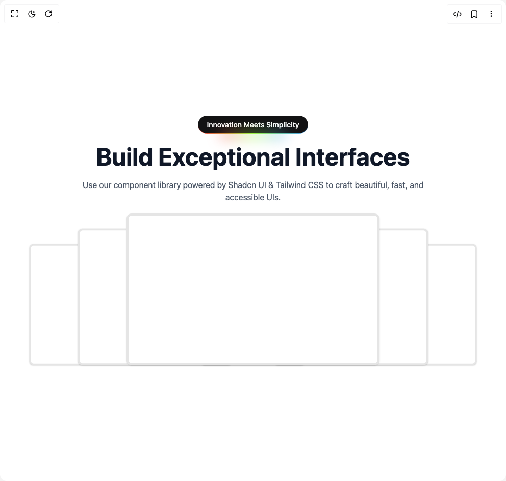

# Build Home Section in BuilderStudio

> Build this component in our Agentic IDE: [BuilderStudio](https://builderstudio.dev).
>
> Join the BuilderStudio community on [Discord](https://discord.gg/QdWeSGCqfe) and [Reddit](https://reddit.com/r/builderstudio).



## Component

- Author group: `ruixenui`
- Component: `home-section`
- Variant: `default`
- Rendered HTML snapshot: [`rendered.html`](rendered.html)

## BuilderStudio prompt

You are implementing a React component based on a component reference.

## Component identity

- Author: ruixenui
- Component slug: home-section
- Demo slug: default
- Title: home-section
- Description: 

## Goal

Recreate this component in a React + TypeScript + Tailwind CSS project. Preserve the visual layout, spacing, colors, border radius, shadows, interaction behavior, animation behavior, responsive behavior, and dark mode behavior shown in the rendered demo.

## Implementation requirements

- Use React and TypeScript.
- Use Tailwind CSS classes whenever possible.
- Keep the component self-contained unless the source files require helper components.
- If the source uses CSS variables, custom CSS, animations, or keyframes, include them.
- If the source uses external packages, list and use the required packages.
- Preserve accessibility attributes, button semantics, links, keyboard behavior, and ARIA attributes when visible in the source.
- Do not replace the component with a simplified placeholder.
- Return complete production-ready code.

## Dependencies

No reference metadata available.

## Rendered DOM snapshot

This is the rendered demo HTML extracted from the live preview. Use it to verify structure, class names, visible content, and layout.

```html
<div id="root"><div class="w-screen min-h-screen flex justify-center items-center"><div class="w-screen min-h-screen flex justify-center items-center"><main><section class="py-20 px-4 bg-white dark:bg-gray-900 transition-colors duration-300"><div class="max-w-6xl mx-auto flex flex-col items-center text-center space-y-5"><button class="whitespace-nowrap outline-offset-2 focus-visible:outline-2 focus-visible:outline-ring/70 [&amp;_svg]:pointer-events-none [&amp;_svg]:shrink-0 bg-primary shadow-black/5 hover:bg-primary/90 py-2 text-sm font-medium shadow-none text-white dark:text-white duration-300 group relative inline-flex h-9 animate-rainbow cursor-pointer items-center justify-center rounded-3xl border-0 bg-[length:200%] px-4 transition-colors [background-clip:padding-box,border-box,border-box] [background-origin:border-box] [border:calc(0.08*1rem)_solid_transparent] focus-visible:outline-none focus-visible:ring-1 focus-visible:ring-ring disabled:pointer-events-none disabled:opacity-50 before:absolute before:bottom-[-20%] before:left-1/2 before:z-0 before:h-1/5 before:w-3/5 before:-translate-x-1/2 before:animate-rainbow before:bg-[linear-gradient(90deg,hsl(var(--color-1)),hsl(var(--color-5)),hsl(var(--color-3)),hsl(var(--color-4)),hsl(var(--color-2)))] before:bg-[length:200%] before:[filter:blur(calc(0.8*1rem))] bg-[linear-gradient(#121213,#121213),linear-gradient(#121213_50%,rgba(18,18,19,0.6)_80%,rgba(18,18,19,0)),linear-gradient(90deg,hsl(var(--color-1)),hsl(var(--color-5)),hsl(var(--color-3)),hsl(var(--color-4)),hsl(var(--color-2)))] dark:bg-[linear-gradient(#fff,#fff),linear-gradient(#fff_50%,rgba(255,255,255,0.6)_80%,rgba(0,0,0,0)),linear-gradient(90deg,hsl(var(--color-1)),hsl(var(--color-5)),hsl(var(--color-3)),hsl(var(--color-4)),hsl(var(--color-2)))]">Innovation Meets Simplicity</button><h1 class="text-3xl md:text-5xl font-bold text-gray-900 dark:text-white transition-colors duration-300">Build Exceptional Interfaces</h1><p class="text-gray-600 dark:text-gray-300 max-w-2xl mx-auto transition-colors duration-300">Use our component library powered by Shadcn UI &amp; Tailwind CSS to craft beautiful, fast, and accessible UIs.</p><div class="flex justify-center items-center relative h-[30vw] min-h-[15rem]"><div class="absolute" style="z-index: 3; translate: none; rotate: none; scale: none; transform-origin: 50% 100%; opacity: 1; transform: translate(-240px, 0px) scale(0.8, 0.8);"><div class="rounded-lg text-card-foreground shadow-sm w-[90vw] sm:w-80 md:w-[50vw] h-60 sm:h-64 md:h-[30vw] bg-white dark:bg-gray-800 overflow-hidden transition-colors duration-300 border-4 dark:border-gray-700"><div class="flex items-center justify-center p-0 h-full"></div></div></div><div class="absolute" style="z-index: 4; translate: none; rotate: none; scale: none; transform-origin: 50% 100%; opacity: 1; transform: translate(-120px, 0px) scale(0.9, 0.9);"><div class="rounded-lg text-card-foreground shadow-sm w-[90vw] sm:w-80 md:w-[50vw] h-60 sm:h-64 md:h-[30vw] bg-white dark:bg-gray-800 overflow-hidden transition-colors duration-300 border-4 dark:border-gray-700"><div class="flex items-center justify-center p-0 h-full"></div></div></div><div class="absolute" style="z-index: 5; translate: none; rotate: none; scale: none; transform-origin: 50% 100%; opacity: 1; transform: translate(0px, 0px);"><div class="rounded-lg text-card-foreground shadow-sm w-[90vw] sm:w-80 md:w-[50vw] h-60 sm:h-64 md:h-[30vw] bg-white dark:bg-gray-800 overflow-hidden transition-colors duration-300 border-4 dark:border-gray-700"><div class="flex items-center justify-center p-0 h-full"></div></div></div><div class="absolute" style="z-index: 4; translate: none; rotate: none; scale: none; transform-origin: 50% 100%; opacity: 1; transform: translate(120px, 0px) scale(0.9, 0.9);"><div class="rounded-lg text-card-foreground shadow-sm w-[90vw] sm:w-80 md:w-[50vw] h-60 sm:h-64 md:h-[30vw] bg-white dark:bg-gray-800 overflow-hidden transition-colors duration-300 border-4 dark:border-gray-700"><div class="flex items-center justify-center p-0 h-full"></div></div></div><div class="absolute" style="z-index: 3; translate: none; rotate: none; scale: none; transform-origin: 50% 100%; opacity: 1; transform: translate(240px, 0px) scale(0.8, 0.8);"><div class="rounded-lg text-card-foreground shadow-sm w-[90vw] sm:w-80 md:w-[50vw] h-60 sm:h-64 md:h-[30vw] bg-white dark:bg-gray-800 overflow-hidden transition-colors duration-300 border-4 dark:border-gray-700"><div class="flex items-center justify-center p-0 h-full"></div></div></div></div></div></section></main></div></div></div>
```

## Reference source files

No reference source files were available.
