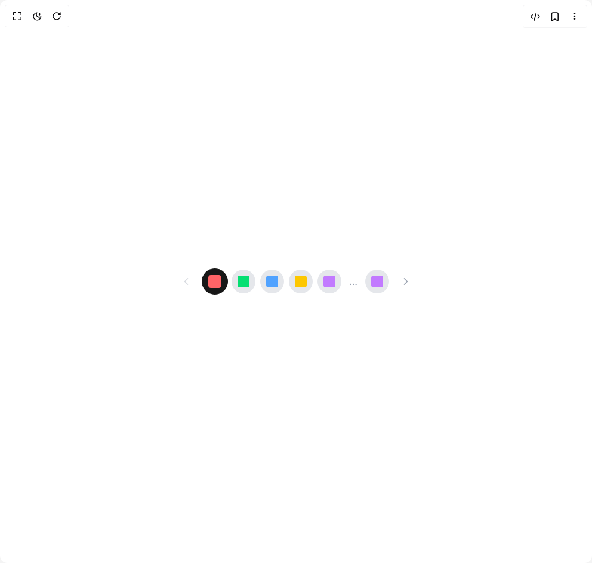

# Build Icon Pagination in BuilderStudio

> Build this component in our Agentic IDE: [BuilderStudio](https://builderstudio.dev).
>
> Join the BuilderStudio community on [Discord](https://discord.gg/QdWeSGCqfe) and [Reddit](https://reddit.com/r/builderstudio).



## Component

- Author group: `ruixenui`
- Component: `icon-pagination`
- Variant: `default`
- Rendered HTML snapshot: [`rendered.html`](rendered.html)

## BuilderStudio prompt

You are implementing a React component based on a component reference.

## Component identity

- Author: ruixenui
- Component slug: icon-pagination
- Demo slug: default
- Title: icon-pagination
- Description: 

## Goal

Recreate this component in a React + TypeScript + Tailwind CSS project. Preserve the visual layout, spacing, colors, border radius, shadows, interaction behavior, animation behavior, responsive behavior, and dark mode behavior shown in the rendered demo.

## Implementation requirements

- Use React and TypeScript.
- Use Tailwind CSS classes whenever possible.
- Keep the component self-contained unless the source files require helper components.
- If the source uses CSS variables, custom CSS, animations, or keyframes, include them.
- If the source uses external packages, list and use the required packages.
- Preserve accessibility attributes, button semantics, links, keyboard behavior, and ARIA attributes when visible in the source.
- Do not replace the component with a simplified placeholder.
- Return complete production-ready code.

## Dependencies

No reference metadata available.

## Rendered DOM snapshot

This is the rendered demo HTML extracted from the live preview. Use it to verify structure, class names, visible content, and layout.

```html
<div id="root"><div class="w-screen min-h-screen flex justify-center items-center"><div class="w-screen min-h-screen flex justify-center items-center"><div class="flex items-center gap-2 p-4 flex-wrap"><button class="inline-flex items-center justify-center whitespace-nowrap rounded-md text-sm font-medium ring-offset-background focus-visible:outline-none focus-visible:ring-2 focus-visible:ring-ring focus-visible:ring-offset-2 disabled:pointer-events-none hover:bg-accent h-10 w-10 text-gray-400 hover:text-primary disabled:opacity-40 transition-colors" disabled=""><svg xmlns="http://www.w3.org/2000/svg" width="24" height="24" viewBox="0 0 24 24" fill="none" stroke="currentColor" stroke-width="2" stroke-linecap="round" stroke-linejoin="round" class="lucide lucide-chevron-left w-5 h-5" aria-hidden="true"><path d="m15 18-6-6 6-6"></path></svg></button><button class="whitespace-nowrap text-sm font-medium ring-offset-background focus-visible:outline-none focus-visible:ring-2 focus-visible:ring-ring focus-visible:ring-offset-2 disabled:pointer-events-none disabled:opacity-50 hover:bg-primary/90 w-10 h-10 rounded-full flex items-center justify-center transition-transform scale-110 bg-primary text-white border border-primary" data-state="closed"><div class="w-5 h-5 rounded bg-red-400"></div></button><button class="whitespace-nowrap text-sm font-medium ring-offset-background focus-visible:outline-none focus-visible:ring-2 focus-visible:ring-ring focus-visible:ring-offset-2 disabled:pointer-events-none disabled:opacity-50 hover:bg-accent hover:text-accent-foreground w-10 h-10 rounded-full flex items-center justify-center transition-transform bg-gray-200 dark:bg-gray-700" data-state="closed"><div class="w-5 h-5 rounded bg-green-400"></div></button><button class="whitespace-nowrap text-sm font-medium ring-offset-background focus-visible:outline-none focus-visible:ring-2 focus-visible:ring-ring focus-visible:ring-offset-2 disabled:pointer-events-none disabled:opacity-50 hover:bg-accent hover:text-accent-foreground w-10 h-10 rounded-full flex items-center justify-center transition-transform bg-gray-200 dark:bg-gray-700" data-state="closed"><div class="w-5 h-5 rounded bg-blue-400"></div></button><button class="whitespace-nowrap text-sm font-medium ring-offset-background focus-visible:outline-none focus-visible:ring-2 focus-visible:ring-ring focus-visible:ring-offset-2 disabled:pointer-events-none disabled:opacity-50 hover:bg-accent hover:text-accent-foreground w-10 h-10 rounded-full flex items-center justify-center transition-transform bg-gray-200 dark:bg-gray-700" data-state="closed"><div class="w-5 h-5 rounded bg-yellow-400"></div></button><button class="whitespace-nowrap text-sm font-medium ring-offset-background focus-visible:outline-none focus-visible:ring-2 focus-visible:ring-ring focus-visible:ring-offset-2 disabled:pointer-events-none disabled:opacity-50 hover:bg-accent hover:text-accent-foreground w-10 h-10 rounded-full flex items-center justify-center transition-transform bg-gray-200 dark:bg-gray-700" data-state="closed"><div class="w-5 h-5 rounded bg-purple-400"></div></button><div class="w-6 h-6 flex items-center justify-center text-gray-400 select-none">...</div><button class="whitespace-nowrap text-sm font-medium ring-offset-background focus-visible:outline-none focus-visible:ring-2 focus-visible:ring-ring focus-visible:ring-offset-2 disabled:pointer-events-none disabled:opacity-50 hover:bg-accent hover:text-accent-foreground w-10 h-10 rounded-full flex items-center justify-center transition-transform bg-gray-200 dark:bg-gray-700" data-state="closed"><div class="w-5 h-5 rounded bg-purple-400"></div></button><button class="inline-flex items-center justify-center whitespace-nowrap rounded-md text-sm font-medium ring-offset-background focus-visible:outline-none focus-visible:ring-2 focus-visible:ring-ring focus-visible:ring-offset-2 disabled:pointer-events-none hover:bg-accent h-10 w-10 text-gray-400 hover:text-primary disabled:opacity-40 transition-colors"><svg xmlns="http://www.w3.org/2000/svg" width="24" height="24" viewBox="0 0 24 24" fill="none" stroke="currentColor" stroke-width="2" stroke-linecap="round" stroke-linejoin="round" class="lucide lucide-chevron-right w-5 h-5" aria-hidden="true"><path d="m9 18 6-6-6-6"></path></svg></button></div></div></div></div>
```

## Reference source files

No reference source files were available.
