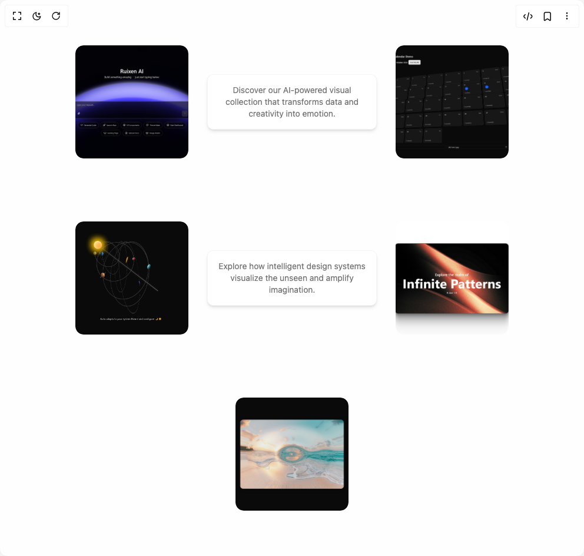

# Build Interactive Image Gallery in BuilderStudio

> Build this component in our Agentic IDE: [BuilderStudio](https://builderstudio.dev).
>
> Join the BuilderStudio community on [Discord](https://discord.gg/QdWeSGCqfe) and [Reddit](https://reddit.com/r/builderstudio).



## Component

- Author group: `ruixenui`
- Component: `interactive-image-gallery`
- Variant: `default`
- Rendered HTML snapshot: [`rendered.html`](rendered.html)

## BuilderStudio prompt

You are implementing a React component based on a component reference.

## Component identity

- Author: ruixenui
- Component slug: interactive-image-gallery
- Demo slug: default
- Title: interactive-image-gallery
- Description: 

## Goal

Recreate this component in a React + TypeScript + Tailwind CSS project. Preserve the visual layout, spacing, colors, border radius, shadows, interaction behavior, animation behavior, responsive behavior, and dark mode behavior shown in the rendered demo.

## Implementation requirements

- Use React and TypeScript.
- Use Tailwind CSS classes whenever possible.
- Keep the component self-contained unless the source files require helper components.
- If the source uses CSS variables, custom CSS, animations, or keyframes, include them.
- If the source uses external packages, list and use the required packages.
- Preserve accessibility attributes, button semantics, links, keyboard behavior, and ARIA attributes when visible in the source.
- Do not replace the component with a simplified placeholder.
- Return complete production-ready code.

## Dependencies

No reference metadata available.

## Rendered DOM snapshot

This is the rendered demo HTML extracted from the live preview. Use it to verify structure, class names, visible content, and layout.

```html
<div id="root"><div class="w-screen min-h-screen flex justify-center items-center"><div class="w-screen min-h-screen flex justify-center items-center"><main class="min-h-screen bg-background text-foreground flex justify-center items-center"><div class="relative w-full min-h-screen bg-muted/10 flex flex-wrap justify-center items-center gap-8 p-10 transition-colors"><div class="relative transition-all duration-300 ease-in-out rounded-xl overflow-hidden hover:scale-105 opacity-100"></div><div class="rounded-lg text-card-foreground w-72 bg-background shadow-md border border-muted text-center"><div class="p-4 text-sm text-muted-foreground">Discover our AI-powered visual collection that transforms data and creativity into emotion.</div></div><div class="relative transition-all duration-300 ease-in-out rounded-xl overflow-hidden hover:scale-105 opacity-100"></div><div class="relative transition-all duration-300 ease-in-out rounded-xl overflow-hidden hover:scale-105 opacity-100"></div><div class="rounded-lg text-card-foreground w-72 bg-background shadow-md border border-muted text-center"><div class="p-4 text-sm text-muted-foreground">Explore how intelligent design systems visualize the unseen and amplify imagination.</div></div><div class="relative transition-all duration-300 ease-in-out rounded-xl overflow-hidden hover:scale-105 opacity-100"></div><div class="relative transition-all duration-300 ease-in-out rounded-xl overflow-hidden hover:scale-105 opacity-100"></div></div></main></div></div></div>
```

## Reference source files

No reference source files were available.
