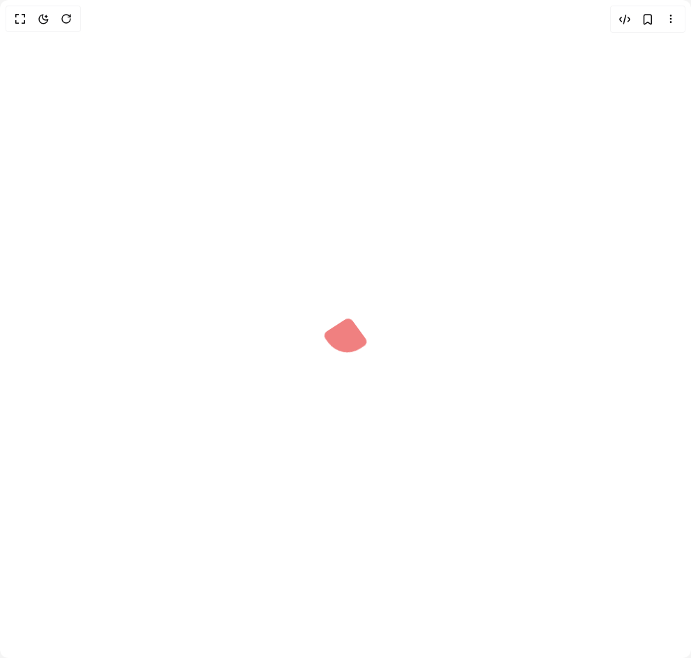

# Build Loader in BuilderStudio

> Build this component in our Agentic IDE: [BuilderStudio](https://builderstudio.dev).
>
> Join the BuilderStudio community on [Discord](https://discord.gg/QdWeSGCqfe) and [Reddit](https://reddit.com/r/builderstudio).



## Component

- Author group: `ruixenui`
- Component: `loader`
- Variant: `default`
- Rendered HTML snapshot: [`rendered.html`](rendered.html)

## BuilderStudio prompt

You are implementing a React component based on a component reference.

## Component identity

- Author: ruixenui
- Component slug: loader
- Demo slug: default
- Title: loader
- Description: 

## Goal

Recreate this component in a React + TypeScript + Tailwind CSS project. Preserve the visual layout, spacing, colors, border radius, shadows, interaction behavior, animation behavior, responsive behavior, and dark mode behavior shown in the rendered demo.

## Implementation requirements

- Use React and TypeScript.
- Use Tailwind CSS classes whenever possible.
- Keep the component self-contained unless the source files require helper components.
- If the source uses CSS variables, custom CSS, animations, or keyframes, include them.
- If the source uses external packages, list and use the required packages.
- Preserve accessibility attributes, button semantics, links, keyboard behavior, and ARIA attributes when visible in the source.
- Do not replace the component with a simplified placeholder.
- Return complete production-ready code.

## Dependencies

No reference metadata available.

## Rendered DOM snapshot

This is the rendered demo HTML extracted from the live preview. Use it to verify structure, class names, visible content, and layout.

```html
<div id="root"><div class="w-screen min-h-screen flex justify-center items-center"><div class="w-screen min-h-screen flex justify-center items-center"><div class="relative w-12 h-12 mx-auto"><div class="absolute w-full h-full bg-[#f08080] rounded-md animate-box-jump"></div><style>
        @keyframes box-jump {
          15% {
            border-bottom-right-radius: 3px;
          }
          25% {
            transform: translateY(9px) rotate(22.5deg);
          }
          50% {
            transform: translateY(18px) scale(1, 0.9) rotate(45deg);
            border-bottom-right-radius: 40px;
          }
          75% {
            transform: translateY(9px) rotate(67.5deg);
          }
          100% {
            transform: translateY(0) rotate(90deg);
          }
        }

        @keyframes shadow-jump {
          0%, 100% {
            transform: scale(1, 1);
          }
          50% {
            transform: scale(1.2, 1);
          }
        }

        .animate-box-jump {
          animation: box-jump 0.5s linear infinite;
        }

        .animate-shadow-jump {
          animation: shadow-jump 0.5s linear infinite;
        }
      </style></div></div></div></div>
```

## Reference source files

No reference source files were available.
