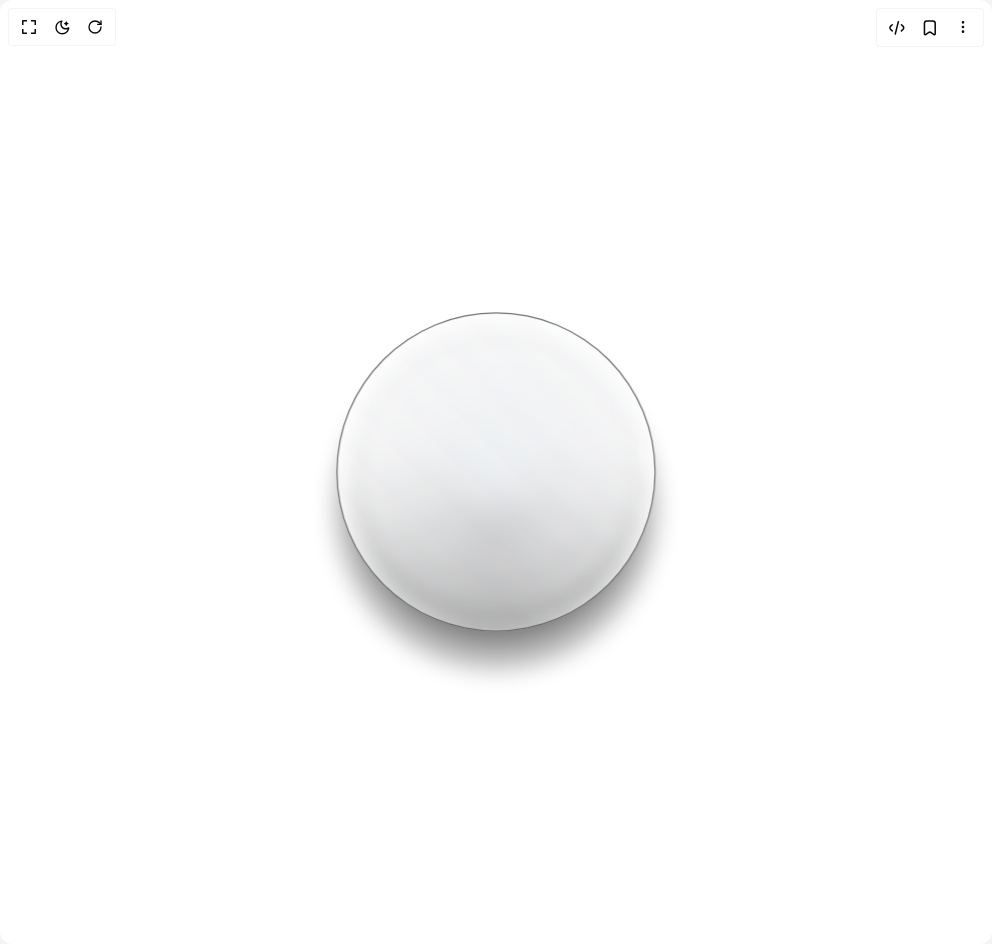

# Build Loading Circle in BuilderStudio

> Build this component in our Agentic IDE: [BuilderStudio](https://builderstudio.dev).
>
> Join the BuilderStudio community on [Discord](https://discord.gg/QdWeSGCqfe) and [Reddit](https://reddit.com/r/builderstudio).



## Component

- Author group: `ruixenui`
- Component: `loading-circle`
- Variant: `default`
- Rendered HTML snapshot: [`rendered.html`](rendered.html)

## BuilderStudio prompt

You are implementing a React component based on a component reference.

## Component identity

- Author: ruixenui
- Component slug: loading-circle
- Demo slug: default
- Title: loading-circle
- Description: 

## Goal

Recreate this component in a React + TypeScript + Tailwind CSS project. Preserve the visual layout, spacing, colors, border radius, shadows, interaction behavior, animation behavior, responsive behavior, and dark mode behavior shown in the rendered demo.

## Implementation requirements

- Use React and TypeScript.
- Use Tailwind CSS classes whenever possible.
- Keep the component self-contained unless the source files require helper components.
- If the source uses CSS variables, custom CSS, animations, or keyframes, include them.
- If the source uses external packages, list and use the required packages.
- Preserve accessibility attributes, button semantics, links, keyboard behavior, and ARIA attributes when visible in the source.
- Do not replace the component with a simplified placeholder.
- Return complete production-ready code.

## Dependencies

No reference metadata available.

## Rendered DOM snapshot

This is the rendered demo HTML extracted from the live preview. Use it to verify structure, class names, visible content, and layout.

```html
<div id="root"><div class="w-screen min-h-screen flex justify-center items-center"><div class="w-screen min-h-screen flex justify-center items-center"><div class="flex min-h-screen items-center justify-center transition-colors"><div class="relative h-[250px] aspect-square"><span class="
            absolute rounded-full 
            border 
            bg-gradient-to-tr 
            from-gray-300/5 to-gray-200/10 
            dark:from-gray-500/10 dark:to-gray-400/10 
            backdrop-blur-sm
          " style="inset: 0%; z-index: 99; border-color: rgba(100, 100, 100, 0.9); animation: 2s ease-in-out 0s infinite normal none running ripple;"></span><span class="
            absolute rounded-full 
            border 
            bg-gradient-to-tr 
            from-gray-300/5 to-gray-200/10 
            dark:from-gray-500/10 dark:to-gray-400/10 
            backdrop-blur-sm
          " style="inset: 5%; z-index: 98; border-color: rgba(100, 100, 100, 0.8); animation: 2s ease-in-out 0.15s infinite normal none running ripple;"></span><span class="
            absolute rounded-full 
            border 
            bg-gradient-to-tr 
            from-gray-300/5 to-gray-200/10 
            dark:from-gray-500/10 dark:to-gray-400/10 
            backdrop-blur-sm
          " style="inset: 10%; z-index: 97; border-color: rgba(100, 100, 100, 0.7); animation: 2s ease-in-out 0.3s infinite normal none running ripple;"></span><span class="
            absolute rounded-full 
            border 
            bg-gradient-to-tr 
            from-gray-300/5 to-gray-200/10 
            dark:from-gray-500/10 dark:to-gray-400/10 
            backdrop-blur-sm
          " style="inset: 15%; z-index: 96; border-color: rgba(100, 100, 100, 0.6); animation: 2s ease-in-out 0.45s infinite normal none running ripple;"></span><span class="
            absolute rounded-full 
            border 
            bg-gradient-to-tr 
            from-gray-300/5 to-gray-200/10 
            dark:from-gray-500/10 dark:to-gray-400/10 
            backdrop-blur-sm
          " style="inset: 20%; z-index: 95; border-color: rgba(100, 100, 100, 0.5); animation: 2s ease-in-out 0.6s infinite normal none running ripple;"></span><span class="
            absolute rounded-full 
            border 
            bg-gradient-to-tr 
            from-gray-300/5 to-gray-200/10 
            dark:from-gray-500/10 dark:to-gray-400/10 
            backdrop-blur-sm
          " style="inset: 25%; z-index: 94; border-color: rgba(100, 100, 100, 0.4); animation: 2s ease-in-out 0.75s infinite normal none running ripple;"></span><span class="
            absolute rounded-full 
            border 
            bg-gradient-to-tr 
            from-gray-300/5 to-gray-200/10 
            dark:from-gray-500/10 dark:to-gray-400/10 
            backdrop-blur-sm
          " style="inset: 30%; z-index: 93; border-color: rgba(100, 100, 100, 0.298); animation: 2s ease-in-out 0.9s infinite normal none running ripple;"></span><span class="
            absolute rounded-full 
            border 
            bg-gradient-to-tr 
            from-gray-300/5 to-gray-200/10 
            dark:from-gray-500/10 dark:to-gray-400/10 
            backdrop-blur-sm
          " style="inset: 35%; z-index: 92; border-color: rgba(100, 100, 100, 0.2); animation: 2s ease-in-out 1.05s infinite normal none running ripple;"></span></div></div></div></div></div>
```

## Reference source files

No reference source files were available.
