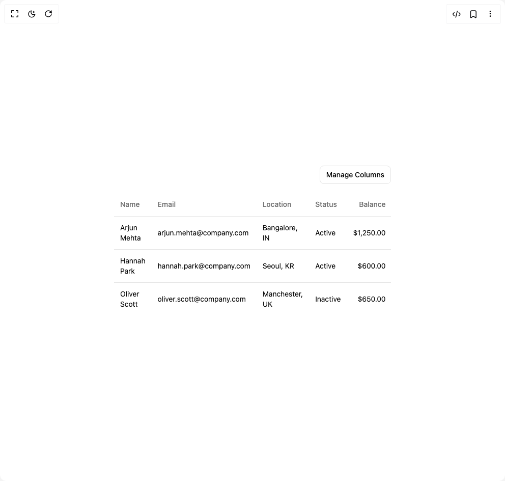

# Build Minimisable Table in BuilderStudio

> Build this component in our Agentic IDE: [BuilderStudio](https://builderstudio.dev).
>
> Join the BuilderStudio community on [Discord](https://discord.gg/QdWeSGCqfe) and [Reddit](https://reddit.com/r/builderstudio).



## Component

- Author group: `ruixenui`
- Component: `minimisable-table`
- Variant: `default`
- Rendered HTML snapshot: [`rendered.html`](rendered.html)

## BuilderStudio prompt

You are implementing a React component based on a component reference.

## Component identity

- Author: ruixenui
- Component slug: minimisable-table
- Demo slug: default
- Title: minimisable-table
- Description: 

## Goal

Recreate this component in a React + TypeScript + Tailwind CSS project. Preserve the visual layout, spacing, colors, border radius, shadows, interaction behavior, animation behavior, responsive behavior, and dark mode behavior shown in the rendered demo.

## Implementation requirements

- Use React and TypeScript.
- Use Tailwind CSS classes whenever possible.
- Keep the component self-contained unless the source files require helper components.
- If the source uses CSS variables, custom CSS, animations, or keyframes, include them.
- If the source uses external packages, list and use the required packages.
- Preserve accessibility attributes, button semantics, links, keyboard behavior, and ARIA attributes when visible in the source.
- Do not replace the component with a simplified placeholder.
- Return complete production-ready code.

## Dependencies

No reference metadata available.

## Rendered DOM snapshot

This is the rendered demo HTML extracted from the live preview. Use it to verify structure, class names, visible content, and layout.

```html
<div id="root"><div class="w-screen min-h-screen flex justify-center items-center"><div class="w-screen min-h-screen flex justify-center items-center"><div class="w-full space-y-4 px-4 max-w-xl"><div class="flex justify-end"><button class="inline-flex items-center justify-center whitespace-nowrap text-sm font-medium ring-offset-background transition-colors focus-visible:outline-none focus-visible:ring-2 focus-visible:ring-ring focus-visible:ring-offset-2 disabled:pointer-events-none disabled:opacity-50 border border-input bg-background hover:bg-accent hover:text-accent-foreground h-9 rounded-md px-3" type="button" id="radix-«r0»" aria-haspopup="menu" aria-expanded="false" data-state="closed">Manage Columns</button></div><div class="relative w-full overflow-auto"><table class="w-full caption-bottom text-sm"><thead class=""><tr class="border-b border-border transition-colors hover:bg-muted/50 data-[state=selected]:bg-muted"><th class="h-12 px-3 text-left align-middle font-medium text-muted-foreground [&amp;:has([role=checkbox])]:w-px [&amp;:has([role=checkbox])]:pr-0 [&amp;&gt;[role=checkbox]]:translate-y-0.5">Name</th><th class="h-12 px-3 text-left align-middle font-medium text-muted-foreground [&amp;:has([role=checkbox])]:w-px [&amp;:has([role=checkbox])]:pr-0 [&amp;&gt;[role=checkbox]]:translate-y-0.5">Email</th><th class="h-12 px-3 text-left align-middle font-medium text-muted-foreground [&amp;:has([role=checkbox])]:w-px [&amp;:has([role=checkbox])]:pr-0 [&amp;&gt;[role=checkbox]]:translate-y-0.5">Location</th><th class="h-12 px-3 text-left align-middle font-medium text-muted-foreground [&amp;:has([role=checkbox])]:w-px [&amp;:has([role=checkbox])]:pr-0 [&amp;&gt;[role=checkbox]]:translate-y-0.5">Status</th><th class="h-12 px-3 align-middle font-medium text-muted-foreground [&amp;:has([role=checkbox])]:w-px [&amp;:has([role=checkbox])]:pr-0 [&amp;&gt;[role=checkbox]]:translate-y-0.5 text-right">Balance</th></tr></thead><tbody class="[&amp;_tr:last-child]:border-0"><tr class="border-b border-border transition-colors hover:bg-muted/50 data-[state=selected]:bg-muted"><td class="p-3 align-middle [&amp;:has([role=checkbox])]:pr-0 [&amp;&gt;[role=checkbox]]:translate-y-0.5">Arjun Mehta</td><td class="p-3 align-middle [&amp;:has([role=checkbox])]:pr-0 [&amp;&gt;[role=checkbox]]:translate-y-0.5">arjun.mehta@company.com</td><td class="p-3 align-middle [&amp;:has([role=checkbox])]:pr-0 [&amp;&gt;[role=checkbox]]:translate-y-0.5">Bangalore, IN</td><td class="p-3 align-middle [&amp;:has([role=checkbox])]:pr-0 [&amp;&gt;[role=checkbox]]:translate-y-0.5">Active</td><td class="p-3 align-middle [&amp;:has([role=checkbox])]:pr-0 [&amp;&gt;[role=checkbox]]:translate-y-0.5 text-right">$1,250.00</td></tr><tr class="border-b border-border transition-colors hover:bg-muted/50 data-[state=selected]:bg-muted"><td class="p-3 align-middle [&amp;:has([role=checkbox])]:pr-0 [&amp;&gt;[role=checkbox]]:translate-y-0.5">Hannah Park</td><td class="p-3 align-middle [&amp;:has([role=checkbox])]:pr-0 [&amp;&gt;[role=checkbox]]:translate-y-0.5">hannah.park@company.com</td><td class="p-3 align-middle [&amp;:has([role=checkbox])]:pr-0 [&amp;&gt;[role=checkbox]]:translate-y-0.5">Seoul, KR</td><td class="p-3 align-middle [&amp;:has([role=checkbox])]:pr-0 [&amp;&gt;[role=checkbox]]:translate-y-0.5">Active</td><td class="p-3 align-middle [&amp;:has([role=checkbox])]:pr-0 [&amp;&gt;[role=checkbox]]:translate-y-0.5 text-right">$600.00</td></tr><tr class="border-b border-border transition-colors hover:bg-muted/50 data-[state=selected]:bg-muted"><td class="p-3 align-middle [&amp;:has([role=checkbox])]:pr-0 [&amp;&gt;[role=checkbox]]:translate-y-0.5">Oliver Scott</td><td class="p-3 align-middle [&amp;:has([role=checkbox])]:pr-0 [&amp;&gt;[role=checkbox]]:translate-y-0.5">oliver.scott@company.com</td><td class="p-3 align-middle [&amp;:has([role=checkbox])]:pr-0 [&amp;&gt;[role=checkbox]]:translate-y-0.5">Manchester, UK</td><td class="p-3 align-middle [&amp;:has([role=checkbox])]:pr-0 [&amp;&gt;[role=checkbox]]:translate-y-0.5">Inactive</td><td class="p-3 align-middle [&amp;:has([role=checkbox])]:pr-0 [&amp;&gt;[role=checkbox]]:translate-y-0.5 text-right">$650.00</td></tr></tbody></table></div></div></div></div></div>
```

## Reference source files

No reference source files were available.
