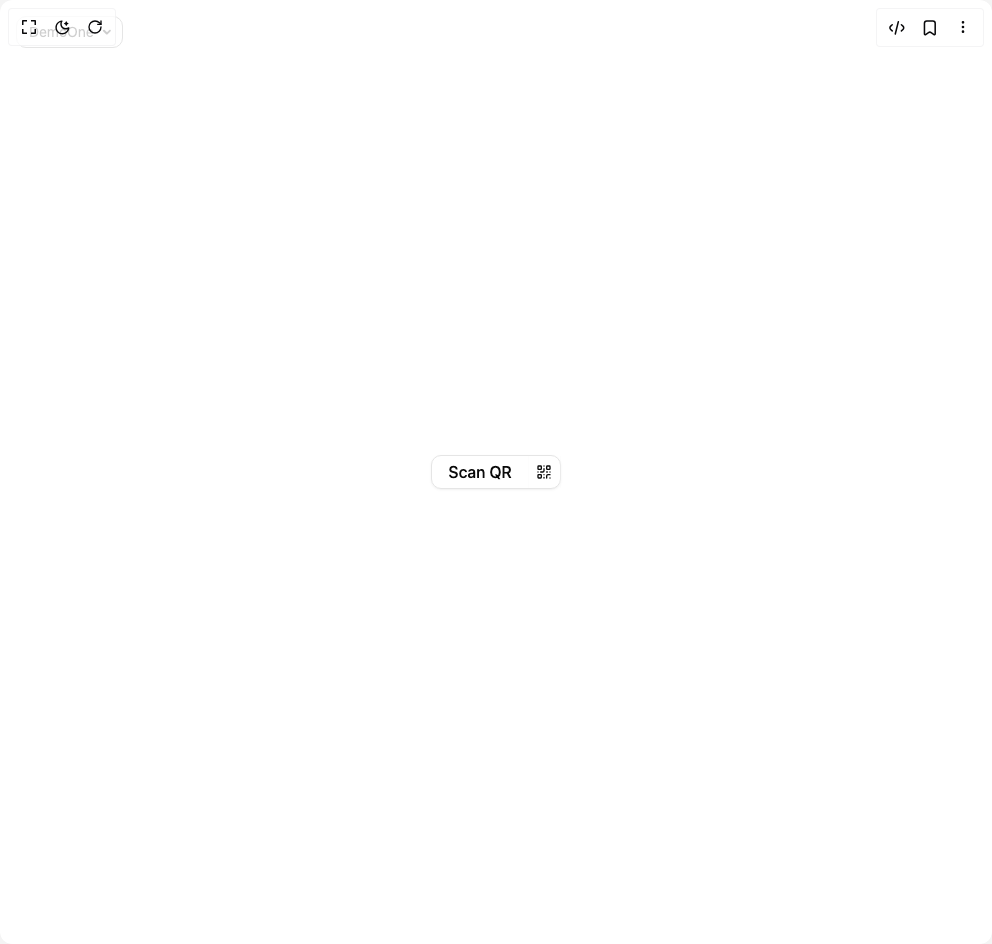

# Build Neo Qrbutton 2 in BuilderStudio

> Build this component in our Agentic IDE: [BuilderStudio](https://builderstudio.dev).
>
> Join the BuilderStudio community on [Discord](https://discord.gg/QdWeSGCqfe) and [Reddit](https://reddit.com/r/builderstudio).



## Component

- Author group: `ruixenui`
- Component: `neo-qrbutton-2`
- Variant: `default`
- Rendered HTML snapshot: [`rendered.html`](rendered.html)

## BuilderStudio prompt

You are implementing a React component based on a component reference.

## Component identity

- Author: ruixenui
- Component slug: neo-qrbutton-2
- Demo slug: default
- Title: neo-qrbutton-2
- Description: 

## Goal

Recreate this component in a React + TypeScript + Tailwind CSS project. Preserve the visual layout, spacing, colors, border radius, shadows, interaction behavior, animation behavior, responsive behavior, and dark mode behavior shown in the rendered demo.

## Implementation requirements

- Use React and TypeScript.
- Use Tailwind CSS classes whenever possible.
- Keep the component self-contained unless the source files require helper components.
- If the source uses CSS variables, custom CSS, animations, or keyframes, include them.
- If the source uses external packages, list and use the required packages.
- Preserve accessibility attributes, button semantics, links, keyboard behavior, and ARIA attributes when visible in the source.
- Do not replace the component with a simplified placeholder.
- Return complete production-ready code.

## Dependencies

No reference metadata available.

## Rendered DOM snapshot

This is the rendered demo HTML extracted from the live preview. Use it to verify structure, class names, visible content, and layout.

```html
<div id="root"><div class="fixed top-4 left-4 z-10"><select class="appearance-none h-8 max-w-[200px] text-sm leading-tight rounded-lg pl-3 pr-7 py-0 border bg-background focus:outline-none focus:ring-0"><option value="named_DemoOne_DemoOne">DemoOne</option></select><div class="absolute top-1/2 transform -translate-y-1/2 right-2 pointer-events-none"><svg class="w-4 h-4 fill-current" viewBox="0 0 20 20"><path d="M5.516 7.548c.436-.446 1.043-.48 1.576 0L10 10.405l2.908-2.857c.533-.48 1.14-.446 1.576 0 .436.445.408 1.197 0 1.615l-3.734 3.705c-.533.534-1.39.534-1.923 0l-3.734-3.705c-.408-.418-.436-1.17 0-1.615z"></path></svg></div></div><div class="w-screen min-h-screen flex justify-center items-center"><div class="relative inline-flex border -space-x-px divide-x divide-primary-foreground/30 rounded-lg shadow-sm shadow-black/5 rtl:space-x-reverse"><button class="rounded-none shadow-none font-medium first:rounded-s-lg last:rounded-e-lg focus-visible:z-10 px-4">Scan QR</button><button class="rounded-none shadow-none font-medium first:rounded-s-lg last:rounded-e-lg focus-visible:z-10 p-2" aria-label="QR code"><svg xmlns="http://www.w3.org/2000/svg" width="16" height="16" viewBox="0 0 24 24" fill="none" stroke="currentColor" stroke-width="2" stroke-linecap="round" stroke-linejoin="round" class="lucide lucide-qr-code" aria-hidden="true"><rect width="5" height="5" x="3" y="3" rx="1"></rect><rect width="5" height="5" x="16" y="3" rx="1"></rect><rect width="5" height="5" x="3" y="16" rx="1"></rect><path d="M21 16h-3a2 2 0 0 0-2 2v3"></path><path d="M21 21v.01"></path><path d="M12 7v3a2 2 0 0 1-2 2H7"></path><path d="M3 12h.01"></path><path d="M12 3h.01"></path><path d="M12 16v.01"></path><path d="M16 12h1"></path><path d="M21 12v.01"></path><path d="M12 21v-1"></path></svg></button><div class="
                    absolute top-full left-1/2 z-20 mt-2 w-48 -translate-x-1/2 rounded-lg
                    bg-gradient-to-tr from-purple-300 via-pink-200 to-indigo-300
                    bg-opacity-20 backdrop-blur-sm border border-white border-opacity-20
                    shadow-lg shadow-purple-200/40
                    flex items-center justify-center p-4
                    transition-opacity transition-transform duration-300 ease-in-out
                    opacity-0 scale-95 invisible pointer-events-none
                " style="min-height: 160px; min-width: 160px;"><svg xmlns="http://www.w3.org/2000/svg" width="96" height="96" viewBox="0 0 24 24" fill="none" stroke="currentColor" stroke-width="2" stroke-linecap="round" stroke-linejoin="round" class="lucide lucide-qr-code text-black" aria-hidden="true"><rect width="5" height="5" x="3" y="3" rx="1"></rect><rect width="5" height="5" x="16" y="3" rx="1"></rect><rect width="5" height="5" x="3" y="16" rx="1"></rect><path d="M21 16h-3a2 2 0 0 0-2 2v3"></path><path d="M21 21v.01"></path><path d="M12 7v3a2 2 0 0 1-2 2H7"></path><path d="M3 12h.01"></path><path d="M12 3h.01"></path><path d="M12 16v.01"></path><path d="M16 12h1"></path><path d="M21 12v.01"></path><path d="M12 21v-1"></path></svg></div></div></div></div>
```

## Reference source files

No reference source files were available.
