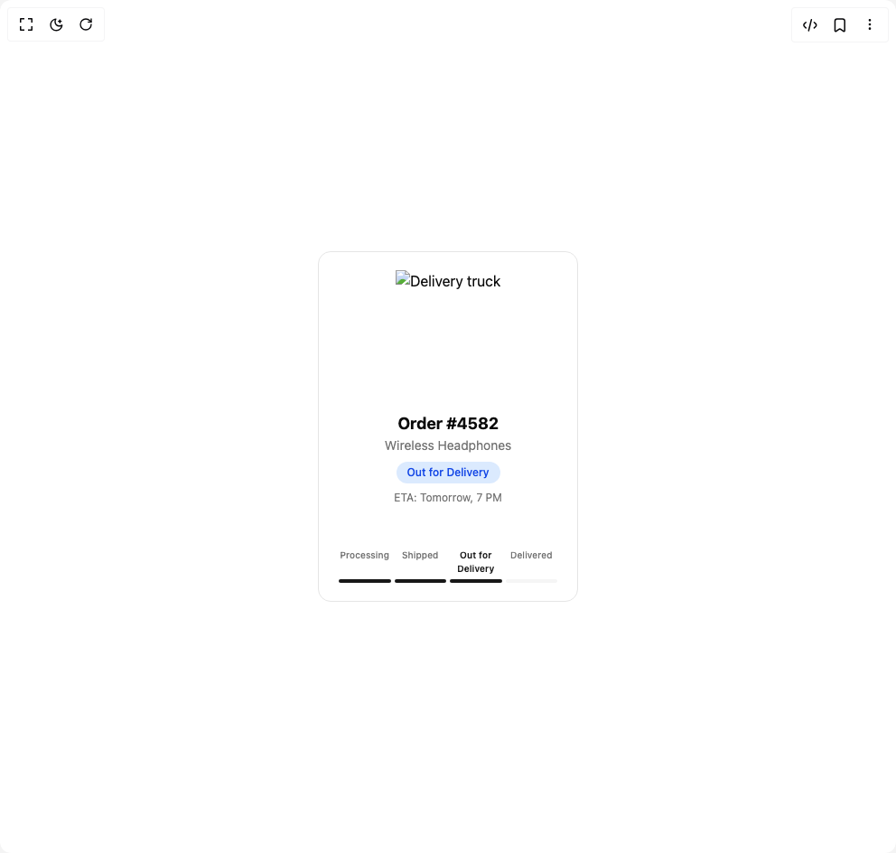

# Build Order Tracking Parallax Card in BuilderStudio

> Build this component in our Agentic IDE: [BuilderStudio](https://builderstudio.dev).
>
> Join the BuilderStudio community on [Discord](https://discord.gg/QdWeSGCqfe) and [Reddit](https://reddit.com/r/builderstudio).



## Component

- Author group: `ruixenui`
- Component: `order-tracking-parallax-card`
- Variant: `default`
- Rendered HTML snapshot: [`rendered.html`](rendered.html)

## BuilderStudio prompt

You are implementing a React component based on a component reference.

## Component identity

- Author: ruixenui
- Component slug: order-tracking-parallax-card
- Demo slug: default
- Title: order-tracking-parallax-card
- Description: 

## Goal

Recreate this component in a React + TypeScript + Tailwind CSS project. Preserve the visual layout, spacing, colors, border radius, shadows, interaction behavior, animation behavior, responsive behavior, and dark mode behavior shown in the rendered demo.

## Implementation requirements

- Use React and TypeScript.
- Use Tailwind CSS classes whenever possible.
- Keep the component self-contained unless the source files require helper components.
- If the source uses CSS variables, custom CSS, animations, or keyframes, include them.
- If the source uses external packages, list and use the required packages.
- Preserve accessibility attributes, button semantics, links, keyboard behavior, and ARIA attributes when visible in the source.
- Do not replace the component with a simplified placeholder.
- Return complete production-ready code.

## Dependencies

No reference metadata available.

## Rendered DOM snapshot

This is the rendered demo HTML extracted from the live preview. Use it to verify structure, class names, visible content, and layout.

```html
<div id="root"><div class="w-screen min-h-screen flex justify-center items-center"><div class="w-screen min-h-screen flex justify-center items-center"><div class="relative h-[420px] w-80 rounded-2xl" style="transform-style: preserve-3d; transform: none;"><div class="absolute inset-4 flex flex-col justify-between rounded-xl bg-card hover:shadow-xl p-5 border cursor-pointer" style="transform: translateZ(40px); transform-style: preserve-3d;"><div class="relative flex justify-center" style="transform: none;"></div><div class="mt-3 text-center" style="transform: none;"><h2 class="text-lg font-bold text-card-foreground">Order #4582</h2><p class="text-sm text-muted-foreground">Wireless Headphones</p><span class="mt-2 inline-block rounded-full px-3 py-1 text-xs font-medium bg-blue-100 text-blue-700">Out for Delivery</span><p class="mt-2 text-xs text-muted-foreground">ETA: Tomorrow, 7 PM</p></div><div class="mt-4" style="transform: none;"><div class="flex justify-between text-[10px] font-medium text-muted-foreground"><span class="w-full text-center">Processing</span><span class="w-full text-center">Shipped</span><span class="w-full text-center text-primary font-semibold">Out for Delivery</span><span class="w-full text-center">Delivered</span></div><div class="mt-1 flex w-full justify-between"><div class="h-1 w-full mx-0.5 rounded-full bg-primary"></div><div class="h-1 w-full mx-0.5 rounded-full bg-primary"></div><div class="h-1 w-full mx-0.5 rounded-full bg-primary"></div><div class="h-1 w-full mx-0.5 rounded-full bg-muted"></div></div></div></div></div></div></div></div>
```

## Reference source files

No reference source files were available.
