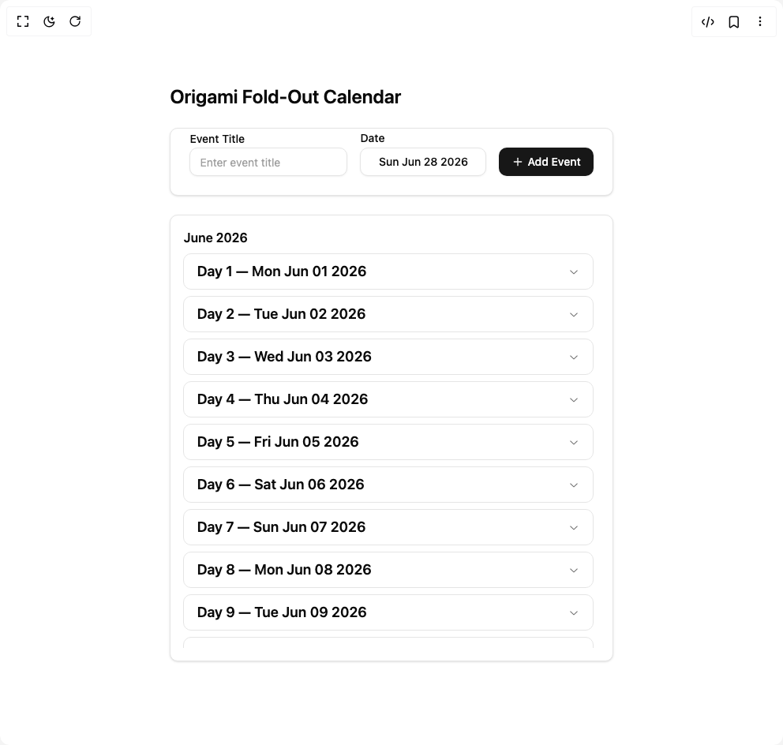

# Build Origami Fold Out Calendar in BuilderStudio

> Build this component in our Agentic IDE: [BuilderStudio](https://builderstudio.dev).
>
> Join the BuilderStudio community on [Discord](https://discord.gg/QdWeSGCqfe) and [Reddit](https://reddit.com/r/builderstudio).



## Component

- Author group: `ruixenui`
- Component: `origami-fold-out-calendar`
- Variant: `default`
- Rendered HTML snapshot: [`rendered.html`](rendered.html)

## BuilderStudio prompt

You are implementing a React component based on a component reference.

## Component identity

- Author: ruixenui
- Component slug: origami-fold-out-calendar
- Demo slug: default
- Title: origami-fold-out-calendar
- Description: 

## Goal

Recreate this component in a React + TypeScript + Tailwind CSS project. Preserve the visual layout, spacing, colors, border radius, shadows, interaction behavior, animation behavior, responsive behavior, and dark mode behavior shown in the rendered demo.

## Implementation requirements

- Use React and TypeScript.
- Use Tailwind CSS classes whenever possible.
- Keep the component self-contained unless the source files require helper components.
- If the source uses CSS variables, custom CSS, animations, or keyframes, include them.
- If the source uses external packages, list and use the required packages.
- Preserve accessibility attributes, button semantics, links, keyboard behavior, and ARIA attributes when visible in the source.
- Do not replace the component with a simplified placeholder.
- Return complete production-ready code.

## Dependencies

No reference metadata available.

## Rendered DOM snapshot

This is the rendered demo HTML extracted from the live preview. Use it to verify structure, class names, visible content, and layout.

```html
<div id="root"><div class="w-screen min-h-screen flex justify-center items-center"><div class="w-screen min-h-screen flex justify-center items-center"><div class="max-w-4xl mx-auto p-6"><h1 class="text-2xl font-semibold mb-6">Origami Fold-Out Calendar</h1><div class="flex flex-col gap-6"><div class="rounded-lg border bg-card text-card-foreground shadow-sm"><div class="p-6 pt-0 flex flex-wrap items-end gap-4"><div class="flex-1 min-w-[200px]"><label class="text-sm font-medium leading-4 text-foreground peer-disabled:cursor-not-allowed peer-disabled:opacity-70">Event Title</label><input class="flex h-9 w-full rounded-lg border border-input bg-background px-3 py-2 text-sm text-foreground shadow-sm shadow-black/5 transition-shadow placeholder:text-muted-foreground/70 focus-visible:border-ring focus-visible:outline-none focus-visible:ring-[3px] focus-visible:ring-ring/20 disabled:cursor-not-allowed disabled:opacity-50" placeholder="Enter event title" value=""></div><div class="flex flex-col"><label class="text-sm font-medium leading-4 text-foreground peer-disabled:cursor-not-allowed peer-disabled:opacity-70">Date</label><button class="inline-flex items-center justify-center whitespace-nowrap rounded-lg text-sm font-medium transition-colors outline-offset-2 focus-visible:outline-2 focus-visible:outline-ring/70 disabled:pointer-events-none disabled:opacity-50 [&amp;_svg]:pointer-events-none [&amp;_svg]:shrink-0 border border-input bg-background shadow-sm shadow-black/5 hover:bg-accent hover:text-accent-foreground h-9 px-4 py-2 mt-1 w-[160px]" type="button" aria-haspopup="dialog" aria-expanded="false" aria-controls="radix-«r0»" data-state="closed">Sun Jun 28 2026</button></div><div class="mt-5"><button class="inline-flex items-center justify-center whitespace-nowrap rounded-lg text-sm font-medium transition-colors outline-offset-2 focus-visible:outline-2 focus-visible:outline-ring/70 disabled:pointer-events-none disabled:opacity-50 [&amp;_svg]:pointer-events-none [&amp;_svg]:shrink-0 bg-primary text-primary-foreground shadow-sm shadow-black/5 hover:bg-primary/90 h-9 px-4 py-2"><svg xmlns="http://www.w3.org/2000/svg" width="24" height="24" viewBox="0 0 24 24" fill="none" stroke="currentColor" stroke-width="2" stroke-linecap="round" stroke-linejoin="round" class="lucide lucide-plus w-4 h-4 mr-1" aria-hidden="true"><path d="M5 12h14"></path><path d="M12 5v14"></path></svg> Add Event</button></div></div></div><div class="rounded-lg border bg-card text-card-foreground shadow-sm"><div class="p-4"><h3 class="font-semibold mb-2">June 2026</h3><div class="h-[500px] overflow-y-auto pr-2"><div class="w-full" data-orientation="vertical"><div data-state="closed" data-orientation="vertical" class="border-border border rounded-lg mb-2 overflow-hidden"><h3 data-orientation="vertical" data-state="closed" class="flex"><button type="button" aria-controls="radix-«r2»" aria-expanded="false" data-state="closed" data-orientation="vertical" id="radix-«r1»" class="flex flex-1 items-center justify-between text-left transition-all hover:underline [&amp;[data-state=open]&gt;svg]:rotate-180 px-4 py-2 text-lg font-semibold" data-radix-collection-item="">Day 1 — Mon Jun 01 2026 <svg width="16" height="16" viewBox="0 0 15 15" fill="none" xmlns="http://www.w3.org/2000/svg" stroke-width="2" class="shrink-0 opacity-60 transition-transform duration-200" aria-hidden="true"><path d="M3.13523 6.15803C3.3241 5.95657 3.64052 5.94637 3.84197 6.13523L7.5 9.56464L11.158 6.13523C11.3595 5.94637 11.6759 5.95657 11.8648 6.15803C12.0536 6.35949 12.0434 6.67591 11.842 6.86477L7.84197 10.6148C7.64964 10.7951 7.35036 10.7951 7.15803 10.6148L3.15803 6.86477C2.95657 6.67591 2.94637 6.35949 3.13523 6.15803Z" fill="currentColor" fill-rule="evenodd" clip-rule="evenodd"></path></svg></button></h3><div data-state="closed" id="radix-«r2»" hidden="" role="region" aria-labelledby="radix-«r1»" data-orientation="vertical" class="overflow-hidden text-sm transition-all data-[state=closed]:animate-accordion-up data-[state=open]:animate-accordion-down" style="--radix-accordion-content-height: var(--radix-collapsible-content-height); --radix-accordion-content-width: var(--radix-collapsible-content-width);"></div></div><div data-state="closed" data-orientation="vertical" class="border-border border rounded-lg mb-2 overflow-hidden"><h3 data-orientation="vertical" data-state="closed" class="flex"><button type="button" aria-controls="radix-«r4»" aria-expanded="false" data-state="closed" data-orientation="vertical" id="radix-«r3»" class="flex flex-1 items-center justify-between text-left transition-all hover:underline [&amp;[data-state=open]&gt;svg]:rotate-180 px-4 py-2 text-lg font-semibold" data-radix-collection-item="">Day 2 — Tue Jun 02 2026 <svg width="16" height="16" viewBox="0 0 15 15" fill="none" xmlns="http://www.w3.org/2000/svg" stroke-width="2" class="shrink-0 opacity-60 transition-transform duration-200" aria-hidden="true"><path d="M3.13523 6.15803C3.3241 5.95657 3.64052 5.94637 3.84197 6.13523L7.5 9.56464L11.158 6.13523C11.3595 5.94637 11.6759 5.95657 11.8648 6.15803C12.0536 6.35949 12.0434 6.67591 11.842 6.86477L7.84197 10.6148C7.64964 10.7951 7.35036 10.7951 7.15803 10.6148L3.15803 6.86477C2.95657 6.67591 2.94637 6.35949 3.13523 6.15803Z" fill="currentColor" fill-rule="evenodd" clip-rule="evenodd"></path></svg></button></h3><div data-state="closed" id="radix-«r4»" hidden="" role="region" aria-labelledby="radix-«r3»" data-orientation="vertical" class="overflow-hidden text-sm transition-all data-[state=closed]:animate-accordion-up data-[state=open]:animate-accordion-down" style="--radix-accordion-content-height: var(--radix-collapsible-content-height); --radix-accordion-content-width: var(--radix-collapsible-content-width);"></div></div><div data-state="closed" data-orientation="vertical" class="border-border border rounded-lg mb-2 overflow-hidden"><h3 data-orientation="vertical" data-state="closed" class="flex"><button type="button" aria-controls="radix-«r6»" aria-expanded="false" data-state="closed" data-orientation="vertical" id="radix-«r5»" class="flex flex-1 items-center justify-between text-left transition-all hover:underline [&amp;[data-state=open]&gt;svg]:rotate-180 px-4 py-2 text-lg font-semibold" data-radix-collection-item="">Day 3 — Wed Jun 03 2026 <svg width="16" height="16" viewBox="0 0 15 15" fill="none" xmlns="http://www.w3.org/2000/svg" stroke-width="2" class="shrink-0 opacity-60 transition-transform duration-200" aria-hidden="true"><path d="M3.13523 6.15803C3.3241 5.95657 3.64052 5.94637 3.84197 6.13523L7.5 9.56464L11.158 6.13523C11.3595 5.94637 11.6759 5.95657 11.8648 6.15803C12.0536 6.35949 12.0434 6.67591 11.842 6.86477L7.84197 10.6148C7.64964 10.7951 7.35036 10.7951 7.15803 10.6148L3.15803 6.86477C2.95657 6.67591 2.94637 6.35949 3.13523 6.15803Z" fill="currentColor" fill-rule="evenodd" clip-rule="evenodd"></path></svg></button></h3><div data-state="closed" id="radix-«r6»" hidden="" role="region" aria-labelledby="radix-«r5»" data-orientation="vertical" class="overflow-hidden text-sm transition-all data-[state=closed]:animate-accordion-up data-[state=open]:animate-accordion-down" style="--radix-accordion-content-height: var(--radix-collapsible-content-height); --radix-accordion-content-width: var(--radix-collapsible-content-width);"></div></div><div data-state="closed" data-orientation="vertical" class="border-border border rounded-lg mb-2 overflow-hidden"><h3 data-orientation="vertical" data-state="closed" class="flex"><button type="button" aria-controls="radix-«r8»" aria-expanded="false" data-state="closed" data-orientation="vertical" id="radix-«r7»" class="flex flex-1 items-center justify-between text-left transition-all hover:underline [&amp;[data-state=open]&gt;svg]:rotate-180 px-4 py-2 text-lg font-semibold" data-radix-collection-item="">Day 4 — Thu Jun 04 2026 <svg width="16" height="16" viewBox="0 0 15 15" fill="none" xmlns="http://www.w3.org/2000/svg" stroke-width="2" class="shrink-0 opacity-60 transition-transform duration-200" aria-hidden="true"><path d="M3.13523 6.15803C3.3241 5.95657 3.64052 5.94637 3.84197 6.13523L7.5 9.56464L11.158 6.13523C11.3595 5.94637 11.6759 5.95657 11.8648 6.15803C12.0536 6.35949 12.0434 6.67591 11.842 6.86477L7.84197 10.6148C7.64964 10.7951 7.35036 10.7951 7.15803 10.6148L3.15803 6.86477C2.95657 6.67591 2.94637 6.35949 3.13523 6.15803Z" fill="currentColor" fill-rule="evenodd" clip-rule="evenodd"></path></svg></button></h3><div data-state="closed" id="radix-«r8»" hidden="" role="region" aria-labelledby="radix-«r7»" data-orientation="vertical" class="overflow-hidden text-sm transition-all data-[state=closed]:animate-accordion-up data-[state=open]:animate-accordion-down" style="--radix-accordion-content-height: var(--radix-collapsible-content-height); --radix-accordion-content-width: var(--radix-collapsible-content-width);"></div></div><div data-state="closed" data-orientation="vertical" class="border-border border rounded-lg mb-2 overflow-hidden"><h3 data-orientation="vertical" data-state="closed" class="flex"><button type="button" aria-controls="radix-«ra»" aria-expanded="false" data-state="closed" data-orientation="vertical" id="radix-«r9»" class="flex flex-1 items-center justify-between text-left transition-all hover:underline [&amp;[data-state=open]&gt;svg]:rotate-180 px-4 py-2 text-lg font-semibold" data-radix-collection-item="">Day 5 — Fri Jun 05 2026 <svg width="16" height="16" viewBox="0 0 15 15" fill="none" xmlns="http://www.w3.org/2000/svg" stroke-width="2" class="shrink-0 opacity-60 transition-transform duration-200" aria-hidden="true"><path d="M3.13523 6.15803C3.3241 5.95657 3.64052 5.94637 3.84197 6.13523L7.5 9.56464L11.158 6.13523C11.3595 5.94637 11.6759 5.95657 11.8648 6.15803C12.0536 6.35949 12.0434 6.67591 11.842 6.86477L7.84197 10.6148C7.64964 10.7951 7.35036 10.7951 7.15803 10.6148L3.15803 6.86477C2.95657 6.67591 2.94637 6.35949 3.13523 6.15803Z" fill="currentColor" fill-rule="evenodd" clip-rule="evenodd"></path></svg></button></h3><div data-state="closed" id="radix-«ra»" hidden="" role="region" aria-labelledby="radix-«r9»" data-orientation="vertical" class="overflow-hidden text-sm transition-all data-[state=closed]:animate-accordion-up data-[state=open]:animate-accordion-down" style="--radix-accordion-content-height: var(--radix-collapsible-content-height); --radix-accordion-content-width: var(--radix-collapsible-content-width);"></div></div><div data-state="closed" data-orientation="vertical" class="border-border border rounded-lg mb-2 overflow-hidden"><h3 data-orientation="vertical" data-state="closed" class="flex"><button type="button" aria-controls="radix-«rc»" aria-expanded="false" data-state="closed" data-orientation="vertical" id="radix-«rb»" class="flex flex-1 items-center justify-between text-left transition-all hover:underline [&amp;[data-state=open]&gt;svg]:rotate-180 px-4 py-2 text-lg font-semibold" data-radix-collection-item="">Day 6 — Sat Jun 06 2026 <svg width="16" height="16" viewBox="0 0 15 15" fill="none" xmlns="http://www.w3.org/2000/svg" stroke-width="2" class="shrink-0 opacity-60 transition-transform duration-200" aria-hidden="true"><path d="M3.13523 6.15803C3.3241 5.95657 3.64052 5.94637 3.84197 6.13523L7.5 9.56464L11.158 6.13523C11.3595 5.94637 11.6759 5.95657 11.8648 6.15803C12.0536 6.35949 12.0434 6.67591 11.842 6.86477L7.84197 10.6148C7.64964 10.7951 7.35036 10.7951 7.15803 10.6148L3.15803 6.86477C2.95657 6.67591 2.94637 6.35949 3.13523 6.15803Z" fill="currentColor" fill-rule="evenodd" clip-rule="evenodd"></path></svg></button></h3><div data-state="closed" id="radix-«rc»" hidden="" role="region" aria-labelledby="radix-«rb»" data-orientation="vertical" class="overflow-hidden text-sm transition-all data-[state=closed]:animate-accordion-up data-[state=open]:animate-accordion-down" style="--radix-accordion-content-height: var(--radix-collapsible-content-height); --radix-accordion-content-width: var(--radix-collapsible-content-width);"></div></div><div data-state="closed" data-orientation="vertical" class="border-border border rounded-lg mb-2 overflow-hidden"><h3 data-orientation="vertical" data-state="closed" class="flex"><button type="button" aria-controls="radix-«re»" aria-expanded="false" data-state="closed" data-orientation="vertical" id="radix-«rd»" class="flex flex-1 items-center justify-between text-left transition-all hover:underline [&amp;[data-state=open]&gt;svg]:rotate-180 px-4 py-2 text-lg font-semibold" data-radix-collection-item="">Day 7 — Sun Jun 07 2026 <svg width="16" height="16" viewBox="0 0 15 15" fill="none" xmlns="http://www.w3.org/2000/svg" stroke-width="2" class="shrink-0 opacity-60 transition-transform duration-200" aria-hidden="true"><path d="M3.13523 6.15803C3.3241 5.95657 3.64052 5.94637 3.84197 6.13523L7.5 9.56464L11.158 6.13523C11.3595 5.94637 11.6759 5.95657 11.8648 6.15803C12.0536 6.35949 12.0434 6.67591 11.842 6.86477L7.84197 10.6148C7.64964 10.7951 7.35036 10.7951 7.15803 10.6148L3.15803 6.86477C2.95657 6.67591 2.94637 6.35949 3.13523 6.15803Z" fill="currentColor" fill-rule="evenodd" clip-rule="evenodd"></path></svg></button></h3><div data-state="closed" id="radix-«re»" hidden="" role="region" aria-labelledby="radix-«rd»" data-orientation="vertical" class="overflow-hidden text-sm transition-all data-[state=closed]:animate-accordion-up data-[state=open]:animate-accordion-down" style="--radix-accordion-content-height: var(--radix-collapsible-content-height); --radix-accordion-content-width: var(--radix-collapsible-content-width);"></div></div><div data-state="closed" data-orientation="vertical" class="border-border border rounded-lg mb-2 overflow-hidden"><h3 data-orientation="vertical" data-state="closed" class="flex"><button type="button" aria-controls="radix-«rg»" aria-expanded="false" data-state="closed" data-orientation="vertical" id="radix-«rf»" class="flex flex-1 items-center justify-between text-left transition-all hover:underline [&amp;[data-state=open]&gt;svg]:rotate-180 px-4 py-2 text-lg font-semibold" data-radix-collection-item="">Day 8 — Mon Jun 08 2026 <svg width="16" height="16" viewBox="0 0 15 15" fill="none" xmlns="http://www.w3.org/2000/svg" stroke-width="2" class="shrink-0 opacity-60 transition-transform duration-200" aria-hidden="true"><path d="M3.13523 6.15803C3.3241 5.95657 3.64052 5.94637 3.84197 6.13523L7.5 9.56464L11.158 6.13523C11.3595 5.94637 11.6759 5.95657 11.8648 6.15803C12.0536 6.35949 12.0434 6.67591 11.842 6.86477L7.84197 10.6148C7.64964 10.7951 7.35036 10.7951 7.15803 10.6148L3.15803 6.86477C2.95657 6.67591 2.94637 6.35949 3.13523 6.15803Z" fill="currentColor" fill-rule="evenodd" clip-rule="evenodd"></path></svg></button></h3><div data-state="closed" id="radix-«rg»" hidden="" role="region" aria-labelledby="radix-«rf»" data-orientation="vertical" class="overflow-hidden text-sm transition-all data-[state=closed]:animate-accordion-up data-[state=open]:animate-accordion-down" style="--radix-accordion-content-height: var(--radix-collapsible-content-height); --radix-accordion-content-width: var(--radix-collapsible-content-width);"></div></div><div data-state="closed" data-orientation="vertical" class="border-border border rounded-lg mb-2 overflow-hidden"><h3 data-orientation="vertical" data-state="closed" class="flex"><button type="button" aria-controls="radix-«ri»" aria-expanded="false" data-state="closed" data-orientation="vertical" id="radix-«rh»" class="flex flex-1 items-center justify-between text-left transition-all hover:underline [&amp;[data-state=open]&gt;svg]:rotate-180 px-4 py-2 text-lg font-semibold" data-radix-collection-item="">Day 9 — Tue Jun 09 2026 <svg width="16" height="16" viewBox="0 0 15 15" fill="none" xmlns="http://www.w3.org/2000/svg" stroke-width="2" class="shrink-0 opacity-60 transition-transform duration-200" aria-hidden="true"><path d="M3.13523 6.15803C3.3241 5.95657 3.64052 5.94637 3.84197 6.13523L7.5 9.56464L11.158 6.13523C11.3595 5.94637 11.6759 5.95657 11.8648 6.15803C12.0536 6.35949 12.0434 6.67591 11.842 6.86477L7.84197 10.6148C7.64964 10.7951 7.35036 10.7951 7.15803 10.6148L3.15803 6.86477C2.95657 6.67591 2.94637 6.35949 3.13523 6.15803Z" fill="currentColor" fill-rule="evenodd" clip-rule="evenodd"></path></svg></button></h3><div data-state="closed" id="radix-«ri»" hidden="" role="region" aria-labelledby="radix-«rh»" data-orientation="vertical" class="overflow-hidden text-sm transition-all data-[state=closed]:animate-accordion-up data-[state=open]:animate-accordion-down" style="--radix-accordion-content-height: var(--radix-collapsible-content-height); --radix-accordion-content-width: var(--radix-collapsible-content-width);"></div></div><div data-state="closed" data-orientation="vertical" class="border-border border rounded-lg mb-2 overflow-hidden"><h3 data-orientation="vertical" data-state="closed" class="flex"><button type="button" aria-controls="radix-«rk»" aria-expanded="false" data-state="closed" data-orientation="vertical" id="radix-«rj»" class="flex flex-1 items-center justify-between text-left transition-all hover:underline [&amp;[data-state=open]&gt;svg]:rotate-180 px-4 py-2 text-lg font-semibold" data-radix-collection-item="">Day 10 — Wed Jun 10 2026 <svg width="16" height="16" viewBox="0 0 15 15" fill="none" xmlns="http://www.w3.org/2000/svg" stroke-width="2" class="shrink-0 opacity-60 transition-transform duration-200" aria-hidden="true"><path d="M3.13523 6.15803C3.3241 5.95657 3.64052 5.94637 3.84197 6.13523L7.5 9.56464L11.158 6.13523C11.3595 5.94637 11.6759 5.95657 11.8648 6.15803C12.0536 6.35949 12.0434 6.67591 11.842 6.86477L7.84197 10.6148C7.64964 10.7951 7.35036 10.7951 7.15803 10.6148L3.15803 6.86477C2.95657 6.67591 2.94637 6.35949 3.13523 6.15803Z" fill="currentColor" fill-rule="evenodd" clip-rule="evenodd"></path></svg></button></h3><div data-state="closed" id="radix-«rk»" hidden="" role="region" aria-labelledby="radix-«rj»" data-orientation="vertical" class="overflow-hidden text-sm transition-all data-[state=closed]:animate-accordion-up data-[state=open]:animate-accordion-down" style="--radix-accordion-content-height: var(--radix-collapsible-content-height); --radix-accordion-content-width: var(--radix-collapsible-content-width);"></div></div><div data-state="closed" data-orientation="vertical" class="border-border border rounded-lg mb-2 overflow-hidden"><h3 data-orientation="vertical" data-state="closed" class="flex"><button type="button" aria-controls="radix-«rm»" aria-expanded="false" data-state="closed" data-orientation="vertical" id="radix-«rl»" class="flex flex-1 items-center justify-between text-left transition-all hover:underline [&amp;[data-state=open]&gt;svg]:rotate-180 px-4 py-2 text-lg font-semibold" data-radix-collection-item="">Day 11 — Thu Jun 11 2026 <svg width="16" height="16" viewBox="0 0 15 15" fill="none" xmlns="http://www.w3.org/2000/svg" stroke-width="2" class="shrink-0 opacity-60 transition-transform duration-200" aria-hidden="true"><path d="M3.13523 6.15803C3.3241 5.95657 3.64052 5.94637 3.84197 6.13523L7.5 9.56464L11.158 6.13523C11.3595 5.94637 11.6759 5.95657 11.8648 6.15803C12.0536 6.35949 12.0434 6.67591 11.842 6.86477L7.84197 10.6148C7.64964 10.7951 7.35036 10.7951 7.15803 10.6148L3.15803 6.86477C2.95657 6.67591 2.94637 6.35949 3.13523 6.15803Z" fill="currentColor" fill-rule="evenodd" clip-rule="evenodd"></path></svg></button></h3><div data-state="closed" id="radix-«rm»" hidden="" role="region" aria-labelledby="radix-«rl»" data-orientation="vertical" class="overflow-hidden text-sm transition-all data-[state=closed]:animate-accordion-up data-[state=open]:animate-accordion-down" style="--radix-accordion-content-height: var(--radix-collapsible-content-height); --radix-accordion-content-width: var(--radix-collapsible-content-width);"></div></div><div data-state="closed" data-orientation="vertical" class="border-border border rounded-lg mb-2 overflow-hidden"><h3 data-orientation="vertical" data-state="closed" class="flex"><button type="button" aria-controls="radix-«ro»" aria-expanded="false" data-state="closed" data-orientation="vertical" id="radix-«rn»" class="flex flex-1 items-center justify-between text-left transition-all hover:underline [&amp;[data-state=open]&gt;svg]:rotate-180 px-4 py-2 text-lg font-semibold" data-radix-collection-item="">Day 12 — Fri Jun 12 2026 <svg width="16" height="16" viewBox="0 0 15 15" fill="none" xmlns="http://www.w3.org/2000/svg" stroke-width="2" class="shrink-0 opacity-60 transition-transform duration-200" aria-hidden="true"><path d="M3.13523 6.15803C3.3241 5.95657 3.64052 5.94637 3.84197 6.13523L7.5 9.56464L11.158 6.13523C11.3595 5.94637 11.6759 5.95657 11.8648 6.15803C12.0536 6.35949 12.0434 6.67591 11.842 6.86477L7.84197 10.6148C7.64964 10.7951 7.35036 10.7951 7.15803 10.6148L3.15803 6.86477C2.95657 6.67591 2.94637 6.35949 3.13523 6.15803Z" fill="currentColor" fill-rule="evenodd" clip-rule="evenodd"></path></svg></button></h3><div data-state="closed" id="radix-«ro»" hidden="" role="region" aria-labelledby="radix-«rn»" data-orientation="vertical" class="overflow-hidden text-sm transition-all data-[state=closed]:animate-accordion-up data-[state=open]:animate-accordion-down" style="--radix-accordion-content-height: var(--radix-collapsible-content-height); --radix-accordion-content-width: var(--radix-collapsible-content-width);"></div></div><div data-state="closed" data-orientation="vertical" class="border-border border rounded-lg mb-2 overflow-hidden"><h3 data-orientation="vertical" data-state="closed" class="flex"><button type="button" aria-controls="radix-«rq»" aria-expanded="false" data-state="closed" data-orientation="vertical" id="radix-«rp»" class="flex flex-1 items-center justify-between text-left transition-all hover:underline [&amp;[data-state=open]&gt;svg]:rotate-180 px-4 py-2 text-lg font-semibold" data-radix-collection-item="">Day 13 — Sat Jun 13 2026 <svg width="16" height="16" viewBox="0 0 15 15" fill="none" xmlns="http://www.w3.org/2000/svg" stroke-width="2" class="shrink-0 opacity-60 transition-transform duration-200" aria-hidden="true"><path d="M3.13523 6.15803C3.3241 5.95657 3.64052 5.94637 3.84197 6.13523L7.5 9.56464L11.158 6.13523C11.3595 5.94637 11.6759 5.95657 11.8648 6.15803C12.0536 6.35949 12.0434 6.67591 11.842 6.86477L7.84197 10.6148C7.64964 10.7951 7.35036 10.7951 7.15803 10.6148L3.15803 6.86477C2.95657 6.67591 2.94637 6.35949 3.13523 6.15803Z" fill="currentColor" fill-rule="evenodd" clip-rule="evenodd"></path></svg></button></h3><div data-state="closed" id="radix-«rq»" hidden="" role="region" aria-labelledby="radix-«rp»" data-orientation="vertical" class="overflow-hidden text-sm transition-all data-[state=closed]:animate-accordion-up data-[state=open]:animate-accordion-down" style="--radix-accordion-content-height: var(--radix-collapsible-content-height); --radix-accordion-content-width: var(--radix-collapsible-content-width);"></div></div><div data-state="closed" data-orientation="vertical" class="border-border border rounded-lg mb-2 overflow-hidden"><h3 data-orientation="vertical" data-state="closed" class="flex"><button type="button" aria-controls="radix-«rs»" aria-expanded="false" data-state="closed" data-orientation="vertical" id="radix-«rr»" class="flex flex-1 items-center justify-between text-left transition-all hover:underline [&amp;[data-state=open]&gt;svg]:rotate-180 px-4 py-2 text-lg font-semibold" data-radix-collection-item="">Day 14 — Sun Jun 14 2026 <svg width="16" height="16" viewBox="0 0 15 15" fill="none" xmlns="http://www.w3.org/2000/svg" stroke-width="2" class="shrink-0 opacity-60 transition-transform duration-200" aria-hidden="true"><path d="M3.13523 6.15803C3.3241 5.95657 3.64052 5.94637 3.84197 6.13523L7.5 9.56464L11.158 6.13523C11.3595 5.94637 11.6759 5.95657 11.8648 6.15803C12.0536 6.35949 12.0434 6.67591 11.842 6.86477L7.84197 10.6148C7.64964 10.7951 7.35036 10.7951 7.15803 10.6148L3.15803 6.86477C2.95657 6.67591 2.94637 6.35949 3.13523 6.15803Z" fill="currentColor" fill-rule="evenodd" clip-rule="evenodd"></path></svg></button></h3><div data-state="closed" id="radix-«rs»" hidden="" role="region" aria-labelledby="radix-«rr»" data-orientation="vertical" class="overflow-hidden text-sm transition-all data-[state=closed]:animate-accordion-up data-[state=open]:animate-accordion-down" style="--radix-accordion-content-height: var(--radix-collapsible-content-height); --radix-accordion-content-width: var(--radix-collapsible-content-width);"></div></div><div data-state="closed" data-orientation="vertical" class="border-border border rounded-lg mb-2 overflow-hidden"><h3 data-orientation="vertical" data-state="closed" class="flex"><button type="button" aria-controls="radix-«ru»" aria-expanded="false" data-state="closed" data-orientation="vertical" id="radix-«rt»" class="flex flex-1 items-center justify-between text-left transition-all hover:underline [&amp;[data-state=open]&gt;svg]:rotate-180 px-4 py-2 text-lg font-semibold" data-radix-collection-item="">Day 15 — Mon Jun 15 2026 <svg width="16" height="16" viewBox="0 0 15 15" fill="none" xmlns="http://www.w3.org/2000/svg" stroke-width="2" class="shrink-0 opacity-60 transition-transform duration-200" aria-hidden="true"><path d="M3.13523 6.15803C3.3241 5.95657 3.64052 5.94637 3.84197 6.13523L7.5 9.56464L11.158 6.13523C11.3595 5.94637 11.6759 5.95657 11.8648 6.15803C12.0536 6.35949 12.0434 6.67591 11.842 6.86477L7.84197 10.6148C7.64964 10.7951 7.35036 10.7951 7.15803 10.6148L3.15803 6.86477C2.95657 6.67591 2.94637 6.35949 3.13523 6.15803Z" fill="currentColor" fill-rule="evenodd" clip-rule="evenodd"></path></svg></button></h3><div data-state="closed" id="radix-«ru»" hidden="" role="region" aria-labelledby="radix-«rt»" data-orientation="vertical" class="overflow-hidden text-sm transition-all data-[state=closed]:animate-accordion-up data-[state=open]:animate-accordion-down" style="--radix-accordion-content-height: var(--radix-collapsible-content-height); --radix-accordion-content-width: var(--radix-collapsible-content-width);"></div></div><div data-state="closed" data-orientation="vertical" class="border-border border rounded-lg mb-2 overflow-hidden"><h3 data-orientation="vertical" data-state="closed" class="flex"><button type="button" aria-controls="radix-«r10»" aria-expanded="false" data-state="closed" data-orientation="vertical" id="radix-«rv»" class="flex flex-1 items-center justify-between text-left transition-all hover:underline [&amp;[data-state=open]&gt;svg]:rotate-180 px-4 py-2 text-lg font-semibold" data-radix-collection-item="">Day 16 — Tue Jun 16 2026 <svg width="16" height="16" viewBox="0 0 15 15" fill="none" xmlns="http://www.w3.org/2000/svg" stroke-width="2" class="shrink-0 opacity-60 transition-transform duration-200" aria-hidden="true"><path d="M3.13523 6.15803C3.3241 5.95657 3.64052 5.94637 3.84197 6.13523L7.5 9.56464L11.158 6.13523C11.3595 5.94637 11.6759 5.95657 11.8648 6.15803C12.0536 6.35949 12.0434 6.67591 11.842 6.86477L7.84197 10.6148C7.64964 10.7951 7.35036 10.7951 7.15803 10.6148L3.15803 6.86477C2.95657 6.67591 2.94637 6.35949 3.13523 6.15803Z" fill="currentColor" fill-rule="evenodd" clip-rule="evenodd"></path></svg></button></h3><div data-state="closed" id="radix-«r10»" hidden="" role="region" aria-labelledby="radix-«rv»" data-orientation="vertical" class="overflow-hidden text-sm transition-all data-[state=closed]:animate-accordion-up data-[state=open]:animate-accordion-down" style="--radix-accordion-content-height: var(--radix-collapsible-content-height); --radix-accordion-content-width: var(--radix-collapsible-content-width);"></div></div><div data-state="closed" data-orientation="vertical" class="border-border border rounded-lg mb-2 overflow-hidden"><h3 data-orientation="vertical" data-state="closed" class="flex"><button type="button" aria-controls="radix-«r12»" aria-expanded="false" data-state="closed" data-orientation="vertical" id="radix-«r11»" class="flex flex-1 items-center justify-between text-left transition-all hover:underline [&amp;[data-state=open]&gt;svg]:rotate-180 px-4 py-2 text-lg font-semibold" data-radix-collection-item="">Day 17 — Wed Jun 17 2026 <svg width="16" height="16" viewBox="0 0 15 15" fill="none" xmlns="http://www.w3.org/2000/svg" stroke-width="2" class="shrink-0 opacity-60 transition-transform duration-200" aria-hidden="true"><path d="M3.13523 6.15803C3.3241 5.95657 3.64052 5.94637 3.84197 6.13523L7.5 9.56464L11.158 6.13523C11.3595 5.94637 11.6759 5.95657 11.8648 6.15803C12.0536 6.35949 12.0434 6.67591 11.842 6.86477L7.84197 10.6148C7.64964 10.7951 7.35036 10.7951 7.15803 10.6148L3.15803 6.86477C2.95657 6.67591 2.94637 6.35949 3.13523 6.15803Z" fill="currentColor" fill-rule="evenodd" clip-rule="evenodd"></path></svg></button></h3><div data-state="closed" id="radix-«r12»" hidden="" role="region" aria-labelledby="radix-«r11»" data-orientation="vertical" class="overflow-hidden text-sm transition-all data-[state=closed]:animate-accordion-up data-[state=open]:animate-accordion-down" style="--radix-accordion-content-height: var(--radix-collapsible-content-height); --radix-accordion-content-width: var(--radix-collapsible-content-width);"></div></div><div data-state="closed" data-orientation="vertical" class="border-border border rounded-lg mb-2 overflow-hidden"><h3 data-orientation="vertical" data-state="closed" class="flex"><button type="button" aria-controls="radix-«r14»" aria-expanded="false" data-state="closed" data-orientation="vertical" id="radix-«r13»" class="flex flex-1 items-center justify-between text-left transition-all hover:underline [&amp;[data-state=open]&gt;svg]:rotate-180 px-4 py-2 text-lg font-semibold" data-radix-collection-item="">Day 18 — Thu Jun 18 2026 <svg width="16" height="16" viewBox="0 0 15 15" fill="none" xmlns="http://www.w3.org/2000/svg" stroke-width="2" class="shrink-0 opacity-60 transition-transform duration-200" aria-hidden="true"><path d="M3.13523 6.15803C3.3241 5.95657 3.64052 5.94637 3.84197 6.13523L7.5 9.56464L11.158 6.13523C11.3595 5.94637 11.6759 5.95657 11.8648 6.15803C12.0536 6.35949 12.0434 6.67591 11.842 6.86477L7.84197 10.6148C7.64964 10.7951 7.35036 10.7951 7.15803 10.6148L3.15803 6.86477C2.95657 6.67591 2.94637 6.35949 3.13523 6.15803Z" fill="currentColor" fill-rule="evenodd" clip-rule="evenodd"></path></svg></button></h3><div data-state="closed" id="radix-«r14»" hidden="" role="region" aria-labelledby="radix-«r13»" data-orientation="vertical" class="overflow-hidden text-sm transition-all data-[state=closed]:animate-accordion-up data-[state=open]:animate-accordion-down" style="--radix-accordion-content-height: var(--radix-collapsible-content-height); --radix-accordion-content-width: var(--radix-collapsible-content-width);"></div></div><div data-state="closed" data-orientation="vertical" class="border-border border rounded-lg mb-2 overflow-hidden"><h3 data-orientation="vertical" data-state="closed" class="flex"><button type="button" aria-controls="radix-«r16»" aria-expanded="false" data-state="closed" data-orientation="vertical" id="radix-«r15»" class="flex flex-1 items-center justify-between text-left transition-all hover:underline [&amp;[data-state=open]&gt;svg]:rotate-180 px-4 py-2 text-lg font-semibold" data-radix-collection-item="">Day 19 — Fri Jun 19 2026 <svg width="16" height="16" viewBox="0 0 15 15" fill="none" xmlns="http://www.w3.org/2000/svg" stroke-width="2" class="shrink-0 opacity-60 transition-transform duration-200" aria-hidden="true"><path d="M3.13523 6.15803C3.3241 5.95657 3.64052 5.94637 3.84197 6.13523L7.5 9.56464L11.158 6.13523C11.3595 5.94637 11.6759 5.95657 11.8648 6.15803C12.0536 6.35949 12.0434 6.67591 11.842 6.86477L7.84197 10.6148C7.64964 10.7951 7.35036 10.7951 7.15803 10.6148L3.15803 6.86477C2.95657 6.67591 2.94637 6.35949 3.13523 6.15803Z" fill="currentColor" fill-rule="evenodd" clip-rule="evenodd"></path></svg></button></h3><div data-state="closed" id="radix-«r16»" hidden="" role="region" aria-labelledby="radix-«r15»" data-orientation="vertical" class="overflow-hidden text-sm transition-all data-[state=closed]:animate-accordion-up data-[state=open]:animate-accordion-down" style="--radix-accordion-content-height: var(--radix-collapsible-content-height); --radix-accordion-content-width: var(--radix-collapsible-content-width);"></div></div><div data-state="closed" data-orientation="vertical" class="border-border border rounded-lg mb-2 overflow-hidden"><h3 data-orientation="vertical" data-state="closed" class="flex"><button type="button" aria-controls="radix-«r18»" aria-expanded="false" data-state="closed" data-orientation="vertical" id="radix-«r17»" class="flex flex-1 items-center justify-between text-left transition-all hover:underline [&amp;[data-state=open]&gt;svg]:rotate-180 px-4 py-2 text-lg font-semibold" data-radix-collection-item="">Day 20 — Sat Jun 20 2026 <svg width="16" height="16" viewBox="0 0 15 15" fill="none" xmlns="http://www.w3.org/2000/svg" stroke-width="2" class="shrink-0 opacity-60 transition-transform duration-200" aria-hidden="true"><path d="M3.13523 6.15803C3.3241 5.95657 3.64052 5.94637 3.84197 6.13523L7.5 9.56464L11.158 6.13523C11.3595 5.94637 11.6759 5.95657 11.8648 6.15803C12.0536 6.35949 12.0434 6.67591 11.842 6.86477L7.84197 10.6148C7.64964 10.7951 7.35036 10.7951 7.15803 10.6148L3.15803 6.86477C2.95657 6.67591 2.94637 6.35949 3.13523 6.15803Z" fill="currentColor" fill-rule="evenodd" clip-rule="evenodd"></path></svg></button></h3><div data-state="closed" id="radix-«r18»" hidden="" role="region" aria-labelledby="radix-«r17»" data-orientation="vertical" class="overflow-hidden text-sm transition-all data-[state=closed]:animate-accordion-up data-[state=open]:animate-accordion-down" style="--radix-accordion-content-height: var(--radix-collapsible-content-height); --radix-accordion-content-width: var(--radix-collapsible-content-width);"></div></div><div data-state="closed" data-orientation="vertical" class="border-border border rounded-lg mb-2 overflow-hidden"><h3 data-orientation="vertical" data-state="closed" class="flex"><button type="button" aria-controls="radix-«r1a»" aria-expanded="false" data-state="closed" data-orientation="vertical" id="radix-«r19»" class="flex flex-1 items-center justify-between text-left transition-all hover:underline [&amp;[data-state=open]&gt;svg]:rotate-180 px-4 py-2 text-lg font-semibold" data-radix-collection-item="">Day 21 — Sun Jun 21 2026 <svg width="16" height="16" viewBox="0 0 15 15" fill="none" xmlns="http://www.w3.org/2000/svg" stroke-width="2" class="shrink-0 opacity-60 transition-transform duration-200" aria-hidden="true"><path d="M3.13523 6.15803C3.3241 5.95657 3.64052 5.94637 3.84197 6.13523L7.5 9.56464L11.158 6.13523C11.3595 5.94637 11.6759 5.95657 11.8648 6.15803C12.0536 6.35949 12.0434 6.67591 11.842 6.86477L7.84197 10.6148C7.64964 10.7951 7.35036 10.7951 7.15803 10.6148L3.15803 6.86477C2.95657 6.67591 2.94637 6.35949 3.13523 6.15803Z" fill="currentColor" fill-rule="evenodd" clip-rule="evenodd"></path></svg></button></h3><div data-state="closed" id="radix-«r1a»" hidden="" role="region" aria-labelledby="radix-«r19»" data-orientation="vertical" class="overflow-hidden text-sm transition-all data-[state=closed]:animate-accordion-up data-[state=open]:animate-accordion-down" style="--radix-accordion-content-height: var(--radix-collapsible-content-height); --radix-accordion-content-width: var(--radix-collapsible-content-width);"></div></div><div data-state="closed" data-orientation="vertical" class="border-border border rounded-lg mb-2 overflow-hidden"><h3 data-orientation="vertical" data-state="closed" class="flex"><button type="button" aria-controls="radix-«r1c»" aria-expanded="false" data-state="closed" data-orientation="vertical" id="radix-«r1b»" class="flex flex-1 items-center justify-between text-left transition-all hover:underline [&amp;[data-state=open]&gt;svg]:rotate-180 px-4 py-2 text-lg font-semibold" data-radix-collection-item="">Day 22 — Mon Jun 22 2026 <svg width="16" height="16" viewBox="0 0 15 15" fill="none" xmlns="http://www.w3.org/2000/svg" stroke-width="2" class="shrink-0 opacity-60 transition-transform duration-200" aria-hidden="true"><path d="M3.13523 6.15803C3.3241 5.95657 3.64052 5.94637 3.84197 6.13523L7.5 9.56464L11.158 6.13523C11.3595 5.94637 11.6759 5.95657 11.8648 6.15803C12.0536 6.35949 12.0434 6.67591 11.842 6.86477L7.84197 10.6148C7.64964 10.7951 7.35036 10.7951 7.15803 10.6148L3.15803 6.86477C2.95657 6.67591 2.94637 6.35949 3.13523 6.15803Z" fill="currentColor" fill-rule="evenodd" clip-rule="evenodd"></path></svg></button></h3><div data-state="closed" id="radix-«r1c»" hidden="" role="region" aria-labelledby="radix-«r1b»" data-orientation="vertical" class="overflow-hidden text-sm transition-all data-[state=closed]:animate-accordion-up data-[state=open]:animate-accordion-down" style="--radix-accordion-content-height: var(--radix-collapsible-content-height); --radix-accordion-content-width: var(--radix-collapsible-content-width);"></div></div><div data-state="closed" data-orientation="vertical" class="border-border border rounded-lg mb-2 overflow-hidden"><h3 data-orientation="vertical" data-state="closed" class="flex"><button type="button" aria-controls="radix-«r1e»" aria-expanded="false" data-state="closed" data-orientation="vertical" id="radix-«r1d»" class="flex flex-1 items-center justify-between text-left transition-all hover:underline [&amp;[data-state=open]&gt;svg]:rotate-180 px-4 py-2 text-lg font-semibold" data-radix-collection-item="">Day 23 — Tue Jun 23 2026 <svg width="16" height="16" viewBox="0 0 15 15" fill="none" xmlns="http://www.w3.org/2000/svg" stroke-width="2" class="shrink-0 opacity-60 transition-transform duration-200" aria-hidden="true"><path d="M3.13523 6.15803C3.3241 5.95657 3.64052 5.94637 3.84197 6.13523L7.5 9.56464L11.158 6.13523C11.3595 5.94637 11.6759 5.95657 11.8648 6.15803C12.0536 6.35949 12.0434 6.67591 11.842 6.86477L7.84197 10.6148C7.64964 10.7951 7.35036 10.7951 7.15803 10.6148L3.15803 6.86477C2.95657 6.67591 2.94637 6.35949 3.13523 6.15803Z" fill="currentColor" fill-rule="evenodd" clip-rule="evenodd"></path></svg></button></h3><div data-state="closed" id="radix-«r1e»" hidden="" role="region" aria-labelledby="radix-«r1d»" data-orientation="vertical" class="overflow-hidden text-sm transition-all data-[state=closed]:animate-accordion-up data-[state=open]:animate-accordion-down" style="--radix-accordion-content-height: var(--radix-collapsible-content-height); --radix-accordion-content-width: var(--radix-collapsible-content-width);"></div></div><div data-state="closed" data-orientation="vertical" class="border-border border rounded-lg mb-2 overflow-hidden"><h3 data-orientation="vertical" data-state="closed" class="flex"><button type="button" aria-controls="radix-«r1g»" aria-expanded="false" data-state="closed" data-orientation="vertical" id="radix-«r1f»" class="flex flex-1 items-center justify-between text-left transition-all hover:underline [&amp;[data-state=open]&gt;svg]:rotate-180 px-4 py-2 text-lg font-semibold" data-radix-collection-item="">Day 24 — Wed Jun 24 2026 <svg width="16" height="16" viewBox="0 0 15 15" fill="none" xmlns="http://www.w3.org/2000/svg" stroke-width="2" class="shrink-0 opacity-60 transition-transform duration-200" aria-hidden="true"><path d="M3.13523 6.15803C3.3241 5.95657 3.64052 5.94637 3.84197 6.13523L7.5 9.56464L11.158 6.13523C11.3595 5.94637 11.6759 5.95657 11.8648 6.15803C12.0536 6.35949 12.0434 6.67591 11.842 6.86477L7.84197 10.6148C7.64964 10.7951 7.35036 10.7951 7.15803 10.6148L3.15803 6.86477C2.95657 6.67591 2.94637 6.35949 3.13523 6.15803Z" fill="currentColor" fill-rule="evenodd" clip-rule="evenodd"></path></svg></button></h3><div data-state="closed" id="radix-«r1g»" hidden="" role="region" aria-labelledby="radix-«r1f»" data-orientation="vertical" class="overflow-hidden text-sm transition-all data-[state=closed]:animate-accordion-up data-[state=open]:animate-accordion-down" style="--radix-accordion-content-height: var(--radix-collapsible-content-height); --radix-accordion-content-width: var(--radix-collapsible-content-width);"></div></div><div data-state="closed" data-orientation="vertical" class="border-border border rounded-lg mb-2 overflow-hidden"><h3 data-orientation="vertical" data-state="closed" class="flex"><button type="button" aria-controls="radix-«r1i»" aria-expanded="false" data-state="closed" data-orientation="vertical" id="radix-«r1h»" class="flex flex-1 items-center justify-between text-left transition-all hover:underline [&amp;[data-state=open]&gt;svg]:rotate-180 px-4 py-2 text-lg font-semibold" data-radix-collection-item="">Day 25 — Thu Jun 25 2026 <svg width="16" height="16" viewBox="0 0 15 15" fill="none" xmlns="http://www.w3.org/2000/svg" stroke-width="2" class="shrink-0 opacity-60 transition-transform duration-200" aria-hidden="true"><path d="M3.13523 6.15803C3.3241 5.95657 3.64052 5.94637 3.84197 6.13523L7.5 9.56464L11.158 6.13523C11.3595 5.94637 11.6759 5.95657 11.8648 6.15803C12.0536 6.35949 12.0434 6.67591 11.842 6.86477L7.84197 10.6148C7.64964 10.7951 7.35036 10.7951 7.15803 10.6148L3.15803 6.86477C2.95657 6.67591 2.94637 6.35949 3.13523 6.15803Z" fill="currentColor" fill-rule="evenodd" clip-rule="evenodd"></path></svg></button></h3><div data-state="closed" id="radix-«r1i»" hidden="" role="region" aria-labelledby="radix-«r1h»" data-orientation="vertical" class="overflow-hidden text-sm transition-all data-[state=closed]:animate-accordion-up data-[state=open]:animate-accordion-down" style="--radix-accordion-content-height: var(--radix-collapsible-content-height); --radix-accordion-content-width: var(--radix-collapsible-content-width);"></div></div><div data-state="closed" data-orientation="vertical" class="border-border border rounded-lg mb-2 overflow-hidden"><h3 data-orientation="vertical" data-state="closed" class="flex"><button type="button" aria-controls="radix-«r1k»" aria-expanded="false" data-state="closed" data-orientation="vertical" id="radix-«r1j»" class="flex flex-1 items-center justify-between text-left transition-all hover:underline [&amp;[data-state=open]&gt;svg]:rotate-180 px-4 py-2 text-lg font-semibold" data-radix-collection-item="">Day 26 — Fri Jun 26 2026 <svg width="16" height="16" viewBox="0 0 15 15" fill="none" xmlns="http://www.w3.org/2000/svg" stroke-width="2" class="shrink-0 opacity-60 transition-transform duration-200" aria-hidden="true"><path d="M3.13523 6.15803C3.3241 5.95657 3.64052 5.94637 3.84197 6.13523L7.5 9.56464L11.158 6.13523C11.3595 5.94637 11.6759 5.95657 11.8648 6.15803C12.0536 6.35949 12.0434 6.67591 11.842 6.86477L7.84197 10.6148C7.64964 10.7951 7.35036 10.7951 7.15803 10.6148L3.15803 6.86477C2.95657 6.67591 2.94637 6.35949 3.13523 6.15803Z" fill="currentColor" fill-rule="evenodd" clip-rule="evenodd"></path></svg></button></h3><div data-state="closed" id="radix-«r1k»" hidden="" role="region" aria-labelledby="radix-«r1j»" data-orientation="vertical" class="overflow-hidden text-sm transition-all data-[state=closed]:animate-accordion-up data-[state=open]:animate-accordion-down" style="--radix-accordion-content-height: var(--radix-collapsible-content-height); --radix-accordion-content-width: var(--radix-collapsible-content-width);"></div></div><div data-state="closed" data-orientation="vertical" class="border-border border rounded-lg mb-2 overflow-hidden"><h3 data-orientation="vertical" data-state="closed" class="flex"><button type="button" aria-controls="radix-«r1m»" aria-expanded="false" data-state="closed" data-orientation="vertical" id="radix-«r1l»" class="flex flex-1 items-center justify-between text-left transition-all hover:underline [&amp;[data-state=open]&gt;svg]:rotate-180 px-4 py-2 text-lg font-semibold" data-radix-collection-item="">Day 27 — Sat Jun 27 2026 <svg width="16" height="16" viewBox="0 0 15 15" fill="none" xmlns="http://www.w3.org/2000/svg" stroke-width="2" class="shrink-0 opacity-60 transition-transform duration-200" aria-hidden="true"><path d="M3.13523 6.15803C3.3241 5.95657 3.64052 5.94637 3.84197 6.13523L7.5 9.56464L11.158 6.13523C11.3595 5.94637 11.6759 5.95657 11.8648 6.15803C12.0536 6.35949 12.0434 6.67591 11.842 6.86477L7.84197 10.6148C7.64964 10.7951 7.35036 10.7951 7.15803 10.6148L3.15803 6.86477C2.95657 6.67591 2.94637 6.35949 3.13523 6.15803Z" fill="currentColor" fill-rule="evenodd" clip-rule="evenodd"></path></svg></button></h3><div data-state="closed" id="radix-«r1m»" hidden="" role="region" aria-labelledby="radix-«r1l»" data-orientation="vertical" class="overflow-hidden text-sm transition-all data-[state=closed]:animate-accordion-up data-[state=open]:animate-accordion-down" style="--radix-accordion-content-height: var(--radix-collapsible-content-height); --radix-accordion-content-width: var(--radix-collapsible-content-width);"></div></div><div data-state="closed" data-orientation="vertical" class="border-border border rounded-lg mb-2 overflow-hidden"><h3 data-orientation="vertical" data-state="closed" class="flex"><button type="button" aria-controls="radix-«r1o»" aria-expanded="false" data-state="closed" data-orientation="vertical" id="radix-«r1n»" class="flex flex-1 items-center justify-between text-left transition-all hover:underline [&amp;[data-state=open]&gt;svg]:rotate-180 px-4 py-2 text-lg font-semibold" data-radix-collection-item="">Day 28 — Sun Jun 28 2026 <svg width="16" height="16" viewBox="0 0 15 15" fill="none" xmlns="http://www.w3.org/2000/svg" stroke-width="2" class="shrink-0 opacity-60 transition-transform duration-200" aria-hidden="true"><path d="M3.13523 6.15803C3.3241 5.95657 3.64052 5.94637 3.84197 6.13523L7.5 9.56464L11.158 6.13523C11.3595 5.94637 11.6759 5.95657 11.8648 6.15803C12.0536 6.35949 12.0434 6.67591 11.842 6.86477L7.84197 10.6148C7.64964 10.7951 7.35036 10.7951 7.15803 10.6148L3.15803 6.86477C2.95657 6.67591 2.94637 6.35949 3.13523 6.15803Z" fill="currentColor" fill-rule="evenodd" clip-rule="evenodd"></path></svg></button></h3><div data-state="closed" id="radix-«r1o»" hidden="" role="region" aria-labelledby="radix-«r1n»" data-orientation="vertical" class="overflow-hidden text-sm transition-all data-[state=closed]:animate-accordion-up data-[state=open]:animate-accordion-down" style="--radix-accordion-content-height: var(--radix-collapsible-content-height); --radix-accordion-content-width: var(--radix-collapsible-content-width);"></div></div><div data-state="closed" data-orientation="vertical" class="border-border border rounded-lg mb-2 overflow-hidden"><h3 data-orientation="vertical" data-state="closed" class="flex"><button type="button" aria-controls="radix-«r1q»" aria-expanded="false" data-state="closed" data-orientation="vertical" id="radix-«r1p»" class="flex flex-1 items-center justify-between text-left transition-all hover:underline [&amp;[data-state=open]&gt;svg]:rotate-180 px-4 py-2 text-lg font-semibold" data-radix-collection-item="">Day 29 — Mon Jun 29 2026 <svg width="16" height="16" viewBox="0 0 15 15" fill="none" xmlns="http://www.w3.org/2000/svg" stroke-width="2" class="shrink-0 opacity-60 transition-transform duration-200" aria-hidden="true"><path d="M3.13523 6.15803C3.3241 5.95657 3.64052 5.94637 3.84197 6.13523L7.5 9.56464L11.158 6.13523C11.3595 5.94637 11.6759 5.95657 11.8648 6.15803C12.0536 6.35949 12.0434 6.67591 11.842 6.86477L7.84197 10.6148C7.64964 10.7951 7.35036 10.7951 7.15803 10.6148L3.15803 6.86477C2.95657 6.67591 2.94637 6.35949 3.13523 6.15803Z" fill="currentColor" fill-rule="evenodd" clip-rule="evenodd"></path></svg></button></h3><div data-state="closed" id="radix-«r1q»" hidden="" role="region" aria-labelledby="radix-«r1p»" data-orientation="vertical" class="overflow-hidden text-sm transition-all data-[state=closed]:animate-accordion-up data-[state=open]:animate-accordion-down" style="--radix-accordion-content-height: var(--radix-collapsible-content-height); --radix-accordion-content-width: var(--radix-collapsible-content-width);"></div></div><div data-state="closed" data-orientation="vertical" class="border-border border rounded-lg mb-2 overflow-hidden"><h3 data-orientation="vertical" data-state="closed" class="flex"><button type="button" aria-controls="radix-«r1s»" aria-expanded="false" data-state="closed" data-orientation="vertical" id="radix-«r1r»" class="flex flex-1 items-center justify-between text-left transition-all hover:underline [&amp;[data-state=open]&gt;svg]:rotate-180 px-4 py-2 text-lg font-semibold" data-radix-collection-item="">Day 30 — Tue Jun 30 2026 <svg width="16" height="16" viewBox="0 0 15 15" fill="none" xmlns="http://www.w3.org/2000/svg" stroke-width="2" class="shrink-0 opacity-60 transition-transform duration-200" aria-hidden="true"><path d="M3.13523 6.15803C3.3241 5.95657 3.64052 5.94637 3.84197 6.13523L7.5 9.56464L11.158 6.13523C11.3595 5.94637 11.6759 5.95657 11.8648 6.15803C12.0536 6.35949 12.0434 6.67591 11.842 6.86477L7.84197 10.6148C7.64964 10.7951 7.35036 10.7951 7.15803 10.6148L3.15803 6.86477C2.95657 6.67591 2.94637 6.35949 3.13523 6.15803Z" fill="currentColor" fill-rule="evenodd" clip-rule="evenodd"></path></svg></button></h3><div data-state="closed" id="radix-«r1s»" hidden="" role="region" aria-labelledby="radix-«r1r»" data-orientation="vertical" class="overflow-hidden text-sm transition-all data-[state=closed]:animate-accordion-up data-[state=open]:animate-accordion-down" style="--radix-accordion-content-height: var(--radix-collapsible-content-height); --radix-accordion-content-width: var(--radix-collapsible-content-width);"></div></div></div></div></div></div></div></div></div></div></div>
```

## Reference source files

No reference source files were available.
