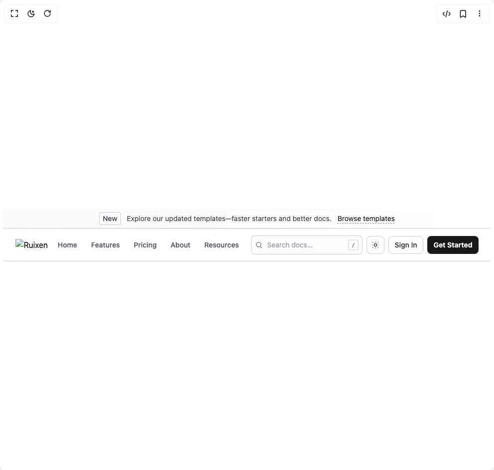

# Build Promote Header in BuilderStudio

> Build this component in our Agentic IDE: [BuilderStudio](https://builderstudio.dev).
>
> Join the BuilderStudio community on [Discord](https://discord.gg/QdWeSGCqfe) and [Reddit](https://reddit.com/r/builderstudio).



## Component

- Author group: `ruixenui`
- Component: `promote-header`
- Variant: `default`
- Rendered HTML snapshot: [`rendered.html`](rendered.html)

## BuilderStudio prompt

You are implementing a React component based on a component reference.

## Component identity

- Author: ruixenui
- Component slug: promote-header
- Demo slug: default
- Title: promote-header
- Description: 

## Goal

Recreate this component in a React + TypeScript + Tailwind CSS project. Preserve the visual layout, spacing, colors, border radius, shadows, interaction behavior, animation behavior, responsive behavior, and dark mode behavior shown in the rendered demo.

## Implementation requirements

- Use React and TypeScript.
- Use Tailwind CSS classes whenever possible.
- Keep the component self-contained unless the source files require helper components.
- If the source uses CSS variables, custom CSS, animations, or keyframes, include them.
- If the source uses external packages, list and use the required packages.
- Preserve accessibility attributes, button semantics, links, keyboard behavior, and ARIA attributes when visible in the source.
- Do not replace the component with a simplified placeholder.
- Return complete production-ready code.

## Dependencies

No reference metadata available.

## Rendered DOM snapshot

This is the rendered demo HTML extracted from the live preview. Use it to verify structure, class names, visible content, and layout.

```html
<div id="root"><div class="w-screen min-h-screen flex justify-center items-center"><div class="w-screen min-h-screen flex justify-center items-center"><div class="flex flex-col"><a href="#main" class="sr-only focus:not-sr-only focus:absolute focus:left-4 focus:top-4 focus:z-[100] rounded bg-zinc-900 px-3 py-2 text-sm text-white dark:bg-zinc-100 dark:text-zinc-900">Skip to content</a><div class="w-full border-b border-zinc-950/20 bg-gradient-to-r from-zinc-50 to-white dark:from-zinc-900 dark:to-zinc-950 dark:border-white/20"><div class="mx-auto flex max-w-7xl items-center justify-center gap-3 px-4 py-1.5 text-xs sm:text-sm"><span class="rounded border border-zinc-950/20 px-1.5 py-0.5 font-medium text-zinc-700 dark:border-white/20 dark:text-zinc-200">New</span><span class="text-zinc-700 dark:text-zinc-300">Explore our updated templates—faster starters and better docs.</span><a href="/templates" class="underline decoration-zinc-400 decoration-dashed underline-offset-4 hover:decoration-solid text-zinc-900 dark:text-zinc-100">Browse templates</a></div></div><header class="sticky top-0 z-50 w-full backdrop-blur bg-white/85 dark:bg-zinc-950/80 supports-[backdrop-filter]:bg-white/60 dark:supports-[backdrop-filter]:bg-zinc-950/60 border-b border-zinc-950/20 dark:border-white/20"><div class="h-[1px] w-full bg-gradient-to-r from-transparent via-zinc-950/10 to-transparent dark:via-white/10"></div><div class="mx-auto max-w-7xl px-4 sm:px-6 lg:px-8"><div class="flex h-14 md:h-16 items-center justify-between gap-3"><div class="flex items-center gap-2"><button type="button" aria-label="Toggle menu" aria-expanded="false" class="md:hidden group relative size-9 rounded-md text-zinc-700 hover:text-zinc-900 dark:text-zinc-300 dark:hover:text-zinc-100 focus-visible:outline-none focus-visible:ring-2 focus-visible:ring-zinc-950/20 dark:focus-visible:ring-white/20"><span class="absolute inset-x-2 top-[9px] h-[2px] rounded bg-current transition-transform "></span><span class="absolute inset-x-2 top-1/2 h-[2px] -translate-y-1/2 rounded bg-current transition-opacity opacity-100"></span><span class="absolute inset-x-2 bottom-[9px] h-[2px] rounded bg-current transition-transform "></span></button><a href="/" class="inline-flex items-center gap-2" aria-label="Home"><span class="sr-only">Ruixen</span></a><nav class="hidden md:flex items-center gap-1"><a href="/" class="rounded-md px-3 py-1.5 text-sm font-medium transition-colors outline-none ring-0 focus-visible:ring-2 focus-visible:ring-offset-0 hover:bg-zinc-950/[.03] dark:hover:bg-white/5 text-zinc-600 dark:text-zinc-400">Home</a><a href="/features" class="rounded-md px-3 py-1.5 text-sm font-medium transition-colors outline-none ring-0 focus-visible:ring-2 focus-visible:ring-offset-0 hover:bg-zinc-950/[.03] dark:hover:bg-white/5 text-zinc-600 dark:text-zinc-400">Features</a><a href="/pricing" class="rounded-md px-3 py-1.5 text-sm font-medium transition-colors outline-none ring-0 focus-visible:ring-2 focus-visible:ring-offset-0 hover:bg-zinc-950/[.03] dark:hover:bg-white/5 text-zinc-600 dark:text-zinc-400">Pricing</a><a href="/about" class="rounded-md px-3 py-1.5 text-sm font-medium transition-colors outline-none ring-0 focus-visible:ring-2 focus-visible:ring-offset-0 hover:bg-zinc-950/[.03] dark:hover:bg-white/5 text-zinc-600 dark:text-zinc-400">About</a><div class="relative group"><button type="button" class="rounded-md px-3 py-1.5 text-sm font-medium transition-colors outline-none ring-0 focus-visible:ring-2 focus-visible:ring-offset-0 hover:bg-zinc-950/[.03] dark:hover:bg-white/5 text-zinc-600 dark:text-zinc-400">Resources</button><div class="pointer-events-none absolute left-1/2 top-full z-40 -translate-x-1/2 pt-2 opacity-0 transition group-hover:pointer-events-auto group-hover:opacity-100 group-focus-within:pointer-events-auto group-focus-within:opacity-100"><div class="max-w-[calc(100vw-2rem)] sm:w-[520px] rounded-xl border border-zinc-950/20 bg-white/95 p-3 shadow-xl backdrop-blur supports-[backdrop-filter]:bg-white/70 dark:border-white/20 dark:bg-zinc-950/95 dark:supports-[backdrop-filter]:bg-zinc-950/70"><ul class="grid grid-cols-1 sm:grid-cols-2 gap-2"><li><a href="/docs" class="flex items-start gap-3 rounded-lg p-3 transition hover:bg-zinc-950/[.03] dark:hover:bg-white/5 border border-transparent hover:border-zinc-950/20 dark:hover:border-white/20"><div class="mt-0.5 text-zinc-700 dark:text-zinc-200"><svg viewBox="0 0 24 24" class="h-5 w-5" fill="none" stroke="currentColor" stroke-width="1.8"><path d="M7 4h7l4 4v12a2 2 0 0 1-2 2H7a2 2 0 0 1-2-2V6a2 2 0 0 1 2-2z"></path><path d="M14 4v4h4"></path></svg></div><div class="min-w-0"><div class="truncate text-sm font-semibold text-zinc-900 dark:text-zinc-100">Docs</div><p class="mt-0.5 line-clamp-2 text-xs text-zinc-600 dark:text-zinc-400">Guides, API, tutorials, and examples.</p></div></a></li><li><a href="/templates" class="flex items-start gap-3 rounded-lg p-3 transition hover:bg-zinc-950/[.03] dark:hover:bg-white/5 border border-transparent hover:border-zinc-950/20 dark:hover:border-white/20"><div class="mt-0.5 text-zinc-700 dark:text-zinc-200"><svg viewBox="0 0 24 24" class="h-5 w-5" fill="none" stroke="currentColor" stroke-width="1.8"><path d="M4 5h16M4 12h16M4 19h16"></path></svg></div><div class="min-w-0"><div class="truncate text-sm font-semibold text-zinc-900 dark:text-zinc-100">Templates</div><p class="mt-0.5 line-clamp-2 text-xs text-zinc-600 dark:text-zinc-400">Production-ready starters for common use cases.</p></div></a></li><li><a href="/community" class="flex items-start gap-3 rounded-lg p-3 transition hover:bg-zinc-950/[.03] dark:hover:bg-white/5 border border-transparent hover:border-zinc-950/20 dark:hover:border-white/20"><div class="mt-0.5 text-zinc-700 dark:text-zinc-200"><svg viewBox="0 0 24 24" class="h-5 w-5" fill="none" stroke="currentColor" stroke-width="1.8"><path d="M7 8a4 4 0 1 0 0-8 4 4 0 0 0 0 8z"></path><path d="M15 14a5 5 0 0 0-10 0v3h10v-3z"></path><path d="M17 8h.01M21 12h.01M19 20h.01"></path></svg></div><div class="min-w-0"><div class="truncate text-sm font-semibold text-zinc-900 dark:text-zinc-100">Community</div><p class="mt-0.5 line-clamp-2 text-xs text-zinc-600 dark:text-zinc-400">Join discussions and find support.</p></div></a></li><li><a href="/changelog" class="flex items-start gap-3 rounded-lg p-3 transition hover:bg-zinc-950/[.03] dark:hover:bg-white/5 border border-transparent hover:border-zinc-950/20 dark:hover:border-white/20"><div class="mt-0.5 text-zinc-700 dark:text-zinc-200"><svg viewBox="0 0 24 24" class="h-5 w-5" fill="none" stroke="currentColor" stroke-width="1.8"><path d="M3 5h18M3 12h18M3 19h18"></path><path d="M7 5v14"></path></svg></div><div class="min-w-0"><div class="truncate text-sm font-semibold text-zinc-900 dark:text-zinc-100">Changelog</div><p class="mt-0.5 line-clamp-2 text-xs text-zinc-600 dark:text-zinc-400">What shipped and when, with details.</p></div></a></li></ul><div class="mt-3 rounded-lg border border-zinc-950/20 p-2 text-xs text-zinc-600 dark:border-white/20 dark:text-zinc-400">Looking for examples? Try the <a href="/templates" class="text-zinc-900 underline dark:text-zinc-100">Templates</a> section or jump straight into the <a href="/docs" class="text-zinc-900 underline dark:text-zinc-100">Docs</a>.</div></div></div></div></nav></div><div class="hidden items-center gap-2 md:flex"><div class="relative w-44 sm:w-56 lg:w-64 xl:w-80"><input placeholder="Search docs…" class="w-full rounded-md border border-zinc-950/20 bg-white/70 px-8 py-2 text-sm text-zinc-900 placeholder:text-zinc-400 focus:outline-none focus:ring-2 focus:ring-zinc-950/20 backdrop-blur supports-[backdrop-filter]:bg-white/50 dark:border-white/20 dark:bg-zinc-900/70 dark:text-zinc-100 dark:placeholder:text-zinc-500 dark:focus:ring-white/20 dark:supports-[backdrop-filter]:bg-zinc-900/50" type="search"><svg viewBox="0 0 24 24" class="pointer-events-none absolute left-2 top-1/2 h-4 w-4 -translate-y-1/2 text-zinc-500 dark:text-zinc-400" fill="none" stroke="currentColor" stroke-width="2"><circle cx="11" cy="11" r="7"></circle><path d="M21 21l-4.3-4.3"></path></svg><kbd class="pointer-events-none absolute right-2 top-1/2 -translate-y-1/2 rounded border border-zinc-950/20 px-1.5 py-0.5 text-[10px] text-zinc-600 dark:border-white/20 dark:text-zinc-400">/</kbd></div><button type="button" class="inline-flex h-9 w-9 items-center justify-center rounded-md border border-zinc-950/20 hover:bg-zinc-950/[.03] text-zinc-800 dark:text-zinc-200 dark:border-white/20 dark:hover:bg-white/5 focus-visible:outline-none focus-visible:ring-2 focus-visible:ring-zinc-950/20 dark:focus-visible:ring-white/20" aria-label="Toggle theme" title="Toggle theme"><svg viewBox="0 0 24 24" class="h-4 w-4 dark:hidden" fill="none" stroke="currentColor" stroke-width="1.8"><circle cx="12" cy="12" r="4"></circle><path d="M12 2v2M12 20v2M4 12H2M22 12h-2M5 5l-1.5-1.5M20.5 20.5 19 19M5 19l-1.5 1.5M20.5 3.5 19 5"></path></svg><svg viewBox="0 0 24 24" class="hidden h-4 w-4 dark:block" fill="none" stroke="currentColor" stroke-width="1.8"><path d="M21 12.79A9 9 0 1 1 11.21 3 7 7 0 0 0 21 12.79z"></path></svg></button><a href="/signin" class="inline-flex h-9 items-center justify-center rounded-md px-3 text-sm font-medium text-zinc-800 dark:text-zinc-200 border border-zinc-950/20 dark:border-white/20 hover:bg-zinc-950/[.03] dark:hover:bg-white/5 focus-visible:outline-none focus-visible:ring-2 focus-visible:ring-zinc-950/20 dark:focus-visible:ring-white/20">Sign In</a><a href="/get-started" class="inline-flex h-9 items-center justify-center rounded-md px-3 text-sm font-semibold bg-zinc-900 text-white hover:bg-zinc-900/90 dark:bg-zinc-100 dark:text-zinc-900 dark:hover:bg-zinc-100/90 focus-visible:outline-none focus-visible:ring-2 focus-visible:ring-zinc-950/20 dark:focus-visible:ring-white/20">Get Started</a></div><div class="md:hidden"><a href="/get-started" class="inline-flex h-9 items-center justify-center rounded-md px-3 text-sm font-semibold bg-zinc-900 text-white hover:bg-zinc-900/90 dark:bg-zinc-100 dark:text-zinc-900 dark:hover:bg-zinc-100/90 focus-visible:outline-none focus-visible:ring-2 focus-visible:ring-zinc-950/20 dark:focus-visible:ring-white/20">Start</a></div></div></div></header><div class="fixed inset-0 z-50 md:hidden transition pointer-events-none" aria-hidden="true"><div class="absolute inset-0 bg-black/30 backdrop-blur-sm opacity-0 transition-opacity"></div><aside class="absolute right-0 top-0 h-full w-80 max-w-[calc(100vw-0.75rem)] transform bg-white/95 p-4 shadow-2xl backdrop-blur supports-[backdrop-filter]:bg-white/70 border-l border-zinc-950/20 dark:border-white/20 dark:bg-zinc-950/95 dark:supports-[backdrop-filter]:bg-zinc-950/70 translate-x-full transition-transform overflow-y-auto" role="dialog" aria-modal="true"><div class="mb-3 flex items-center justify-between"><a href="/" class="flex items-center gap-2"><span class="sr-only">Ruixen</span></a><button class="inline-flex size-9 items-center justify-center rounded-md border border-zinc-950/20 text-zinc-700 hover:bg-zinc-950/[.03] focus-visible:outline-none focus-visible:ring-2 focus-visible:ring-zinc-950/20 dark:border-white/20 dark:text-zinc-200 dark:hover:bg-white/5 dark:focus-visible:ring-white/20" aria-label="Close menu"><svg viewBox="0 0 24 24" class="h-4 w-4" fill="none" stroke="currentColor" stroke-width="2"><path d="M18 6 6 18M6 6l12 12"></path></svg></button></div><div class="mb-3"><div class="relative"><input placeholder="Search…" class="w-full rounded-md border border-zinc-950/20 bg-white/80 px-8 py-2 text-sm text-zinc-900 placeholder:text-zinc-400 focus:outline-none focus:ring-2 focus:ring-zinc-950/20 dark:border-white/20 dark:bg-zinc-900/80 dark:text-zinc-100 dark:placeholder:text-zinc-500 dark:focus:ring-white/20" type="search"><svg viewBox="0 0 24 24" class="pointer-events-none absolute left-2 top-1/2 h-4 w-4 -translate-y-1/2 text-zinc-500 dark:text-zinc-400" fill="none" stroke="currentColor" stroke-width="2"><circle cx="11" cy="11" r="7"></circle><path d="M21 21l-4.3-4.3"></path></svg></div></div><nav class="space-y-1"><a href="/" class="block rounded-md px-2.5 py-2 text-sm font-medium hover:bg-zinc-950/[.03] dark:hover:bg-white/5 text-zinc-700 dark:text-zinc-300">Home</a><a href="/features" class="block rounded-md px-2.5 py-2 text-sm font-medium hover:bg-zinc-950/[.03] dark:hover:bg-white/5 text-zinc-700 dark:text-zinc-300">Features</a><a href="/pricing" class="block rounded-md px-2.5 py-2 text-sm font-medium hover:bg-zinc-950/[.03] dark:hover:bg-white/5 text-zinc-700 dark:text-zinc-300">Pricing</a><a href="/about" class="block rounded-md px-2.5 py-2 text-sm font-medium hover:bg-zinc-950/[.03] dark:hover:bg-white/5 text-zinc-700 dark:text-zinc-300">About</a></nav><div class="mt-4"><div class="mb-2 text-xs font-semibold uppercase tracking-wide text-zinc-500 dark:text-zinc-400">Quick Links</div><div class="grid grid-cols-2 gap-2"><a href="/docs" class="flex items-start gap-2 rounded-lg border border-zinc-950/20 p-2 text-sm hover:bg-zinc-950/[.03] dark:border-white/20 dark:hover:bg-white/5"><span class="mt-0.5 text-zinc-700 dark:text-zinc-200"><svg viewBox="0 0 24 24" class="h-5 w-5" fill="none" stroke="currentColor" stroke-width="1.8"><path d="M7 4h7l4 4v12a2 2 0 0 1-2 2H7a2 2 0 0 1-2-2V6a2 2 0 0 1 2-2z"></path><path d="M14 4v4h4"></path></svg></span><span class="truncate text-zinc-800 dark:text-zinc-200">Docs</span></a><a href="/templates" class="flex items-start gap-2 rounded-lg border border-zinc-950/20 p-2 text-sm hover:bg-zinc-950/[.03] dark:border-white/20 dark:hover:bg-white/5"><span class="mt-0.5 text-zinc-700 dark:text-zinc-200"><svg viewBox="0 0 24 24" class="h-5 w-5" fill="none" stroke="currentColor" stroke-width="1.8"><path d="M4 5h16M4 12h16M4 19h16"></path></svg></span><span class="truncate text-zinc-800 dark:text-zinc-200">Templates</span></a><a href="/community" class="flex items-start gap-2 rounded-lg border border-zinc-950/20 p-2 text-sm hover:bg-zinc-950/[.03] dark:border-white/20 dark:hover:bg-white/5"><span class="mt-0.5 text-zinc-700 dark:text-zinc-200"><svg viewBox="0 0 24 24" class="h-5 w-5" fill="none" stroke="currentColor" stroke-width="1.8"><path d="M7 8a4 4 0 1 0 0-8 4 4 0 0 0 0 8z"></path><path d="M15 14a5 5 0 0 0-10 0v3h10v-3z"></path><path d="M17 8h.01M21 12h.01M19 20h.01"></path></svg></span><span class="truncate text-zinc-800 dark:text-zinc-200">Community</span></a><a href="/changelog" class="flex items-start gap-2 rounded-lg border border-zinc-950/20 p-2 text-sm hover:bg-zinc-950/[.03] dark:border-white/20 dark:hover:bg-white/5"><span class="mt-0.5 text-zinc-700 dark:text-zinc-200"><svg viewBox="0 0 24 24" class="h-5 w-5" fill="none" stroke="currentColor" stroke-width="1.8"><path d="M3 5h18M3 12h18M3 19h18"></path><path d="M7 5v14"></path></svg></span><span class="truncate text-zinc-800 dark:text-zinc-200">Changelog</span></a></div></div><div class="mt-4 grid grid-cols-2 gap-2"><a href="/signin" class="inline-flex h-9 items-center justify-center rounded-md px-3 text-sm font-medium text-zinc-800 dark:text-zinc-200 border border-zinc-950/20 dark:border-white/20 hover:bg-zinc-950/[.03] dark:hover:bg-white/5 focus-visible:outline-none focus-visible:ring-2 focus-visible:ring-zinc-950/20 dark:focus-visible:ring-white/20">Sign In</a><a href="/get-started" class="inline-flex h-9 items-center justify-center rounded-md px-3 text-sm font-semibold bg-zinc-900 text-white hover:bg-zinc-900/90 dark:bg-zinc-100 dark:text-zinc-900 dark:hover:bg-zinc-100/90 focus-visible:outline-none focus-visible:ring-2 focus-visible:ring-zinc-950/20 dark:focus-visible:ring-white/20">Get Started</a></div><div class="mt-3 flex items-center justify-between"><button class="inline-flex items-center gap-2 rounded-md border border-zinc-950/20 px-3 py-2 text-sm text-zinc-800 hover:bg-zinc-950/[.03] focus-visible:outline-none focus-visible:ring-2 focus-visible:ring-zinc-950/20 dark:border-white/20 dark:text-zinc-200 dark:hover:bg-white/5 dark:focus-visible:ring-white/20"><svg viewBox="0 0 24 24" class="h-4 w-4 dark:hidden" fill="none" stroke="currentColor" stroke-width="1.8"><circle cx="12" cy="12" r="4"></circle><path d="M12 2v2M12 20v2M4 12H2M22 12h-2M5 5l-1.5-1.5M20.5 20.5 19 19M5 19l-1.5 1.5M20.5 3.5 19 5"></path></svg><svg viewBox="0 0 24 24" class="hidden h-4 w-4 dark:block" fill="none" stroke="currentColor" stroke-width="1.8"><path d="M21 12.79A9 9 0 1 1 11.21 3 7 7 0 0 0 21 12.79z"></path></svg>Toggle theme</button><a href="/contact" class="rounded-md border border-zinc-950/20 px-3 py-2 text-sm text-zinc-700 hover:bg-zinc-950/[.03] dark:border-white/20 dark:text-zinc-300 dark:hover:bg-white/5">Contact sales</a></div></aside></div></div></div></div></div>
```

## Reference source files

No reference source files were available.
