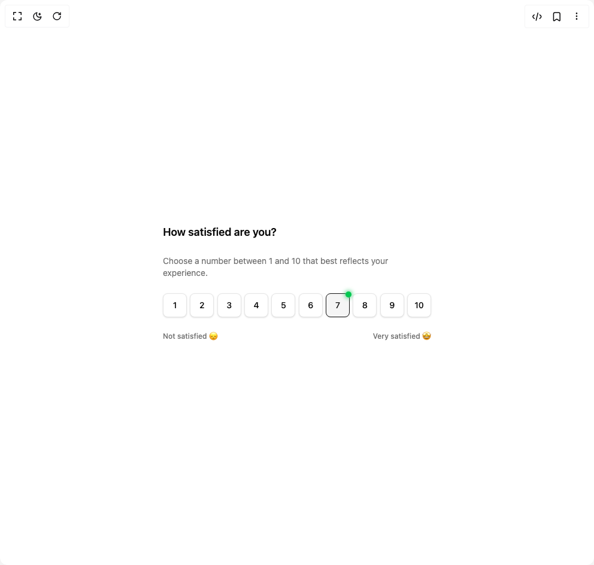

# Build Rating Scale Group in BuilderStudio

> Build this component in our Agentic IDE: [BuilderStudio](https://builderstudio.dev).
>
> Join the BuilderStudio community on [Discord](https://discord.gg/QdWeSGCqfe) and [Reddit](https://reddit.com/r/builderstudio).



## Component

- Author group: `ruixenui`
- Component: `rating-scale-group`
- Variant: `default`
- Rendered HTML snapshot: [`rendered.html`](rendered.html)

## BuilderStudio prompt

You are implementing a React component based on a component reference.

## Component identity

- Author: ruixenui
- Component slug: rating-scale-group
- Demo slug: default
- Title: rating-scale-group
- Description: 

## Goal

Recreate this component in a React + TypeScript + Tailwind CSS project. Preserve the visual layout, spacing, colors, border radius, shadows, interaction behavior, animation behavior, responsive behavior, and dark mode behavior shown in the rendered demo.

## Implementation requirements

- Use React and TypeScript.
- Use Tailwind CSS classes whenever possible.
- Keep the component self-contained unless the source files require helper components.
- If the source uses CSS variables, custom CSS, animations, or keyframes, include them.
- If the source uses external packages, list and use the required packages.
- Preserve accessibility attributes, button semantics, links, keyboard behavior, and ARIA attributes when visible in the source.
- Do not replace the component with a simplified placeholder.
- Return complete production-ready code.

## Dependencies

No reference metadata available.

## Rendered DOM snapshot

This is the rendered demo HTML extracted from the live preview. Use it to verify structure, class names, visible content, and layout.

```html
<div id="root"><div class="w-screen min-h-screen flex justify-center items-center"><div class="w-screen min-h-screen flex justify-center items-center"><div class="max-w-md space-y-6"><h2 class="text-lg font-semibold">How satisfied are you?</h2><p class="text-sm text-muted-foreground">Choose a number between 1 and 10 that best reflects your experience.</p><div role="radiogroup" aria-required="false" dir="ltr" class="flex w-full justify-between gap-1" tabindex="0" style="outline: none;"><button type="button" role="radio" aria-checked="false" data-state="unchecked" value="1" class="relative flex h-10 w-10 items-center justify-center rounded-md border border-input bg-background text-sm font-medium shadow-sm transition-all hover:border-primary/70 hover:shadow-md focus-visible:outline-2 focus-visible:outline-ring/70 data-[state=checked]:border-primary data-[state=checked]:bg-accent data-[state=checked]:text-accent-foreground disabled:cursor-not-allowed disabled:opacity-50" tabindex="-1" data-radix-collection-item="">1</button><button type="button" role="radio" aria-checked="false" data-state="unchecked" value="2" class="relative flex h-10 w-10 items-center justify-center rounded-md border border-input bg-background text-sm font-medium shadow-sm transition-all hover:border-primary/70 hover:shadow-md focus-visible:outline-2 focus-visible:outline-ring/70 data-[state=checked]:border-primary data-[state=checked]:bg-accent data-[state=checked]:text-accent-foreground disabled:cursor-not-allowed disabled:opacity-50" tabindex="-1" data-radix-collection-item="">2</button><button type="button" role="radio" aria-checked="false" data-state="unchecked" value="3" class="relative flex h-10 w-10 items-center justify-center rounded-md border border-input bg-background text-sm font-medium shadow-sm transition-all hover:border-primary/70 hover:shadow-md focus-visible:outline-2 focus-visible:outline-ring/70 data-[state=checked]:border-primary data-[state=checked]:bg-accent data-[state=checked]:text-accent-foreground disabled:cursor-not-allowed disabled:opacity-50" tabindex="-1" data-radix-collection-item="">3</button><button type="button" role="radio" aria-checked="false" data-state="unchecked" value="4" class="relative flex h-10 w-10 items-center justify-center rounded-md border border-input bg-background text-sm font-medium shadow-sm transition-all hover:border-primary/70 hover:shadow-md focus-visible:outline-2 focus-visible:outline-ring/70 data-[state=checked]:border-primary data-[state=checked]:bg-accent data-[state=checked]:text-accent-foreground disabled:cursor-not-allowed disabled:opacity-50" tabindex="-1" data-radix-collection-item="">4</button><button type="button" role="radio" aria-checked="false" data-state="unchecked" value="5" class="relative flex h-10 w-10 items-center justify-center rounded-md border border-input bg-background text-sm font-medium shadow-sm transition-all hover:border-primary/70 hover:shadow-md focus-visible:outline-2 focus-visible:outline-ring/70 data-[state=checked]:border-primary data-[state=checked]:bg-accent data-[state=checked]:text-accent-foreground disabled:cursor-not-allowed disabled:opacity-50" tabindex="-1" data-radix-collection-item="">5</button><button type="button" role="radio" aria-checked="false" data-state="unchecked" value="6" class="relative flex h-10 w-10 items-center justify-center rounded-md border border-input bg-background text-sm font-medium shadow-sm transition-all hover:border-primary/70 hover:shadow-md focus-visible:outline-2 focus-visible:outline-ring/70 data-[state=checked]:border-primary data-[state=checked]:bg-accent data-[state=checked]:text-accent-foreground disabled:cursor-not-allowed disabled:opacity-50" tabindex="-1" data-radix-collection-item="">6</button><button type="button" role="radio" aria-checked="true" data-state="checked" value="7" class="relative flex h-10 w-10 items-center justify-center rounded-md border border-input bg-background text-sm font-medium shadow-sm transition-all hover:border-primary/70 hover:shadow-md focus-visible:outline-2 focus-visible:outline-ring/70 data-[state=checked]:border-primary data-[state=checked]:bg-accent data-[state=checked]:text-accent-foreground disabled:cursor-not-allowed disabled:opacity-50" tabindex="-1" data-radix-collection-item="">7<span data-state="checked" class="absolute -top-1 -right-1"><span class="flex size-2.5 rounded-full bg-green-500 shadow-[0_0_6px_2px_rgba(34,197,94,0.6)]"></span></span></button><button type="button" role="radio" aria-checked="false" data-state="unchecked" value="8" class="relative flex h-10 w-10 items-center justify-center rounded-md border border-input bg-background text-sm font-medium shadow-sm transition-all hover:border-primary/70 hover:shadow-md focus-visible:outline-2 focus-visible:outline-ring/70 data-[state=checked]:border-primary data-[state=checked]:bg-accent data-[state=checked]:text-accent-foreground disabled:cursor-not-allowed disabled:opacity-50" tabindex="-1" data-radix-collection-item="">8</button><button type="button" role="radio" aria-checked="false" data-state="unchecked" value="9" class="relative flex h-10 w-10 items-center justify-center rounded-md border border-input bg-background text-sm font-medium shadow-sm transition-all hover:border-primary/70 hover:shadow-md focus-visible:outline-2 focus-visible:outline-ring/70 data-[state=checked]:border-primary data-[state=checked]:bg-accent data-[state=checked]:text-accent-foreground disabled:cursor-not-allowed disabled:opacity-50" tabindex="-1" data-radix-collection-item="">9</button><button type="button" role="radio" aria-checked="false" data-state="unchecked" value="10" class="relative flex h-10 w-10 items-center justify-center rounded-md border border-input bg-background text-sm font-medium shadow-sm transition-all hover:border-primary/70 hover:shadow-md focus-visible:outline-2 focus-visible:outline-ring/70 data-[state=checked]:border-primary data-[state=checked]:bg-accent data-[state=checked]:text-accent-foreground disabled:cursor-not-allowed disabled:opacity-50" tabindex="-1" data-radix-collection-item="">10</button></div><div class="mt-2 flex justify-between text-xs font-medium text-muted-foreground"><span>Not satisfied 😞</span><span>Very satisfied 🤩</span></div></div></div></div></div>
```

## Reference source files

No reference source files were available.
