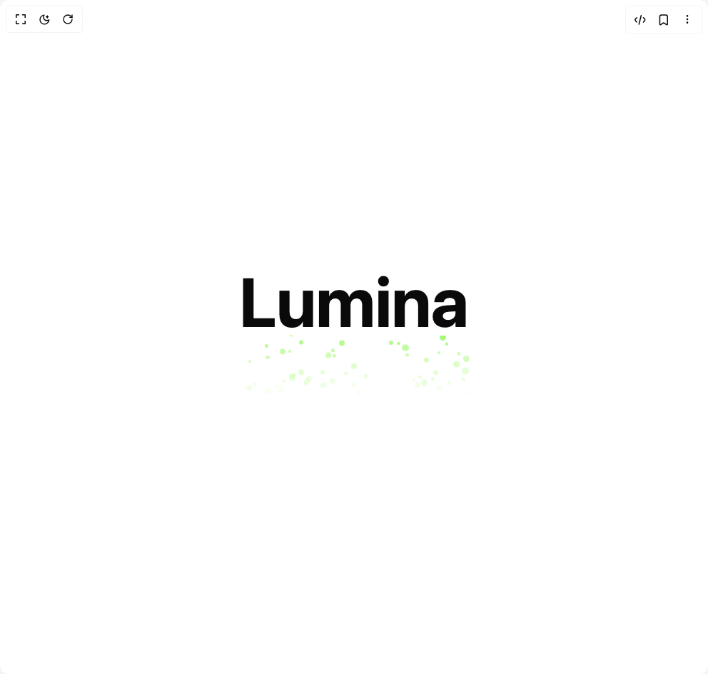

# Build Rising Glow in BuilderStudio

> Build this component in our Agentic IDE: [BuilderStudio](https://builderstudio.dev).
>
> Join the BuilderStudio community on [Discord](https://discord.gg/QdWeSGCqfe) and [Reddit](https://reddit.com/r/builderstudio).



## Component

- Author group: `ruixenui`
- Component: `rising-glow`
- Variant: `default`
- Rendered HTML snapshot: [`rendered.html`](rendered.html)

## BuilderStudio prompt

You are implementing a React component based on a component reference.

## Component identity

- Author: ruixenui
- Component slug: rising-glow
- Demo slug: default
- Title: rising-glow
- Description: 

## Goal

Recreate this component in a React + TypeScript + Tailwind CSS project. Preserve the visual layout, spacing, colors, border radius, shadows, interaction behavior, animation behavior, responsive behavior, and dark mode behavior shown in the rendered demo.

## Implementation requirements

- Use React and TypeScript.
- Use Tailwind CSS classes whenever possible.
- Keep the component self-contained unless the source files require helper components.
- If the source uses CSS variables, custom CSS, animations, or keyframes, include them.
- If the source uses external packages, list and use the required packages.
- Preserve accessibility attributes, button semantics, links, keyboard behavior, and ARIA attributes when visible in the source.
- Do not replace the component with a simplified placeholder.
- Return complete production-ready code.

## Dependencies

No reference metadata available.

## Rendered DOM snapshot

This is the rendered demo HTML extracted from the live preview. Use it to verify structure, class names, visible content, and layout.

```html
<div id="root"><div class="w-screen min-h-screen flex justify-center items-center"><div class="w-screen min-h-screen flex justify-center items-center"><div class="flex flex-col items-center justify-center p-6"><h1 class="text-6xl md:text-8xl font-bold relative z-10">Lumina</h1><div class="w-full max-w-4xl"><div class="relative overflow-hidden" style="width: 100%; height: 100px;"><div class="absolute bottom-0 rounded-full" style="left: 76.3451%; width: 8.15642px; height: 8.15642px; background-color: rgb(124, 247, 52); transform: translateY(-28.6754px);"></div><div class="absolute bottom-0 rounded-full" style="left: 21.5602%; width: 9.07797px; height: 9.07797px; background-color: rgb(124, 247, 52); transform: translateY(-37.4614px);"></div><div class="absolute bottom-0 rounded-full" style="left: 54.6818%; width: 5.26872px; height: 5.26872px; background-color: rgb(124, 247, 52); transform: translateY(-14.5093px);"></div><div class="absolute bottom-0 rounded-full" style="left: 28.4019%; width: 4.31294px; height: 4.31294px; background-color: rgb(124, 247, 52); transform: translateY(-20.8785px);"></div><div class="absolute bottom-0 rounded-full" style="left: 43.4399%; width: 7.67488px; height: 7.67488px; background-color: rgb(124, 247, 52); transform: translateY(-86.9373px);"></div><div class="absolute bottom-0 rounded-full" style="left: 9.709%; width: 9.2516px; height: 9.2516px; background-color: rgb(124, 247, 52); transform: translateY(-14.6024px);"></div><div class="absolute bottom-0 rounded-full" style="left: 21.2576%; width: 4.02547px; height: 4.02547px; background-color: rgb(124, 247, 52); transform: translateY(-77.6661px);"></div><div class="absolute bottom-0 rounded-full" style="left: 99.5414%; width: 8.9394px; height: 8.9394px; background-color: rgb(124, 247, 52); transform: translateY(-16.275px);"></div><div class="absolute bottom-0 rounded-full" style="left: 35.7635%; width: 7.10982px; height: 7.10982px; background-color: rgb(124, 247, 52); transform: translateY(-10.0269px);"></div><div class="absolute bottom-0 rounded-full" style="left: 3.96578%; width: 4.1514px; height: 4.1514px; background-color: rgb(124, 247, 52); transform: translateY(-58.7863px);"></div><div class="absolute bottom-0 rounded-full" style="left: 14.9856%; width: 4.47377px; height: 4.47377px; background-color: rgb(124, 247, 52); transform: translateY(-25.3948px);"></div><div class="absolute bottom-0 rounded-full" style="left: 96.9607%; width: 4.92363px; height: 4.92363px; background-color: rgb(124, 247, 52); transform: translateY(-11.1461px);"></div><div class="absolute bottom-0 rounded-full" style="left: 16.7368%; width: 9.58278px; height: 9.58278px; background-color: rgb(124, 247, 52); transform: translateY(-22.0211px);"></div><div class="absolute bottom-0 rounded-full" style="left: 39.9601%; width: 5.05379px; height: 5.05379px; background-color: rgb(124, 247, 52); transform: translateY(-74.1795px);"></div><div class="absolute bottom-0 rounded-full" style="left: 3.54585%; width: 5.76383px; height: 5.76383px; background-color: rgb(124, 247, 52); transform: translateY(-24.6353px);"></div><div class="absolute bottom-0 rounded-full" style="left: 97.6456%; width: 8.80261px; height: 8.80261px; background-color: rgb(124, 247, 52); transform: translateY(-64.9137px);"></div><div class="absolute bottom-0 rounded-full" style="left: 54.2913%; width: 5.63609px; height: 5.63609px; background-color: rgb(124, 247, 52); transform: translateY(-42.0792px);"></div><div class="absolute bottom-0 rounded-full" style="left: 25.8153%; width: 8.09849px; height: 8.09849px; background-color: rgb(124, 247, 52); transform: translateY(-41.9523px);"></div><div class="absolute bottom-0 rounded-full" style="left: 70.1008%; width: 6.77559px; height: 6.77559px; background-color: rgb(124, 247, 52); transform: translateY(-11.5716px);"></div><div class="absolute bottom-0 rounded-full" style="left: 86.3481%; width: 4.43964px; height: 4.43964px; background-color: rgb(124, 247, 52); transform: translateY(-71.5543px);"></div><div class="absolute bottom-0 rounded-full" style="left: 11.712%; width: 9.17954px; height: 9.17954px; background-color: rgb(124, 247, 52); transform: translateY(-17.5378px);"></div><div class="absolute bottom-0 rounded-full" style="left: 23.2597%; width: 5.02546px; height: 5.02546px; background-color: rgb(124, 247, 52); transform: translateY(-44.5068px);"></div><div class="absolute bottom-0 rounded-full" style="left: 44.4398%; width: 9.17831px; height: 9.17831px; background-color: rgb(124, 247, 52); transform: translateY(-10.01px);"></div><div class="absolute bottom-0 rounded-full" style="left: 45.7868%; width: 4.24703px; height: 4.24703px; background-color: rgb(124, 247, 52); transform: translateY(-10.0324px);"></div><div class="absolute bottom-0 rounded-full" style="left: 96.9732%; width: 5.22619px; height: 5.22619px; background-color: rgb(124, 247, 52); transform: translateY(-33.7936px);"></div><div class="absolute bottom-0 rounded-full" style="left: 88.3166%; width: 6.78749px; height: 6.78749px; background-color: rgb(124, 247, 52); transform: translateY(-14.1455px);"></div><div class="absolute bottom-0 rounded-full" style="left: 85.8915%; width: 7.82675px; height: 7.82675px; background-color: rgb(124, 247, 52); transform: translateY(-24.5851px);"></div><div class="absolute bottom-0 rounded-full" style="left: 40.9914%; width: 4.66829px; height: 4.66829px; background-color: rgb(124, 247, 52); transform: translateY(-15.2773px);"></div><div class="absolute bottom-0 rounded-full" style="left: 75.4499%; width: 4.44468px; height: 4.44468px; background-color: rgb(124, 247, 52); transform: translateY(-33.9706px);"></div><div class="absolute bottom-0 rounded-full" style="left: 11.5374%; width: 5.13845px; height: 5.13845px; background-color: rgb(124, 247, 52); transform: translateY(-64.268px);"></div><div class="absolute bottom-0 rounded-full" style="left: 21.6661%; width: 6.08558px; height: 6.08558px; background-color: rgb(124, 247, 52); transform: translateY(-10.2542px);"></div><div class="absolute bottom-0 rounded-full" style="left: 25.924%; width: 5.88933px; height: 5.88933px; background-color: rgb(124, 247, 52); transform: translateY(-88.6242px);"></div><div class="absolute bottom-0 rounded-full" style="left: 40.781%; width: 4.79893px; height: 4.79893px; background-color: rgb(124, 247, 52); transform: translateY(-70.997px);"></div><div class="absolute bottom-0 rounded-full" style="left: 3.13776%; width: 7.34011px; height: 7.34011px; background-color: rgb(124, 247, 52); transform: translateY(-25.4972px);"></div><div class="absolute bottom-0 rounded-full" style="left: 72.5442%; width: 4.6408px; height: 4.6408px; background-color: rgb(124, 247, 52); transform: translateY(-72.1705px);"></div><div class="absolute bottom-0 rounded-full" style="left: 24.1463%; width: 4.82803px; height: 4.82803px; background-color: rgb(124, 247, 52); transform: translateY(-10.0174px);"></div><div class="absolute bottom-0 rounded-full" style="left: 89.7069%; width: 4.93605px; height: 4.93605px; background-color: rgb(124, 247, 52); transform: translateY(-87.0813px);"></div><div class="absolute bottom-0 rounded-full" style="left: 47.4163%; width: 5.70158px; height: 5.70158px; background-color: rgb(124, 247, 52); transform: translateY(-11.5338px);"></div><div class="absolute bottom-0 rounded-full" style="left: 35.3372%; width: 6.21657px; height: 6.21657px; background-color: rgb(124, 247, 52); transform: translateY(-47.6141px);"></div><div class="absolute bottom-0 rounded-full" style="left: 97.0914%; width: 9.57369px; height: 9.57369px; background-color: rgb(124, 247, 52); transform: translateY(-47.7443px);"></div><div class="absolute bottom-0 rounded-full" style="left: 17.4895%; width: 8.04152px; height: 8.04152px; background-color: rgb(124, 247, 52); transform: translateY(-75.3178px);"></div><div class="absolute bottom-0 rounded-full" style="left: 50.795%; width: 7.86155px; height: 7.86155px; background-color: rgb(124, 247, 52); transform: translateY(-14.2653px);"></div><div class="absolute bottom-0 rounded-full" style="left: 83.5106%; width: 5.51874px; height: 5.51874px; background-color: rgb(124, 247, 52); transform: translateY(-38.4457px);"></div><div class="absolute bottom-0 rounded-full" style="left: 28.1856%; width: 7.94427px; height: 7.94427px; background-color: rgb(124, 247, 52); transform: translateY(-32.7399px);"></div><div class="absolute bottom-0 rounded-full" style="left: 78.1534%; width: 4.52625px; height: 4.52625px; background-color: rgb(124, 247, 52); transform: translateY(-41.5725px);"></div><div class="absolute bottom-0 rounded-full" style="left: 35.0765%; width: 5.42465px; height: 5.42465px; background-color: rgb(124, 247, 52); transform: translateY(-29.5009px);"></div><div class="absolute bottom-0 rounded-full" style="left: 97.9453%; width: 8.02982px; height: 8.02982px; background-color: rgb(124, 247, 52); transform: translateY(-15.8531px);"></div><div class="absolute bottom-0 rounded-full" style="left: 65.1588%; width: 6.2791px; height: 6.2791px; background-color: rgb(124, 247, 52); transform: translateY(-88.2572px);"></div><div class="absolute bottom-0 rounded-full" style="left: 5.67781%; width: 5.77656px; height: 5.77656px; background-color: rgb(124, 247, 52); transform: translateY(-30.6196px);"></div><div class="absolute bottom-0 rounded-full" style="left: 39.4055%; width: 7.82134px; height: 7.82134px; background-color: rgb(124, 247, 52); transform: translateY(-34.4443px);"></div><div class="absolute bottom-0 rounded-full" style="left: 76.2761%; width: 9.11216px; height: 9.11216px; background-color: rgb(124, 247, 52); transform: translateY(-10.8691px);"></div><div class="absolute bottom-0 rounded-full" style="left: 21.2462%; width: 8.57904px; height: 8.57904px; background-color: rgb(124, 247, 52); transform: translateY(-99.7047px);"></div><div class="absolute bottom-0 rounded-full" style="left: 90.6263%; width: 5.68185px; height: 5.68185px; background-color: rgb(124, 247, 52); transform: translateY(-32.2761px);"></div><div class="absolute bottom-0 rounded-full" style="left: 70.9328%; width: 9.27514px; height: 9.27514px; background-color: rgb(124, 247, 52); transform: translateY(-80.2769px);"></div><div class="absolute bottom-0 rounded-full" style="left: 68.8037%; width: 4.22775px; height: 4.22775px; background-color: rgb(124, 247, 52); transform: translateY(-85.1635px);"></div><div class="absolute bottom-0 rounded-full" style="left: 15.8479%; width: 7.82566px; height: 7.82566px; background-color: rgb(124, 247, 52); transform: translateY(-10.0019px);"></div><div class="absolute bottom-0 rounded-full" style="left: 48.7802%; width: 7.80364px; height: 7.80364px; background-color: rgb(124, 247, 52); transform: translateY(-50.4257px);"></div><div class="absolute bottom-0 rounded-full" style="left: 35.9741%; width: 8.37282px; height: 8.37282px; background-color: rgb(124, 247, 52); transform: translateY(-28.7848px);"></div><div class="absolute bottom-0 rounded-full" style="left: 49.1649%; width: 6.15621px; height: 6.15621px; background-color: rgb(124, 247, 52); transform: translateY(-26.3244px);"></div><div class="absolute bottom-0 rounded-full" style="left: 27.9851%; width: 4.80459px; height: 4.80459px; background-color: rgb(124, 247, 52); transform: translateY(-28.7848px);"></div><div class="absolute bottom-0 rounded-full" style="left: 37.4801%; width: 8.32508px; height: 8.32508px; background-color: rgb(124, 247, 52); transform: translateY(-65.686px);"></div><div class="absolute bottom-0 rounded-full" style="left: 87.2035%; width: 9.82552px; height: 9.82552px; background-color: rgb(124, 247, 52); transform: translateY(-94.216px);"></div><div class="absolute bottom-0 rounded-full" style="left: 58.7126%; width: 6.73286px; height: 6.73286px; background-color: rgb(124, 247, 52); transform: translateY(-10.9574px);"></div><div class="absolute bottom-0 rounded-full" style="left: 86.2488%; width: 9.56716px; height: 9.56716px; background-color: rgb(124, 247, 52); transform: translateY(-10.0593px);"></div><div class="absolute bottom-0 rounded-full" style="left: 18.9559%; width: 5.03877px; height: 5.03877px; background-color: rgb(124, 247, 52); transform: translateY(-35.7603px);"></div><div class="absolute bottom-0 rounded-full" style="left: 29.1549%; width: 8.24833px; height: 8.24833px; background-color: rgb(124, 247, 52); transform: translateY(-37.4001px);"></div><div class="absolute bottom-0 rounded-full" style="left: 42.4729%; width: 5.56172px; height: 5.56172px; background-color: rgb(124, 247, 52); transform: translateY(-11.8283px);"></div><div class="absolute bottom-0 rounded-full" style="left: 45.7246%; width: 4.25066px; height: 4.25066px; background-color: rgb(124, 247, 52); transform: translateY(-47.2236px);"></div><div class="absolute bottom-0 rounded-full" style="left: 93.3911%; width: 8.77233px; height: 8.77233px; background-color: rgb(124, 247, 52); transform: translateY(-52.7267px);"></div><div class="absolute bottom-0 rounded-full" style="left: 79.3062%; width: 8.35405px; height: 8.35405px; background-color: rgb(124, 247, 52); transform: translateY(-33.2065px);"></div><div class="absolute bottom-0 rounded-full" style="left: 94.1135%; width: 9.10289px; height: 9.10289px; background-color: rgb(124, 247, 52); transform: translateY(-11.7274px);"></div><div class="absolute bottom-0 rounded-full" style="left: 84.5401%; width: 6.84818px; height: 6.84818px; background-color: rgb(124, 247, 52); transform: translateY(-42.2061px);"></div><div class="absolute bottom-0 rounded-full" style="left: 21.706%; width: 7.79894px; height: 7.79894px; background-color: rgb(124, 247, 52); transform: translateY(-41.5725px);"></div><div class="absolute bottom-0 rounded-full" style="left: 94.9867%; width: 4.94026px; height: 4.94026px; background-color: rgb(124, 247, 52); transform: translateY(-73.8776px);"></div><div class="absolute bottom-0 rounded-full" style="left: 80.5015%; width: 6.70598px; height: 6.70598px; background-color: rgb(124, 247, 52); transform: translateY(-64.5911px);"></div><div class="absolute bottom-0 rounded-full" style="left: 11.1409%; width: 4.53554px; height: 4.53554px; background-color: rgb(124, 247, 52); transform: translateY(-84.6562px);"></div><div class="absolute bottom-0 rounded-full" style="left: 77.2574%; width: 7.10894px; height: 7.10894px; background-color: rgb(124, 247, 52); transform: translateY(-12.9052px);"></div><div class="absolute bottom-0 rounded-full" style="left: 17.5346%; width: 4.91637px; height: 4.91637px; background-color: rgb(124, 247, 52); transform: translateY(-11.6682px);"></div><div class="absolute bottom-0 rounded-full" style="left: 86.9905%; width: 6.88209px; height: 6.88209px; background-color: rgb(124, 247, 52); transform: translateY(-10.5688px);"></div><div class="absolute bottom-0 rounded-full" style="left: 79.6833%; width: 7.82249px; height: 7.82249px; background-color: rgb(124, 247, 52); transform: translateY(-30.3381px);"></div></div></div></div></div></div></div>
```

## Reference source files

No reference source files were available.
