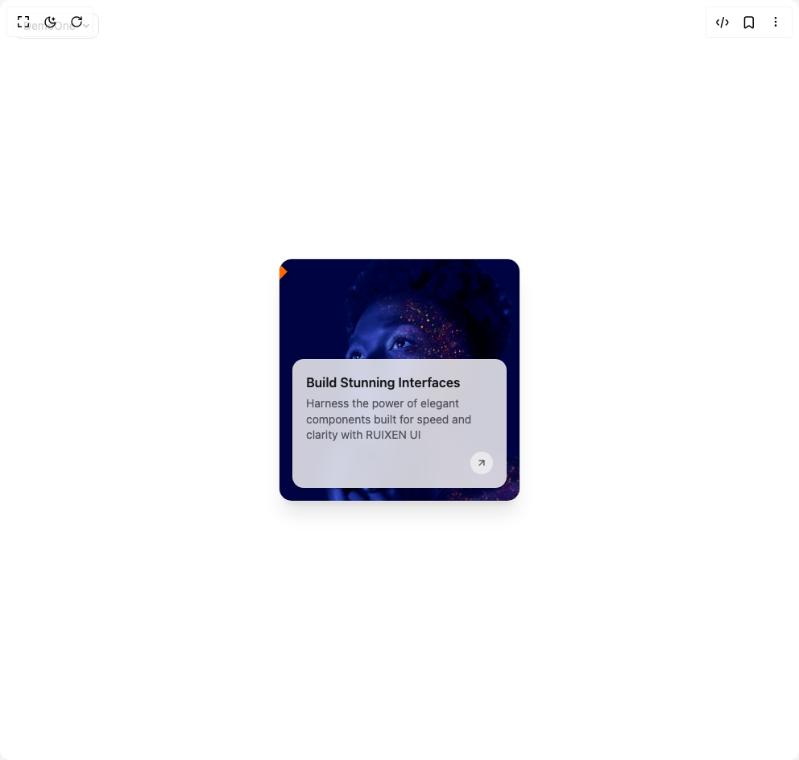

# Build Ruixen Card 01 in BuilderStudio

> Build this component in our Agentic IDE: [BuilderStudio](https://builderstudio.dev).
>
> Join the BuilderStudio community on [Discord](https://discord.gg/QdWeSGCqfe) and [Reddit](https://reddit.com/r/builderstudio).



## Component

- Author group: `ruixenui`
- Component: `ruixen-card-01`
- Variant: `default`
- Rendered HTML snapshot: [`rendered.html`](rendered.html)

## BuilderStudio prompt

You are implementing a React component based on a component reference.

## Component identity

- Author: ruixenui
- Component slug: ruixen-card-01
- Demo slug: default
- Title: ruixen-card-01
- Description: 

## Goal

Recreate this component in a React + TypeScript + Tailwind CSS project. Preserve the visual layout, spacing, colors, border radius, shadows, interaction behavior, animation behavior, responsive behavior, and dark mode behavior shown in the rendered demo.

## Implementation requirements

- Use React and TypeScript.
- Use Tailwind CSS classes whenever possible.
- Keep the component self-contained unless the source files require helper components.
- If the source uses CSS variables, custom CSS, animations, or keyframes, include them.
- If the source uses external packages, list and use the required packages.
- Preserve accessibility attributes, button semantics, links, keyboard behavior, and ARIA attributes when visible in the source.
- Do not replace the component with a simplified placeholder.
- Return complete production-ready code.

## Dependencies

No reference metadata available.

## Rendered DOM snapshot

This is the rendered demo HTML extracted from the live preview. Use it to verify structure, class names, visible content, and layout.

```html
<div id="root"><div class="fixed top-4 left-4 z-10"><select class="appearance-none h-8 max-w-[200px] text-sm leading-tight rounded-lg pl-3 pr-7 py-0 border bg-background focus:outline-none focus:ring-0"><option value="named_DemoOne_DemoOne">DemoOne</option></select><div class="absolute top-1/2 transform -translate-y-1/2 right-2 pointer-events-none"><svg class="w-4 h-4 fill-current" viewBox="0 0 20 20"><path d="M5.516 7.548c.436-.446 1.043-.48 1.576 0L10 10.405l2.908-2.857c.533-.48 1.14-.446 1.576 0 .436.445.408 1.197 0 1.615l-3.734 3.705c-.533.534-1.39.534-1.923 0l-3.734-3.705c-.408-.418-.436-1.17 0-1.615z"></path></svg></div></div><div class="w-screen min-h-screen flex justify-center items-center"><div class="w-full max-w-[300px] flex flex-col group"><a href="#" class="relative block overflow-hidden rounded-2xl shadow-xl border border-zinc-200 dark:border-zinc-800 bg-gradient-to-tr from-white/50 to-zinc-100 dark:from-zinc-900/40 dark:to-zinc-800/30 backdrop-blur-md transition-all duration-300 hover:scale-[1.02]"><div class="relative h-[300px] w-full"></div><div class="absolute top-4 -left-10 transform -rotate-45"><div class="px-3 py-0.5 text-xs font-bold shadow-md bg-orange-500 text-white">New</div></div><div class="absolute bottom-4 left-4 right-4 group-hover:scale-[1.01] group-hover:translate-y-[-4px] transform transition-all duration-300 ease-out bg-white/80 dark:bg-zinc-900/80 backdrop-blur-md rounded-xl p-4 shadow-md border border-white/10 dark:border-zinc-700"><div class="flex flex-col gap-1"><h3 class="text-base font-semibold text-zinc-900 dark:text-white">Build Stunning Interfaces</h3><p class="text-sm text-zinc-600 dark:text-zinc-300 leading-snug">Harness the power of elegant components built for speed and clarity with RUIXEN UI</p><div class="flex justify-end mt-2"><div class="group relative w-7 h-7 flex items-center justify-center rounded-full bg-zinc-100/70 dark:bg-zinc-800/60 transition-all duration-300 hover:scale-110 hover:shadow-md"><svg xmlns="http://www.w3.org/2000/svg" width="24" height="24" viewBox="0 0 24 24" fill="none" stroke="currentColor" stroke-width="2" stroke-linecap="round" stroke-linejoin="round" class="lucide lucide-arrow-up-right w-3.5 h-3.5 text-zinc-700 dark:text-white transition-transform duration-300 group-hover:rotate-45" aria-hidden="true"><path d="M7 7h10v10"></path><path d="M7 17 17 7"></path></svg><div class="absolute inset-0 rounded-full bg-black/5 dark:bg-white/5 opacity-0 group-hover:opacity-100 transition-opacity duration-300"></div></div></div></div></div></a></div></div></div>
```

## Reference source files

No reference source files were available.
