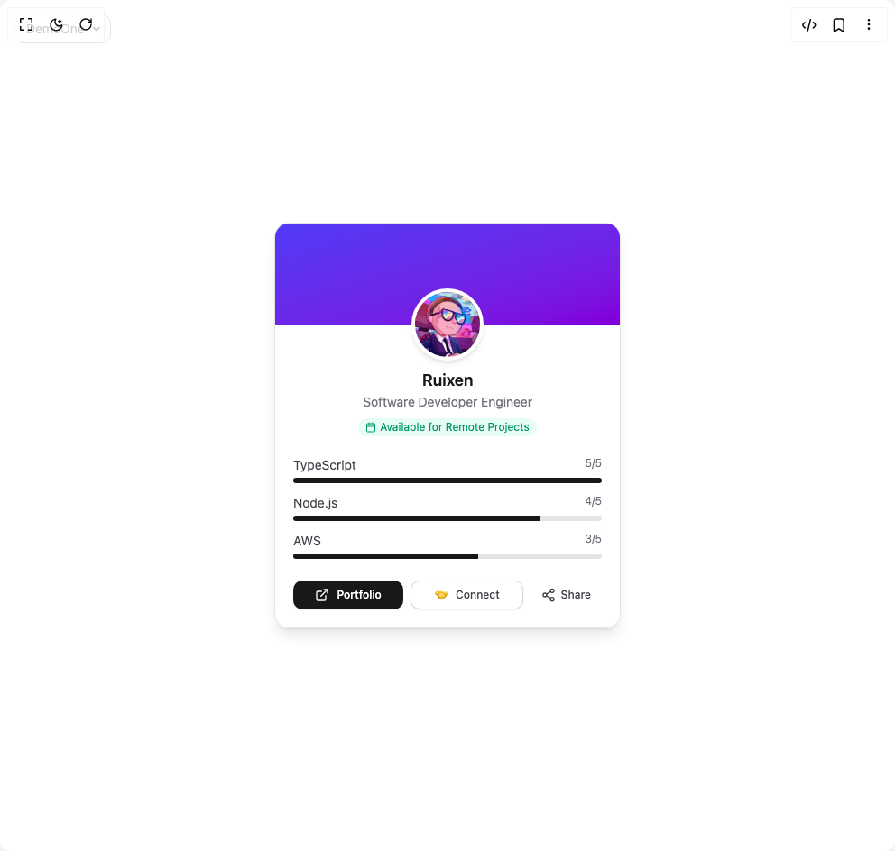

# Build Ruixen Card02 in BuilderStudio

> Build this component in our Agentic IDE: [BuilderStudio](https://builderstudio.dev).
>
> Join the BuilderStudio community on [Discord](https://discord.gg/QdWeSGCqfe) and [Reddit](https://reddit.com/r/builderstudio).



## Component

- Author group: `ruixenui`
- Component: `ruixen-card02`
- Variant: `default`
- Rendered HTML snapshot: [`rendered.html`](rendered.html)

## BuilderStudio prompt

You are implementing a React component based on a component reference.

## Component identity

- Author: ruixenui
- Component slug: ruixen-card02
- Demo slug: default
- Title: ruixen-card02
- Description: 

## Goal

Recreate this component in a React + TypeScript + Tailwind CSS project. Preserve the visual layout, spacing, colors, border radius, shadows, interaction behavior, animation behavior, responsive behavior, and dark mode behavior shown in the rendered demo.

## Implementation requirements

- Use React and TypeScript.
- Use Tailwind CSS classes whenever possible.
- Keep the component self-contained unless the source files require helper components.
- If the source uses CSS variables, custom CSS, animations, or keyframes, include them.
- If the source uses external packages, list and use the required packages.
- Preserve accessibility attributes, button semantics, links, keyboard behavior, and ARIA attributes when visible in the source.
- Do not replace the component with a simplified placeholder.
- Return complete production-ready code.

## Dependencies

No reference metadata available.

## Rendered DOM snapshot

This is the rendered demo HTML extracted from the live preview. Use it to verify structure, class names, visible content, and layout.

```html
<div id="root"><div class="fixed top-4 left-4 z-10"><select class="appearance-none h-8 max-w-[200px] text-sm leading-tight rounded-lg pl-3 pr-7 py-0 border bg-background focus:outline-none focus:ring-0"><option value="named_DemoOne_DemoOne">DemoOne</option></select><div class="absolute top-1/2 transform -translate-y-1/2 right-2 pointer-events-none"><svg class="w-4 h-4 fill-current" viewBox="0 0 20 20"><path d="M5.516 7.548c.436-.446 1.043-.48 1.576 0L10 10.405l2.908-2.857c.533-.48 1.14-.446 1.576 0 .436.445.408 1.197 0 1.615l-3.734 3.705c-.533.534-1.39.534-1.923 0l-3.734-3.705c-.408-.418-.436-1.17 0-1.615z"></path></svg></div></div><div class="w-screen min-h-screen flex justify-center items-center"><div class="relative w-full max-w-sm mx-auto rounded-2xl overflow-hidden border border-zinc-200 dark:border-zinc-800 bg-white/60 dark:bg-zinc-900/60 backdrop-blur-md shadow-lg transition-shadow duration-300"><div class="relative h-28 bg-gradient-to-br from-indigo-600 to-purple-700 text-white flex items-end justify-start p-4"></div><div class="relative z-10 flex justify-center -mt-10"><div class="w-20 h-20 rounded-full border-4 border-white dark:border-zinc-900 shadow-md overflow-hidden"></div></div><div class="text-center mt-2 px-5"><h3 class="text-lg font-semibold text-zinc-900 dark:text-white">Ruixen</h3><p class="text-sm text-zinc-500 dark:text-zinc-400">Software Developer Engineer</p><div class="mt-2 inline-flex items-center gap-1 text-xs text-emerald-600 dark:text-emerald-400 bg-emerald-100/50 dark:bg-emerald-900/30 px-2 py-0.5 rounded-lg"><svg xmlns="http://www.w3.org/2000/svg" width="24" height="24" viewBox="0 0 24 24" fill="none" stroke="currentColor" stroke-width="2" stroke-linecap="round" stroke-linejoin="round" class="lucide lucide-calendar w-3 h-3" aria-hidden="true"><path d="M8 2v4"></path><path d="M16 2v4"></path><rect width="18" height="18" x="3" y="4" rx="2"></rect><path d="M3 10h18"></path></svg>Available for Remote Projects</div></div><div class="mt-5 px-5 space-y-3"><div><div class="flex justify-between text-sm text-zinc-700 dark:text-zinc-300 mb-1"><span>TypeScript</span><span class="text-xs text-zinc-500 dark:text-zinc-400">5/5</span></div><div class="w-full h-1.5 bg-zinc-200 dark:bg-zinc-700 rounded-full overflow-hidden"><div class="h-full bg-zinc-900 dark:bg-zinc-100" style="width: 100%;"></div></div></div><div><div class="flex justify-between text-sm text-zinc-700 dark:text-zinc-300 mb-1"><span>Node.js</span><span class="text-xs text-zinc-500 dark:text-zinc-400">4/5</span></div><div class="w-full h-1.5 bg-zinc-200 dark:bg-zinc-700 rounded-full overflow-hidden"><div class="h-full bg-zinc-900 dark:bg-zinc-100" style="width: 80%;"></div></div></div><div><div class="flex justify-between text-sm text-zinc-700 dark:text-zinc-300 mb-1"><span>AWS</span><span class="text-xs text-zinc-500 dark:text-zinc-400">3/5</span></div><div class="w-full h-1.5 bg-zinc-200 dark:bg-zinc-700 rounded-full overflow-hidden"><div class="h-full bg-zinc-900 dark:bg-zinc-100" style="width: 60%;"></div></div></div></div><div class="mt-6 px-5 pb-5 flex flex-wrap gap-2 sm:flex-nowrap"><button class="inline-flex items-center justify-center whitespace-nowrap font-medium transition-colors outline-offset-2 focus-visible:outline-2 focus-visible:outline-ring/70 disabled:pointer-events-none disabled:opacity-50 [&amp;_svg]:pointer-events-none [&amp;_svg]:shrink-0 shadow-sm shadow-black/5 h-8 rounded-lg px-3 text-xs flex-1 bg-zinc-900 dark:bg-zinc-100 text-white dark:text-zinc-900 hover:bg-zinc-800 dark:hover:bg-white"><svg xmlns="http://www.w3.org/2000/svg" width="24" height="24" viewBox="0 0 24 24" fill="none" stroke="currentColor" stroke-width="2" stroke-linecap="round" stroke-linejoin="round" class="lucide lucide-external-link w-4 h-4 mr-2" aria-hidden="true"><path d="M15 3h6v6"></path><path d="M10 14 21 3"></path><path d="M18 13v6a2 2 0 0 1-2 2H5a2 2 0 0 1-2-2V8a2 2 0 0 1 2-2h6"></path></svg>Portfolio</button><button class="inline-flex items-center justify-center whitespace-nowrap font-medium transition-colors outline-offset-2 focus-visible:outline-2 focus-visible:outline-ring/70 disabled:pointer-events-none disabled:opacity-50 [&amp;_svg]:pointer-events-none [&amp;_svg]:shrink-0 border bg-background shadow-sm shadow-black/5 hover:text-accent-foreground h-8 rounded-lg px-3 text-xs flex-1 text-zinc-700 dark:text-zinc-200 border-zinc-300 dark:border-zinc-700 hover:bg-zinc-100 dark:hover:bg-zinc-800"><span class="w-4 h-4 mr-2">🤝</span>Connect</button><button class="justify-center whitespace-nowrap font-medium transition-colors outline-offset-2 focus-visible:outline-2 focus-visible:outline-ring/70 disabled:pointer-events-none disabled:opacity-50 [&amp;_svg]:pointer-events-none [&amp;_svg]:shrink-0 hover:text-accent-foreground h-8 rounded-lg px-3 text-xs flex items-center gap-1.5 text-zinc-700 dark:text-zinc-200 hover:bg-zinc-100 dark:hover:bg-zinc-800"><svg xmlns="http://www.w3.org/2000/svg" width="24" height="24" viewBox="0 0 24 24" fill="none" stroke="currentColor" stroke-width="2" stroke-linecap="round" stroke-linejoin="round" class="lucide lucide-share2 lucide-share-2 w-4 h-4" aria-hidden="true"><circle cx="18" cy="5" r="3"></circle><circle cx="6" cy="12" r="3"></circle><circle cx="18" cy="19" r="3"></circle><line x1="8.59" x2="15.42" y1="13.51" y2="17.49"></line><line x1="15.41" x2="8.59" y1="6.51" y2="10.49"></line></svg>Share</button></div></div></div></div>
```

## Reference source files

No reference source files were available.
