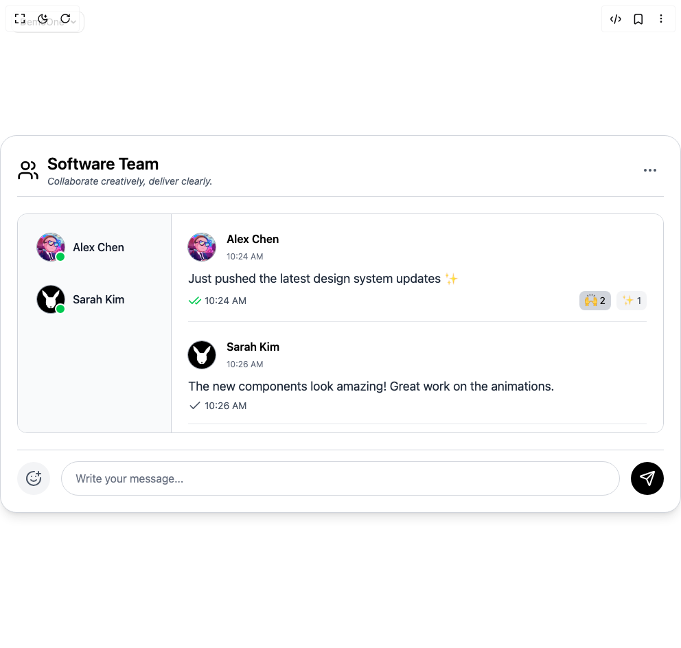

# Ruixen Mono Chat

Variant: `default`

> Build this component in our Agentic IDE: [BuilderStudio](https://builderstudio.dev).
>
> Join the BuilderStudio community on [Discord](https://discord.gg/QdWeSGCqfe) and [Reddit](https://reddit.com/r/builderstudio).

## Files

- [BuilderStudio prompt](prompt.md)
- [Rendered HTML snapshot](rendered.html)
- [Screenshot](screenshot.png)

## Use in BuilderStudio

1. Open [BuilderStudio](https://builderstudio.dev).
2. Create or open a project.
3. Paste the prompt from [`prompt.md`](prompt.md).
4. Ask the agent to implement the component in your app.
