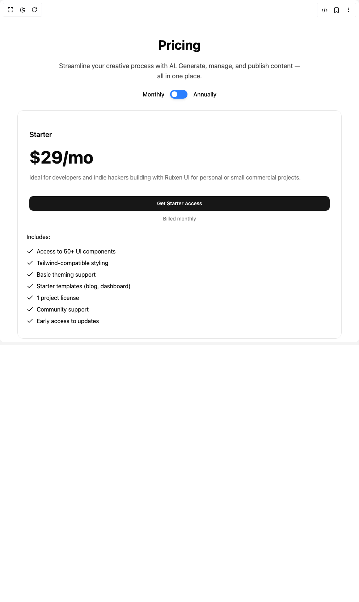

# Build Ruixen Pricing 04 in BuilderStudio

> Build this component in our Agentic IDE: [BuilderStudio](https://builderstudio.dev).
>
> Join the BuilderStudio community on [Discord](https://discord.gg/QdWeSGCqfe) and [Reddit](https://reddit.com/r/builderstudio).



## Component

- Author group: `ruixenui`
- Component: `ruixen-pricing-04`
- Variant: `default`
- Rendered HTML snapshot: [`rendered.html`](rendered.html)

## BuilderStudio prompt

You are implementing a React component based on a component reference.

## Component identity

- Author: ruixenui
- Component slug: ruixen-pricing-04
- Demo slug: default
- Title: ruixen-pricing-04
- Description: 

## Goal

Recreate this component in a React + TypeScript + Tailwind CSS project. Preserve the visual layout, spacing, colors, border radius, shadows, interaction behavior, animation behavior, responsive behavior, and dark mode behavior shown in the rendered demo.

## Implementation requirements

- Use React and TypeScript.
- Use Tailwind CSS classes whenever possible.
- Keep the component self-contained unless the source files require helper components.
- If the source uses CSS variables, custom CSS, animations, or keyframes, include them.
- If the source uses external packages, list and use the required packages.
- Preserve accessibility attributes, button semantics, links, keyboard behavior, and ARIA attributes when visible in the source.
- Do not replace the component with a simplified placeholder.
- Return complete production-ready code.

## Dependencies

No reference metadata available.

## Rendered DOM snapshot

This is the rendered demo HTML extracted from the live preview. Use it to verify structure, class names, visible content, and layout.

```html
<div id="root"><div class="w-screen min-h-screen flex justify-center items-center"><div class="w-screen min-h-screen flex justify-center items-center"><div class="relative flex flex-col items-center justify-center max-w-5xl py-20 mx-auto"><div class="flex flex-col items-center justify-center max-w-2xl mx-auto"><div class="flex flex-col items-center text-center max-w-2xl mx-auto"><h2 class="text-3xl md:text-4xl lg:text-5xl font-bold mt-6">Pricing</h2><p class="text-base md:text-lg text-center text-accent-foreground/80 mt-6">Streamline your creative process with AI. Generate, manage, and publish content — all in one place.</p></div><div class="flex items-center justify-center space-x-4 mt-6"><span class="text-base font-medium">Monthly</span><button class="relative rounded-full focus:outline-none"><div class="w-12 h-6 transition rounded-full shadow-md outline-none bg-blue-500"></div><div class="absolute inline-flex items-center justify-center w-4 h-4 transition-all duration-500 ease-in-out top-1 left-1 rounded-full bg-white translate-x-0"></div></button><span class="text-base font-medium">Annually</span></div></div><div class="grid w-full grid-cols-1 lg:grid-cols-2 pt-8 lg:pt-12 gap-4 lg:gap-6 max-w-4xl mx-auto"><div class="flex flex-col relative rounded-2xl lg:rounded-3xl transition-all bg-background/ items-start w-full border border-foreground/10 overflow-hidden"><div class="p-4 md:p-8 flex rounded-t-2xl lg:rounded-t-3xl flex-col items-start w-full relative"><h2 class="font-medium text-xl text-foreground pt-5">Starter</h2><h3 class="mt-3 text-2xl font-bold md:text-5xl"><number-flow-react></number-flow-react></h3><p class="text-sm md:text-base text-muted-foreground mt-2">Ideal for developers and indie hackers building with Ruixen UI for personal or small commercial projects.</p></div><div class="flex flex-col items-start w-full px-4 py-2 md:px-8"><button class="inline-flex items-center justify-center whitespace-nowrap text-sm font-medium transition-colors outline-offset-2 focus-visible:outline-2 focus-visible:outline-ring/70 disabled:pointer-events-none disabled:opacity-50 [&amp;_svg]:pointer-events-none [&amp;_svg]:shrink-0 bg-primary text-primary-foreground shadow-sm shadow-black/5 hover:bg-primary/90 h-10 rounded-lg px-8 w-full">Get Starter Access</button><div class="h-8 overflow-hidden w-full mx-auto"><span class="text-sm text-center text-muted-foreground mt-3 mx-auto block" style="opacity: 1; transform: none;">Billed monthly</span></div></div><div class="flex flex-col items-start w-full p-5 mb-4 ml-1 gap-y-2"><span class="text-base text-left mb-2">Includes:</span><div class="flex items-center justify-start gap-2"><div class="flex items-center justify-center"><svg xmlns="http://www.w3.org/2000/svg" width="24" height="24" viewBox="0 0 24 24" fill="none" stroke="currentColor" stroke-width="2" stroke-linecap="round" stroke-linejoin="round" class="lucide lucide-check size-5" aria-hidden="true"><path d="M20 6 9 17l-5-5"></path></svg></div><span>Access to 50+ UI components</span></div><div class="flex items-center justify-start gap-2"><div class="flex items-center justify-center"><svg xmlns="http://www.w3.org/2000/svg" width="24" height="24" viewBox="0 0 24 24" fill="none" stroke="currentColor" stroke-width="2" stroke-linecap="round" stroke-linejoin="round" class="lucide lucide-check size-5" aria-hidden="true"><path d="M20 6 9 17l-5-5"></path></svg></div><span>Tailwind-compatible styling</span></div><div class="flex items-center justify-start gap-2"><div class="flex items-center justify-center"><svg xmlns="http://www.w3.org/2000/svg" width="24" height="24" viewBox="0 0 24 24" fill="none" stroke="currentColor" stroke-width="2" stroke-linecap="round" stroke-linejoin="round" class="lucide lucide-check size-5" aria-hidden="true"><path d="M20 6 9 17l-5-5"></path></svg></div><span>Basic theming support</span></div><div class="flex items-center justify-start gap-2"><div class="flex items-center justify-center"><svg xmlns="http://www.w3.org/2000/svg" width="24" height="24" viewBox="0 0 24 24" fill="none" stroke="currentColor" stroke-width="2" stroke-linecap="round" stroke-linejoin="round" class="lucide lucide-check size-5" aria-hidden="true"><path d="M20 6 9 17l-5-5"></path></svg></div><span>Starter templates (blog, dashboard)</span></div><div class="flex items-center justify-start gap-2"><div class="flex items-center justify-center"><svg xmlns="http://www.w3.org/2000/svg" width="24" height="24" viewBox="0 0 24 24" fill="none" stroke="currentColor" stroke-width="2" stroke-linecap="round" stroke-linejoin="round" class="lucide lucide-check size-5" aria-hidden="true"><path d="M20 6 9 17l-5-5"></path></svg></div><span>1 project license</span></div><div class="flex items-center justify-start gap-2"><div class="flex items-center justify-center"><svg xmlns="http://www.w3.org/2000/svg" width="24" height="24" viewBox="0 0 24 24" fill="none" stroke="currentColor" stroke-width="2" stroke-linecap="round" stroke-linejoin="round" class="lucide lucide-check size-5" aria-hidden="true"><path d="M20 6 9 17l-5-5"></path></svg></div><span>Community support</span></div><div class="flex items-center justify-start gap-2"><div class="flex items-center justify-center"><svg xmlns="http://www.w3.org/2000/svg" width="24" height="24" viewBox="0 0 24 24" fill="none" stroke="currentColor" stroke-width="2" stroke-linecap="round" stroke-linejoin="round" class="lucide lucide-check size-5" aria-hidden="true"><path d="M20 6 9 17l-5-5"></path></svg></div><span>Early access to updates</span></div></div></div><div class="flex flex-col relative rounded-2xl lg:rounded-3xl transition-all bg-background/ items-start w-full border border-foreground/10 overflow-hidden"><div class="p-4 md:p-8 flex rounded-t-2xl lg:rounded-t-3xl flex-col items-start w-full relative"><h2 class="font-medium text-xl text-foreground pt-5">Pro</h2><h3 class="mt-3 text-2xl font-bold md:text-5xl"><number-flow-react></number-flow-react></h3><p class="text-sm md:text-base text-muted-foreground mt-2">Designed for teams and startups who need advanced UI components, theme customization, and premium support.</p></div><div class="flex flex-col items-start w-full px-4 py-2 md:px-8"><button class="inline-flex items-center justify-center whitespace-nowrap text-sm font-medium transition-colors outline-offset-2 focus-visible:outline-2 focus-visible:outline-ring/70 disabled:pointer-events-none disabled:opacity-50 [&amp;_svg]:pointer-events-none [&amp;_svg]:shrink-0 bg-primary text-primary-foreground shadow-sm shadow-black/5 hover:bg-primary/90 h-10 rounded-lg px-8 w-full">Upgrade to Pro</button><div class="h-8 overflow-hidden w-full mx-auto"><span class="text-sm text-center text-muted-foreground mt-3 mx-auto block" style="opacity: 1; transform: none;">Billed monthly</span></div></div><div class="flex flex-col items-start w-full p-5 mb-4 ml-1 gap-y-2"><span class="text-base text-left mb-2">Includes:</span><div class="flex items-center justify-start gap-2"><div class="flex items-center justify-center"><svg xmlns="http://www.w3.org/2000/svg" width="24" height="24" viewBox="0 0 24 24" fill="none" stroke="currentColor" stroke-width="2" stroke-linecap="round" stroke-linejoin="round" class="lucide lucide-check size-5" aria-hidden="true"><path d="M20 6 9 17l-5-5"></path></svg></div><span>Access to 100+ production-grade components</span></div><div class="flex items-center justify-start gap-2"><div class="flex items-center justify-center"><svg xmlns="http://www.w3.org/2000/svg" width="24" height="24" viewBox="0 0 24 24" fill="none" stroke="currentColor" stroke-width="2" stroke-linecap="round" stroke-linejoin="round" class="lucide lucide-check size-5" aria-hidden="true"><path d="M20 6 9 17l-5-5"></path></svg></div><span>Advanced theming &amp; dark mode</span></div><div class="flex items-center justify-start gap-2"><div class="flex items-center justify-center"><svg xmlns="http://www.w3.org/2000/svg" width="24" height="24" viewBox="0 0 24 24" fill="none" stroke="currentColor" stroke-width="2" stroke-linecap="round" stroke-linejoin="round" class="lucide lucide-check size-5" aria-hidden="true"><path d="M20 6 9 17l-5-5"></path></svg></div><span>Code snippets &amp; layout presets</span></div><div class="flex items-center justify-start gap-2"><div class="flex items-center justify-center"><svg xmlns="http://www.w3.org/2000/svg" width="24" height="24" viewBox="0 0 24 24" fill="none" stroke="currentColor" stroke-width="2" stroke-linecap="round" stroke-linejoin="round" class="lucide lucide-check size-5" aria-hidden="true"><path d="M20 6 9 17l-5-5"></path></svg></div><span>Figma design system access</span></div><div class="flex items-center justify-start gap-2"><div class="flex items-center justify-center"><svg xmlns="http://www.w3.org/2000/svg" width="24" height="24" viewBox="0 0 24 24" fill="none" stroke="currentColor" stroke-width="2" stroke-linecap="round" stroke-linejoin="round" class="lucide lucide-check size-5" aria-hidden="true"><path d="M20 6 9 17l-5-5"></path></svg></div><span>Commercial use for up to 10 projects</span></div><div class="flex items-center justify-start gap-2"><div class="flex items-center justify-center"><svg xmlns="http://www.w3.org/2000/svg" width="24" height="24" viewBox="0 0 24 24" fill="none" stroke="currentColor" stroke-width="2" stroke-linecap="round" stroke-linejoin="round" class="lucide lucide-check size-5" aria-hidden="true"><path d="M20 6 9 17l-5-5"></path></svg></div><span>Priority GitHub issue support</span></div><div class="flex items-center justify-start gap-2"><div class="flex items-center justify-center"><svg xmlns="http://www.w3.org/2000/svg" width="24" height="24" viewBox="0 0 24 24" fill="none" stroke="currentColor" stroke-width="2" stroke-linecap="round" stroke-linejoin="round" class="lucide lucide-check size-5" aria-hidden="true"><path d="M20 6 9 17l-5-5"></path></svg></div><span>Team collaboration tools</span></div></div></div></div></div></div></div></div>
```

## Reference source files

No reference source files were available.
