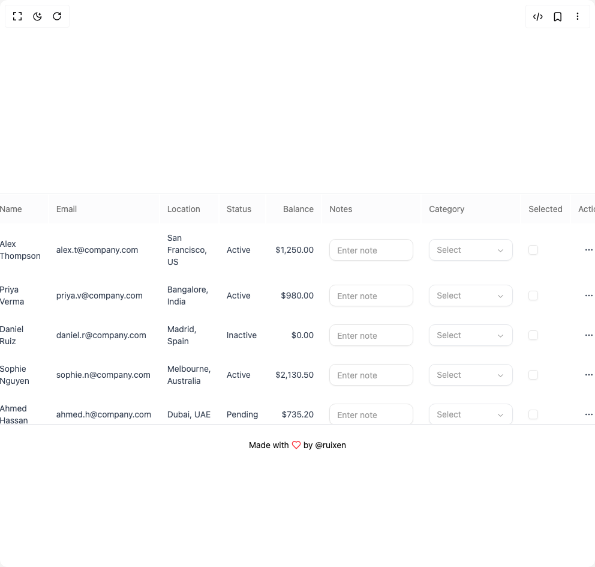

# Build Ruixen Table Basic in BuilderStudio

> Build this component in our Agentic IDE: [BuilderStudio](https://builderstudio.dev).
>
> Join the BuilderStudio community on [Discord](https://discord.gg/QdWeSGCqfe) and [Reddit](https://reddit.com/r/builderstudio).



## Component

- Author group: `ruixenui`
- Component: `ruixen-table-basic`
- Variant: `default`
- Rendered HTML snapshot: [`rendered.html`](rendered.html)

## BuilderStudio prompt

You are implementing a React component based on a component reference.

## Component identity

- Author: ruixenui
- Component slug: ruixen-table-basic
- Demo slug: default
- Title: ruixen-table-basic
- Description: 

## Goal

Recreate this component in a React + TypeScript + Tailwind CSS project. Preserve the visual layout, spacing, colors, border radius, shadows, interaction behavior, animation behavior, responsive behavior, and dark mode behavior shown in the rendered demo.

## Implementation requirements

- Use React and TypeScript.
- Use Tailwind CSS classes whenever possible.
- Keep the component self-contained unless the source files require helper components.
- If the source uses CSS variables, custom CSS, animations, or keyframes, include them.
- If the source uses external packages, list and use the required packages.
- Preserve accessibility attributes, button semantics, links, keyboard behavior, and ARIA attributes when visible in the source.
- Do not replace the component with a simplified placeholder.
- Return complete production-ready code.

## Dependencies

No reference metadata available.

## Rendered DOM snapshot

This is the rendered demo HTML extracted from the live preview. Use it to verify structure, class names, visible content, and layout.

```html
<div id="root"><div class="w-screen min-h-screen flex justify-center items-center"><div class="w-screen min-h-screen flex justify-center items-center"><div class="bg-background"><div class="[&amp;&gt;div]:max-h-96 max-w-5xl mx-auto mt-32 rounded-xl border border-gray-200 dark:border-gray-800"><div class="relative w-full overflow-auto"><table class="w-full caption-bottom text-sm border-separate"><thead class="sticky top-0 z-10 bg-gray-50/50 dark:bg-black backdrop-blur-xl"><tr class="border-b border-border transition-colors data-[state=selected]:bg-muted hover:bg-transparent"><th class="h-12 px-3 align-middle text-muted-foreground [&amp;:has([role=checkbox])]:w-px [&amp;:has([role=checkbox])]:pr-0 [&amp;&gt;[role=checkbox]]:translate-y-0.5 text-left font-normal">Name</th><th class="h-12 px-3 align-middle text-muted-foreground [&amp;:has([role=checkbox])]:w-px [&amp;:has([role=checkbox])]:pr-0 [&amp;&gt;[role=checkbox]]:translate-y-0.5 text-left font-normal">Email</th><th class="h-12 px-3 align-middle text-muted-foreground [&amp;:has([role=checkbox])]:w-px [&amp;:has([role=checkbox])]:pr-0 [&amp;&gt;[role=checkbox]]:translate-y-0.5 text-left font-normal">Location</th><th class="h-12 px-3 align-middle text-muted-foreground [&amp;:has([role=checkbox])]:w-px [&amp;:has([role=checkbox])]:pr-0 [&amp;&gt;[role=checkbox]]:translate-y-0.5 text-left font-normal">Status</th><th class="h-12 px-3 align-middle text-muted-foreground [&amp;:has([role=checkbox])]:w-px [&amp;:has([role=checkbox])]:pr-0 [&amp;&gt;[role=checkbox]]:translate-y-0.5 text-right font-normal">Balance</th><th class="h-12 px-3 align-middle text-muted-foreground [&amp;:has([role=checkbox])]:w-px [&amp;:has([role=checkbox])]:pr-0 [&amp;&gt;[role=checkbox]]:translate-y-0.5 text-left font-normal">Notes</th> <th class="h-12 px-3 align-middle text-muted-foreground [&amp;:has([role=checkbox])]:w-px [&amp;:has([role=checkbox])]:pr-0 [&amp;&gt;[role=checkbox]]:translate-y-0.5 text-left font-normal">Category</th> <th class="h-12 px-3 align-middle text-muted-foreground [&amp;:has([role=checkbox])]:w-px [&amp;:has([role=checkbox])]:pr-0 [&amp;&gt;[role=checkbox]]:translate-y-0.5 text-left font-normal">Selected</th> <th class="h-12 px-3 align-middle text-muted-foreground [&amp;:has([role=checkbox])]:w-px [&amp;:has([role=checkbox])]:pr-0 [&amp;&gt;[role=checkbox]]:translate-y-0.5 text-left font-normal">Actions</th> </tr></thead><tbody class="[&amp;_tr:last-child]:border-0 text-gray-700 dark:text-gray-400"><tr class="border-b border-border transition-colors hover:bg-muted/50 data-[state=selected]:bg-muted"><td class="p-3 align-middle [&amp;:has([role=checkbox])]:pr-0 [&amp;&gt;[role=checkbox]]:translate-y-0.5 font-normal">Alex Thompson</td><td class="p-3 align-middle [&amp;:has([role=checkbox])]:pr-0 [&amp;&gt;[role=checkbox]]:translate-y-0.5 font-normal">alex.t@company.com</td><td class="p-3 align-middle [&amp;:has([role=checkbox])]:pr-0 [&amp;&gt;[role=checkbox]]:translate-y-0.5 font-normal">San Francisco, US</td><td class="p-3 align-middle [&amp;:has([role=checkbox])]:pr-0 [&amp;&gt;[role=checkbox]]:translate-y-0.5 font-normal">Active</td><td class="p-3 align-middle [&amp;:has([role=checkbox])]:pr-0 [&amp;&gt;[role=checkbox]]:translate-y-0.5 text-right font-normal">$1,250.00</td><td class="p-3 align-middle [&amp;:has([role=checkbox])]:pr-0 [&amp;&gt;[role=checkbox]]:translate-y-0.5"><input class="flex h-9 rounded-lg border border-input bg-background px-3 py-2 text-sm text-foreground shadow-sm shadow-black/5 transition-shadow placeholder:text-muted-foreground/70 focus-visible:border-ring focus-visible:outline-none focus-visible:ring-[3px] focus-visible:ring-ring/20 disabled:cursor-not-allowed disabled:opacity-50 w-[140px]" placeholder="Enter note"></td><td class="p-3 align-middle [&amp;:has([role=checkbox])]:pr-0 [&amp;&gt;[role=checkbox]]:translate-y-0.5"><button type="button" role="combobox" aria-controls="radix-«r0»" aria-expanded="false" aria-autocomplete="none" dir="ltr" data-state="closed" data-placeholder="" class="flex h-9 items-center justify-between gap-2 rounded-lg bg-background px-3 py-2 text-start text-sm text-foreground shadow-sm shadow-black/5 focus:border-ring focus:outline-none focus:ring-[3px] focus:ring-ring/20 disabled:cursor-not-allowed disabled:opacity-50 data-[placeholder]:text-muted-foreground/70 [&amp;&gt;span]:min-w-0 w-[140px] border border-gray-200 dark:border-gray-800"><span style="pointer-events: none;">Select</span><svg width="15" height="15" viewBox="0 0 15 15" fill="none" xmlns="http://www.w3.org/2000/svg" size="16" stroke-width="2" class="shrink-0 text-muted-foreground/80" aria-hidden="true"><path d="M3.13523 6.15803C3.3241 5.95657 3.64052 5.94637 3.84197 6.13523L7.5 9.56464L11.158 6.13523C11.3595 5.94637 11.6759 5.95657 11.8648 6.15803C12.0536 6.35949 12.0434 6.67591 11.842 6.86477L7.84197 10.6148C7.64964 10.7951 7.35036 10.7951 7.15803 10.6148L3.15803 6.86477C2.95657 6.67591 2.94637 6.35949 3.13523 6.15803Z" fill="currentColor" fill-rule="evenodd" clip-rule="evenodd"></path></svg></button></td><td class="p-3 align-middle [&amp;:has([role=checkbox])]:pr-0 [&amp;&gt;[role=checkbox]]:translate-y-0.5"><button type="button" role="checkbox" aria-checked="false" data-state="unchecked" value="on" class="peer size-4 shrink-0 rounded border border-input shadow-sm shadow-black/5 outline-offset-2 focus-visible:outline-2 focus-visible:outline-ring/70 disabled:cursor-not-allowed disabled:opacity-50 data-[state=checked]:border-primary data-[state=indeterminate]:border-primary data-[state=checked]:bg-primary data-[state=indeterminate]:bg-primary data-[state=checked]:text-primary-foreground data-[state=indeterminate]:text-primary-foreground"></button></td><td class="p-3 align-middle [&amp;:has([role=checkbox])]:pr-0 [&amp;&gt;[role=checkbox]]:translate-y-0.5 w-[120px]"><button class="inline-flex items-center justify-center whitespace-nowrap text-sm font-medium transition-colors outline-offset-2 focus-visible:outline-2 focus-visible:outline-ring/70 disabled:pointer-events-none disabled:opacity-50 [&amp;_svg]:pointer-events-none [&amp;_svg]:shrink-0 hover:bg-accent hover:text-accent-foreground h-9 w-9 rounded-full shadow-none" aria-label="Open edit menu" type="button" id="radix-«r1»" aria-haspopup="menu" aria-expanded="false" data-state="closed"><svg xmlns="http://www.w3.org/2000/svg" width="16" height="16" viewBox="0 0 24 24" fill="none" stroke="currentColor" stroke-width="2" stroke-linecap="round" stroke-linejoin="round" class="lucide lucide-ellipsis" aria-hidden="true"><circle cx="12" cy="12" r="1"></circle><circle cx="19" cy="12" r="1"></circle><circle cx="5" cy="12" r="1"></circle></svg></button></td></tr><tr class="border-b border-border transition-colors hover:bg-muted/50 data-[state=selected]:bg-muted"><td class="p-3 align-middle [&amp;:has([role=checkbox])]:pr-0 [&amp;&gt;[role=checkbox]]:translate-y-0.5 font-normal">Priya Verma</td><td class="p-3 align-middle [&amp;:has([role=checkbox])]:pr-0 [&amp;&gt;[role=checkbox]]:translate-y-0.5 font-normal">priya.v@company.com</td><td class="p-3 align-middle [&amp;:has([role=checkbox])]:pr-0 [&amp;&gt;[role=checkbox]]:translate-y-0.5 font-normal">Bangalore, India</td><td class="p-3 align-middle [&amp;:has([role=checkbox])]:pr-0 [&amp;&gt;[role=checkbox]]:translate-y-0.5 font-normal">Active</td><td class="p-3 align-middle [&amp;:has([role=checkbox])]:pr-0 [&amp;&gt;[role=checkbox]]:translate-y-0.5 text-right font-normal">$980.00</td><td class="p-3 align-middle [&amp;:has([role=checkbox])]:pr-0 [&amp;&gt;[role=checkbox]]:translate-y-0.5"><input class="flex h-9 rounded-lg border border-input bg-background px-3 py-2 text-sm text-foreground shadow-sm shadow-black/5 transition-shadow placeholder:text-muted-foreground/70 focus-visible:border-ring focus-visible:outline-none focus-visible:ring-[3px] focus-visible:ring-ring/20 disabled:cursor-not-allowed disabled:opacity-50 w-[140px]" placeholder="Enter note"></td><td class="p-3 align-middle [&amp;:has([role=checkbox])]:pr-0 [&amp;&gt;[role=checkbox]]:translate-y-0.5"><button type="button" role="combobox" aria-controls="radix-«r3»" aria-expanded="false" aria-autocomplete="none" dir="ltr" data-state="closed" data-placeholder="" class="flex h-9 items-center justify-between gap-2 rounded-lg bg-background px-3 py-2 text-start text-sm text-foreground shadow-sm shadow-black/5 focus:border-ring focus:outline-none focus:ring-[3px] focus:ring-ring/20 disabled:cursor-not-allowed disabled:opacity-50 data-[placeholder]:text-muted-foreground/70 [&amp;&gt;span]:min-w-0 w-[140px] border border-gray-200 dark:border-gray-800"><span style="pointer-events: none;">Select</span><svg width="15" height="15" viewBox="0 0 15 15" fill="none" xmlns="http://www.w3.org/2000/svg" size="16" stroke-width="2" class="shrink-0 text-muted-foreground/80" aria-hidden="true"><path d="M3.13523 6.15803C3.3241 5.95657 3.64052 5.94637 3.84197 6.13523L7.5 9.56464L11.158 6.13523C11.3595 5.94637 11.6759 5.95657 11.8648 6.15803C12.0536 6.35949 12.0434 6.67591 11.842 6.86477L7.84197 10.6148C7.64964 10.7951 7.35036 10.7951 7.15803 10.6148L3.15803 6.86477C2.95657 6.67591 2.94637 6.35949 3.13523 6.15803Z" fill="currentColor" fill-rule="evenodd" clip-rule="evenodd"></path></svg></button></td><td class="p-3 align-middle [&amp;:has([role=checkbox])]:pr-0 [&amp;&gt;[role=checkbox]]:translate-y-0.5"><button type="button" role="checkbox" aria-checked="false" data-state="unchecked" value="on" class="peer size-4 shrink-0 rounded border border-input shadow-sm shadow-black/5 outline-offset-2 focus-visible:outline-2 focus-visible:outline-ring/70 disabled:cursor-not-allowed disabled:opacity-50 data-[state=checked]:border-primary data-[state=indeterminate]:border-primary data-[state=checked]:bg-primary data-[state=indeterminate]:bg-primary data-[state=checked]:text-primary-foreground data-[state=indeterminate]:text-primary-foreground"></button></td><td class="p-3 align-middle [&amp;:has([role=checkbox])]:pr-0 [&amp;&gt;[role=checkbox]]:translate-y-0.5 w-[120px]"><button class="inline-flex items-center justify-center whitespace-nowrap text-sm font-medium transition-colors outline-offset-2 focus-visible:outline-2 focus-visible:outline-ring/70 disabled:pointer-events-none disabled:opacity-50 [&amp;_svg]:pointer-events-none [&amp;_svg]:shrink-0 hover:bg-accent hover:text-accent-foreground h-9 w-9 rounded-full shadow-none" aria-label="Open edit menu" type="button" id="radix-«r4»" aria-haspopup="menu" aria-expanded="false" data-state="closed"><svg xmlns="http://www.w3.org/2000/svg" width="16" height="16" viewBox="0 0 24 24" fill="none" stroke="currentColor" stroke-width="2" stroke-linecap="round" stroke-linejoin="round" class="lucide lucide-ellipsis" aria-hidden="true"><circle cx="12" cy="12" r="1"></circle><circle cx="19" cy="12" r="1"></circle><circle cx="5" cy="12" r="1"></circle></svg></button></td></tr><tr class="border-b border-border transition-colors hover:bg-muted/50 data-[state=selected]:bg-muted"><td class="p-3 align-middle [&amp;:has([role=checkbox])]:pr-0 [&amp;&gt;[role=checkbox]]:translate-y-0.5 font-normal">Daniel Ruiz</td><td class="p-3 align-middle [&amp;:has([role=checkbox])]:pr-0 [&amp;&gt;[role=checkbox]]:translate-y-0.5 font-normal">daniel.r@company.com</td><td class="p-3 align-middle [&amp;:has([role=checkbox])]:pr-0 [&amp;&gt;[role=checkbox]]:translate-y-0.5 font-normal">Madrid, Spain</td><td class="p-3 align-middle [&amp;:has([role=checkbox])]:pr-0 [&amp;&gt;[role=checkbox]]:translate-y-0.5 font-normal">Inactive</td><td class="p-3 align-middle [&amp;:has([role=checkbox])]:pr-0 [&amp;&gt;[role=checkbox]]:translate-y-0.5 text-right font-normal">$0.00</td><td class="p-3 align-middle [&amp;:has([role=checkbox])]:pr-0 [&amp;&gt;[role=checkbox]]:translate-y-0.5"><input class="flex h-9 rounded-lg border border-input bg-background px-3 py-2 text-sm text-foreground shadow-sm shadow-black/5 transition-shadow placeholder:text-muted-foreground/70 focus-visible:border-ring focus-visible:outline-none focus-visible:ring-[3px] focus-visible:ring-ring/20 disabled:cursor-not-allowed disabled:opacity-50 w-[140px]" placeholder="Enter note"></td><td class="p-3 align-middle [&amp;:has([role=checkbox])]:pr-0 [&amp;&gt;[role=checkbox]]:translate-y-0.5"><button type="button" role="combobox" aria-controls="radix-«r6»" aria-expanded="false" aria-autocomplete="none" dir="ltr" data-state="closed" data-placeholder="" class="flex h-9 items-center justify-between gap-2 rounded-lg bg-background px-3 py-2 text-start text-sm text-foreground shadow-sm shadow-black/5 focus:border-ring focus:outline-none focus:ring-[3px] focus:ring-ring/20 disabled:cursor-not-allowed disabled:opacity-50 data-[placeholder]:text-muted-foreground/70 [&amp;&gt;span]:min-w-0 w-[140px] border border-gray-200 dark:border-gray-800"><span style="pointer-events: none;">Select</span><svg width="15" height="15" viewBox="0 0 15 15" fill="none" xmlns="http://www.w3.org/2000/svg" size="16" stroke-width="2" class="shrink-0 text-muted-foreground/80" aria-hidden="true"><path d="M3.13523 6.15803C3.3241 5.95657 3.64052 5.94637 3.84197 6.13523L7.5 9.56464L11.158 6.13523C11.3595 5.94637 11.6759 5.95657 11.8648 6.15803C12.0536 6.35949 12.0434 6.67591 11.842 6.86477L7.84197 10.6148C7.64964 10.7951 7.35036 10.7951 7.15803 10.6148L3.15803 6.86477C2.95657 6.67591 2.94637 6.35949 3.13523 6.15803Z" fill="currentColor" fill-rule="evenodd" clip-rule="evenodd"></path></svg></button></td><td class="p-3 align-middle [&amp;:has([role=checkbox])]:pr-0 [&amp;&gt;[role=checkbox]]:translate-y-0.5"><button type="button" role="checkbox" aria-checked="false" data-state="unchecked" value="on" class="peer size-4 shrink-0 rounded border border-input shadow-sm shadow-black/5 outline-offset-2 focus-visible:outline-2 focus-visible:outline-ring/70 disabled:cursor-not-allowed disabled:opacity-50 data-[state=checked]:border-primary data-[state=indeterminate]:border-primary data-[state=checked]:bg-primary data-[state=indeterminate]:bg-primary data-[state=checked]:text-primary-foreground data-[state=indeterminate]:text-primary-foreground"></button></td><td class="p-3 align-middle [&amp;:has([role=checkbox])]:pr-0 [&amp;&gt;[role=checkbox]]:translate-y-0.5 w-[120px]"><button class="inline-flex items-center justify-center whitespace-nowrap text-sm font-medium transition-colors outline-offset-2 focus-visible:outline-2 focus-visible:outline-ring/70 disabled:pointer-events-none disabled:opacity-50 [&amp;_svg]:pointer-events-none [&amp;_svg]:shrink-0 hover:bg-accent hover:text-accent-foreground h-9 w-9 rounded-full shadow-none" aria-label="Open edit menu" type="button" id="radix-«r7»" aria-haspopup="menu" aria-expanded="false" data-state="closed"><svg xmlns="http://www.w3.org/2000/svg" width="16" height="16" viewBox="0 0 24 24" fill="none" stroke="currentColor" stroke-width="2" stroke-linecap="round" stroke-linejoin="round" class="lucide lucide-ellipsis" aria-hidden="true"><circle cx="12" cy="12" r="1"></circle><circle cx="19" cy="12" r="1"></circle><circle cx="5" cy="12" r="1"></circle></svg></button></td></tr><tr class="border-b border-border transition-colors hover:bg-muted/50 data-[state=selected]:bg-muted"><td class="p-3 align-middle [&amp;:has([role=checkbox])]:pr-0 [&amp;&gt;[role=checkbox]]:translate-y-0.5 font-normal">Sophie Nguyen</td><td class="p-3 align-middle [&amp;:has([role=checkbox])]:pr-0 [&amp;&gt;[role=checkbox]]:translate-y-0.5 font-normal">sophie.n@company.com</td><td class="p-3 align-middle [&amp;:has([role=checkbox])]:pr-0 [&amp;&gt;[role=checkbox]]:translate-y-0.5 font-normal">Melbourne, Australia</td><td class="p-3 align-middle [&amp;:has([role=checkbox])]:pr-0 [&amp;&gt;[role=checkbox]]:translate-y-0.5 font-normal">Active</td><td class="p-3 align-middle [&amp;:has([role=checkbox])]:pr-0 [&amp;&gt;[role=checkbox]]:translate-y-0.5 text-right font-normal">$2,130.50</td><td class="p-3 align-middle [&amp;:has([role=checkbox])]:pr-0 [&amp;&gt;[role=checkbox]]:translate-y-0.5"><input class="flex h-9 rounded-lg border border-input bg-background px-3 py-2 text-sm text-foreground shadow-sm shadow-black/5 transition-shadow placeholder:text-muted-foreground/70 focus-visible:border-ring focus-visible:outline-none focus-visible:ring-[3px] focus-visible:ring-ring/20 disabled:cursor-not-allowed disabled:opacity-50 w-[140px]" placeholder="Enter note"></td><td class="p-3 align-middle [&amp;:has([role=checkbox])]:pr-0 [&amp;&gt;[role=checkbox]]:translate-y-0.5"><button type="button" role="combobox" aria-controls="radix-«r9»" aria-expanded="false" aria-autocomplete="none" dir="ltr" data-state="closed" data-placeholder="" class="flex h-9 items-center justify-between gap-2 rounded-lg bg-background px-3 py-2 text-start text-sm text-foreground shadow-sm shadow-black/5 focus:border-ring focus:outline-none focus:ring-[3px] focus:ring-ring/20 disabled:cursor-not-allowed disabled:opacity-50 data-[placeholder]:text-muted-foreground/70 [&amp;&gt;span]:min-w-0 w-[140px] border border-gray-200 dark:border-gray-800"><span style="pointer-events: none;">Select</span><svg width="15" height="15" viewBox="0 0 15 15" fill="none" xmlns="http://www.w3.org/2000/svg" size="16" stroke-width="2" class="shrink-0 text-muted-foreground/80" aria-hidden="true"><path d="M3.13523 6.15803C3.3241 5.95657 3.64052 5.94637 3.84197 6.13523L7.5 9.56464L11.158 6.13523C11.3595 5.94637 11.6759 5.95657 11.8648 6.15803C12.0536 6.35949 12.0434 6.67591 11.842 6.86477L7.84197 10.6148C7.64964 10.7951 7.35036 10.7951 7.15803 10.6148L3.15803 6.86477C2.95657 6.67591 2.94637 6.35949 3.13523 6.15803Z" fill="currentColor" fill-rule="evenodd" clip-rule="evenodd"></path></svg></button></td><td class="p-3 align-middle [&amp;:has([role=checkbox])]:pr-0 [&amp;&gt;[role=checkbox]]:translate-y-0.5"><button type="button" role="checkbox" aria-checked="false" data-state="unchecked" value="on" class="peer size-4 shrink-0 rounded border border-input shadow-sm shadow-black/5 outline-offset-2 focus-visible:outline-2 focus-visible:outline-ring/70 disabled:cursor-not-allowed disabled:opacity-50 data-[state=checked]:border-primary data-[state=indeterminate]:border-primary data-[state=checked]:bg-primary data-[state=indeterminate]:bg-primary data-[state=checked]:text-primary-foreground data-[state=indeterminate]:text-primary-foreground"></button></td><td class="p-3 align-middle [&amp;:has([role=checkbox])]:pr-0 [&amp;&gt;[role=checkbox]]:translate-y-0.5 w-[120px]"><button class="inline-flex items-center justify-center whitespace-nowrap text-sm font-medium transition-colors outline-offset-2 focus-visible:outline-2 focus-visible:outline-ring/70 disabled:pointer-events-none disabled:opacity-50 [&amp;_svg]:pointer-events-none [&amp;_svg]:shrink-0 hover:bg-accent hover:text-accent-foreground h-9 w-9 rounded-full shadow-none" aria-label="Open edit menu" type="button" id="radix-«ra»" aria-haspopup="menu" aria-expanded="false" data-state="closed"><svg xmlns="http://www.w3.org/2000/svg" width="16" height="16" viewBox="0 0 24 24" fill="none" stroke="currentColor" stroke-width="2" stroke-linecap="round" stroke-linejoin="round" class="lucide lucide-ellipsis" aria-hidden="true"><circle cx="12" cy="12" r="1"></circle><circle cx="19" cy="12" r="1"></circle><circle cx="5" cy="12" r="1"></circle></svg></button></td></tr><tr class="border-b border-border transition-colors hover:bg-muted/50 data-[state=selected]:bg-muted"><td class="p-3 align-middle [&amp;:has([role=checkbox])]:pr-0 [&amp;&gt;[role=checkbox]]:translate-y-0.5 font-normal">Ahmed Hassan</td><td class="p-3 align-middle [&amp;:has([role=checkbox])]:pr-0 [&amp;&gt;[role=checkbox]]:translate-y-0.5 font-normal">ahmed.h@company.com</td><td class="p-3 align-middle [&amp;:has([role=checkbox])]:pr-0 [&amp;&gt;[role=checkbox]]:translate-y-0.5 font-normal">Dubai, UAE</td><td class="p-3 align-middle [&amp;:has([role=checkbox])]:pr-0 [&amp;&gt;[role=checkbox]]:translate-y-0.5 font-normal">Pending</td><td class="p-3 align-middle [&amp;:has([role=checkbox])]:pr-0 [&amp;&gt;[role=checkbox]]:translate-y-0.5 text-right font-normal">$735.20</td><td class="p-3 align-middle [&amp;:has([role=checkbox])]:pr-0 [&amp;&gt;[role=checkbox]]:translate-y-0.5"><input class="flex h-9 rounded-lg border border-input bg-background px-3 py-2 text-sm text-foreground shadow-sm shadow-black/5 transition-shadow placeholder:text-muted-foreground/70 focus-visible:border-ring focus-visible:outline-none focus-visible:ring-[3px] focus-visible:ring-ring/20 disabled:cursor-not-allowed disabled:opacity-50 w-[140px]" placeholder="Enter note"></td><td class="p-3 align-middle [&amp;:has([role=checkbox])]:pr-0 [&amp;&gt;[role=checkbox]]:translate-y-0.5"><button type="button" role="combobox" aria-controls="radix-«rc»" aria-expanded="false" aria-autocomplete="none" dir="ltr" data-state="closed" data-placeholder="" class="flex h-9 items-center justify-between gap-2 rounded-lg bg-background px-3 py-2 text-start text-sm text-foreground shadow-sm shadow-black/5 focus:border-ring focus:outline-none focus:ring-[3px] focus:ring-ring/20 disabled:cursor-not-allowed disabled:opacity-50 data-[placeholder]:text-muted-foreground/70 [&amp;&gt;span]:min-w-0 w-[140px] border border-gray-200 dark:border-gray-800"><span style="pointer-events: none;">Select</span><svg width="15" height="15" viewBox="0 0 15 15" fill="none" xmlns="http://www.w3.org/2000/svg" size="16" stroke-width="2" class="shrink-0 text-muted-foreground/80" aria-hidden="true"><path d="M3.13523 6.15803C3.3241 5.95657 3.64052 5.94637 3.84197 6.13523L7.5 9.56464L11.158 6.13523C11.3595 5.94637 11.6759 5.95657 11.8648 6.15803C12.0536 6.35949 12.0434 6.67591 11.842 6.86477L7.84197 10.6148C7.64964 10.7951 7.35036 10.7951 7.15803 10.6148L3.15803 6.86477C2.95657 6.67591 2.94637 6.35949 3.13523 6.15803Z" fill="currentColor" fill-rule="evenodd" clip-rule="evenodd"></path></svg></button></td><td class="p-3 align-middle [&amp;:has([role=checkbox])]:pr-0 [&amp;&gt;[role=checkbox]]:translate-y-0.5"><button type="button" role="checkbox" aria-checked="false" data-state="unchecked" value="on" class="peer size-4 shrink-0 rounded border border-input shadow-sm shadow-black/5 outline-offset-2 focus-visible:outline-2 focus-visible:outline-ring/70 disabled:cursor-not-allowed disabled:opacity-50 data-[state=checked]:border-primary data-[state=indeterminate]:border-primary data-[state=checked]:bg-primary data-[state=indeterminate]:bg-primary data-[state=checked]:text-primary-foreground data-[state=indeterminate]:text-primary-foreground"></button></td><td class="p-3 align-middle [&amp;:has([role=checkbox])]:pr-0 [&amp;&gt;[role=checkbox]]:translate-y-0.5 w-[120px]"><button class="inline-flex items-center justify-center whitespace-nowrap text-sm font-medium transition-colors outline-offset-2 focus-visible:outline-2 focus-visible:outline-ring/70 disabled:pointer-events-none disabled:opacity-50 [&amp;_svg]:pointer-events-none [&amp;_svg]:shrink-0 hover:bg-accent hover:text-accent-foreground h-9 w-9 rounded-full shadow-none" aria-label="Open edit menu" type="button" id="radix-«rd»" aria-haspopup="menu" aria-expanded="false" data-state="closed"><svg xmlns="http://www.w3.org/2000/svg" width="16" height="16" viewBox="0 0 24 24" fill="none" stroke="currentColor" stroke-width="2" stroke-linecap="round" stroke-linejoin="round" class="lucide lucide-ellipsis" aria-hidden="true"><circle cx="12" cy="12" r="1"></circle><circle cx="19" cy="12" r="1"></circle><circle cx="5" cy="12" r="1"></circle></svg></button></td></tr><tr class="border-b border-border transition-colors hover:bg-muted/50 data-[state=selected]:bg-muted"><td class="p-3 align-middle [&amp;:has([role=checkbox])]:pr-0 [&amp;&gt;[role=checkbox]]:translate-y-0.5 font-normal">Linda Park</td><td class="p-3 align-middle [&amp;:has([role=checkbox])]:pr-0 [&amp;&gt;[role=checkbox]]:translate-y-0.5 font-normal">linda.p@company.com</td><td class="p-3 align-middle [&amp;:has([role=checkbox])]:pr-0 [&amp;&gt;[role=checkbox]]:translate-y-0.5 font-normal">Seoul, South Korea</td><td class="p-3 align-middle [&amp;:has([role=checkbox])]:pr-0 [&amp;&gt;[role=checkbox]]:translate-y-0.5 font-normal">Active</td><td class="p-3 align-middle [&amp;:has([role=checkbox])]:pr-0 [&amp;&gt;[role=checkbox]]:translate-y-0.5 text-right font-normal">$3,600.75</td><td class="p-3 align-middle [&amp;:has([role=checkbox])]:pr-0 [&amp;&gt;[role=checkbox]]:translate-y-0.5"><input class="flex h-9 rounded-lg border border-input bg-background px-3 py-2 text-sm text-foreground shadow-sm shadow-black/5 transition-shadow placeholder:text-muted-foreground/70 focus-visible:border-ring focus-visible:outline-none focus-visible:ring-[3px] focus-visible:ring-ring/20 disabled:cursor-not-allowed disabled:opacity-50 w-[140px]" placeholder="Enter note"></td><td class="p-3 align-middle [&amp;:has([role=checkbox])]:pr-0 [&amp;&gt;[role=checkbox]]:translate-y-0.5"><button type="button" role="combobox" aria-controls="radix-«rf»" aria-expanded="false" aria-autocomplete="none" dir="ltr" data-state="closed" data-placeholder="" class="flex h-9 items-center justify-between gap-2 rounded-lg bg-background px-3 py-2 text-start text-sm text-foreground shadow-sm shadow-black/5 focus:border-ring focus:outline-none focus:ring-[3px] focus:ring-ring/20 disabled:cursor-not-allowed disabled:opacity-50 data-[placeholder]:text-muted-foreground/70 [&amp;&gt;span]:min-w-0 w-[140px] border border-gray-200 dark:border-gray-800"><span style="pointer-events: none;">Select</span><svg width="15" height="15" viewBox="0 0 15 15" fill="none" xmlns="http://www.w3.org/2000/svg" size="16" stroke-width="2" class="shrink-0 text-muted-foreground/80" aria-hidden="true"><path d="M3.13523 6.15803C3.3241 5.95657 3.64052 5.94637 3.84197 6.13523L7.5 9.56464L11.158 6.13523C11.3595 5.94637 11.6759 5.95657 11.8648 6.15803C12.0536 6.35949 12.0434 6.67591 11.842 6.86477L7.84197 10.6148C7.64964 10.7951 7.35036 10.7951 7.15803 10.6148L3.15803 6.86477C2.95657 6.67591 2.94637 6.35949 3.13523 6.15803Z" fill="currentColor" fill-rule="evenodd" clip-rule="evenodd"></path></svg></button></td><td class="p-3 align-middle [&amp;:has([role=checkbox])]:pr-0 [&amp;&gt;[role=checkbox]]:translate-y-0.5"><button type="button" role="checkbox" aria-checked="false" data-state="unchecked" value="on" class="peer size-4 shrink-0 rounded border border-input shadow-sm shadow-black/5 outline-offset-2 focus-visible:outline-2 focus-visible:outline-ring/70 disabled:cursor-not-allowed disabled:opacity-50 data-[state=checked]:border-primary data-[state=indeterminate]:border-primary data-[state=checked]:bg-primary data-[state=indeterminate]:bg-primary data-[state=checked]:text-primary-foreground data-[state=indeterminate]:text-primary-foreground"></button></td><td class="p-3 align-middle [&amp;:has([role=checkbox])]:pr-0 [&amp;&gt;[role=checkbox]]:translate-y-0.5 w-[120px]"><button class="inline-flex items-center justify-center whitespace-nowrap text-sm font-medium transition-colors outline-offset-2 focus-visible:outline-2 focus-visible:outline-ring/70 disabled:pointer-events-none disabled:opacity-50 [&amp;_svg]:pointer-events-none [&amp;_svg]:shrink-0 hover:bg-accent hover:text-accent-foreground h-9 w-9 rounded-full shadow-none" aria-label="Open edit menu" type="button" id="radix-«rg»" aria-haspopup="menu" aria-expanded="false" data-state="closed"><svg xmlns="http://www.w3.org/2000/svg" width="16" height="16" viewBox="0 0 24 24" fill="none" stroke="currentColor" stroke-width="2" stroke-linecap="round" stroke-linejoin="round" class="lucide lucide-ellipsis" aria-hidden="true"><circle cx="12" cy="12" r="1"></circle><circle cx="19" cy="12" r="1"></circle><circle cx="5" cy="12" r="1"></circle></svg></button></td></tr><tr class="border-b border-border transition-colors hover:bg-muted/50 data-[state=selected]:bg-muted"><td class="p-3 align-middle [&amp;:has([role=checkbox])]:pr-0 [&amp;&gt;[role=checkbox]]:translate-y-0.5 font-normal">George Smith</td><td class="p-3 align-middle [&amp;:has([role=checkbox])]:pr-0 [&amp;&gt;[role=checkbox]]:translate-y-0.5 font-normal">george.s@company.com</td><td class="p-3 align-middle [&amp;:has([role=checkbox])]:pr-0 [&amp;&gt;[role=checkbox]]:translate-y-0.5 font-normal">London, UK</td><td class="p-3 align-middle [&amp;:has([role=checkbox])]:pr-0 [&amp;&gt;[role=checkbox]]:translate-y-0.5 font-normal">Inactive</td><td class="p-3 align-middle [&amp;:has([role=checkbox])]:pr-0 [&amp;&gt;[role=checkbox]]:translate-y-0.5 text-right font-normal">$125.00</td><td class="p-3 align-middle [&amp;:has([role=checkbox])]:pr-0 [&amp;&gt;[role=checkbox]]:translate-y-0.5"><input class="flex h-9 rounded-lg border border-input bg-background px-3 py-2 text-sm text-foreground shadow-sm shadow-black/5 transition-shadow placeholder:text-muted-foreground/70 focus-visible:border-ring focus-visible:outline-none focus-visible:ring-[3px] focus-visible:ring-ring/20 disabled:cursor-not-allowed disabled:opacity-50 w-[140px]" placeholder="Enter note"></td><td class="p-3 align-middle [&amp;:has([role=checkbox])]:pr-0 [&amp;&gt;[role=checkbox]]:translate-y-0.5"><button type="button" role="combobox" aria-controls="radix-«ri»" aria-expanded="false" aria-autocomplete="none" dir="ltr" data-state="closed" data-placeholder="" class="flex h-9 items-center justify-between gap-2 rounded-lg bg-background px-3 py-2 text-start text-sm text-foreground shadow-sm shadow-black/5 focus:border-ring focus:outline-none focus:ring-[3px] focus:ring-ring/20 disabled:cursor-not-allowed disabled:opacity-50 data-[placeholder]:text-muted-foreground/70 [&amp;&gt;span]:min-w-0 w-[140px] border border-gray-200 dark:border-gray-800"><span style="pointer-events: none;">Select</span><svg width="15" height="15" viewBox="0 0 15 15" fill="none" xmlns="http://www.w3.org/2000/svg" size="16" stroke-width="2" class="shrink-0 text-muted-foreground/80" aria-hidden="true"><path d="M3.13523 6.15803C3.3241 5.95657 3.64052 5.94637 3.84197 6.13523L7.5 9.56464L11.158 6.13523C11.3595 5.94637 11.6759 5.95657 11.8648 6.15803C12.0536 6.35949 12.0434 6.67591 11.842 6.86477L7.84197 10.6148C7.64964 10.7951 7.35036 10.7951 7.15803 10.6148L3.15803 6.86477C2.95657 6.67591 2.94637 6.35949 3.13523 6.15803Z" fill="currentColor" fill-rule="evenodd" clip-rule="evenodd"></path></svg></button></td><td class="p-3 align-middle [&amp;:has([role=checkbox])]:pr-0 [&amp;&gt;[role=checkbox]]:translate-y-0.5"><button type="button" role="checkbox" aria-checked="false" data-state="unchecked" value="on" class="peer size-4 shrink-0 rounded border border-input shadow-sm shadow-black/5 outline-offset-2 focus-visible:outline-2 focus-visible:outline-ring/70 disabled:cursor-not-allowed disabled:opacity-50 data-[state=checked]:border-primary data-[state=indeterminate]:border-primary data-[state=checked]:bg-primary data-[state=indeterminate]:bg-primary data-[state=checked]:text-primary-foreground data-[state=indeterminate]:text-primary-foreground"></button></td><td class="p-3 align-middle [&amp;:has([role=checkbox])]:pr-0 [&amp;&gt;[role=checkbox]]:translate-y-0.5 w-[120px]"><button class="inline-flex items-center justify-center whitespace-nowrap text-sm font-medium transition-colors outline-offset-2 focus-visible:outline-2 focus-visible:outline-ring/70 disabled:pointer-events-none disabled:opacity-50 [&amp;_svg]:pointer-events-none [&amp;_svg]:shrink-0 hover:bg-accent hover:text-accent-foreground h-9 w-9 rounded-full shadow-none" aria-label="Open edit menu" type="button" id="radix-«rj»" aria-haspopup="menu" aria-expanded="false" data-state="closed"><svg xmlns="http://www.w3.org/2000/svg" width="16" height="16" viewBox="0 0 24 24" fill="none" stroke="currentColor" stroke-width="2" stroke-linecap="round" stroke-linejoin="round" class="lucide lucide-ellipsis" aria-hidden="true"><circle cx="12" cy="12" r="1"></circle><circle cx="19" cy="12" r="1"></circle><circle cx="5" cy="12" r="1"></circle></svg></button></td></tr><tr class="border-b border-border transition-colors hover:bg-muted/50 data-[state=selected]:bg-muted"><td class="p-3 align-middle [&amp;:has([role=checkbox])]:pr-0 [&amp;&gt;[role=checkbox]]:translate-y-0.5 font-normal">Maria Lopez</td><td class="p-3 align-middle [&amp;:has([role=checkbox])]:pr-0 [&amp;&gt;[role=checkbox]]:translate-y-0.5 font-normal">maria.l@company.com</td><td class="p-3 align-middle [&amp;:has([role=checkbox])]:pr-0 [&amp;&gt;[role=checkbox]]:translate-y-0.5 font-normal">Mexico City, Mexico</td><td class="p-3 align-middle [&amp;:has([role=checkbox])]:pr-0 [&amp;&gt;[role=checkbox]]:translate-y-0.5 font-normal">Active</td><td class="p-3 align-middle [&amp;:has([role=checkbox])]:pr-0 [&amp;&gt;[role=checkbox]]:translate-y-0.5 text-right font-normal">$1,810.40</td><td class="p-3 align-middle [&amp;:has([role=checkbox])]:pr-0 [&amp;&gt;[role=checkbox]]:translate-y-0.5"><input class="flex h-9 rounded-lg border border-input bg-background px-3 py-2 text-sm text-foreground shadow-sm shadow-black/5 transition-shadow placeholder:text-muted-foreground/70 focus-visible:border-ring focus-visible:outline-none focus-visible:ring-[3px] focus-visible:ring-ring/20 disabled:cursor-not-allowed disabled:opacity-50 w-[140px]" placeholder="Enter note"></td><td class="p-3 align-middle [&amp;:has([role=checkbox])]:pr-0 [&amp;&gt;[role=checkbox]]:translate-y-0.5"><button type="button" role="combobox" aria-controls="radix-«rl»" aria-expanded="false" aria-autocomplete="none" dir="ltr" data-state="closed" data-placeholder="" class="flex h-9 items-center justify-between gap-2 rounded-lg bg-background px-3 py-2 text-start text-sm text-foreground shadow-sm shadow-black/5 focus:border-ring focus:outline-none focus:ring-[3px] focus:ring-ring/20 disabled:cursor-not-allowed disabled:opacity-50 data-[placeholder]:text-muted-foreground/70 [&amp;&gt;span]:min-w-0 w-[140px] border border-gray-200 dark:border-gray-800"><span style="pointer-events: none;">Select</span><svg width="15" height="15" viewBox="0 0 15 15" fill="none" xmlns="http://www.w3.org/2000/svg" size="16" stroke-width="2" class="shrink-0 text-muted-foreground/80" aria-hidden="true"><path d="M3.13523 6.15803C3.3241 5.95657 3.64052 5.94637 3.84197 6.13523L7.5 9.56464L11.158 6.13523C11.3595 5.94637 11.6759 5.95657 11.8648 6.15803C12.0536 6.35949 12.0434 6.67591 11.842 6.86477L7.84197 10.6148C7.64964 10.7951 7.35036 10.7951 7.15803 10.6148L3.15803 6.86477C2.95657 6.67591 2.94637 6.35949 3.13523 6.15803Z" fill="currentColor" fill-rule="evenodd" clip-rule="evenodd"></path></svg></button></td><td class="p-3 align-middle [&amp;:has([role=checkbox])]:pr-0 [&amp;&gt;[role=checkbox]]:translate-y-0.5"><button type="button" role="checkbox" aria-checked="false" data-state="unchecked" value="on" class="peer size-4 shrink-0 rounded border border-input shadow-sm shadow-black/5 outline-offset-2 focus-visible:outline-2 focus-visible:outline-ring/70 disabled:cursor-not-allowed disabled:opacity-50 data-[state=checked]:border-primary data-[state=indeterminate]:border-primary data-[state=checked]:bg-primary data-[state=indeterminate]:bg-primary data-[state=checked]:text-primary-foreground data-[state=indeterminate]:text-primary-foreground"></button></td><td class="p-3 align-middle [&amp;:has([role=checkbox])]:pr-0 [&amp;&gt;[role=checkbox]]:translate-y-0.5 w-[120px]"><button class="inline-flex items-center justify-center whitespace-nowrap text-sm font-medium transition-colors outline-offset-2 focus-visible:outline-2 focus-visible:outline-ring/70 disabled:pointer-events-none disabled:opacity-50 [&amp;_svg]:pointer-events-none [&amp;_svg]:shrink-0 hover:bg-accent hover:text-accent-foreground h-9 w-9 rounded-full shadow-none" aria-label="Open edit menu" type="button" id="radix-«rm»" aria-haspopup="menu" aria-expanded="false" data-state="closed"><svg xmlns="http://www.w3.org/2000/svg" width="16" height="16" viewBox="0 0 24 24" fill="none" stroke="currentColor" stroke-width="2" stroke-linecap="round" stroke-linejoin="round" class="lucide lucide-ellipsis" aria-hidden="true"><circle cx="12" cy="12" r="1"></circle><circle cx="19" cy="12" r="1"></circle><circle cx="5" cy="12" r="1"></circle></svg></button></td></tr><tr class="border-b border-border transition-colors hover:bg-muted/50 data-[state=selected]:bg-muted"><td class="p-3 align-middle [&amp;:has([role=checkbox])]:pr-0 [&amp;&gt;[role=checkbox]]:translate-y-0.5 font-normal">Jin Woo</td><td class="p-3 align-middle [&amp;:has([role=checkbox])]:pr-0 [&amp;&gt;[role=checkbox]]:translate-y-0.5 font-normal">jin.w@company.com</td><td class="p-3 align-middle [&amp;:has([role=checkbox])]:pr-0 [&amp;&gt;[role=checkbox]]:translate-y-0.5 font-normal">Tokyo, Japan</td><td class="p-3 align-middle [&amp;:has([role=checkbox])]:pr-0 [&amp;&gt;[role=checkbox]]:translate-y-0.5 font-normal">Active</td><td class="p-3 align-middle [&amp;:has([role=checkbox])]:pr-0 [&amp;&gt;[role=checkbox]]:translate-y-0.5 text-right font-normal">$2,750.90</td><td class="p-3 align-middle [&amp;:has([role=checkbox])]:pr-0 [&amp;&gt;[role=checkbox]]:translate-y-0.5"><input class="flex h-9 rounded-lg border border-input bg-background px-3 py-2 text-sm text-foreground shadow-sm shadow-black/5 transition-shadow placeholder:text-muted-foreground/70 focus-visible:border-ring focus-visible:outline-none focus-visible:ring-[3px] focus-visible:ring-ring/20 disabled:cursor-not-allowed disabled:opacity-50 w-[140px]" placeholder="Enter note"></td><td class="p-3 align-middle [&amp;:has([role=checkbox])]:pr-0 [&amp;&gt;[role=checkbox]]:translate-y-0.5"><button type="button" role="combobox" aria-controls="radix-«ro»" aria-expanded="false" aria-autocomplete="none" dir="ltr" data-state="closed" data-placeholder="" class="flex h-9 items-center justify-between gap-2 rounded-lg bg-background px-3 py-2 text-start text-sm text-foreground shadow-sm shadow-black/5 focus:border-ring focus:outline-none focus:ring-[3px] focus:ring-ring/20 disabled:cursor-not-allowed disabled:opacity-50 data-[placeholder]:text-muted-foreground/70 [&amp;&gt;span]:min-w-0 w-[140px] border border-gray-200 dark:border-gray-800"><span style="pointer-events: none;">Select</span><svg width="15" height="15" viewBox="0 0 15 15" fill="none" xmlns="http://www.w3.org/2000/svg" size="16" stroke-width="2" class="shrink-0 text-muted-foreground/80" aria-hidden="true"><path d="M3.13523 6.15803C3.3241 5.95657 3.64052 5.94637 3.84197 6.13523L7.5 9.56464L11.158 6.13523C11.3595 5.94637 11.6759 5.95657 11.8648 6.15803C12.0536 6.35949 12.0434 6.67591 11.842 6.86477L7.84197 10.6148C7.64964 10.7951 7.35036 10.7951 7.15803 10.6148L3.15803 6.86477C2.95657 6.67591 2.94637 6.35949 3.13523 6.15803Z" fill="currentColor" fill-rule="evenodd" clip-rule="evenodd"></path></svg></button></td><td class="p-3 align-middle [&amp;:has([role=checkbox])]:pr-0 [&amp;&gt;[role=checkbox]]:translate-y-0.5"><button type="button" role="checkbox" aria-checked="false" data-state="unchecked" value="on" class="peer size-4 shrink-0 rounded border border-input shadow-sm shadow-black/5 outline-offset-2 focus-visible:outline-2 focus-visible:outline-ring/70 disabled:cursor-not-allowed disabled:opacity-50 data-[state=checked]:border-primary data-[state=indeterminate]:border-primary data-[state=checked]:bg-primary data-[state=indeterminate]:bg-primary data-[state=checked]:text-primary-foreground data-[state=indeterminate]:text-primary-foreground"></button></td><td class="p-3 align-middle [&amp;:has([role=checkbox])]:pr-0 [&amp;&gt;[role=checkbox]]:translate-y-0.5 w-[120px]"><button class="inline-flex items-center justify-center whitespace-nowrap text-sm font-medium transition-colors outline-offset-2 focus-visible:outline-2 focus-visible:outline-ring/70 disabled:pointer-events-none disabled:opacity-50 [&amp;_svg]:pointer-events-none [&amp;_svg]:shrink-0 hover:bg-accent hover:text-accent-foreground h-9 w-9 rounded-full shadow-none" aria-label="Open edit menu" type="button" id="radix-«rp»" aria-haspopup="menu" aria-expanded="false" data-state="closed"><svg xmlns="http://www.w3.org/2000/svg" width="16" height="16" viewBox="0 0 24 24" fill="none" stroke="currentColor" stroke-width="2" stroke-linecap="round" stroke-linejoin="round" class="lucide lucide-ellipsis" aria-hidden="true"><circle cx="12" cy="12" r="1"></circle><circle cx="19" cy="12" r="1"></circle><circle cx="5" cy="12" r="1"></circle></svg></button></td></tr><tr class="border-b border-border transition-colors hover:bg-muted/50 data-[state=selected]:bg-muted"><td class="p-3 align-middle [&amp;:has([role=checkbox])]:pr-0 [&amp;&gt;[role=checkbox]]:translate-y-0.5 font-normal">Emily Carter</td><td class="p-3 align-middle [&amp;:has([role=checkbox])]:pr-0 [&amp;&gt;[role=checkbox]]:translate-y-0.5 font-normal">emily.c@company.com</td><td class="p-3 align-middle [&amp;:has([role=checkbox])]:pr-0 [&amp;&gt;[role=checkbox]]:translate-y-0.5 font-normal">New York, US</td><td class="p-3 align-middle [&amp;:has([role=checkbox])]:pr-0 [&amp;&gt;[role=checkbox]]:translate-y-0.5 font-normal">Pending</td><td class="p-3 align-middle [&amp;:has([role=checkbox])]:pr-0 [&amp;&gt;[role=checkbox]]:translate-y-0.5 text-right font-normal">$650.00</td><td class="p-3 align-middle [&amp;:has([role=checkbox])]:pr-0 [&amp;&gt;[role=checkbox]]:translate-y-0.5"><input class="flex h-9 rounded-lg border border-input bg-background px-3 py-2 text-sm text-foreground shadow-sm shadow-black/5 transition-shadow placeholder:text-muted-foreground/70 focus-visible:border-ring focus-visible:outline-none focus-visible:ring-[3px] focus-visible:ring-ring/20 disabled:cursor-not-allowed disabled:opacity-50 w-[140px]" placeholder="Enter note"></td><td class="p-3 align-middle [&amp;:has([role=checkbox])]:pr-0 [&amp;&gt;[role=checkbox]]:translate-y-0.5"><button type="button" role="combobox" aria-controls="radix-«rr»" aria-expanded="false" aria-autocomplete="none" dir="ltr" data-state="closed" data-placeholder="" class="flex h-9 items-center justify-between gap-2 rounded-lg bg-background px-3 py-2 text-start text-sm text-foreground shadow-sm shadow-black/5 focus:border-ring focus:outline-none focus:ring-[3px] focus:ring-ring/20 disabled:cursor-not-allowed disabled:opacity-50 data-[placeholder]:text-muted-foreground/70 [&amp;&gt;span]:min-w-0 w-[140px] border border-gray-200 dark:border-gray-800"><span style="pointer-events: none;">Select</span><svg width="15" height="15" viewBox="0 0 15 15" fill="none" xmlns="http://www.w3.org/2000/svg" size="16" stroke-width="2" class="shrink-0 text-muted-foreground/80" aria-hidden="true"><path d="M3.13523 6.15803C3.3241 5.95657 3.64052 5.94637 3.84197 6.13523L7.5 9.56464L11.158 6.13523C11.3595 5.94637 11.6759 5.95657 11.8648 6.15803C12.0536 6.35949 12.0434 6.67591 11.842 6.86477L7.84197 10.6148C7.64964 10.7951 7.35036 10.7951 7.15803 10.6148L3.15803 6.86477C2.95657 6.67591 2.94637 6.35949 3.13523 6.15803Z" fill="currentColor" fill-rule="evenodd" clip-rule="evenodd"></path></svg></button></td><td class="p-3 align-middle [&amp;:has([role=checkbox])]:pr-0 [&amp;&gt;[role=checkbox]]:translate-y-0.5"><button type="button" role="checkbox" aria-checked="false" data-state="unchecked" value="on" class="peer size-4 shrink-0 rounded border border-input shadow-sm shadow-black/5 outline-offset-2 focus-visible:outline-2 focus-visible:outline-ring/70 disabled:cursor-not-allowed disabled:opacity-50 data-[state=checked]:border-primary data-[state=indeterminate]:border-primary data-[state=checked]:bg-primary data-[state=indeterminate]:bg-primary data-[state=checked]:text-primary-foreground data-[state=indeterminate]:text-primary-foreground"></button></td><td class="p-3 align-middle [&amp;:has([role=checkbox])]:pr-0 [&amp;&gt;[role=checkbox]]:translate-y-0.5 w-[120px]"><button class="inline-flex items-center justify-center whitespace-nowrap text-sm font-medium transition-colors outline-offset-2 focus-visible:outline-2 focus-visible:outline-ring/70 disabled:pointer-events-none disabled:opacity-50 [&amp;_svg]:pointer-events-none [&amp;_svg]:shrink-0 hover:bg-accent hover:text-accent-foreground h-9 w-9 rounded-full shadow-none" aria-label="Open edit menu" type="button" id="radix-«rs»" aria-haspopup="menu" aria-expanded="false" data-state="closed"><svg xmlns="http://www.w3.org/2000/svg" width="16" height="16" viewBox="0 0 24 24" fill="none" stroke="currentColor" stroke-width="2" stroke-linecap="round" stroke-linejoin="round" class="lucide lucide-ellipsis" aria-hidden="true"><circle cx="12" cy="12" r="1"></circle><circle cx="19" cy="12" r="1"></circle><circle cx="5" cy="12" r="1"></circle></svg></button></td></tr><tr class="border-b border-border transition-colors hover:bg-muted/50 data-[state=selected]:bg-muted"><td class="p-3 align-middle [&amp;:has([role=checkbox])]:pr-0 [&amp;&gt;[role=checkbox]]:translate-y-0.5 font-normal">Nikhil Mehta</td><td class="p-3 align-middle [&amp;:has([role=checkbox])]:pr-0 [&amp;&gt;[role=checkbox]]:translate-y-0.5 font-normal">nikhil.m@company.com</td><td class="p-3 align-middle [&amp;:has([role=checkbox])]:pr-0 [&amp;&gt;[role=checkbox]]:translate-y-0.5 font-normal">Pune, India</td><td class="p-3 align-middle [&amp;:has([role=checkbox])]:pr-0 [&amp;&gt;[role=checkbox]]:translate-y-0.5 font-normal">Active</td><td class="p-3 align-middle [&amp;:has([role=checkbox])]:pr-0 [&amp;&gt;[role=checkbox]]:translate-y-0.5 text-right font-normal">$920.00</td><td class="p-3 align-middle [&amp;:has([role=checkbox])]:pr-0 [&amp;&gt;[role=checkbox]]:translate-y-0.5"><input class="flex h-9 rounded-lg border border-input bg-background px-3 py-2 text-sm text-foreground shadow-sm shadow-black/5 transition-shadow placeholder:text-muted-foreground/70 focus-visible:border-ring focus-visible:outline-none focus-visible:ring-[3px] focus-visible:ring-ring/20 disabled:cursor-not-allowed disabled:opacity-50 w-[140px]" placeholder="Enter note"></td><td class="p-3 align-middle [&amp;:has([role=checkbox])]:pr-0 [&amp;&gt;[role=checkbox]]:translate-y-0.5"><button type="button" role="combobox" aria-controls="radix-«ru»" aria-expanded="false" aria-autocomplete="none" dir="ltr" data-state="closed" data-placeholder="" class="flex h-9 items-center justify-between gap-2 rounded-lg bg-background px-3 py-2 text-start text-sm text-foreground shadow-sm shadow-black/5 focus:border-ring focus:outline-none focus:ring-[3px] focus:ring-ring/20 disabled:cursor-not-allowed disabled:opacity-50 data-[placeholder]:text-muted-foreground/70 [&amp;&gt;span]:min-w-0 w-[140px] border border-gray-200 dark:border-gray-800"><span style="pointer-events: none;">Select</span><svg width="15" height="15" viewBox="0 0 15 15" fill="none" xmlns="http://www.w3.org/2000/svg" size="16" stroke-width="2" class="shrink-0 text-muted-foreground/80" aria-hidden="true"><path d="M3.13523 6.15803C3.3241 5.95657 3.64052 5.94637 3.84197 6.13523L7.5 9.56464L11.158 6.13523C11.3595 5.94637 11.6759 5.95657 11.8648 6.15803C12.0536 6.35949 12.0434 6.67591 11.842 6.86477L7.84197 10.6148C7.64964 10.7951 7.35036 10.7951 7.15803 10.6148L3.15803 6.86477C2.95657 6.67591 2.94637 6.35949 3.13523 6.15803Z" fill="currentColor" fill-rule="evenodd" clip-rule="evenodd"></path></svg></button></td><td class="p-3 align-middle [&amp;:has([role=checkbox])]:pr-0 [&amp;&gt;[role=checkbox]]:translate-y-0.5"><button type="button" role="checkbox" aria-checked="false" data-state="unchecked" value="on" class="peer size-4 shrink-0 rounded border border-input shadow-sm shadow-black/5 outline-offset-2 focus-visible:outline-2 focus-visible:outline-ring/70 disabled:cursor-not-allowed disabled:opacity-50 data-[state=checked]:border-primary data-[state=indeterminate]:border-primary data-[state=checked]:bg-primary data-[state=indeterminate]:bg-primary data-[state=checked]:text-primary-foreground data-[state=indeterminate]:text-primary-foreground"></button></td><td class="p-3 align-middle [&amp;:has([role=checkbox])]:pr-0 [&amp;&gt;[role=checkbox]]:translate-y-0.5 w-[120px]"><button class="inline-flex items-center justify-center whitespace-nowrap text-sm font-medium transition-colors outline-offset-2 focus-visible:outline-2 focus-visible:outline-ring/70 disabled:pointer-events-none disabled:opacity-50 [&amp;_svg]:pointer-events-none [&amp;_svg]:shrink-0 hover:bg-accent hover:text-accent-foreground h-9 w-9 rounded-full shadow-none" aria-label="Open edit menu" type="button" id="radix-«rv»" aria-haspopup="menu" aria-expanded="false" data-state="closed"><svg xmlns="http://www.w3.org/2000/svg" width="16" height="16" viewBox="0 0 24 24" fill="none" stroke="currentColor" stroke-width="2" stroke-linecap="round" stroke-linejoin="round" class="lucide lucide-ellipsis" aria-hidden="true"><circle cx="12" cy="12" r="1"></circle><circle cx="19" cy="12" r="1"></circle><circle cx="5" cy="12" r="1"></circle></svg></button></td></tr><tr class="border-b border-border transition-colors hover:bg-muted/50 data-[state=selected]:bg-muted"><td class="p-3 align-middle [&amp;:has([role=checkbox])]:pr-0 [&amp;&gt;[role=checkbox]]:translate-y-0.5 font-normal">Chloe Dubois</td><td class="p-3 align-middle [&amp;:has([role=checkbox])]:pr-0 [&amp;&gt;[role=checkbox]]:translate-y-0.5 font-normal">chloe.d@company.com</td><td class="p-3 align-middle [&amp;:has([role=checkbox])]:pr-0 [&amp;&gt;[role=checkbox]]:translate-y-0.5 font-normal">Paris, France</td><td class="p-3 align-middle [&amp;:has([role=checkbox])]:pr-0 [&amp;&gt;[role=checkbox]]:translate-y-0.5 font-normal">Inactive</td><td class="p-3 align-middle [&amp;:has([role=checkbox])]:pr-0 [&amp;&gt;[role=checkbox]]:translate-y-0.5 text-right font-normal">$0.00</td><td class="p-3 align-middle [&amp;:has([role=checkbox])]:pr-0 [&amp;&gt;[role=checkbox]]:translate-y-0.5"><input class="flex h-9 rounded-lg border border-input bg-background px-3 py-2 text-sm text-foreground shadow-sm shadow-black/5 transition-shadow placeholder:text-muted-foreground/70 focus-visible:border-ring focus-visible:outline-none focus-visible:ring-[3px] focus-visible:ring-ring/20 disabled:cursor-not-allowed disabled:opacity-50 w-[140px]" placeholder="Enter note"></td><td class="p-3 align-middle [&amp;:has([role=checkbox])]:pr-0 [&amp;&gt;[role=checkbox]]:translate-y-0.5"><button type="button" role="combobox" aria-controls="radix-«r11»" aria-expanded="false" aria-autocomplete="none" dir="ltr" data-state="closed" data-placeholder="" class="flex h-9 items-center justify-between gap-2 rounded-lg bg-background px-3 py-2 text-start text-sm text-foreground shadow-sm shadow-black/5 focus:border-ring focus:outline-none focus:ring-[3px] focus:ring-ring/20 disabled:cursor-not-allowed disabled:opacity-50 data-[placeholder]:text-muted-foreground/70 [&amp;&gt;span]:min-w-0 w-[140px] border border-gray-200 dark:border-gray-800"><span style="pointer-events: none;">Select</span><svg width="15" height="15" viewBox="0 0 15 15" fill="none" xmlns="http://www.w3.org/2000/svg" size="16" stroke-width="2" class="shrink-0 text-muted-foreground/80" aria-hidden="true"><path d="M3.13523 6.15803C3.3241 5.95657 3.64052 5.94637 3.84197 6.13523L7.5 9.56464L11.158 6.13523C11.3595 5.94637 11.6759 5.95657 11.8648 6.15803C12.0536 6.35949 12.0434 6.67591 11.842 6.86477L7.84197 10.6148C7.64964 10.7951 7.35036 10.7951 7.15803 10.6148L3.15803 6.86477C2.95657 6.67591 2.94637 6.35949 3.13523 6.15803Z" fill="currentColor" fill-rule="evenodd" clip-rule="evenodd"></path></svg></button></td><td class="p-3 align-middle [&amp;:has([role=checkbox])]:pr-0 [&amp;&gt;[role=checkbox]]:translate-y-0.5"><button type="button" role="checkbox" aria-checked="false" data-state="unchecked" value="on" class="peer size-4 shrink-0 rounded border border-input shadow-sm shadow-black/5 outline-offset-2 focus-visible:outline-2 focus-visible:outline-ring/70 disabled:cursor-not-allowed disabled:opacity-50 data-[state=checked]:border-primary data-[state=indeterminate]:border-primary data-[state=checked]:bg-primary data-[state=indeterminate]:bg-primary data-[state=checked]:text-primary-foreground data-[state=indeterminate]:text-primary-foreground"></button></td><td class="p-3 align-middle [&amp;:has([role=checkbox])]:pr-0 [&amp;&gt;[role=checkbox]]:translate-y-0.5 w-[120px]"><button class="inline-flex items-center justify-center whitespace-nowrap text-sm font-medium transition-colors outline-offset-2 focus-visible:outline-2 focus-visible:outline-ring/70 disabled:pointer-events-none disabled:opacity-50 [&amp;_svg]:pointer-events-none [&amp;_svg]:shrink-0 hover:bg-accent hover:text-accent-foreground h-9 w-9 rounded-full shadow-none" aria-label="Open edit menu" type="button" id="radix-«r12»" aria-haspopup="menu" aria-expanded="false" data-state="closed"><svg xmlns="http://www.w3.org/2000/svg" width="16" height="16" viewBox="0 0 24 24" fill="none" stroke="currentColor" stroke-width="2" stroke-linecap="round" stroke-linejoin="round" class="lucide lucide-ellipsis" aria-hidden="true"><circle cx="12" cy="12" r="1"></circle><circle cx="19" cy="12" r="1"></circle><circle cx="5" cy="12" r="1"></circle></svg></button></td></tr><tr class="border-b border-border transition-colors hover:bg-muted/50 data-[state=selected]:bg-muted"><td class="p-3 align-middle [&amp;:has([role=checkbox])]:pr-0 [&amp;&gt;[role=checkbox]]:translate-y-0.5 font-normal">Tom Becker</td><td class="p-3 align-middle [&amp;:has([role=checkbox])]:pr-0 [&amp;&gt;[role=checkbox]]:translate-y-0.5 font-normal">tom.b@company.com</td><td class="p-3 align-middle [&amp;:has([role=checkbox])]:pr-0 [&amp;&gt;[role=checkbox]]:translate-y-0.5 font-normal">Berlin, Germany</td><td class="p-3 align-middle [&amp;:has([role=checkbox])]:pr-0 [&amp;&gt;[role=checkbox]]:translate-y-0.5 font-normal">Active</td><td class="p-3 align-middle [&amp;:has([role=checkbox])]:pr-0 [&amp;&gt;[role=checkbox]]:translate-y-0.5 text-right font-normal">$2,400.00</td><td class="p-3 align-middle [&amp;:has([role=checkbox])]:pr-0 [&amp;&gt;[role=checkbox]]:translate-y-0.5"><input class="flex h-9 rounded-lg border border-input bg-background px-3 py-2 text-sm text-foreground shadow-sm shadow-black/5 transition-shadow placeholder:text-muted-foreground/70 focus-visible:border-ring focus-visible:outline-none focus-visible:ring-[3px] focus-visible:ring-ring/20 disabled:cursor-not-allowed disabled:opacity-50 w-[140px]" placeholder="Enter note"></td><td class="p-3 align-middle [&amp;:has([role=checkbox])]:pr-0 [&amp;&gt;[role=checkbox]]:translate-y-0.5"><button type="button" role="combobox" aria-controls="radix-«r14»" aria-expanded="false" aria-autocomplete="none" dir="ltr" data-state="closed" data-placeholder="" class="flex h-9 items-center justify-between gap-2 rounded-lg bg-background px-3 py-2 text-start text-sm text-foreground shadow-sm shadow-black/5 focus:border-ring focus:outline-none focus:ring-[3px] focus:ring-ring/20 disabled:cursor-not-allowed disabled:opacity-50 data-[placeholder]:text-muted-foreground/70 [&amp;&gt;span]:min-w-0 w-[140px] border border-gray-200 dark:border-gray-800"><span style="pointer-events: none;">Select</span><svg width="15" height="15" viewBox="0 0 15 15" fill="none" xmlns="http://www.w3.org/2000/svg" size="16" stroke-width="2" class="shrink-0 text-muted-foreground/80" aria-hidden="true"><path d="M3.13523 6.15803C3.3241 5.95657 3.64052 5.94637 3.84197 6.13523L7.5 9.56464L11.158 6.13523C11.3595 5.94637 11.6759 5.95657 11.8648 6.15803C12.0536 6.35949 12.0434 6.67591 11.842 6.86477L7.84197 10.6148C7.64964 10.7951 7.35036 10.7951 7.15803 10.6148L3.15803 6.86477C2.95657 6.67591 2.94637 6.35949 3.13523 6.15803Z" fill="currentColor" fill-rule="evenodd" clip-rule="evenodd"></path></svg></button></td><td class="p-3 align-middle [&amp;:has([role=checkbox])]:pr-0 [&amp;&gt;[role=checkbox]]:translate-y-0.5"><button type="button" role="checkbox" aria-checked="false" data-state="unchecked" value="on" class="peer size-4 shrink-0 rounded border border-input shadow-sm shadow-black/5 outline-offset-2 focus-visible:outline-2 focus-visible:outline-ring/70 disabled:cursor-not-allowed disabled:opacity-50 data-[state=checked]:border-primary data-[state=indeterminate]:border-primary data-[state=checked]:bg-primary data-[state=indeterminate]:bg-primary data-[state=checked]:text-primary-foreground data-[state=indeterminate]:text-primary-foreground"></button></td><td class="p-3 align-middle [&amp;:has([role=checkbox])]:pr-0 [&amp;&gt;[role=checkbox]]:translate-y-0.5 w-[120px]"><button class="inline-flex items-center justify-center whitespace-nowrap text-sm font-medium transition-colors outline-offset-2 focus-visible:outline-2 focus-visible:outline-ring/70 disabled:pointer-events-none disabled:opacity-50 [&amp;_svg]:pointer-events-none [&amp;_svg]:shrink-0 hover:bg-accent hover:text-accent-foreground h-9 w-9 rounded-full shadow-none" aria-label="Open edit menu" type="button" id="radix-«r15»" aria-haspopup="menu" aria-expanded="false" data-state="closed"><svg xmlns="http://www.w3.org/2000/svg" width="16" height="16" viewBox="0 0 24 24" fill="none" stroke="currentColor" stroke-width="2" stroke-linecap="round" stroke-linejoin="round" class="lucide lucide-ellipsis" aria-hidden="true"><circle cx="12" cy="12" r="1"></circle><circle cx="19" cy="12" r="1"></circle><circle cx="5" cy="12" r="1"></circle></svg></button></td></tr><tr class="border-b border-border transition-colors hover:bg-muted/50 data-[state=selected]:bg-muted"><td class="p-3 align-middle [&amp;:has([role=checkbox])]:pr-0 [&amp;&gt;[role=checkbox]]:translate-y-0.5 font-normal">Fatima Al-Zahrani</td><td class="p-3 align-middle [&amp;:has([role=checkbox])]:pr-0 [&amp;&gt;[role=checkbox]]:translate-y-0.5 font-normal">fatima.z@company.com</td><td class="p-3 align-middle [&amp;:has([role=checkbox])]:pr-0 [&amp;&gt;[role=checkbox]]:translate-y-0.5 font-normal">Riyadh, Saudi Arabia</td><td class="p-3 align-middle [&amp;:has([role=checkbox])]:pr-0 [&amp;&gt;[role=checkbox]]:translate-y-0.5 font-normal">Active</td><td class="p-3 align-middle [&amp;:has([role=checkbox])]:pr-0 [&amp;&gt;[role=checkbox]]:translate-y-0.5 text-right font-normal">$1,500.00</td><td class="p-3 align-middle [&amp;:has([role=checkbox])]:pr-0 [&amp;&gt;[role=checkbox]]:translate-y-0.5"><input class="flex h-9 rounded-lg border border-input bg-background px-3 py-2 text-sm text-foreground shadow-sm shadow-black/5 transition-shadow placeholder:text-muted-foreground/70 focus-visible:border-ring focus-visible:outline-none focus-visible:ring-[3px] focus-visible:ring-ring/20 disabled:cursor-not-allowed disabled:opacity-50 w-[140px]" placeholder="Enter note"></td><td class="p-3 align-middle [&amp;:has([role=checkbox])]:pr-0 [&amp;&gt;[role=checkbox]]:translate-y-0.5"><button type="button" role="combobox" aria-controls="radix-«r17»" aria-expanded="false" aria-autocomplete="none" dir="ltr" data-state="closed" data-placeholder="" class="flex h-9 items-center justify-between gap-2 rounded-lg bg-background px-3 py-2 text-start text-sm text-foreground shadow-sm shadow-black/5 focus:border-ring focus:outline-none focus:ring-[3px] focus:ring-ring/20 disabled:cursor-not-allowed disabled:opacity-50 data-[placeholder]:text-muted-foreground/70 [&amp;&gt;span]:min-w-0 w-[140px] border border-gray-200 dark:border-gray-800"><span style="pointer-events: none;">Select</span><svg width="15" height="15" viewBox="0 0 15 15" fill="none" xmlns="http://www.w3.org/2000/svg" size="16" stroke-width="2" class="shrink-0 text-muted-foreground/80" aria-hidden="true"><path d="M3.13523 6.15803C3.3241 5.95657 3.64052 5.94637 3.84197 6.13523L7.5 9.56464L11.158 6.13523C11.3595 5.94637 11.6759 5.95657 11.8648 6.15803C12.0536 6.35949 12.0434 6.67591 11.842 6.86477L7.84197 10.6148C7.64964 10.7951 7.35036 10.7951 7.15803 10.6148L3.15803 6.86477C2.95657 6.67591 2.94637 6.35949 3.13523 6.15803Z" fill="currentColor" fill-rule="evenodd" clip-rule="evenodd"></path></svg></button></td><td class="p-3 align-middle [&amp;:has([role=checkbox])]:pr-0 [&amp;&gt;[role=checkbox]]:translate-y-0.5"><button type="button" role="checkbox" aria-checked="false" data-state="unchecked" value="on" class="peer size-4 shrink-0 rounded border border-input shadow-sm shadow-black/5 outline-offset-2 focus-visible:

[TRUNCATED: original length 67218 characters]
```

## Reference source files

No reference source files were available.
