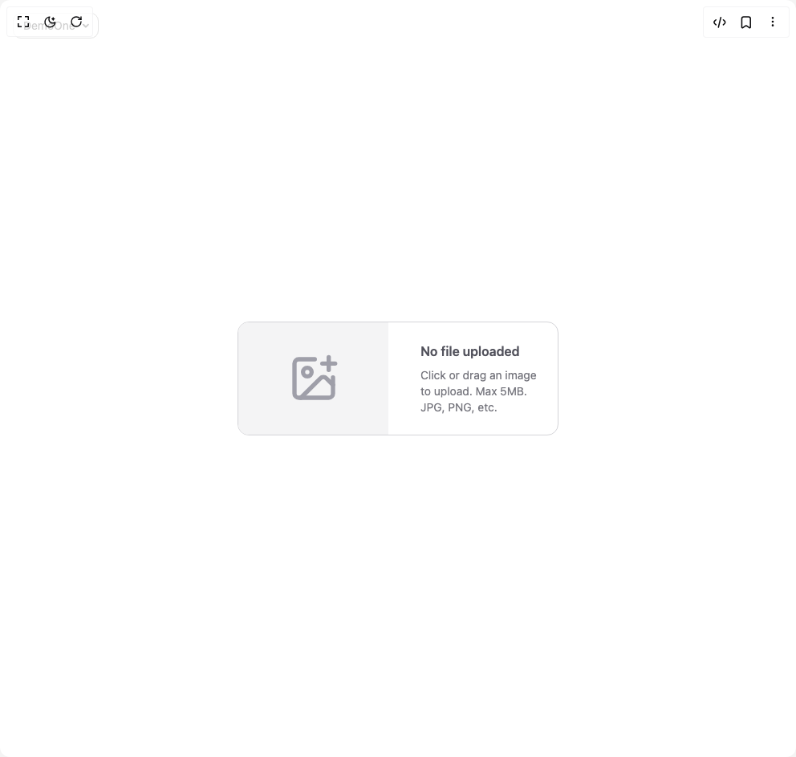

# Build Ruixen Upload Input in BuilderStudio

> Build this component in our Agentic IDE: [BuilderStudio](https://builderstudio.dev).
>
> Join the BuilderStudio community on [Discord](https://discord.gg/QdWeSGCqfe) and [Reddit](https://reddit.com/r/builderstudio).



## Component

- Author group: `ruixenui`
- Component: `ruixen-upload-input`
- Variant: `default`
- Rendered HTML snapshot: [`rendered.html`](rendered.html)

## BuilderStudio prompt

You are implementing a React component based on a component reference.

## Component identity

- Author: ruixenui
- Component slug: ruixen-upload-input
- Demo slug: default
- Title: ruixen-upload-input
- Description: 

## Goal

Recreate this component in a React + TypeScript + Tailwind CSS project. Preserve the visual layout, spacing, colors, border radius, shadows, interaction behavior, animation behavior, responsive behavior, and dark mode behavior shown in the rendered demo.

## Implementation requirements

- Use React and TypeScript.
- Use Tailwind CSS classes whenever possible.
- Keep the component self-contained unless the source files require helper components.
- If the source uses CSS variables, custom CSS, animations, or keyframes, include them.
- If the source uses external packages, list and use the required packages.
- Preserve accessibility attributes, button semantics, links, keyboard behavior, and ARIA attributes when visible in the source.
- Do not replace the component with a simplified placeholder.
- Return complete production-ready code.

## Dependencies

No reference metadata available.

## Rendered DOM snapshot

This is the rendered demo HTML extracted from the live preview. Use it to verify structure, class names, visible content, and layout.

```html
<div id="root"><div class="fixed top-4 left-4 z-10"><select class="appearance-none h-8 max-w-[200px] text-sm leading-tight rounded-lg pl-3 pr-7 py-0 border bg-background focus:outline-none focus:ring-0"><option value="named_DemoOne_DemoOne">DemoOne</option></select><div class="absolute top-1/2 transform -translate-y-1/2 right-2 pointer-events-none"><svg class="w-4 h-4 fill-current" viewBox="0 0 20 20"><path d="M5.516 7.548c.436-.446 1.043-.48 1.576 0L10 10.405l2.908-2.857c.533-.48 1.14-.446 1.576 0 .436.445.408 1.197 0 1.615l-3.734 3.705c-.533.534-1.39.534-1.923 0l-3.734-3.705c-.408-.418-.436-1.17 0-1.615z"></path></svg></div></div><div class="w-screen min-h-screen flex justify-center items-center"><div class="w-full max-w-md mx-auto px-6"><div class="group relative grid grid-cols-1 sm:grid-cols-2 gap-6 border rounded-xl overflow-hidden transition duration-300 border-zinc-300 dark:border-zinc-700 bg-white dark:bg-zinc-900" role="button" tabindex="0"><input accept="image/*" class="hidden" type="file"><div class="relative flex items-center justify-center bg-zinc-100 dark:bg-zinc-800"><div class="text-zinc-400 dark:text-zinc-500"><svg xmlns="http://www.w3.org/2000/svg" width="24" height="24" viewBox="0 0 24 24" fill="none" stroke="currentColor" stroke-width="2" stroke-linecap="round" stroke-linejoin="round" class="lucide lucide-image-plus w-16 h-16" aria-hidden="true"><path d="M16 5h6"></path><path d="M19 2v6"></path><path d="M21 11.5V19a2 2 0 0 1-2 2H5a2 2 0 0 1-2-2V5a2 2 0 0 1 2-2h7.5"></path><path d="m21 15-3.086-3.086a2 2 0 0 0-2.828 0L6 21"></path><circle cx="9" cy="9" r="2"></circle></svg></div></div><div class="flex flex-col justify-between py-6 px-4 relative"><div class="text-zinc-600 dark:text-zinc-300 text-center sm:text-left"><p class="text-md font-semibold mb-2">No file uploaded</p><p class="text-sm opacity-80">Click or drag an image to upload. Max 5MB. JPG, PNG, etc.</p></div></div></div></div></div></div>
```

## Reference source files

No reference source files were available.
