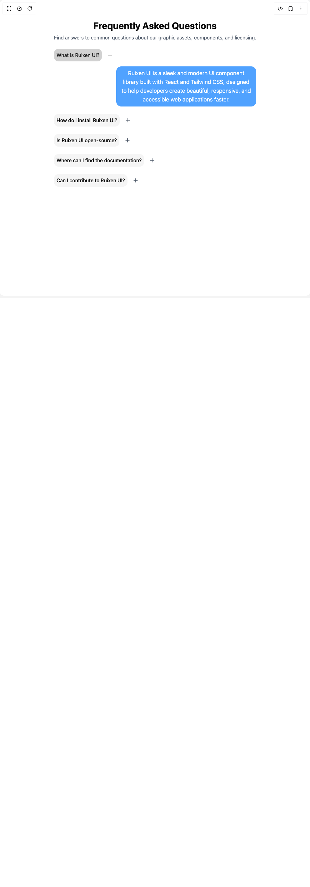

# Build Scroll Faqaccordion in BuilderStudio

> Build this component in our Agentic IDE: [BuilderStudio](https://builderstudio.dev).
>
> Join the BuilderStudio community on [Discord](https://discord.gg/QdWeSGCqfe) and [Reddit](https://reddit.com/r/builderstudio).



## Component

- Author group: `ruixenui`
- Component: `scroll-faqaccordion`
- Variant: `default`
- Rendered HTML snapshot: [`rendered.html`](rendered.html)

## BuilderStudio prompt

You are implementing a React component based on a component reference.

## Component identity

- Author: ruixenui
- Component slug: scroll-faqaccordion
- Demo slug: default
- Title: scroll-faqaccordion
- Description: 

## Goal

Recreate this component in a React + TypeScript + Tailwind CSS project. Preserve the visual layout, spacing, colors, border radius, shadows, interaction behavior, animation behavior, responsive behavior, and dark mode behavior shown in the rendered demo.

## Implementation requirements

- Use React and TypeScript.
- Use Tailwind CSS classes whenever possible.
- Keep the component self-contained unless the source files require helper components.
- If the source uses CSS variables, custom CSS, animations, or keyframes, include them.
- If the source uses external packages, list and use the required packages.
- Preserve accessibility attributes, button semantics, links, keyboard behavior, and ARIA attributes when visible in the source.
- Do not replace the component with a simplified placeholder.
- Return complete production-ready code.

## Dependencies

No reference metadata available.

## Rendered DOM snapshot

This is the rendered demo HTML extracted from the live preview. Use it to verify structure, class names, visible content, and layout.

```html
<div id="root"><div class="w-screen min-h-screen flex justify-center items-center"><div class="w-screen min-h-screen flex justify-center items-center"><div class="pin-spacer" style="order: 0; place-self: auto; grid-area: auto; z-index: auto; float: none; flex-shrink: 1; display: block; margin: 0px 172.672px; inset: auto; position: relative; flex-basis: auto; overflow: visible; box-sizing: border-box; width: 647px; height: 2832px; padding: 0px;"><div class="max-w-4xl mx-auto text-center py-16 h-[300vh]" style="translate: none; rotate: none; scale: none; left: 172.672px; top: 0.001px; margin: 0px; max-width: 647px; width: 647px; max-height: 2832px; height: 2832px; padding: 64px 0px; box-sizing: border-box; position: fixed; transform: translate(0px, 0px);"><h2 class="text-3xl font-bold mb-2"><a href="https://github.com/ruixenui/ruixen-free-components" target="_blank" rel="noopener noreferrer" class="hover:text-blue-400 transition-colors">Frequently Asked Questions</a></h2><p class="text-gray-600 dark:text-gray-200 mb-6">Find answers to common questions about our graphic assets, components, and licensing.</p><div data-orientation="vertical"><div data-state="open" data-orientation="vertical" class="mb-6"><h3 data-orientation="vertical" data-state="open"><button type="button" aria-controls="radix-«r1»" aria-expanded="true" data-state="open" data-orientation="vertical" id="radix-«r0»" class="flex w-full items-center justify-start gap-x-4 cursor-default" data-radix-collection-item=""><div class="relative flex items-center space-x-2 rounded-xl p-2 transition-colors bg-primary/20 text-primary"><span class="font-medium">What is Ruixen UI?</span></div><span class="dark:text-gray-200 text-primary"><svg xmlns="http://www.w3.org/2000/svg" width="24" height="24" viewBox="0 0 24 24" fill="none" stroke="currentColor" stroke-width="2" stroke-linecap="round" stroke-linejoin="round" class="lucide lucide-minus h-5 w-5" aria-hidden="true"><path d="M5 12h14"></path></svg></span></button></h3><div class="overflow-hidden" data-state="open" id="radix-«r1»" role="region" aria-labelledby="radix-«r0»" data-orientation="vertical" style="--radix-accordion-content-height: var(--radix-collapsible-content-height); --radix-accordion-content-width: var(--radix-collapsible-content-width); opacity: 1; height: auto; --radix-collapsible-content-width: 647px; --radix-collapsible-content-height: 144px;"><div class="flex justify-end ml-7 mt-4 md:ml-16"><div class="relative max-w-md rounded-2xl px-4 py-2 text-white dark:text-black text-lg !bg-blue-400 dark:!bg-blue-600">Ruixen UI is a sleek and modern UI component library built with React and Tailwind CSS, designed to help developers create beautiful, responsive, and accessible web applications faster.</div></div></div></div><div data-state="closed" data-orientation="vertical" class="mb-6"><h3 data-orientation="vertical" data-state="closed"><button type="button" aria-controls="radix-«r3»" aria-expanded="false" data-state="closed" data-orientation="vertical" id="radix-«r2»" class="flex w-full items-center justify-start gap-x-4 cursor-default" data-radix-collection-item=""><div class="relative flex items-center space-x-2 rounded-xl p-2 transition-colors bg-muted"><span class="font-medium">How do I install Ruixen UI?</span></div><span class="text-gray-600 dark:text-gray-200"><svg xmlns="http://www.w3.org/2000/svg" width="24" height="24" viewBox="0 0 24 24" fill="none" stroke="currentColor" stroke-width="2" stroke-linecap="round" stroke-linejoin="round" class="lucide lucide-plus h-5 w-5" aria-hidden="true"><path d="M5 12h14"></path><path d="M12 5v14"></path></svg></span></button></h3><div class="overflow-hidden" data-state="closed" id="radix-«r3»" role="region" aria-labelledby="radix-«r2»" data-orientation="vertical" style="--radix-accordion-content-height: var(--radix-collapsible-content-height); --radix-accordion-content-width: var(--radix-collapsible-content-width); opacity: 0; height: 0px; --radix-collapsible-content-width: 647px; --radix-collapsible-content-height: 3.875px;"><div class="flex justify-end ml-7 mt-4 md:ml-16"><div class="relative max-w-md rounded-2xl px-4 py-2 text-white dark:text-black text-lg !bg-blue-400 dark:!bg-blue-600">You can install Ruixen UI via your terminal using npm or yarn: `npm install ruixenui` or `yarn add ruixenui`.</div></div></div></div><div data-state="closed" data-orientation="vertical" class="mb-6"><h3 data-orientation="vertical" data-state="closed"><button type="button" aria-controls="radix-«r5»" aria-expanded="false" data-state="closed" data-orientation="vertical" id="radix-«r4»" class="flex w-full items-center justify-start gap-x-4 cursor-default" data-radix-collection-item=""><div class="relative flex items-center space-x-2 rounded-xl p-2 transition-colors bg-muted"><span class="font-medium">Is Ruixen UI open-source?</span></div><span class="text-gray-600 dark:text-gray-200"><svg xmlns="http://www.w3.org/2000/svg" width="24" height="24" viewBox="0 0 24 24" fill="none" stroke="currentColor" stroke-width="2" stroke-linecap="round" stroke-linejoin="round" class="lucide lucide-plus h-5 w-5" aria-hidden="true"><path d="M5 12h14"></path><path d="M12 5v14"></path></svg></span></button></h3><div class="overflow-hidden" data-state="closed" id="radix-«r5»" role="region" aria-labelledby="radix-«r4»" data-orientation="vertical" style="--radix-accordion-content-height: var(--radix-collapsible-content-height); --radix-accordion-content-width: var(--radix-collapsible-content-width); opacity: 0; height: 0px; --radix-collapsible-content-width: 647px;"><div class="flex justify-end ml-7 mt-4 md:ml-16"><div class="relative max-w-md rounded-2xl px-4 py-2 text-white dark:text-black text-lg !bg-blue-400 dark:!bg-blue-600">Yes, Ruixen UI is completely open-source and available under the MIT license. You’re free to use it in both personal and commercial projects.</div></div></div></div><div data-state="closed" data-orientation="vertical" class="mb-6"><h3 data-orientation="vertical" data-state="closed"><button type="button" aria-controls="radix-«r7»" aria-expanded="false" data-state="closed" data-orientation="vertical" id="radix-«r6»" class="flex w-full items-center justify-start gap-x-4 cursor-default" data-radix-collection-item=""><div class="relative flex items-center space-x-2 rounded-xl p-2 transition-colors bg-muted"><span class="font-medium">Where can I find the documentation?</span></div><span class="text-gray-600 dark:text-gray-200"><svg xmlns="http://www.w3.org/2000/svg" width="24" height="24" viewBox="0 0 24 24" fill="none" stroke="currentColor" stroke-width="2" stroke-linecap="round" stroke-linejoin="round" class="lucide lucide-plus h-5 w-5" aria-hidden="true"><path d="M5 12h14"></path><path d="M12 5v14"></path></svg></span></button></h3><div class="overflow-hidden" data-state="closed" id="radix-«r7»" role="region" aria-labelledby="radix-«r6»" data-orientation="vertical" style="--radix-accordion-content-height: var(--radix-collapsible-content-height); --radix-accordion-content-width: var(--radix-collapsible-content-width); opacity: 0; height: 0px; transition-duration: 0s; animation-name: none; --radix-collapsible-content-width: 646.65625px;"><div class="flex justify-end ml-7 mt-4 md:ml-16"><div class="relative max-w-md rounded-2xl px-4 py-2 text-white dark:text-black text-lg !bg-blue-400 dark:!bg-blue-600">You can find full documentation, usage examples, and component APIs at our official site: docs.ruixenui.com.</div></div></div></div><div data-state="closed" data-orientation="vertical" class="mb-6"><h3 data-orientation="vertical" data-state="closed"><button type="button" aria-controls="radix-«r9»" aria-expanded="false" data-state="closed" data-orientation="vertical" id="radix-«r8»" class="flex w-full items-center justify-start gap-x-4 cursor-default" data-radix-collection-item=""><div class="relative flex items-center space-x-2 rounded-xl p-2 transition-colors bg-muted"><span class="font-medium">Can I contribute to Ruixen UI?</span></div><span class="text-gray-600 dark:text-gray-200"><svg xmlns="http://www.w3.org/2000/svg" width="24" height="24" viewBox="0 0 24 24" fill="none" stroke="currentColor" stroke-width="2" stroke-linecap="round" stroke-linejoin="round" class="lucide lucide-plus h-5 w-5" aria-hidden="true"><path d="M5 12h14"></path><path d="M12 5v14"></path></svg></span></button></h3><div class="overflow-hidden" data-state="closed" id="radix-«r9»" role="region" aria-labelledby="radix-«r8»" data-orientation="vertical" style="--radix-accordion-content-height: var(--radix-collapsible-content-height); --radix-accordion-content-width: var(--radix-collapsible-content-width); opacity: 0; height: 0px; transition-duration: 0s; animation-name: none; --radix-collapsible-content-width: 646.65625px;"><div class="flex justify-end ml-7 mt-4 md:ml-16"><div class="relative max-w-md rounded-2xl px-4 py-2 text-white dark:text-black text-lg !bg-blue-400 dark:!bg-blue-600">Definitely! Ruixen UI thrives on community support. Visit our GitHub repository to explore contribution guidelines, report issues, or submit pull requests.</div></div></div></div></div></div></div></div></div></div>
```

## Reference source files

No reference source files were available.
