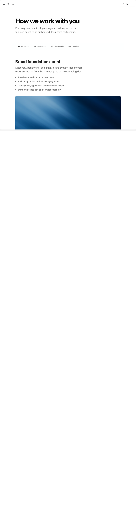

# Build Service Changelog in BuilderStudio

> Build this component in our Agentic IDE: [BuilderStudio](https://builderstudio.dev).
>
> Join the BuilderStudio community on [Discord](https://discord.gg/QdWeSGCqfe) and [Reddit](https://reddit.com/r/builderstudio).



## Component

- Author group: `ruixenui`
- Component: `service-changelog`
- Variant: `default`
- Rendered HTML snapshot: [`rendered.html`](rendered.html)

## BuilderStudio prompt

You are implementing a React component based on a component reference.

## Component identity

- Author: ruixenui
- Component slug: service-changelog
- Demo slug: default
- Title: service-changelog
- Description: 

## Goal

Recreate this component in a React + TypeScript + Tailwind CSS project. Preserve the visual layout, spacing, colors, border radius, shadows, interaction behavior, animation behavior, responsive behavior, and dark mode behavior shown in the rendered demo.

## Implementation requirements

- Use React and TypeScript.
- Use Tailwind CSS classes whenever possible.
- Keep the component self-contained unless the source files require helper components.
- If the source uses CSS variables, custom CSS, animations, or keyframes, include them.
- If the source uses external packages, list and use the required packages.
- Preserve accessibility attributes, button semantics, links, keyboard behavior, and ARIA attributes when visible in the source.
- Do not replace the component with a simplified placeholder.
- Return complete production-ready code.

## Dependencies

No reference metadata available.

## Rendered DOM snapshot

This is the rendered demo HTML extracted from the live preview. Use it to verify structure, class names, visible content, and layout.

```html
<div id="root"><div class="w-screen min-h-screen flex justify-center items-center"><div class="w-screen min-h-screen flex justify-center items-center"><section class="py-16 md:py-32" style="--ledger-strip-h: 53px;"><div class="mx-auto w-full max-w-5xl px-4 sm:px-6"><div class="mx-auto max-w-3xl"><h2 class="mb-3 text-balance text-2xl font-bold tracking-tight text-foreground sm:text-3xl md:mb-4 md:text-5xl">How we work with you</h2><p class="mb-6 text-balance text-sm text-muted-foreground sm:text-base md:text-lg">Four ways our studio plugs into your roadmap — from a focused sprint to an embedded, long-term partnership.</p></div></div><nav aria-label="Service navigation" class="sticky z-20 mt-8 border-b border-border bg-background/90 backdrop-blur-sm md:mt-16" style="top: var(--ledger-sticky-top, 0px);"><div class="mx-auto w-full max-w-5xl px-4 sm:px-6"><div class="mx-auto max-w-3xl"><div class="flex items-center gap-0 overflow-x-auto [mask-image:linear-gradient(to_right,transparent,black_2%,black_98%,transparent)] [scrollbar-width:none] [&amp;::-webkit-scrollbar]:hidden"><a href="#service-ledger-0" aria-current="true" class="-mb-px inline-flex shrink-0 items-center gap-1.5 whitespace-nowrap border-b-2 px-3 py-3.5 text-sm transition-colors focus-visible:outline-none focus-visible:ring-2 focus-visible:ring-ring focus-visible:ring-offset-2 sm:gap-2 sm:px-4 sm:py-4 border-foreground text-foreground"><span class="font-semibold">01</span><span class="hidden text-xs text-muted-foreground sm:inline">4–6 weeks</span></a><a href="#service-ledger-1" class="-mb-px inline-flex shrink-0 items-center gap-1.5 whitespace-nowrap border-b-2 px-3 py-3.5 text-sm transition-colors focus-visible:outline-none focus-visible:ring-2 focus-visible:ring-ring focus-visible:ring-offset-2 sm:gap-2 sm:px-4 sm:py-4 border-transparent text-muted-foreground hover:text-foreground"><span class="font-semibold">02</span><span class="hidden text-xs text-muted-foreground sm:inline">8–12 weeks</span></a><a href="#service-ledger-2" class="-mb-px inline-flex shrink-0 items-center gap-1.5 whitespace-nowrap border-b-2 px-3 py-3.5 text-sm transition-colors focus-visible:outline-none focus-visible:ring-2 focus-visible:ring-ring focus-visible:ring-offset-2 sm:gap-2 sm:px-4 sm:py-4 border-transparent text-muted-foreground hover:text-foreground"><span class="font-semibold">03</span><span class="hidden text-xs text-muted-foreground sm:inline">12–16 weeks</span></a><a href="#service-ledger-3" class="-mb-px inline-flex shrink-0 items-center gap-1.5 whitespace-nowrap border-b-2 px-3 py-3.5 text-sm transition-colors focus-visible:outline-none focus-visible:ring-2 focus-visible:ring-ring focus-visible:ring-offset-2 sm:gap-2 sm:px-4 sm:py-4 border-transparent text-muted-foreground hover:text-foreground"><span class="font-semibold">04</span><span class="hidden text-xs text-muted-foreground sm:inline">Ongoing</span></a></div></div></div></nav><div class="mx-auto w-full max-w-5xl px-4 sm:px-6"><div class="mx-auto mt-10 flex max-w-3xl flex-col space-y-14 md:mt-16 md:space-y-24"><div id="service-ledger-0" class="flex flex-col" style="scroll-margin-top: calc(var(--ledger-sticky-top, 0px) + var(--ledger-strip-h, 4rem) + 20px);"><h3 class="mb-3 text-balance text-xl font-bold leading-tight text-foreground/90 sm:text-2xl md:text-3xl">Brand foundation sprint</h3><p class="text-balance text-sm text-muted-foreground sm:text-base md:text-lg">Discovery, positioning, and a tight brand system that anchors every surface — from the homepage to the next funding deck.</p><ul class="ml-4 mt-4 space-y-1.5 text-sm text-muted-foreground sm:text-base"><li class="list-disc">Stakeholder and audience interviews</li><li class="list-disc">Positioning, voice, and a messaging matrix</li><li class="list-disc">Logo system, type stack, and core color tokens</li><li class="list-disc">Brand guidelines doc and component library</li></ul><a href="#" class="mt-5 inline-flex items-center gap-1.5 self-start text-sm font-semibold text-foreground underline-offset-4 hover:underline sm:text-base md:mt-6">See the playbook<svg xmlns="http://www.w3.org/2000/svg" width="24" height="24" viewBox="0 0 24 24" fill="none" stroke="currentColor" stroke-width="2" stroke-linecap="round" stroke-linejoin="round" class="lucide lucide-arrow-up-right size-4 md:size-5" aria-hidden="true"><path d="M7 7h10v10"></path><path d="M7 17 17 7"></path></svg></a></div><div id="service-ledger-1" class="flex flex-col" style="scroll-margin-top: calc(var(--ledger-sticky-top, 0px) + var(--ledger-strip-h, 4rem) + 20px);"><h3 class="mb-3 text-balance text-xl font-bold leading-tight text-foreground/90 sm:text-2xl md:text-3xl">Design system engineering</h3><p class="text-balance text-sm text-muted-foreground sm:text-base md:text-lg">A token-driven, accessibility-audited component library your engineers can actually ship with — light and dark out of the box.</p><ul class="ml-4 mt-4 space-y-1.5 text-sm text-muted-foreground sm:text-base"><li class="list-disc">Foundations: tokens, spacing scale, type ramp</li><li class="list-disc">Primitive and composite component coverage</li><li class="list-disc">Theming hooks for light, dark, and brand variants</li><li class="list-disc">Searchable docs your whole team can use</li></ul></div><div id="service-ledger-2" class="flex flex-col" style="scroll-margin-top: calc(var(--ledger-sticky-top, 0px) + var(--ledger-strip-h, 4rem) + 20px);"><h3 class="mb-3 text-balance text-xl font-bold leading-tight text-foreground/90 sm:text-2xl md:text-3xl">Product build-out</h3><p class="text-balance text-sm text-muted-foreground sm:text-base md:text-lg">Full-stack delivery for the first slice of your product — designed, built, instrumented, and live in a quarter.</p><ul class="ml-4 mt-4 space-y-1.5 text-sm text-muted-foreground sm:text-base"><li class="list-disc">App Router foundation with edge-ready deploys</li><li class="list-disc">Auth, billing, and data layer wiring</li><li class="list-disc">Analytics, error tracking, and feature flags</li><li class="list-disc">A two-week launch checklist and handoff</li></ul><a href="#" class="mt-5 inline-flex items-center gap-1.5 self-start text-sm font-semibold text-foreground underline-offset-4 hover:underline sm:text-base md:mt-6">Read a case study<svg xmlns="http://www.w3.org/2000/svg" width="24" height="24" viewBox="0 0 24 24" fill="none" stroke="currentColor" stroke-width="2" stroke-linecap="round" stroke-linejoin="round" class="lucide lucide-arrow-up-right size-4 md:size-5" aria-hidden="true"><path d="M7 7h10v10"></path><path d="M7 17 17 7"></path></svg></a></div><div id="service-ledger-3" class="flex flex-col" style="scroll-margin-top: calc(var(--ledger-sticky-top, 0px) + var(--ledger-strip-h, 4rem) + 20px);"><h3 class="mb-3 text-balance text-xl font-bold leading-tight text-foreground/90 sm:text-2xl md:text-3xl">Growth and optimization</h3><p class="text-balance text-sm text-muted-foreground sm:text-base md:text-lg">Embedded design and engineering capacity for the months after launch — landing pages, experiments, and lifecycle UI.</p><ul class="ml-4 mt-4 space-y-1.5 text-sm text-muted-foreground sm:text-base"><li class="list-disc">Quarterly refreshes and net-new pages</li><li class="list-disc">Experiment briefs and A/B test scaffolding</li><li class="list-disc">Onboarding, pricing, and upgrade flows</li><li class="list-disc">Weekly working sessions with your team</li></ul></div></div></div></section></div></div></div>
```

## Reference source files

No reference source files were available.
