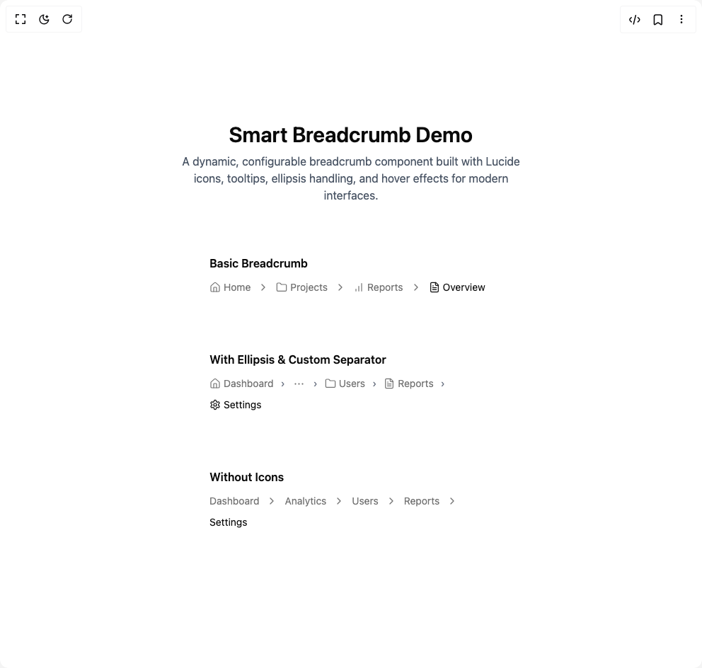

# Build Smart Breadcrumb in BuilderStudio

> Build this component in our Agentic IDE: [BuilderStudio](https://builderstudio.dev).
>
> Join the BuilderStudio community on [Discord](https://discord.gg/QdWeSGCqfe) and [Reddit](https://reddit.com/r/builderstudio).



## Component

- Author group: `ruixenui`
- Component: `smart-breadcrumb`
- Variant: `default`
- Rendered HTML snapshot: [`rendered.html`](rendered.html)

## BuilderStudio prompt

You are implementing a React component based on a component reference.

## Component identity

- Author: ruixenui
- Component slug: smart-breadcrumb
- Demo slug: default
- Title: smart-breadcrumb
- Description: 

## Goal

Recreate this component in a React + TypeScript + Tailwind CSS project. Preserve the visual layout, spacing, colors, border radius, shadows, interaction behavior, animation behavior, responsive behavior, and dark mode behavior shown in the rendered demo.

## Implementation requirements

- Use React and TypeScript.
- Use Tailwind CSS classes whenever possible.
- Keep the component self-contained unless the source files require helper components.
- If the source uses CSS variables, custom CSS, animations, or keyframes, include them.
- If the source uses external packages, list and use the required packages.
- Preserve accessibility attributes, button semantics, links, keyboard behavior, and ARIA attributes when visible in the source.
- Do not replace the component with a simplified placeholder.
- Return complete production-ready code.

## Dependencies

No reference metadata available.

## Rendered DOM snapshot

This is the rendered demo HTML extracted from the live preview. Use it to verify structure, class names, visible content, and layout.

```html
<div id="root"><div class="w-screen min-h-screen flex justify-center items-center"><div class="w-screen min-h-screen flex justify-center items-center"><div class="flex flex-col items-center justify-center space-y-12 p-6"><div class="text-center"><h1 class="text-3xl font-semibold mb-2">Smart Breadcrumb Demo</h1><p class="text-gray-600 max-w-lg mx-auto">A dynamic, configurable breadcrumb component built with Lucide icons, tooltips, ellipsis handling, and hover effects for modern interfaces.</p></div><div class="space-y-8"><div class="p-6 w-full max-w-md"><h2 class="font-semibold mb-3">Basic Breadcrumb</h2><nav aria-label="breadcrumb" class=""><ol class="flex flex-wrap items-center gap-1.5 break-words text-sm text-muted-foreground sm:gap-2.5"><li class="inline-flex items-center gap-1.5"><a class="flex items-center gap-1 hover:text-primary transition-colors" href="/"><svg xmlns="http://www.w3.org/2000/svg" width="24" height="24" viewBox="0 0 24 24" fill="none" stroke="currentColor" stroke-width="2" stroke-linecap="round" stroke-linejoin="round" class="lucide lucide-house size-4 stroke-[1.8]" aria-hidden="true"><path d="M15 21v-8a1 1 0 0 0-1-1h-4a1 1 0 0 0-1 1v8"></path><path d="M3 10a2 2 0 0 1 .709-1.528l7-5.999a2 2 0 0 1 2.582 0l7 5.999A2 2 0 0 1 21 10v9a2 2 0 0 1-2 2H5a2 2 0 0 1-2-2z"></path></svg><span>Home</span></a></li><li role="presentation" aria-hidden="true"><svg xmlns="http://www.w3.org/2000/svg" width="24" height="24" viewBox="0 0 24 24" fill="none" stroke="currentColor" stroke-width="2" stroke-linecap="round" stroke-linejoin="round" class="lucide lucide-chevron-right size-4 stroke-2" aria-hidden="true"><path d="m9 18 6-6-6-6"></path></svg></li><li class="inline-flex items-center gap-1.5"><a class="flex items-center gap-1 hover:text-primary transition-colors" href="/projects"><svg xmlns="http://www.w3.org/2000/svg" width="24" height="24" viewBox="0 0 24 24" fill="none" stroke="currentColor" stroke-width="2" stroke-linecap="round" stroke-linejoin="round" class="lucide lucide-folder size-4 stroke-[1.8]" aria-hidden="true"><path d="M20 20a2 2 0 0 0 2-2V8a2 2 0 0 0-2-2h-7.9a2 2 0 0 1-1.69-.9L9.6 3.9A2 2 0 0 0 7.93 3H4a2 2 0 0 0-2 2v13a2 2 0 0 0 2 2Z"></path></svg><span>Projects</span></a></li><li role="presentation" aria-hidden="true"><svg xmlns="http://www.w3.org/2000/svg" width="24" height="24" viewBox="0 0 24 24" fill="none" stroke="currentColor" stroke-width="2" stroke-linecap="round" stroke-linejoin="round" class="lucide lucide-chevron-right size-4 stroke-2" aria-hidden="true"><path d="m9 18 6-6-6-6"></path></svg></li><li class="inline-flex items-center gap-1.5"><a class="flex items-center gap-1 hover:text-primary transition-colors" href="/reports"><svg xmlns="http://www.w3.org/2000/svg" width="24" height="24" viewBox="0 0 24 24" fill="none" stroke="currentColor" stroke-width="2" stroke-linecap="round" stroke-linejoin="round" class="lucide lucide-chart-no-axes-column-increasing size-4 stroke-[1.8]" aria-hidden="true"><line x1="12" x2="12" y1="20" y2="10"></line><line x1="18" x2="18" y1="20" y2="4"></line><line x1="6" x2="6" y1="20" y2="16"></line></svg><span>Reports</span></a></li><li role="presentation" aria-hidden="true"><svg xmlns="http://www.w3.org/2000/svg" width="24" height="24" viewBox="0 0 24 24" fill="none" stroke="currentColor" stroke-width="2" stroke-linecap="round" stroke-linejoin="round" class="lucide lucide-chevron-right size-4 stroke-2" aria-hidden="true"><path d="m9 18 6-6-6-6"></path></svg></li><li class="inline-flex items-center gap-1.5"><span role="link" aria-disabled="true" aria-current="page" class="text-foreground flex items-center gap-1"><svg xmlns="http://www.w3.org/2000/svg" width="24" height="24" viewBox="0 0 24 24" fill="none" stroke="currentColor" stroke-width="2" stroke-linecap="round" stroke-linejoin="round" class="lucide lucide-file-text size-4 stroke-[1.8]" aria-hidden="true"><path d="M15 2H6a2 2 0 0 0-2 2v16a2 2 0 0 0 2 2h12a2 2 0 0 0 2-2V7Z"></path><path d="M14 2v4a2 2 0 0 0 2 2h4"></path><path d="M10 9H8"></path><path d="M16 13H8"></path><path d="M16 17H8"></path></svg><span>Overview</span></span></li></ol></nav></div><div class="p-6 w-full max-w-md"><h2 class="font-semibold mb-3">With Ellipsis &amp; Custom Separator</h2><nav aria-label="breadcrumb" class=""><ol class="flex flex-wrap items-center gap-1.5 break-words text-sm text-muted-foreground sm:gap-2.5"><li class="inline-flex items-center gap-1.5"><a class="flex items-center gap-1 hover:text-primary transition-colors" href="/"><svg xmlns="http://www.w3.org/2000/svg" width="24" height="24" viewBox="0 0 24 24" fill="none" stroke="currentColor" stroke-width="2" stroke-linecap="round" stroke-linejoin="round" class="lucide lucide-house size-4 stroke-[1.8]" aria-hidden="true"><path d="M15 21v-8a1 1 0 0 0-1-1h-4a1 1 0 0 0-1 1v8"></path><path d="M3 10a2 2 0 0 1 .709-1.528l7-5.999a2 2 0 0 1 2.582 0l7 5.999A2 2 0 0 1 21 10v9a2 2 0 0 1-2 2H5a2 2 0 0 1-2-2z"></path></svg><span>Dashboard</span></a></li><li role="presentation" aria-hidden="true"><span class="text-gray-500">›</span></li><li class="inline-flex items-center gap-1.5"><span role="presentation" aria-hidden="true" class="flex size-5 items-center justify-center"><svg width="15" height="15" viewBox="0 0 15 15" fill="none" xmlns="http://www.w3.org/2000/svg" size="16" stroke-width="2"><path d="M3.625 7.5C3.625 8.12132 3.12132 8.625 2.5 8.625C1.87868 8.625 1.375 8.12132 1.375 7.5C1.375 6.87868 1.87868 6.375 2.5 6.375C3.12132 6.375 3.625 6.87868 3.625 7.5ZM8.625 7.5C8.625 8.12132 8.12132 8.625 7.5 8.625C6.87868 8.625 6.375 8.12132 6.375 7.5C6.375 6.87868 6.87868 6.375 7.5 6.375C8.12132 6.375 8.625 6.87868 8.625 7.5ZM12.5 8.625C13.1213 8.625 13.625 8.12132 13.625 7.5C13.625 6.87868 13.1213 6.375 12.5 6.375C11.8787 6.375 11.375 6.87868 11.375 7.5C11.375 8.12132 11.8787 8.625 12.5 8.625Z" fill="currentColor" fill-rule="evenodd" clip-rule="evenodd"></path></svg></span></li><li role="presentation" aria-hidden="true"><span class="text-gray-500">›</span></li><li class="inline-flex items-center gap-1.5"><a class="flex items-center gap-1 hover:text-primary transition-colors" href="/users"><svg xmlns="http://www.w3.org/2000/svg" width="24" height="24" viewBox="0 0 24 24" fill="none" stroke="currentColor" stroke-width="2" stroke-linecap="round" stroke-linejoin="round" class="lucide lucide-folder size-4 stroke-[1.8]" aria-hidden="true"><path d="M20 20a2 2 0 0 0 2-2V8a2 2 0 0 0-2-2h-7.9a2 2 0 0 1-1.69-.9L9.6 3.9A2 2 0 0 0 7.93 3H4a2 2 0 0 0-2 2v13a2 2 0 0 0 2 2Z"></path></svg><span>Users</span></a></li><li role="presentation" aria-hidden="true"><span class="text-gray-500">›</span></li><li class="inline-flex items-center gap-1.5"><a class="flex items-center gap-1 hover:text-primary transition-colors" href="/reports"><svg xmlns="http://www.w3.org/2000/svg" width="24" height="24" viewBox="0 0 24 24" fill="none" stroke="currentColor" stroke-width="2" stroke-linecap="round" stroke-linejoin="round" class="lucide lucide-file-text size-4 stroke-[1.8]" aria-hidden="true"><path d="M15 2H6a2 2 0 0 0-2 2v16a2 2 0 0 0 2 2h12a2 2 0 0 0 2-2V7Z"></path><path d="M14 2v4a2 2 0 0 0 2 2h4"></path><path d="M10 9H8"></path><path d="M16 13H8"></path><path d="M16 17H8"></path></svg><span>Reports</span></a></li><li role="presentation" aria-hidden="true"><span class="text-gray-500">›</span></li><li class="inline-flex items-center gap-1.5"><span role="link" aria-disabled="true" aria-current="page" class="text-foreground flex items-center gap-1"><svg xmlns="http://www.w3.org/2000/svg" width="24" height="24" viewBox="0 0 24 24" fill="none" stroke="currentColor" stroke-width="2" stroke-linecap="round" stroke-linejoin="round" class="lucide lucide-settings size-4 stroke-[1.8]" aria-hidden="true"><path d="M12.22 2h-.44a2 2 0 0 0-2 2v.18a2 2 0 0 1-1 1.73l-.43.25a2 2 0 0 1-2 0l-.15-.08a2 2 0 0 0-2.73.73l-.22.38a2 2 0 0 0 .73 2.73l.15.1a2 2 0 0 1 1 1.72v.51a2 2 0 0 1-1 1.74l-.15.09a2 2 0 0 0-.73 2.73l.22.38a2 2 0 0 0 2.73.73l.15-.08a2 2 0 0 1 2 0l.43.25a2 2 0 0 1 1 1.73V20a2 2 0 0 0 2 2h.44a2 2 0 0 0 2-2v-.18a2 2 0 0 1 1-1.73l.43-.25a2 2 0 0 1 2 0l.15.08a2 2 0 0 0 2.73-.73l.22-.39a2 2 0 0 0-.73-2.73l-.15-.08a2 2 0 0 1-1-1.74v-.5a2 2 0 0 1 1-1.74l.15-.09a2 2 0 0 0 .73-2.73l-.22-.38a2 2 0 0 0-2.73-.73l-.15.08a2 2 0 0 1-2 0l-.43-.25a2 2 0 0 1-1-1.73V4a2 2 0 0 0-2-2z"></path><circle cx="12" cy="12" r="3"></circle></svg><span>Settings</span></span></li></ol></nav></div><div class="p-6 w-full max-w-md"><h2 class="font-semibold mb-3">Without Icons</h2><nav aria-label="breadcrumb" class=""><ol class="flex flex-wrap items-center gap-1.5 break-words text-sm text-muted-foreground sm:gap-2.5"><li class="inline-flex items-center gap-1.5"><a class="flex items-center gap-1 hover:text-primary transition-colors" href="/"><span>Dashboard</span></a></li><li role="presentation" aria-hidden="true"><svg xmlns="http://www.w3.org/2000/svg" width="24" height="24" viewBox="0 0 24 24" fill="none" stroke="currentColor" stroke-width="2" stroke-linecap="round" stroke-linejoin="round" class="lucide lucide-chevron-right size-4 stroke-2" aria-hidden="true"><path d="m9 18 6-6-6-6"></path></svg></li><li class="inline-flex items-center gap-1.5"><a class="flex items-center gap-1 hover:text-primary transition-colors" href="/analytics"><span>Analytics</span></a></li><li role="presentation" aria-hidden="true"><svg xmlns="http://www.w3.org/2000/svg" width="24" height="24" viewBox="0 0 24 24" fill="none" stroke="currentColor" stroke-width="2" stroke-linecap="round" stroke-linejoin="round" class="lucide lucide-chevron-right size-4 stroke-2" aria-hidden="true"><path d="m9 18 6-6-6-6"></path></svg></li><li class="inline-flex items-center gap-1.5"><a class="flex items-center gap-1 hover:text-primary transition-colors" href="/users"><span>Users</span></a></li><li role="presentation" aria-hidden="true"><svg xmlns="http://www.w3.org/2000/svg" width="24" height="24" viewBox="0 0 24 24" fill="none" stroke="currentColor" stroke-width="2" stroke-linecap="round" stroke-linejoin="round" class="lucide lucide-chevron-right size-4 stroke-2" aria-hidden="true"><path d="m9 18 6-6-6-6"></path></svg></li><li class="inline-flex items-center gap-1.5"><a class="flex items-center gap-1 hover:text-primary transition-colors" href="/reports"><span>Reports</span></a></li><li role="presentation" aria-hidden="true"><svg xmlns="http://www.w3.org/2000/svg" width="24" height="24" viewBox="0 0 24 24" fill="none" stroke="currentColor" stroke-width="2" stroke-linecap="round" stroke-linejoin="round" class="lucide lucide-chevron-right size-4 stroke-2" aria-hidden="true"><path d="m9 18 6-6-6-6"></path></svg></li><li class="inline-flex items-center gap-1.5"><span role="link" aria-disabled="true" aria-current="page" class="text-foreground flex items-center gap-1"><span>Settings</span></span></li></ol></nav></div></div></div></div></div></div>
```

## Reference source files

No reference source files were available.
