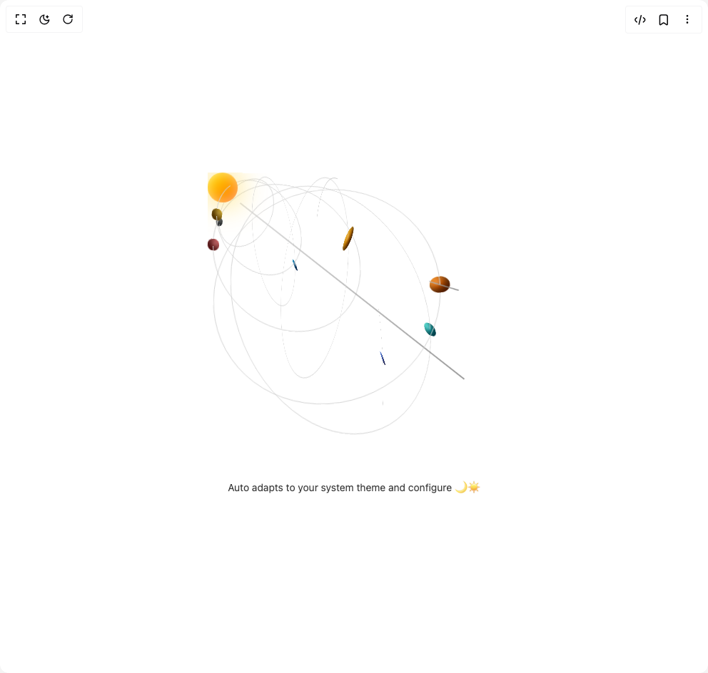

# Build Solar Loader in BuilderStudio

> Build this component in our Agentic IDE: [BuilderStudio](https://builderstudio.dev).
>
> Join the BuilderStudio community on [Discord](https://discord.gg/QdWeSGCqfe) and [Reddit](https://reddit.com/r/builderstudio).



## Component

- Author group: `ruixenui`
- Component: `solar-loader`
- Variant: `default`
- Rendered HTML snapshot: [`rendered.html`](rendered.html)

## BuilderStudio prompt

You are implementing a React component based on a component reference.

## Component identity

- Author: ruixenui
- Component slug: solar-loader
- Demo slug: default
- Title: solar-loader
- Description: 

## Goal

Recreate this component in a React + TypeScript + Tailwind CSS project. Preserve the visual layout, spacing, colors, border radius, shadows, interaction behavior, animation behavior, responsive behavior, and dark mode behavior shown in the rendered demo.

## Implementation requirements

- Use React and TypeScript.
- Use Tailwind CSS classes whenever possible.
- Keep the component self-contained unless the source files require helper components.
- If the source uses CSS variables, custom CSS, animations, or keyframes, include them.
- If the source uses external packages, list and use the required packages.
- Preserve accessibility attributes, button semantics, links, keyboard behavior, and ARIA attributes when visible in the source.
- Do not replace the component with a simplified placeholder.
- Return complete production-ready code.

## Dependencies

No reference metadata available.

## Rendered DOM snapshot

This is the rendered demo HTML extracted from the live preview. Use it to verify structure, class names, visible content, and layout.

```html
<div id="root"><div class="w-screen min-h-screen flex justify-center items-center"><div class="w-screen min-h-screen flex justify-center items-center"><div class="flex flex-col items-center justify-center p-10"><div class="relative mx-auto flex items-center justify-center undefined" style="width: 400px; height: 400px; perspective: 1200px;"><div class="relative animate-[tilt_10s_infinite_linear] [transform-style:preserve-3d]" style="width: 100%; height: 100%;"><div class="absolute left-1/2 top-40 bg-gradient-to-r from-neutral-300/70 to-neutral-500/70 dark:from-neutral-500/60 dark:to-neutral-300/60" style="width: 400px; height: 1.5px; transform: translate(-50%, -50%) rotate(38deg); box-shadow: rgba(255, 255, 255, 0.3) 0px 0px 8px; z-index: 0;"></div><div class="absolute flex items-center justify-center rounded-full shadow-lg
                     bg-gradient-to-br from-yellow-300 to-orange-500 dark:from-yellow-200 dark:to-orange-400" style="width: 40px; height: 40px; box-shadow: rgba(255, 200, 0, 0.7) 0px 0px 40px, rgba(255, 255, 255, 0.5) 0px 0px 15px inset; transform: translateZ(30px); z-index: 10;"></div><div class="absolute rounded-full border border-neutral-300 dark:border-neutral-700" style="width: 100px; height: 100px; animation: 2s linear 0s infinite normal none running orbit3d; transform-style: preserve-3d; transform: rotateX(20deg) translateZ(25px);"><div class="absolute rounded-full bg-gradient-to-br from-gray-500 to-gray-800 dark:from-gray-300 dark:to-gray-600 shadow-inner" style="width: 12px; height: 12px; top: 50%; left: 100%; transform: translate(-50%, -50%) rotateX(15deg); box-shadow: rgba(0, 0, 0, 0.6) -6px -6px 12px inset, rgba(255, 255, 255, 0.2) 4px 4px 8px inset;"><div class="absolute rounded-full bg-white/40 blur-[2px]" style="width: 3.6px; height: 3.6px; top: 25%; left: 25%; opacity: 0.6;"></div></div></div><div class="absolute rounded-full border border-neutral-300 dark:border-neutral-700" style="width: 140px; height: 140px; animation: 3s linear 0s infinite normal none running orbit3d; transform-style: preserve-3d; transform: rotateX(20deg) translateZ(-25px);"><div class="absolute rounded-full bg-gradient-to-br from-yellow-400 to-yellow-700 dark:from-yellow-200 dark:to-yellow-500 shadow-inner" style="width: 16px; height: 16px; top: 50%; left: 100%; transform: translate(-50%, -50%) rotateX(15deg); box-shadow: rgba(0, 0, 0, 0.6) -6px -6px 12px inset, rgba(255, 255, 255, 0.2) 4px 4px 8px inset;"><div class="absolute rounded-full bg-white/40 blur-[2px]" style="width: 4.8px; height: 4.8px; top: 25%; left: 25%; opacity: 0.6;"></div></div></div><div class="absolute rounded-full border border-neutral-300 dark:border-neutral-700" style="width: 180px; height: 180px; animation: 4s linear 0s infinite normal none running orbit3d; transform-style: preserve-3d; transform: rotateX(20deg) translateZ(25px);"><div class="absolute rounded-full bg-gradient-to-br from-sky-400 to-blue-900 dark:from-sky-300 dark:to-blue-700 shadow-inner" style="width: 18px; height: 18px; top: 50%; left: 100%; transform: translate(-50%, -50%) rotateX(15deg); box-shadow: rgba(0, 0, 0, 0.6) -6px -6px 12px inset, rgba(255, 255, 255, 0.2) 4px 4px 8px inset;"><div class="absolute rounded-full bg-white/40 blur-[2px]" style="width: 5.4px; height: 5.4px; top: 25%; left: 25%; opacity: 0.6;"></div></div></div><div class="absolute rounded-full border border-neutral-300 dark:border-neutral-700" style="width: 220px; height: 220px; animation: 5s linear 0s infinite normal none running orbit3d; transform-style: preserve-3d; transform: rotateX(20deg) translateZ(-25px);"><div class="absolute rounded-full bg-gradient-to-br from-red-400 to-red-800 dark:from-red-300 dark:to-red-700 shadow-inner" style="width: 16px; height: 16px; top: 50%; left: 100%; transform: translate(-50%, -50%) rotateX(15deg); box-shadow: rgba(0, 0, 0, 0.6) -6px -6px 12px inset, rgba(255, 255, 255, 0.2) 4px 4px 8px inset;"><div class="absolute rounded-full bg-white/40 blur-[2px]" style="width: 4.8px; height: 4.8px; top: 25%; left: 25%; opacity: 0.6;"></div></div></div><div class="absolute rounded-full border border-neutral-300 dark:border-neutral-700" style="width: 280px; height: 280px; animation: 6s linear 0s infinite normal none running orbit3d; transform-style: preserve-3d; transform: rotateX(20deg) translateZ(25px);"><div class="absolute rounded-full bg-gradient-to-br from-amber-400 to-amber-800 dark:from-amber-300 dark:to-amber-700 shadow-inner" style="width: 32px; height: 32px; top: 50%; left: 100%; transform: translate(-50%, -50%) rotateX(15deg); box-shadow: rgba(0, 0, 0, 0.6) -6px -6px 12px inset, rgba(255, 255, 255, 0.2) 4px 4px 8px inset;"><div class="absolute rounded-full bg-white/40 blur-[2px]" style="width: 9.6px; height: 9.6px; top: 25%; left: 25%; opacity: 0.6;"></div></div></div><div class="absolute rounded-full border border-neutral-300 dark:border-neutral-700" style="width: 320px; height: 320px; animation: 7s linear 0s infinite normal none running orbit3d; transform-style: preserve-3d; transform: rotateX(20deg) translateZ(-25px);"><div class="absolute rounded-full bg-gradient-to-br from-orange-400 to-orange-800 dark:from-orange-300 dark:to-orange-700 shadow-inner" style="width: 28px; height: 28px; top: 50%; left: 100%; transform: translate(-50%, -50%) rotateX(15deg); box-shadow: rgba(0, 0, 0, 0.6) -6px -6px 12px inset, rgba(255, 255, 255, 0.2) 4px 4px 8px inset;"><div class="absolute rounded-full bg-white/40 blur-[2px]" style="width: 8.4px; height: 8.4px; top: 25%; left: 25%; opacity: 0.6;"></div><div class="absolute bg-gradient-to-r from-neutral-300 to-neutral-500 dark:from-neutral-400 dark:to-neutral-200 opacity-80" style="width: 56px; height: 1.5px; top: 50%; left: 50%; transform: translate(-50%, -50%) rotate(25deg);"></div></div></div><div class="absolute rounded-full border border-neutral-300 dark:border-neutral-700" style="width: 360px; height: 360px; animation: 8s linear 0s infinite normal none running orbit3d; transform-style: preserve-3d; transform: rotateX(20deg) translateZ(25px);"><div class="absolute rounded-full bg-gradient-to-br from-teal-300 to-cyan-700 dark:from-teal-200 dark:to-cyan-600 shadow-inner" style="width: 24px; height: 24px; top: 50%; left: 100%; transform: translate(-50%, -50%) rotateX(15deg); box-shadow: rgba(0, 0, 0, 0.6) -6px -6px 12px inset, rgba(255, 255, 255, 0.2) 4px 4px 8px inset;"><div class="absolute rounded-full bg-white/40 blur-[2px]" style="width: 7.2px; height: 7.2px; top: 25%; left: 25%; opacity: 0.6;"></div></div></div><div class="absolute rounded-full border border-neutral-300 dark:border-neutral-700" style="width: 400px; height: 400px; animation: 9s linear 0s infinite normal none running orbit3d; transform-style: preserve-3d; transform: rotateX(20deg) translateZ(-25px);"><div class="absolute rounded-full bg-gradient-to-br from-blue-500 to-indigo-900 dark:from-blue-400 dark:to-indigo-700 shadow-inner" style="width: 24px; height: 24px; top: 50%; left: 100%; transform: translate(-50%, -50%) rotateX(15deg); box-shadow: rgba(0, 0, 0, 0.6) -6px -6px 12px inset, rgba(255, 255, 255, 0.2) 4px 4px 8px inset;"><div class="absolute rounded-full bg-white/40 blur-[2px]" style="width: 7.2px; height: 7.2px; top: 25%; left: 25%; opacity: 0.6;"></div></div></div></div></div><p class="mt-6 text-center text-sm opacity-80">Auto adapts to your system theme and configure 🌙☀️</p></div></div></div></div>
```

## Reference source files

No reference source files were available.
