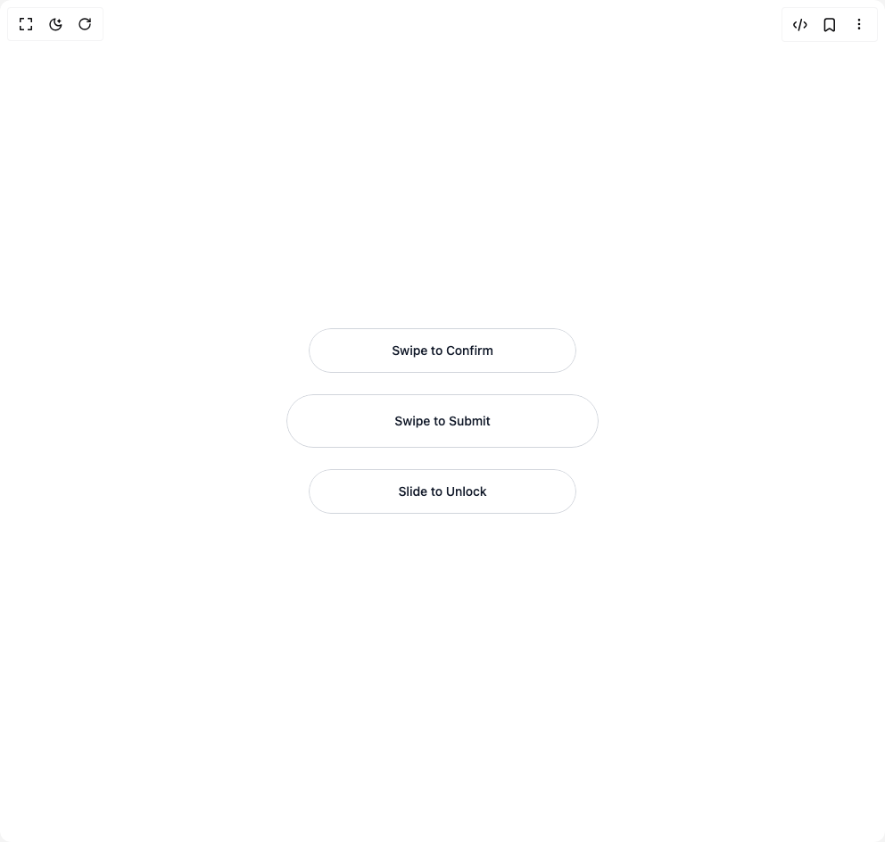

# Build Swipe To Confirm Button in BuilderStudio

> Build this component in our Agentic IDE: [BuilderStudio](https://builderstudio.dev).
>
> Join the BuilderStudio community on [Discord](https://discord.gg/QdWeSGCqfe) and [Reddit](https://reddit.com/r/builderstudio).



## Component

- Author group: `ruixenui`
- Component: `swipe-to-confirm-button`
- Variant: `default`
- Rendered HTML snapshot: [`rendered.html`](rendered.html)

## BuilderStudio prompt

You are implementing a React component based on a component reference.

## Component identity

- Author: ruixenui
- Component slug: swipe-to-confirm-button
- Demo slug: default
- Title: swipe-to-confirm-button
- Description: 

## Goal

Recreate this component in a React + TypeScript + Tailwind CSS project. Preserve the visual layout, spacing, colors, border radius, shadows, interaction behavior, animation behavior, responsive behavior, and dark mode behavior shown in the rendered demo.

## Implementation requirements

- Use React and TypeScript.
- Use Tailwind CSS classes whenever possible.
- Keep the component self-contained unless the source files require helper components.
- If the source uses CSS variables, custom CSS, animations, or keyframes, include them.
- If the source uses external packages, list and use the required packages.
- Preserve accessibility attributes, button semantics, links, keyboard behavior, and ARIA attributes when visible in the source.
- Do not replace the component with a simplified placeholder.
- Return complete production-ready code.

## Dependencies

No reference metadata available.

## Rendered DOM snapshot

This is the rendered demo HTML extracted from the live preview. Use it to verify structure, class names, visible content, and layout.

```html
<div id="root"><div class="w-screen min-h-screen flex justify-center items-center"><div class="w-screen min-h-screen flex justify-center items-center"><div class="p-6 flex flex-col gap-6 items-center"><div class="relative rounded-full overflow-hidden undefined" style="width: 300px; height: 50px;"><div class="absolute top-0 left-0 h-full rounded-full z-0 bg-green-400 dark:bg-green-600" style="width: 0px;"></div><div class="inline-flex items-center justify-center whitespace-nowrap text-sm font-medium outline-offset-2 focus-visible:outline-2 focus-visible:outline-ring/70 disabled:pointer-events-none disabled:opacity-50 [&amp;_svg]:pointer-events-none [&amp;_svg]:shrink-0 shadow-sm shadow-black/5 absolute top-0 left-0 z-10 p-0 rounded-full w-full h-full bg-white text-gray-900 dark:bg-gray-900 dark:text-white border border-gray-300 dark:border-gray-700 hover:bg-gray-100 dark:hover:bg-gray-800 transition-colors duration-200 flex items-center justify-center h-full w-full cursor-pointer select-none" draggable="false" style="transform: none; user-select: none; touch-action: pan-y;"><span class="px-4 text-sm font-medium">Swipe to Confirm</span></div></div><div class="relative rounded-full overflow-hidden undefined" style="width: 350px; height: 60px;"><div class="absolute top-0 left-0 h-full rounded-full z-0 bg-green-400 dark:bg-green-600" style="width: 0px;"></div><div class="inline-flex items-center justify-center whitespace-nowrap text-sm font-medium outline-offset-2 focus-visible:outline-2 focus-visible:outline-ring/70 disabled:pointer-events-none disabled:opacity-50 [&amp;_svg]:pointer-events-none [&amp;_svg]:shrink-0 shadow-sm shadow-black/5 absolute top-0 left-0 z-10 p-0 rounded-full w-full h-full bg-white text-gray-900 dark:bg-gray-900 dark:text-white border border-gray-300 dark:border-gray-700 hover:bg-gray-100 dark:hover:bg-gray-800 transition-colors duration-200 flex items-center justify-center h-full w-full cursor-pointer select-none" draggable="false" style="transform: none; user-select: none; touch-action: pan-y;"><span class="px-4 text-sm font-medium">Swipe to Submit</span></div></div><div class="relative rounded-full overflow-hidden undefined" style="width: 300px; height: 50px;"><div class="absolute top-0 left-0 h-full rounded-full z-0 bg-green-400 dark:bg-green-600" style="width: 0px;"></div><div class="inline-flex items-center justify-center whitespace-nowrap text-sm font-medium outline-offset-2 focus-visible:outline-2 focus-visible:outline-ring/70 disabled:pointer-events-none disabled:opacity-50 [&amp;_svg]:pointer-events-none [&amp;_svg]:shrink-0 shadow-sm shadow-black/5 absolute top-0 left-0 z-10 p-0 rounded-full w-full h-full bg-white text-gray-900 dark:bg-gray-900 dark:text-white border border-gray-300 dark:border-gray-700 hover:bg-gray-100 dark:hover:bg-gray-800 transition-colors duration-200 flex items-center justify-center h-full w-full cursor-pointer select-none" draggable="false" style="transform: none; user-select: none; touch-action: pan-y;"><span class="px-4 text-sm font-medium">Slide to Unlock</span></div></div></div></div></div></div>
```

## Reference source files

No reference source files were available.
