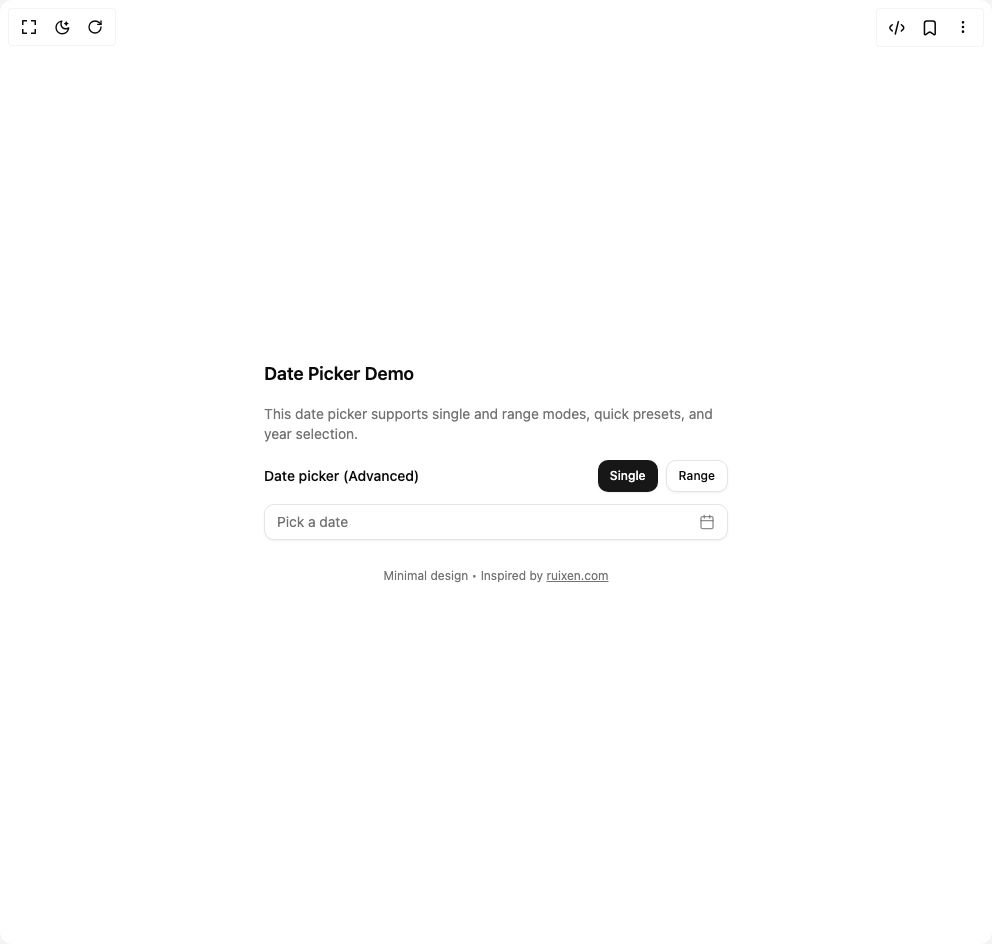

# Build Universal Date Picker in BuilderStudio

> Build this component in our Agentic IDE: [BuilderStudio](https://builderstudio.dev).
>
> Join the BuilderStudio community on [Discord](https://discord.gg/QdWeSGCqfe) and [Reddit](https://reddit.com/r/builderstudio).



## Component

- Author group: `ruixenui`
- Component: `universal-date-picker`
- Variant: `default`
- Rendered HTML snapshot: [`rendered.html`](rendered.html)

## BuilderStudio prompt

You are implementing a React component based on a component reference.

## Component identity

- Author: ruixenui
- Component slug: universal-date-picker
- Demo slug: default
- Title: universal-date-picker
- Description: 

## Goal

Recreate this component in a React + TypeScript + Tailwind CSS project. Preserve the visual layout, spacing, colors, border radius, shadows, interaction behavior, animation behavior, responsive behavior, and dark mode behavior shown in the rendered demo.

## Implementation requirements

- Use React and TypeScript.
- Use Tailwind CSS classes whenever possible.
- Keep the component self-contained unless the source files require helper components.
- If the source uses CSS variables, custom CSS, animations, or keyframes, include them.
- If the source uses external packages, list and use the required packages.
- Preserve accessibility attributes, button semantics, links, keyboard behavior, and ARIA attributes when visible in the source.
- Do not replace the component with a simplified placeholder.
- Return complete production-ready code.

## Dependencies

No reference metadata available.

## Rendered DOM snapshot

This is the rendered demo HTML extracted from the live preview. Use it to verify structure, class names, visible content, and layout.

```html
<div id="root"><div class="w-screen min-h-screen flex justify-center items-center"><div class="w-screen min-h-screen flex justify-center items-center"><div class="flex min-h-[80vh] items-center justify-center p-6"><div class="rounded-lg border bg-card text-card-foreground p-6 max-w-lg w-full space-y-4 shadow-none border-none"><h2 class="text-lg font-semibold">Date Picker Demo</h2><p class="text-sm text-muted-foreground">This date picker supports single and range modes, quick presets, and year selection.</p><div class="space-y-3"><div class="flex items-center justify-between"><label class="text-sm font-medium leading-4 text-foreground peer-disabled:cursor-not-allowed peer-disabled:opacity-70" for="«r0»">Date picker (Advanced)</label><div class="flex gap-2"><button class="inline-flex items-center justify-center whitespace-nowrap font-medium transition-colors outline-offset-2 focus-visible:outline-2 focus-visible:outline-ring/70 disabled:pointer-events-none disabled:opacity-50 [&amp;_svg]:pointer-events-none [&amp;_svg]:shrink-0 bg-primary text-primary-foreground shadow-sm shadow-black/5 hover:bg-primary/90 h-8 rounded-lg px-3 text-xs">Single</button><button class="inline-flex items-center justify-center whitespace-nowrap font-medium transition-colors outline-offset-2 focus-visible:outline-2 focus-visible:outline-ring/70 disabled:pointer-events-none disabled:opacity-50 [&amp;_svg]:pointer-events-none [&amp;_svg]:shrink-0 border border-input bg-background shadow-sm shadow-black/5 hover:bg-accent hover:text-accent-foreground h-8 rounded-lg px-3 text-xs">Range</button></div></div><button class="inline-flex items-center whitespace-nowrap rounded-lg text-sm transition-colors disabled:pointer-events-none disabled:opacity-50 [&amp;_svg]:pointer-events-none [&amp;_svg]:shrink-0 border border-input shadow-sm shadow-black/5 hover:text-accent-foreground h-9 py-2 group w-full justify-between bg-background px-3 font-normal outline-offset-0 hover:bg-background focus-visible:border-ring focus-visible:outline-[3px] focus-visible:outline-ring/20 text-muted-foreground" id="«r0»" type="button" aria-haspopup="dialog" aria-expanded="false" aria-controls="radix-«r1»" data-state="closed"><span class="truncate">Pick a date</span><svg xmlns="http://www.w3.org/2000/svg" width="16" height="16" viewBox="0 0 24 24" fill="none" stroke="currentColor" stroke-width="2" stroke-linecap="round" stroke-linejoin="round" class="lucide lucide-calendar shrink-0 text-muted-foreground/80 transition-colors group-hover:text-foreground" aria-hidden="true"><path d="M8 2v4"></path><path d="M16 2v4"></path><rect width="18" height="18" x="3" y="4" rx="2"></rect><path d="M3 10h18"></path></svg></button><div class="mt-4 text-xs text-center text-muted-foreground">Minimal design • Inspired by <a href="https://www.ruixen.com" target="_blank" class="underline">ruixen.com</a></div></div></div></div></div></div></div>
```

## Reference source files

No reference source files were available.
