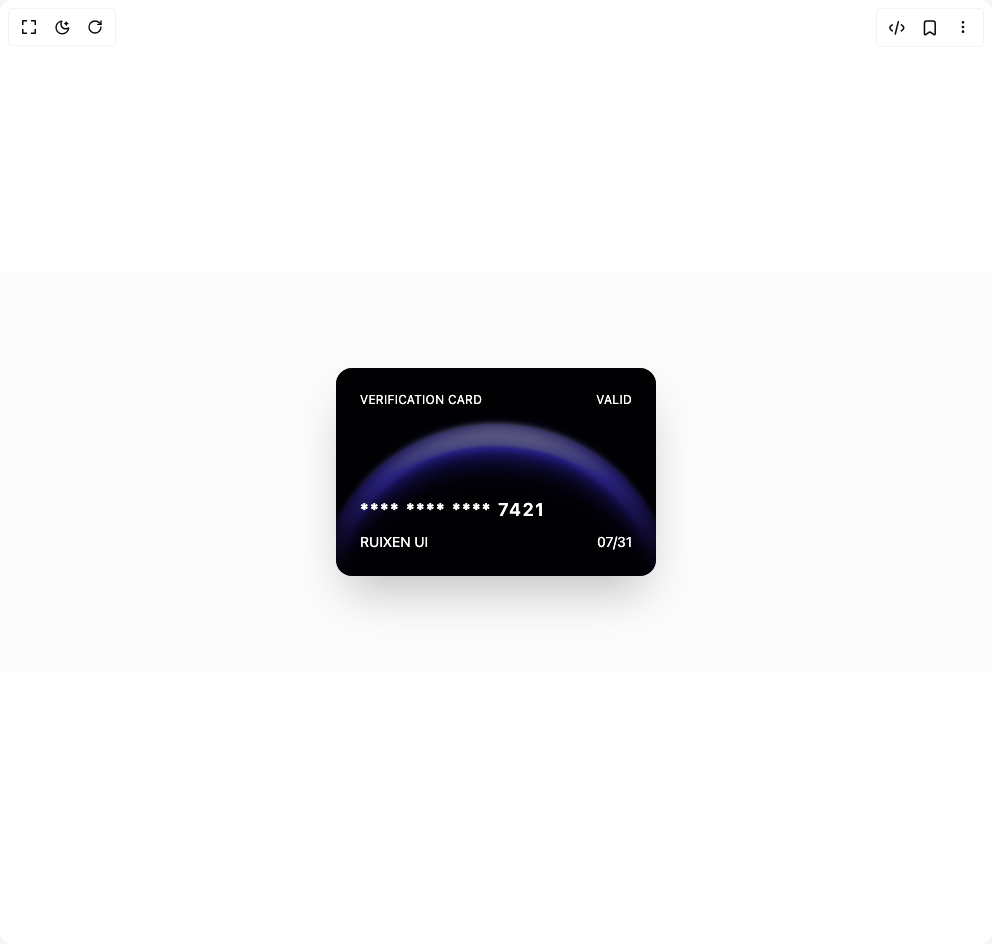

# Build Verification Card in BuilderStudio

> Build this component in our Agentic IDE: [BuilderStudio](https://builderstudio.dev).
>
> Join the BuilderStudio community on [Discord](https://discord.gg/QdWeSGCqfe) and [Reddit](https://reddit.com/r/builderstudio).



## Component

- Author group: `ruixenui`
- Component: `verification-card`
- Variant: `default`
- Rendered HTML snapshot: [`rendered.html`](rendered.html)

## BuilderStudio prompt

You are implementing a React component based on a component reference.

## Component identity

- Author: ruixenui
- Component slug: verification-card
- Demo slug: default
- Title: verification-card
- Description: 

## Goal

Recreate this component in a React + TypeScript + Tailwind CSS project. Preserve the visual layout, spacing, colors, border radius, shadows, interaction behavior, animation behavior, responsive behavior, and dark mode behavior shown in the rendered demo.

## Implementation requirements

- Use React and TypeScript.
- Use Tailwind CSS classes whenever possible.
- Keep the component self-contained unless the source files require helper components.
- If the source uses CSS variables, custom CSS, animations, or keyframes, include them.
- If the source uses external packages, list and use the required packages.
- Preserve accessibility attributes, button semantics, links, keyboard behavior, and ARIA attributes when visible in the source.
- Do not replace the component with a simplified placeholder.
- Return complete production-ready code.

## Dependencies

No reference metadata available.

## Rendered DOM snapshot

This is the rendered demo HTML extracted from the live preview. Use it to verify structure, class names, visible content, and layout.

```html
<div id="root"><div class="w-screen min-h-screen flex justify-center items-center"><div class="w-screen min-h-screen flex justify-center items-center"><div class="flex min-h-[400px] w-full items-center justify-center bg-muted/30"><a href="https://www.ruixen.com/?utm_source=BuilderStudio" target="_blank" rel="noopener noreferrer"><div class="relative h-52 w-80 rounded-2xl p-6 shadow-2xl text-white flex flex-col justify-between bg-cover bg-center" style="background-image: url(&quot;https://pub-940ccf6255b54fa799a9b01050e6c227.r2.dev/ruixen_moon.png&quot;); opacity: 1; transform: none;"><div class="absolute inset-0 bg-black/50 rounded-2xl"></div><div class="relative z-10 flex justify-between items-start text-xs tracking-wide"><span>VERIFICATION CARD</span><span>VALID</span></div><div class="relative z-10"><p class="text-lg tracking-widest font-semibold">**** **** **** 7421</p><div class="flex justify-between text-sm mt-2"><span>RUIXEN UI</span><span>07/31</span></div></div></div></a></div></div></div></div>
```

## Reference source files

No reference source files were available.
