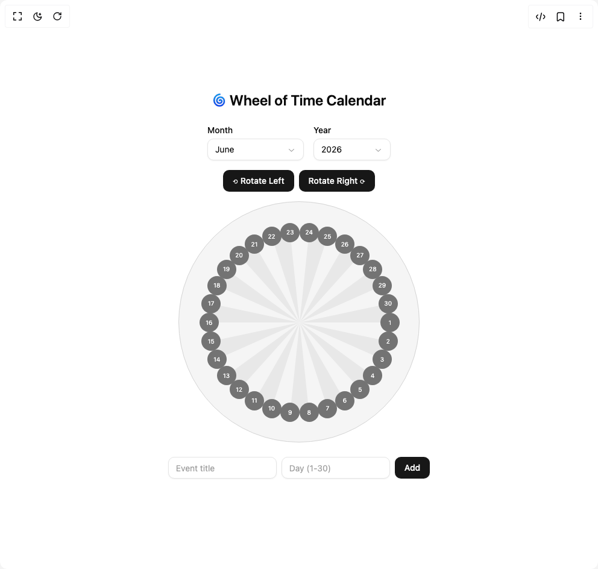

# Build Wheel Of Time Calendar in BuilderStudio

> Build this component in our Agentic IDE: [BuilderStudio](https://builderstudio.dev).
>
> Join the BuilderStudio community on [Discord](https://discord.gg/QdWeSGCqfe) and [Reddit](https://reddit.com/r/builderstudio).



## Component

- Author group: `ruixenui`
- Component: `wheel-of-time-calendar`
- Variant: `default`
- Rendered HTML snapshot: [`rendered.html`](rendered.html)

## BuilderStudio prompt

You are implementing a React component based on a component reference.

## Component identity

- Author: ruixenui
- Component slug: wheel-of-time-calendar
- Demo slug: default
- Title: wheel-of-time-calendar
- Description: 

## Goal

Recreate this component in a React + TypeScript + Tailwind CSS project. Preserve the visual layout, spacing, colors, border radius, shadows, interaction behavior, animation behavior, responsive behavior, and dark mode behavior shown in the rendered demo.

## Implementation requirements

- Use React and TypeScript.
- Use Tailwind CSS classes whenever possible.
- Keep the component self-contained unless the source files require helper components.
- If the source uses CSS variables, custom CSS, animations, or keyframes, include them.
- If the source uses external packages, list and use the required packages.
- Preserve accessibility attributes, button semantics, links, keyboard behavior, and ARIA attributes when visible in the source.
- Do not replace the component with a simplified placeholder.
- Return complete production-ready code.

## Dependencies

No reference metadata available.

## Rendered DOM snapshot

This is the rendered demo HTML extracted from the live preview. Use it to verify structure, class names, visible content, and layout.

```html
<div id="root"><div class="w-screen min-h-screen flex justify-center items-center"><div class="w-screen min-h-screen flex justify-center items-center"><div class="flex flex-col items-center p-8 space-y-6"><h1 class="text-2xl font-semibold">🌀 Wheel of Time Calendar</h1><div class="flex flex-col items-center space-y-4"><div class="flex gap-4 mb-4 flex-wrap justify-center items-center"><div class="flex flex-col"><span class="font-medium text-sm mb-1">Month</span><button type="button" role="combobox" aria-controls="radix-«r0»" aria-expanded="false" aria-autocomplete="none" dir="ltr" data-state="closed" class="flex h-9 items-center justify-between gap-2 rounded-lg border border-input bg-background px-3 py-2 text-start text-sm text-foreground shadow-sm shadow-black/5 focus:border-ring focus:outline-none focus:ring-[3px] focus:ring-ring/20 disabled:cursor-not-allowed disabled:opacity-50 data-[placeholder]:text-muted-foreground/70 [&amp;&gt;span]:min-w-0 w-40"><span style="pointer-events: none;">June</span><svg width="15" height="15" viewBox="0 0 15 15" fill="none" xmlns="http://www.w3.org/2000/svg" size="16" stroke-width="2" class="shrink-0 text-muted-foreground/80" aria-hidden="true"><path d="M3.13523 6.15803C3.3241 5.95657 3.64052 5.94637 3.84197 6.13523L7.5 9.56464L11.158 6.13523C11.3595 5.94637 11.6759 5.95657 11.8648 6.15803C12.0536 6.35949 12.0434 6.67591 11.842 6.86477L7.84197 10.6148C7.64964 10.7951 7.35036 10.7951 7.15803 10.6148L3.15803 6.86477C2.95657 6.67591 2.94637 6.35949 3.13523 6.15803Z" fill="currentColor" fill-rule="evenodd" clip-rule="evenodd"></path></svg></button></div><div class="flex flex-col"><span class="font-medium text-sm mb-1">Year</span><button type="button" role="combobox" aria-controls="radix-«r1»" aria-expanded="false" aria-autocomplete="none" dir="ltr" data-state="closed" class="flex h-9 items-center justify-between gap-2 rounded-lg border border-input bg-background px-3 py-2 text-start text-sm text-foreground shadow-sm shadow-black/5 focus:border-ring focus:outline-none focus:ring-[3px] focus:ring-ring/20 disabled:cursor-not-allowed disabled:opacity-50 data-[placeholder]:text-muted-foreground/70 [&amp;&gt;span]:min-w-0 w-32"><span style="pointer-events: none;">2026</span><svg width="15" height="15" viewBox="0 0 15 15" fill="none" xmlns="http://www.w3.org/2000/svg" size="16" stroke-width="2" class="shrink-0 text-muted-foreground/80" aria-hidden="true"><path d="M3.13523 6.15803C3.3241 5.95657 3.64052 5.94637 3.84197 6.13523L7.5 9.56464L11.158 6.13523C11.3595 5.94637 11.6759 5.95657 11.8648 6.15803C12.0536 6.35949 12.0434 6.67591 11.842 6.86477L7.84197 10.6148C7.64964 10.7951 7.35036 10.7951 7.15803 10.6148L3.15803 6.86477C2.95657 6.67591 2.94637 6.35949 3.13523 6.15803Z" fill="currentColor" fill-rule="evenodd" clip-rule="evenodd"></path></svg></button></div></div><div class="flex gap-2"><button class="inline-flex items-center justify-center whitespace-nowrap rounded-lg text-sm font-medium transition-colors outline-offset-2 focus-visible:outline-2 focus-visible:outline-ring/70 disabled:pointer-events-none disabled:opacity-50 [&amp;_svg]:pointer-events-none [&amp;_svg]:shrink-0 bg-primary text-primary-foreground shadow-sm shadow-black/5 hover:bg-primary/90 h-9 px-4 py-2">⟲ Rotate Left</button><button class="inline-flex items-center justify-center whitespace-nowrap rounded-lg text-sm font-medium transition-colors outline-offset-2 focus-visible:outline-2 focus-visible:outline-ring/70 disabled:pointer-events-none disabled:opacity-50 [&amp;_svg]:pointer-events-none [&amp;_svg]:shrink-0 bg-primary text-primary-foreground shadow-sm shadow-black/5 hover:bg-primary/90 h-9 px-4 py-2">Rotate Right ⟳</button></div><div class="relative w-[400px] h-[400px] rounded-full bg-neutral-100 dark:bg-neutral-900 border border-neutral-300 dark:border-neutral-800 overflow-hidden"><svg class="absolute inset-0 w-full h-full" style="pointer-events: none;"><path d="M200,200 L350,200 A150,150 0 0,1 346.7221401100709,231.1867536226639 Z" fill="rgba(255,255,255,0.05)" stroke="rgba(255,255,255,0.1)" stroke-width="0.5"></path><path d="M200,200 L346.7221401100709,231.1867536226639 A150,150 0 0,1 337.0318186463901,261.01049646137005 Z" fill="rgba(0,0,0,0.05)" stroke="rgba(255,255,255,0.1)" stroke-width="0.5"></path><path d="M200,200 L337.0318186463901,261.01049646137005 A150,150 0 0,1 321.3525491562421,288.167787843871 Z" fill="rgba(255,255,255,0.05)" stroke="rgba(255,255,255,0.1)" stroke-width="0.5"></path><path d="M200,200 L321.3525491562421,288.167787843871 A150,150 0 0,1 300.3695909538287,311.47172382160915 Z" fill="rgba(0,0,0,0.05)" stroke="rgba(255,255,255,0.1)" stroke-width="0.5"></path><path d="M200,200 L300.3695909538287,311.47172382160915 A150,150 0 0,1 275,329.9038105676658 Z" fill="rgba(255,255,255,0.05)" stroke="rgba(255,255,255,0.1)" stroke-width="0.5"></path><path d="M200,200 L275,329.9038105676658 A150,150 0 0,1 246.3525491562421,342.658477444273 Z" fill="rgba(0,0,0,0.05)" stroke="rgba(255,255,255,0.1)" stroke-width="0.5"></path><path d="M200,200 L246.3525491562421,342.658477444273 A150,150 0 0,1 215.67926949014802,349.178284305241 Z" fill="rgba(255,255,255,0.05)" stroke="rgba(255,255,255,0.1)" stroke-width="0.5"></path><path d="M200,200 L215.67926949014804,349.178284305241 A150,150 0 0,1 184.320730509852,349.17828430524105 Z" fill="rgba(0,0,0,0.05)" stroke="rgba(255,255,255,0.1)" stroke-width="0.5"></path><path d="M200,200 L184.320730509852,349.17828430524105 A150,150 0 0,1 153.6474508437579,342.65847744427305 Z" fill="rgba(255,255,255,0.05)" stroke="rgba(255,255,255,0.1)" stroke-width="0.5"></path><path d="M200,200 L153.6474508437579,342.65847744427305 A150,150 0 0,1 125.00000000000003,329.9038105676658 Z" fill="rgba(0,0,0,0.05)" stroke="rgba(255,255,255,0.1)" stroke-width="0.5"></path><path d="M200,200 L125.00000000000003,329.9038105676658 A150,150 0 0,1 99.63040904617131,311.4717238216092 Z" fill="rgba(255,255,255,0.05)" stroke="rgba(255,255,255,0.1)" stroke-width="0.5"></path><path d="M200,200 L99.63040904617131,311.4717238216092 A150,150 0 0,1 78.64745084375794,288.16778784387105 Z" fill="rgba(0,0,0,0.05)" stroke="rgba(255,255,255,0.1)" stroke-width="0.5"></path><path d="M200,200 L78.6474508437579,288.167787843871 A150,150 0 0,1 62.96818135360988,261.01049646137005 Z" fill="rgba(255,255,255,0.05)" stroke="rgba(255,255,255,0.1)" stroke-width="0.5"></path><path d="M200,200 L62.96818135360988,261.01049646137005 A150,150 0 0,1 53.277859889929175,231.18675362266396 Z" fill="rgba(0,0,0,0.05)" stroke="rgba(255,255,255,0.1)" stroke-width="0.5"></path><path d="M200,200 L53.277859889929175,231.18675362266396 A150,150 0 0,1 50,200.00000000000009 Z" fill="rgba(255,255,255,0.05)" stroke="rgba(255,255,255,0.1)" stroke-width="0.5"></path><path d="M200,200 L50,200.00000000000003 A150,150 0 0,1 53.27785988992915,168.81324637733613 Z" fill="rgba(0,0,0,0.05)" stroke="rgba(255,255,255,0.1)" stroke-width="0.5"></path><path d="M200,200 L53.27785988992915,168.81324637733613 A150,150 0 0,1 62.96818135360985,138.98950353863003 Z" fill="rgba(255,255,255,0.05)" stroke="rgba(255,255,255,0.1)" stroke-width="0.5"></path><path d="M200,200 L62.96818135360985,138.98950353863003 A150,150 0 0,1 78.64745084375784,111.8322121561291 Z" fill="rgba(0,0,0,0.05)" stroke="rgba(255,255,255,0.1)" stroke-width="0.5"></path><path d="M200,200 L78.64745084375787,111.83221215612905 A150,150 0 0,1 99.63040904617124,88.5282761783909 Z" fill="rgba(255,255,255,0.05)" stroke="rgba(255,255,255,0.1)" stroke-width="0.5"></path><path d="M200,200 L99.63040904617124,88.5282761783909 A150,150 0 0,1 124.99999999999993,70.09618943233426 Z" fill="rgba(0,0,0,0.05)" stroke="rgba(255,255,255,0.1)" stroke-width="0.5"></path><path d="M200,200 L124.99999999999993,70.09618943233426 A150,150 0 0,1 153.64745084375787,57.34152255572698 Z" fill="rgba(255,255,255,0.05)" stroke="rgba(255,255,255,0.1)" stroke-width="0.5"></path><path d="M200,200 L153.64745084375787,57.34152255572698 A150,150 0 0,1 184.32073050985198,50.82171569475898 Z" fill="rgba(0,0,0,0.05)" stroke="rgba(255,255,255,0.1)" stroke-width="0.5"></path><path d="M200,200 L184.32073050985187,50.82171569475901 A150,150 0 0,1 215.67926949014796,50.82171569475898 Z" fill="rgba(255,255,255,0.05)" stroke="rgba(255,255,255,0.1)" stroke-width="0.5"></path><path d="M200,200 L215.67926949014796,50.82171569475898 A150,150 0 0,1 246.35254915624208,57.341522555726954 Z" fill="rgba(0,0,0,0.05)" stroke="rgba(255,255,255,0.1)" stroke-width="0.5"></path><path d="M200,200 L246.35254915624208,57.341522555726954 A150,150 0 0,1 275,70.0961894323342 Z" fill="rgba(255,255,255,0.05)" stroke="rgba(255,255,255,0.1)" stroke-width="0.5"></path><path d="M200,200 L274.9999999999999,70.09618943233414 A150,150 0 0,1 300.36959095382866,88.52827617839081 Z" fill="rgba(0,0,0,0.05)" stroke="rgba(255,255,255,0.1)" stroke-width="0.5"></path><path d="M200,200 L300.36959095382866,88.52827617839081 A150,150 0 0,1 321.3525491562421,111.832212156129 Z" fill="rgba(255,255,255,0.05)" stroke="rgba(255,255,255,0.1)" stroke-width="0.5"></path><path d="M200,200 L321.3525491562421,111.832212156129 A150,150 0 0,1 337.03181864639015,138.98950353862998 Z" fill="rgba(0,0,0,0.05)" stroke="rgba(255,255,255,0.1)" stroke-width="0.5"></path><path d="M200,200 L337.0318186463901,138.98950353862986 A150,150 0 0,1 346.7221401100708,168.81324637733601 Z" fill="rgba(255,255,255,0.05)" stroke="rgba(255,255,255,0.1)" stroke-width="0.5"></path><path d="M200,200 L346.7221401100708,168.81324637733601 A150,150 0 0,1 350,199.99999999999997 Z" fill="rgba(0,0,0,0.05)" stroke="rgba(255,255,255,0.1)" stroke-width="0.5"></path></svg><div class="absolute w-8 h-8 flex items-center justify-center rounded-full text-[10px] cursor-pointer transition-colors bg-neutral-500 text-white dark:bg-neutral-700 dark:text-neutral-200" type="button" aria-haspopup="dialog" aria-expanded="false" aria-controls="radix-«r2»" data-state="closed" style="left: 350px; top: 200px; transform: translate(-50%, -50%);">1</div><div class="absolute w-8 h-8 flex items-center justify-center rounded-full text-[10px] cursor-pointer transition-colors bg-neutral-500 text-white dark:bg-neutral-700 dark:text-neutral-200" type="button" aria-haspopup="dialog" aria-expanded="false" aria-controls="radix-«r3»" data-state="closed" style="left: 346.722px; top: 231.187px; transform: translate(-50%, -50%);">2</div><div class="absolute w-8 h-8 flex items-center justify-center rounded-full text-[10px] cursor-pointer transition-colors bg-neutral-500 text-white dark:bg-neutral-700 dark:text-neutral-200" type="button" aria-haspopup="dialog" aria-expanded="false" aria-controls="radix-«r4»" data-state="closed" style="left: 337.032px; top: 261.01px; transform: translate(-50%, -50%);">3</div><div class="absolute w-8 h-8 flex items-center justify-center rounded-full text-[10px] cursor-pointer transition-colors bg-neutral-500 text-white dark:bg-neutral-700 dark:text-neutral-200" type="button" aria-haspopup="dialog" aria-expanded="false" aria-controls="radix-«r5»" data-state="closed" style="left: 321.353px; top: 288.168px; transform: translate(-50%, -50%);">4</div><div class="absolute w-8 h-8 flex items-center justify-center rounded-full text-[10px] cursor-pointer transition-colors bg-neutral-500 text-white dark:bg-neutral-700 dark:text-neutral-200" type="button" aria-haspopup="dialog" aria-expanded="false" aria-controls="radix-«r6»" data-state="closed" style="left: 300.37px; top: 311.472px; transform: translate(-50%, -50%);">5</div><div class="absolute w-8 h-8 flex items-center justify-center rounded-full text-[10px] cursor-pointer transition-colors bg-neutral-500 text-white dark:bg-neutral-700 dark:text-neutral-200" type="button" aria-haspopup="dialog" aria-expanded="false" aria-controls="radix-«r7»" data-state="closed" style="left: 275px; top: 329.904px; transform: translate(-50%, -50%);">6</div><div class="absolute w-8 h-8 flex items-center justify-center rounded-full text-[10px] cursor-pointer transition-colors bg-neutral-500 text-white dark:bg-neutral-700 dark:text-neutral-200" type="button" aria-haspopup="dialog" aria-expanded="false" aria-controls="radix-«r8»" data-state="closed" style="left: 246.353px; top: 342.658px; transform: translate(-50%, -50%);">7</div><div class="absolute w-8 h-8 flex items-center justify-center rounded-full text-[10px] cursor-pointer transition-colors bg-neutral-500 text-white dark:bg-neutral-700 dark:text-neutral-200" type="button" aria-haspopup="dialog" aria-expanded="false" aria-controls="radix-«r9»" data-state="closed" style="left: 215.679px; top: 349.178px; transform: translate(-50%, -50%);">8</div><div class="absolute w-8 h-8 flex items-center justify-center rounded-full text-[10px] cursor-pointer transition-colors bg-neutral-500 text-white dark:bg-neutral-700 dark:text-neutral-200" type="button" aria-haspopup="dialog" aria-expanded="false" aria-controls="radix-«ra»" data-state="closed" style="left: 184.321px; top: 349.178px; transform: translate(-50%, -50%);">9</div><div class="absolute w-8 h-8 flex items-center justify-center rounded-full text-[10px] cursor-pointer transition-colors bg-neutral-500 text-white dark:bg-neutral-700 dark:text-neutral-200" type="button" aria-haspopup="dialog" aria-expanded="false" aria-controls="radix-«rb»" data-state="closed" style="left: 153.647px; top: 342.658px; transform: translate(-50%, -50%);">10</div><div class="absolute w-8 h-8 flex items-center justify-center rounded-full text-[10px] cursor-pointer transition-colors bg-neutral-500 text-white dark:bg-neutral-700 dark:text-neutral-200" type="button" aria-haspopup="dialog" aria-expanded="false" aria-controls="radix-«rc»" data-state="closed" style="left: 125px; top: 329.904px; transform: translate(-50%, -50%);">11</div><div class="absolute w-8 h-8 flex items-center justify-center rounded-full text-[10px] cursor-pointer transition-colors bg-neutral-500 text-white dark:bg-neutral-700 dark:text-neutral-200" type="button" aria-haspopup="dialog" aria-expanded="false" aria-controls="radix-«rd»" data-state="closed" style="left: 99.6304px; top: 311.472px; transform: translate(-50%, -50%);">12</div><div class="absolute w-8 h-8 flex items-center justify-center rounded-full text-[10px] cursor-pointer transition-colors bg-neutral-500 text-white dark:bg-neutral-700 dark:text-neutral-200" type="button" aria-haspopup="dialog" aria-expanded="false" aria-controls="radix-«re»" data-state="closed" style="left: 78.6475px; top: 288.168px; transform: translate(-50%, -50%);">13</div><div class="absolute w-8 h-8 flex items-center justify-center rounded-full text-[10px] cursor-pointer transition-colors bg-neutral-500 text-white dark:bg-neutral-700 dark:text-neutral-200" type="button" aria-haspopup="dialog" aria-expanded="false" aria-controls="radix-«rf»" data-state="closed" style="left: 62.9682px; top: 261.01px; transform: translate(-50%, -50%);">14</div><div class="absolute w-8 h-8 flex items-center justify-center rounded-full text-[10px] cursor-pointer transition-colors bg-neutral-500 text-white dark:bg-neutral-700 dark:text-neutral-200" type="button" aria-haspopup="dialog" aria-expanded="false" aria-controls="radix-«rg»" data-state="closed" style="left: 53.2779px; top: 231.187px; transform: translate(-50%, -50%);">15</div><div class="absolute w-8 h-8 flex items-center justify-center rounded-full text-[10px] cursor-pointer transition-colors bg-neutral-500 text-white dark:bg-neutral-700 dark:text-neutral-200" type="button" aria-haspopup="dialog" aria-expanded="false" aria-controls="radix-«rh»" data-state="closed" style="left: 50px; top: 200px; transform: translate(-50%, -50%);">16</div><div class="absolute w-8 h-8 flex items-center justify-center rounded-full text-[10px] cursor-pointer transition-colors bg-neutral-500 text-white dark:bg-neutral-700 dark:text-neutral-200" type="button" aria-haspopup="dialog" aria-expanded="false" aria-controls="radix-«ri»" data-state="closed" style="left: 53.2779px; top: 168.813px; transform: translate(-50%, -50%);">17</div><div class="absolute w-8 h-8 flex items-center justify-center rounded-full text-[10px] cursor-pointer transition-colors bg-neutral-500 text-white dark:bg-neutral-700 dark:text-neutral-200" type="button" aria-haspopup="dialog" aria-expanded="false" aria-controls="radix-«rj»" data-state="closed" style="left: 62.9682px; top: 138.99px; transform: translate(-50%, -50%);">18</div><div class="absolute w-8 h-8 flex items-center justify-center rounded-full text-[10px] cursor-pointer transition-colors bg-neutral-500 text-white dark:bg-neutral-700 dark:text-neutral-200" type="button" aria-haspopup="dialog" aria-expanded="false" aria-controls="radix-«rk»" data-state="closed" style="left: 78.6475px; top: 111.832px; transform: translate(-50%, -50%);">19</div><div class="absolute w-8 h-8 flex items-center justify-center rounded-full text-[10px] cursor-pointer transition-colors bg-neutral-500 text-white dark:bg-neutral-700 dark:text-neutral-200" type="button" aria-haspopup="dialog" aria-expanded="false" aria-controls="radix-«rl»" data-state="closed" style="left: 99.6304px; top: 88.5283px; transform: translate(-50%, -50%);">20</div><div class="absolute w-8 h-8 flex items-center justify-center rounded-full text-[10px] cursor-pointer transition-colors bg-neutral-500 text-white dark:bg-neutral-700 dark:text-neutral-200" type="button" aria-haspopup="dialog" aria-expanded="false" aria-controls="radix-«rm»" data-state="closed" style="left: 125px; top: 70.0962px; transform: translate(-50%, -50%);">21</div><div class="absolute w-8 h-8 flex items-center justify-center rounded-full text-[10px] cursor-pointer transition-colors bg-neutral-500 text-white dark:bg-neutral-700 dark:text-neutral-200" type="button" aria-haspopup="dialog" aria-expanded="false" aria-controls="radix-«rn»" data-state="closed" style="left: 153.647px; top: 57.3415px; transform: translate(-50%, -50%);">22</div><div class="absolute w-8 h-8 flex items-center justify-center rounded-full text-[10px] cursor-pointer transition-colors bg-neutral-500 text-white dark:bg-neutral-700 dark:text-neutral-200" type="button" aria-haspopup="dialog" aria-expanded="false" aria-controls="radix-«ro»" data-state="closed" style="left: 184.321px; top: 50.8217px; transform: translate(-50%, -50%);">23</div><div class="absolute w-8 h-8 flex items-center justify-center rounded-full text-[10px] cursor-pointer transition-colors bg-neutral-500 text-white dark:bg-neutral-700 dark:text-neutral-200" type="button" aria-haspopup="dialog" aria-expanded="false" aria-controls="radix-«rp»" data-state="closed" style="left: 215.679px; top: 50.8217px; transform: translate(-50%, -50%);">24</div><div class="absolute w-8 h-8 flex items-center justify-center rounded-full text-[10px] cursor-pointer transition-colors bg-neutral-500 text-white dark:bg-neutral-700 dark:text-neutral-200" type="button" aria-haspopup="dialog" aria-expanded="false" aria-controls="radix-«rq»" data-state="closed" style="left: 246.353px; top: 57.3415px; transform: translate(-50%, -50%);">25</div><div class="absolute w-8 h-8 flex items-center justify-center rounded-full text-[10px] cursor-pointer transition-colors bg-neutral-500 text-white dark:bg-neutral-700 dark:text-neutral-200" type="button" aria-haspopup="dialog" aria-expanded="false" aria-controls="radix-«rr»" data-state="closed" style="left: 275px; top: 70.0962px; transform: translate(-50%, -50%);">26</div><div class="absolute w-8 h-8 flex items-center justify-center rounded-full text-[10px] cursor-pointer transition-colors bg-neutral-500 text-white dark:bg-neutral-700 dark:text-neutral-200" type="button" aria-haspopup="dialog" aria-expanded="false" aria-controls="radix-«rs»" data-state="closed" style="left: 300.37px; top: 88.5283px; transform: translate(-50%, -50%);">27</div><div class="absolute w-8 h-8 flex items-center justify-center rounded-full text-[10px] cursor-pointer transition-colors bg-neutral-500 text-white dark:bg-neutral-700 dark:text-neutral-200" type="button" aria-haspopup="dialog" aria-expanded="false" aria-controls="radix-«rt»" data-state="closed" style="left: 321.353px; top: 111.832px; transform: translate(-50%, -50%);">28</div><div class="absolute w-8 h-8 flex items-center justify-center rounded-full text-[10px] cursor-pointer transition-colors bg-neutral-500 text-white dark:bg-neutral-700 dark:text-neutral-200" type="button" aria-haspopup="dialog" aria-expanded="false" aria-controls="radix-«ru»" data-state="closed" style="left: 337.032px; top: 138.99px; transform: translate(-50%, -50%);">29</div><div class="absolute w-8 h-8 flex items-center justify-center rounded-full text-[10px] cursor-pointer transition-colors bg-neutral-500 text-white dark:bg-neutral-700 dark:text-neutral-200" type="button" aria-haspopup="dialog" aria-expanded="false" aria-controls="radix-«rv»" data-state="closed" style="left: 346.722px; top: 168.813px; transform: translate(-50%, -50%);">30</div></div></div><div class="flex gap-2 items-center"><input class="flex h-9 w-full rounded-lg border border-input bg-background px-3 py-2 text-sm text-foreground shadow-sm shadow-black/5 transition-shadow placeholder:text-muted-foreground/70 focus-visible:border-ring focus-visible:outline-none focus-visible:ring-[3px] focus-visible:ring-ring/20 disabled:cursor-not-allowed disabled:opacity-50" placeholder="Event title" value=""><input class="flex h-9 w-full rounded-lg border border-input bg-background px-3 py-2 text-sm text-foreground shadow-sm shadow-black/5 transition-shadow placeholder:text-muted-foreground/70 focus-visible:border-ring focus-visible:outline-none focus-visible:ring-[3px] focus-visible:ring-ring/20 disabled:cursor-not-allowed disabled:opacity-50" placeholder="Day (1-30)" type="number" value=""><button class="inline-flex items-center justify-center whitespace-nowrap rounded-lg text-sm font-medium transition-colors outline-offset-2 focus-visible:outline-2 focus-visible:outline-ring/70 disabled:pointer-events-none disabled:opacity-50 [&amp;_svg]:pointer-events-none [&amp;_svg]:shrink-0 bg-primary text-primary-foreground shadow-sm shadow-black/5 hover:bg-primary/90 h-9 px-4 py-2">Add</button></div></div></div></div></div>
```

## Reference source files

No reference source files were available.
