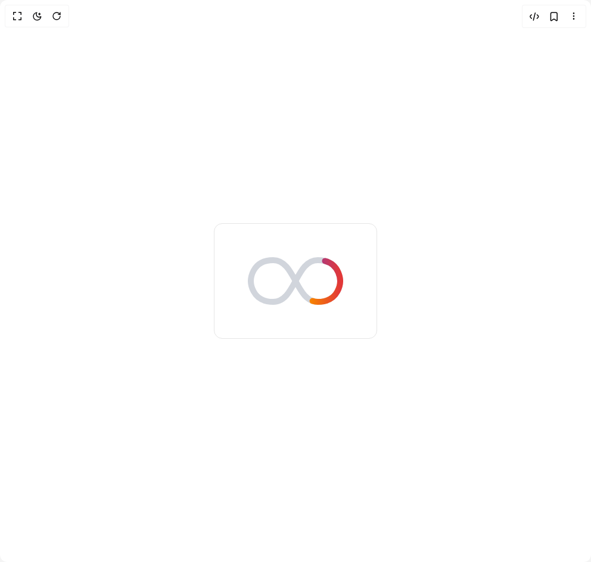

# Build Worm Loader in BuilderStudio

> Build this component in our Agentic IDE: [BuilderStudio](https://builderstudio.dev).
>
> Join the BuilderStudio community on [Discord](https://discord.gg/QdWeSGCqfe) and [Reddit](https://reddit.com/r/builderstudio).



## Component

- Author group: `ruixenui`
- Component: `worm-loader`
- Variant: `default`
- Rendered HTML snapshot: [`rendered.html`](rendered.html)

## BuilderStudio prompt

You are implementing a React component based on a component reference.

## Component identity

- Author: ruixenui
- Component slug: worm-loader
- Demo slug: default
- Title: worm-loader
- Description: 

## Goal

Recreate this component in a React + TypeScript + Tailwind CSS project. Preserve the visual layout, spacing, colors, border radius, shadows, interaction behavior, animation behavior, responsive behavior, and dark mode behavior shown in the rendered demo.

## Implementation requirements

- Use React and TypeScript.
- Use Tailwind CSS classes whenever possible.
- Keep the component self-contained unless the source files require helper components.
- If the source uses CSS variables, custom CSS, animations, or keyframes, include them.
- If the source uses external packages, list and use the required packages.
- Preserve accessibility attributes, button semantics, links, keyboard behavior, and ARIA attributes when visible in the source.
- Do not replace the component with a simplified placeholder.
- Return complete production-ready code.

## Dependencies

No reference metadata available.

## Rendered DOM snapshot

This is the rendered demo HTML extracted from the live preview. Use it to verify structure, class names, visible content, and layout.

```html
<div id="root"><div class="w-screen min-h-screen flex justify-center items-center"><div class="w-screen min-h-screen flex justify-center items-center"><div class="flex min-h-screen items-center justify-center transition-colors"><div class="rounded-xl bg-white dark:bg-gray-800 border p-8"><div class="flex items-center justify-center p-6"><svg xmlns="http://www.w3.org/2000/svg" height="128px" width="256px" viewBox="0 0 256 128" class="w-40 h-20"><defs><linearGradient y2="0" x2="1" y1="0" x1="0" id="grad1"><stop stop-color="#5ebd3e" offset="0%"></stop><stop stop-color="#ffb900" offset="33%"></stop><stop stop-color="#f78200" offset="67%"></stop><stop stop-color="#e23838" offset="100%"></stop></linearGradient><linearGradient y2="0" x2="0" y1="0" x1="1" id="grad2"><stop stop-color="#e23838" offset="0%"></stop><stop stop-color="#973999" offset="33%"></stop><stop stop-color="#009cdf" offset="67%"></stop><stop stop-color="#5ebd3e" offset="100%"></stop></linearGradient></defs><g stroke-width="16" stroke-linecap="round" fill="none"><g class="stroke-gray-300 dark:stroke-gray-800 transition-colors"><path d="M8,64s0-56,60-56,60,112,120,112,60-56,60-56"></path><path d="M248,64s0-56-60-56-60,112-120,112S8,64,8,64"></path></g><g stroke-dasharray="180 656"><path d="M8,64s0-56,60-56,60,112,120,112,60-56,60-56" stroke="url(#grad1)" class="animate-worm1"></path><path d="M248,64s0-56-60-56-60,112-120,112S8,64,8,64" stroke="url(#grad2)" class="animate-worm2"></path></g></g></svg></div></div></div></div></div></div>
```

## Reference source files

No reference source files were available.
