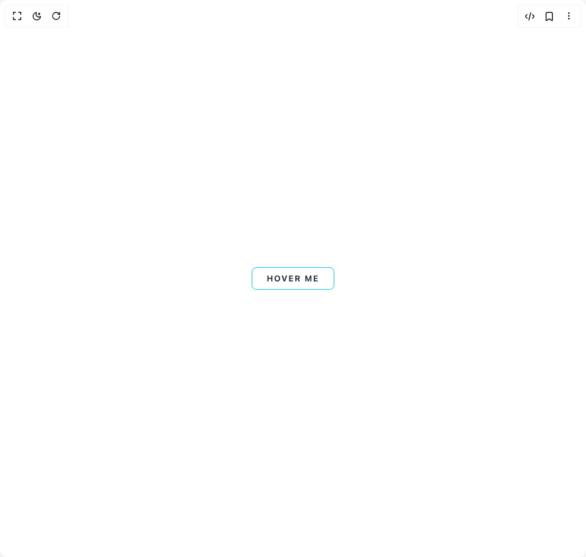
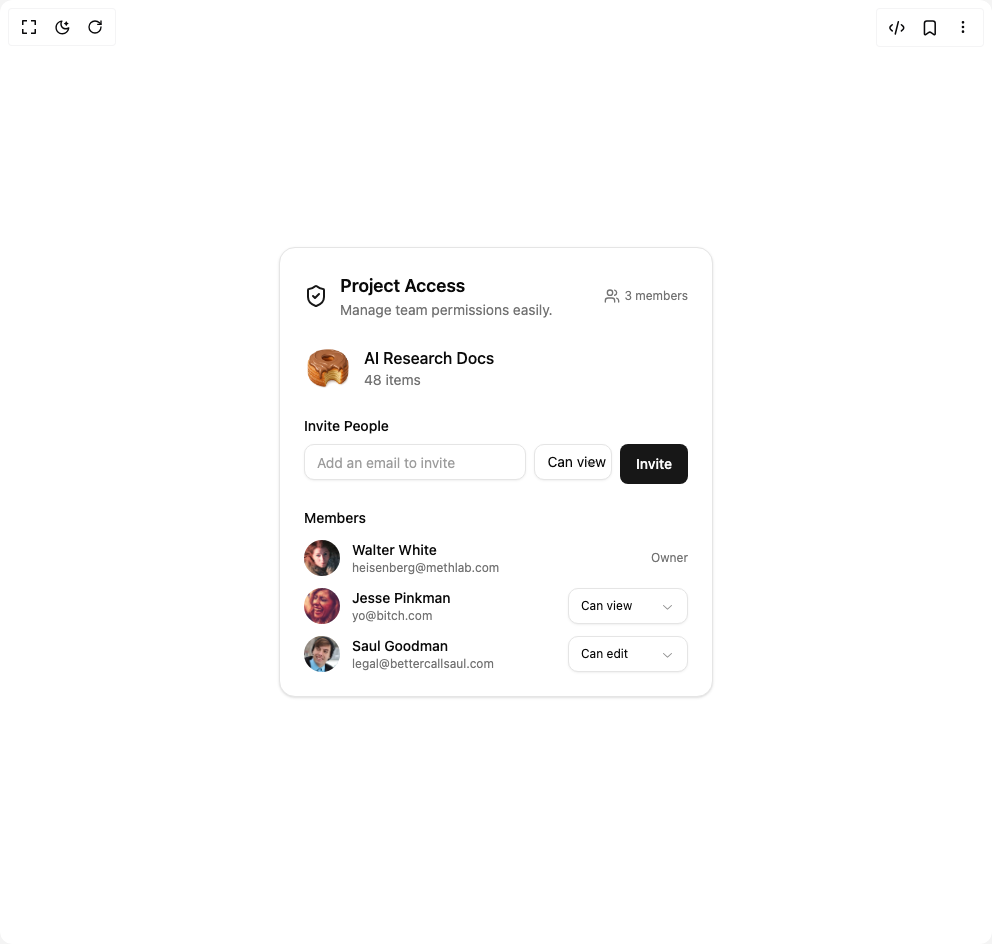
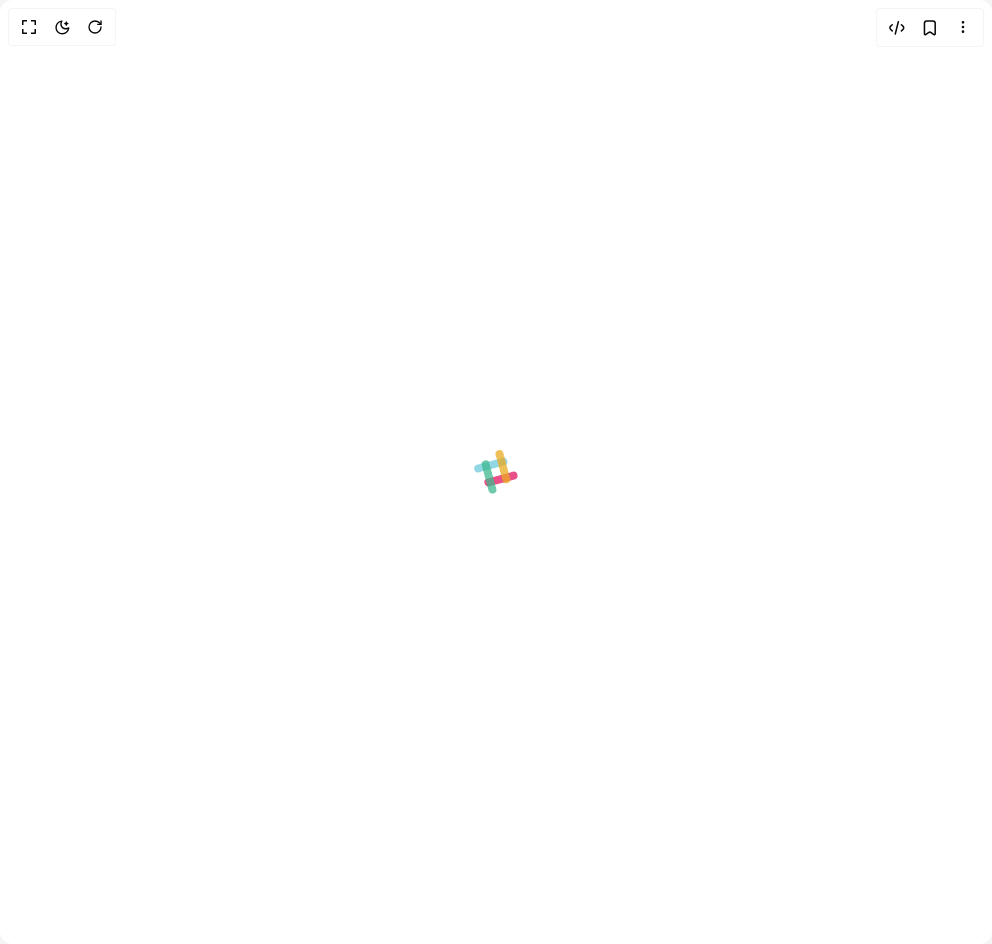
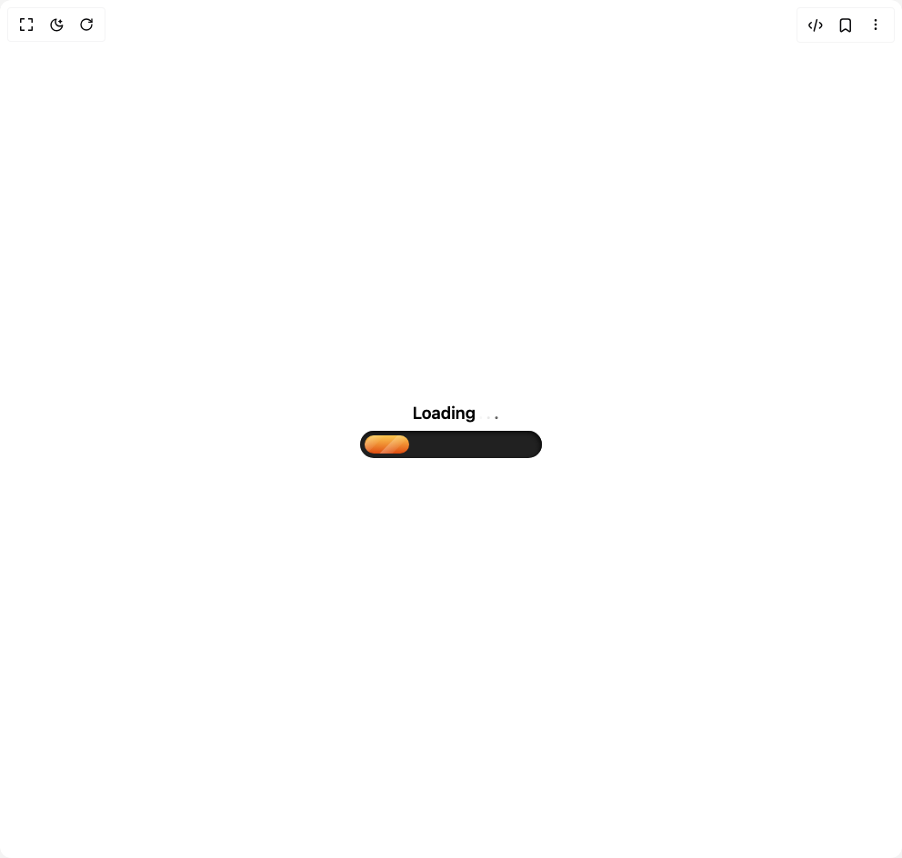
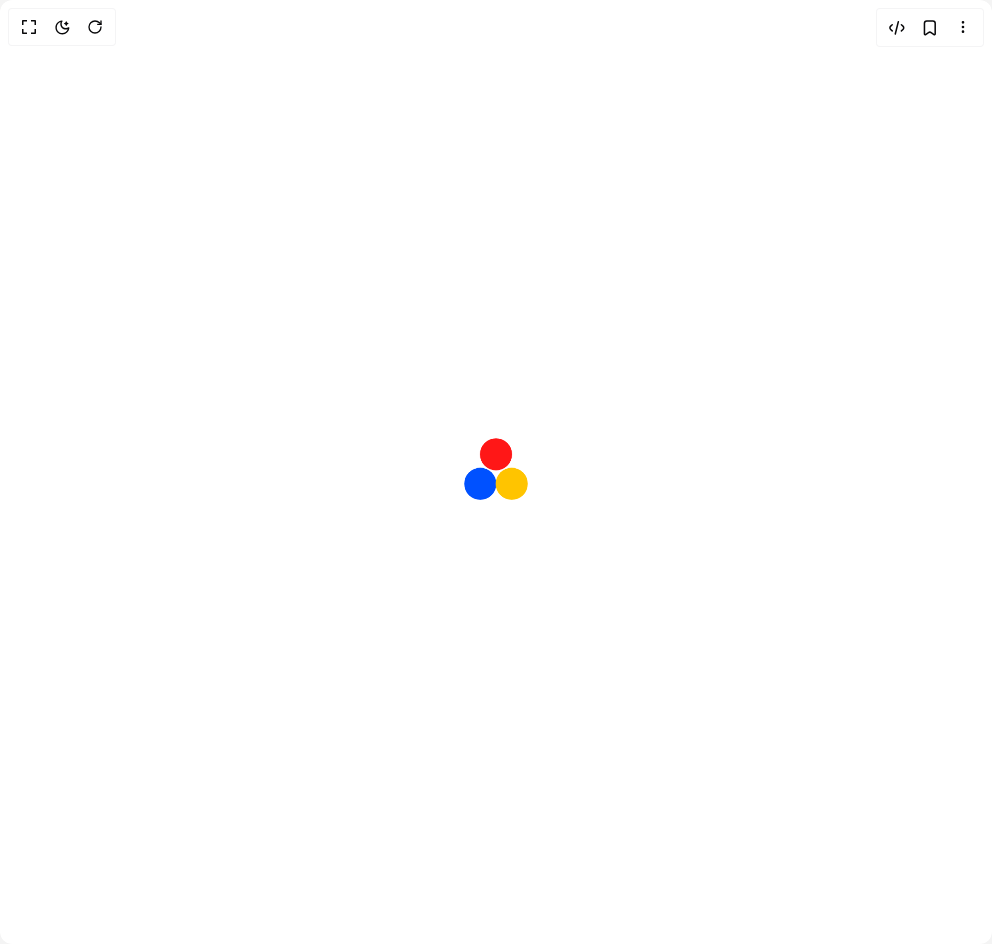
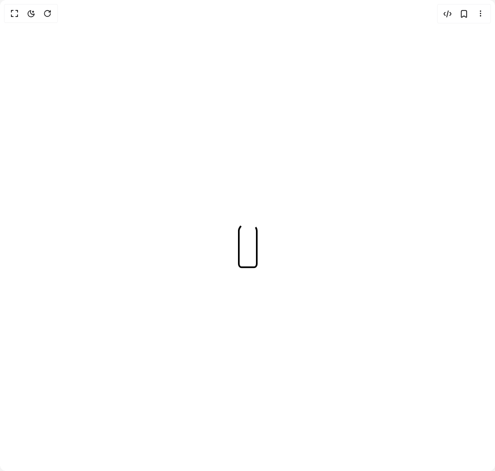
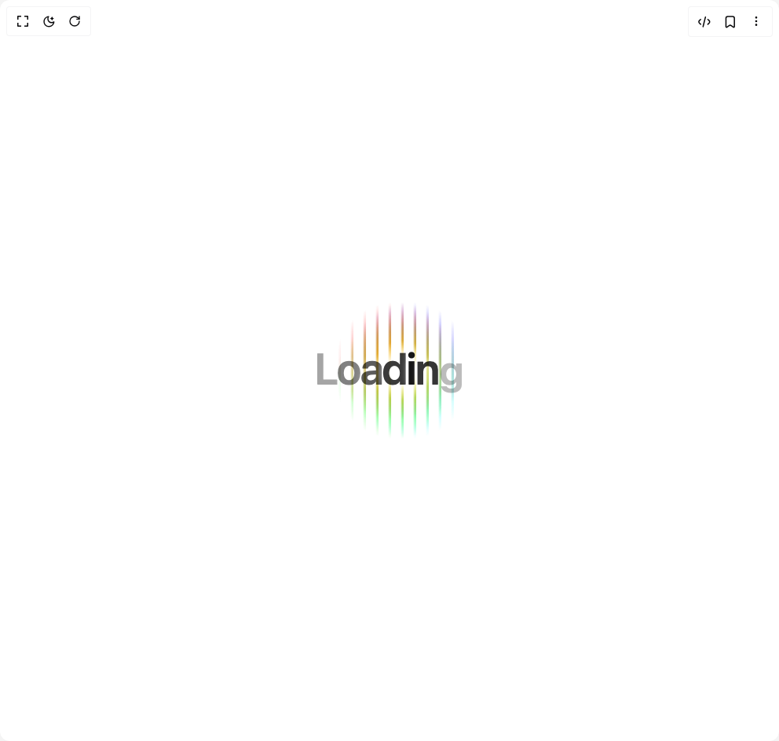
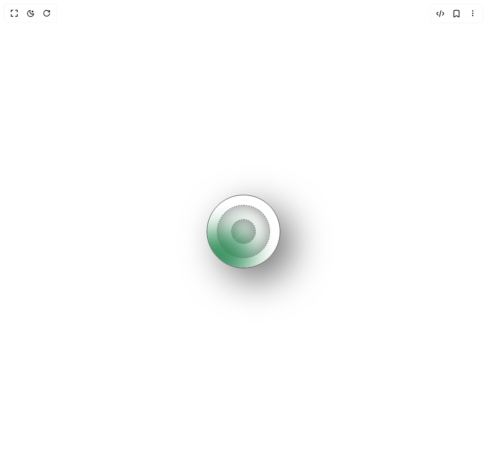

# Ruvyui Components

9 components are available in this author group.

> Build any component in [BuilderStudio](https://builderstudio.dev), then share improvements with the community on [Discord](https://discord.gg/QdWeSGCqfe) or [Reddit](https://reddit.com/r/builderstudio).

| Preview | Component | Variant |
| --- | --- | --- |
|  | [Astra Button](astra-button/default/README.md) | `default` |
|  | [Bar Loader](bar-loader/default/README.md) | `default` |
|  | [Health Stat Card](health-stat-card/default/README.md) | `default` |
|  | [Loader Grid](loader-grid/default/README.md) | `default` |
|  | [Loader Progressive Bar](loader-progressive-bar/default/README.md) | `default` |
|  | [Loader](loader/default/README.md) | `default` |
|  | [Loading Bottle](loading-bottle/default/README.md) | `default` |
|  | [Loading Lines](loading-lines/default/README.md) | `default` |
|  | [Loading Radar](loading-radar/default/README.md) | `default` |
