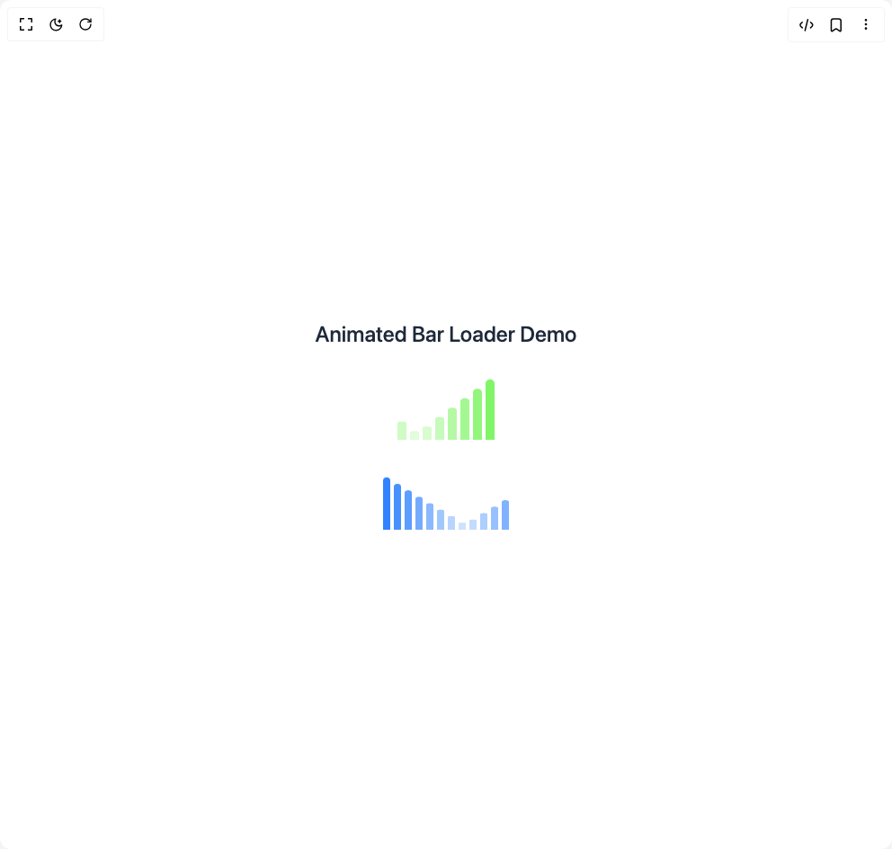

# Build Bar Loader in BuilderStudio

> Build this component in our Agentic IDE: [BuilderStudio](https://builderstudio.dev).
>
> Join the BuilderStudio community on [Discord](https://discord.gg/QdWeSGCqfe) and [Reddit](https://reddit.com/r/builderstudio).



## Component

- Author group: `ruvyui`
- Component: `bar-loader`
- Variant: `default`
- Rendered HTML snapshot: [`rendered.html`](rendered.html)

## BuilderStudio prompt

You are implementing a React component based on a component reference.

## Component identity

- Author: RuvyUI
- Component slug: bar-loader
- Demo slug: default
- Title: bar-loader
- Description: 

## Goal

Recreate this component in a React + TypeScript + Tailwind CSS project. Preserve the visual layout, spacing, colors, border radius, shadows, interaction behavior, animation behavior, responsive behavior, and dark mode behavior shown in the rendered demo.

## Implementation requirements

- Use React and TypeScript.
- Use Tailwind CSS classes whenever possible.
- Keep the component self-contained unless the source files require helper components.
- If the source uses CSS variables, custom CSS, animations, or keyframes, include them.
- If the source uses external packages, list and use the required packages.
- Preserve accessibility attributes, button semantics, links, keyboard behavior, and ARIA attributes when visible in the source.
- Do not replace the component with a simplified placeholder.
- Return complete production-ready code.

## Dependencies

No reference metadata available.

## Rendered DOM snapshot

This is the rendered demo HTML extracted from the live preview. Use it to verify structure, class names, visible content, and layout.

```html
<div id="root"><div class="w-screen min-h-screen flex justify-center items-center"><div class="w-screen min-h-screen flex justify-center items-center"><div class="flex flex-col items-center justify-center"><h1 class="text-2xl font-medium mb-8 text-gray-800 dark:text-gray-200">Animated Bar Loader Demo</h1><div class="relative flex justify-center items-end gap-1 mb-10"><div class="bg-[#7CF562] rounded-t-xl origin-bottom animate-barLoader" style="width: 10px; height: 70px; animation-delay: 0.1s; animation-duration: 1.2s;"></div><div class="bg-[#7CF562] rounded-t-xl origin-bottom animate-barLoader" style="width: 10px; height: 70px; animation-delay: 0.2s; animation-duration: 1.2s;"></div><div class="bg-[#7CF562] rounded-t-xl origin-bottom animate-barLoader" style="width: 10px; height: 70px; animation-delay: 0.3s; animation-duration: 1.2s;"></div><div class="bg-[#7CF562] rounded-t-xl origin-bottom animate-barLoader" style="width: 10px; height: 70px; animation-delay: 0.4s; animation-duration: 1.2s;"></div><div class="bg-[#7CF562] rounded-t-xl origin-bottom animate-barLoader" style="width: 10px; height: 70px; animation-delay: 0.5s; animation-duration: 1.2s;"></div><div class="bg-[#7CF562] rounded-t-xl origin-bottom animate-barLoader" style="width: 10px; height: 70px; animation-delay: 0.6s; animation-duration: 1.2s;"></div><div class="bg-[#7CF562] rounded-t-xl origin-bottom animate-barLoader" style="width: 10px; height: 70px; animation-delay: 0.7s; animation-duration: 1.2s;"></div><div class="bg-[#7CF562] rounded-t-xl origin-bottom animate-barLoader" style="width: 10px; height: 70px; animation-delay: 0.8s; animation-duration: 1.2s;"></div></div><div class="relative flex justify-center items-end gap-1 undefined"><div class="bg-blue-500 dark:bg-blue-300 rounded-t-xl origin-bottom animate-barLoader" style="width: 8px; height: 60px; animation-delay: 0.1s; animation-duration: 1.5s;"></div><div class="bg-blue-500 dark:bg-blue-300 rounded-t-xl origin-bottom animate-barLoader" style="width: 8px; height: 60px; animation-delay: 0.2s; animation-duration: 1.5s;"></div><div class="bg-blue-500 dark:bg-blue-300 rounded-t-xl origin-bottom animate-barLoader" style="width: 8px; height: 60px; animation-delay: 0.3s; animation-duration: 1.5s;"></div><div class="bg-blue-500 dark:bg-blue-300 rounded-t-xl origin-bottom animate-barLoader" style="width: 8px; height: 60px; animation-delay: 0.4s; animation-duration: 1.5s;"></div><div class="bg-blue-500 dark:bg-blue-300 rounded-t-xl origin-bottom animate-barLoader" style="width: 8px; height: 60px; animation-delay: 0.5s; animation-duration: 1.5s;"></div><div class="bg-blue-500 dark:bg-blue-300 rounded-t-xl origin-bottom animate-barLoader" style="width: 8px; height: 60px; animation-delay: 0.6s; animation-duration: 1.5s;"></div><div class="bg-blue-500 dark:bg-blue-300 rounded-t-xl origin-bottom animate-barLoader" style="width: 8px; height: 60px; animation-delay: 0.7s; animation-duration: 1.5s;"></div><div class="bg-blue-500 dark:bg-blue-300 rounded-t-xl origin-bottom animate-barLoader" style="width: 8px; height: 60px; animation-delay: 0.8s; animation-duration: 1.5s;"></div><div class="bg-blue-500 dark:bg-blue-300 rounded-t-xl origin-bottom animate-barLoader" style="width: 8px; height: 60px; animation-delay: 0.9s; animation-duration: 1.5s;"></div><div class="bg-blue-500 dark:bg-blue-300 rounded-t-xl origin-bottom animate-barLoader" style="width: 8px; height: 60px; animation-delay: 1s; animation-duration: 1.5s;"></div><div class="bg-blue-500 dark:bg-blue-300 rounded-t-xl origin-bottom animate-barLoader" style="width: 8px; height: 60px; animation-delay: 1.1s; animation-duration: 1.5s;"></div><div class="bg-blue-500 dark:bg-blue-300 rounded-t-xl origin-bottom animate-barLoader" style="width: 8px; height: 60px; animation-delay: 1.2s; animation-duration: 1.5s;"></div></div></div></div></div></div>
```

## Reference source files

No reference source files were available.
