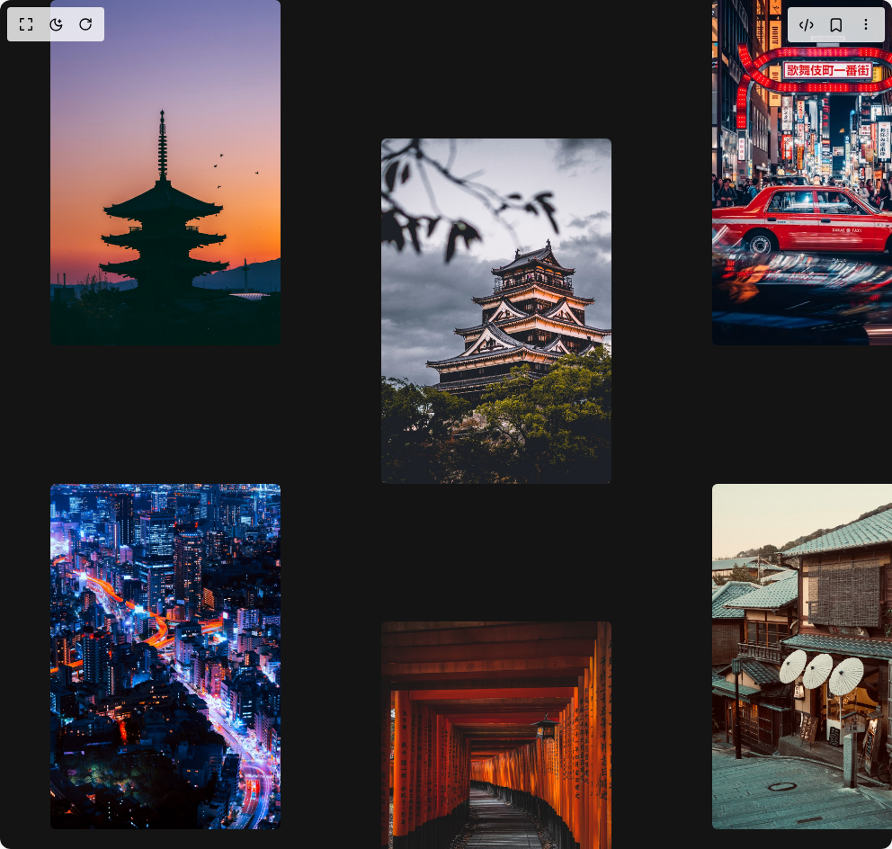

# Build Infinite Drag Scroll in BuilderStudio

> Build this component in our Agentic IDE: [BuilderStudio](https://builderstudio.dev).
>
> Join the BuilderStudio community on [Discord](https://discord.gg/QdWeSGCqfe) and [Reddit](https://reddit.com/r/builderstudio).



## Component

- Author group: `rylenlobo`
- Component: `infinite-drag-scroll`
- Variant: `default`
- Rendered HTML snapshot: [`rendered.html`](rendered.html)

## BuilderStudio prompt

You are implementing a React component based on a component reference.

## Component identity

- Author: rylenlobo
- Component slug: infinite-drag-scroll
- Demo slug: default
- Title: infinite-drag-scroll
- Description: 

## Goal

Recreate this component in a React + TypeScript + Tailwind CSS project. Preserve the visual layout, spacing, colors, border radius, shadows, interaction behavior, animation behavior, responsive behavior, and dark mode behavior shown in the rendered demo.

## Implementation requirements

- Use React and TypeScript.
- Use Tailwind CSS classes whenever possible.
- Keep the component self-contained unless the source files require helper components.
- If the source uses CSS variables, custom CSS, animations, or keyframes, include them.
- If the source uses external packages, list and use the required packages.
- Preserve accessibility attributes, button semantics, links, keyboard behavior, and ARIA attributes when visible in the source.
- Do not replace the component with a simplified placeholder.
- Return complete production-ready code.

## Dependencies

No reference metadata available.

## Rendered DOM snapshot

This is the rendered demo HTML extracted from the live preview. Use it to verify structure, class names, visible content, and layout.

```html
<div id="root"><div class="h-dvh overflow-hidden"><div class="h-dvh overflow-hidden"><div class="grid h-fit w-fit cursor-grab grid-cols-[repeat(2,1fr)] bg-[#141414] active:cursor-grabbing will-change-transform" draggable="false" style="transform: none; user-select: none; touch-action: none;"><div class="grid grid-cols-[repeat(6,1fr)] h-fit w-fit gap-x-14 px-7 md:gap-x-28 md:px-14"><div class="overflow-hidden hover:cursor-pointer will-change-transform even:mt-[60%] rounded-sm relative h-54 w-36 md:h-96 md:w-64" style="opacity: 1; transform: none;"></div><div class="overflow-hidden hover:cursor-pointer will-change-transform even:mt-[60%] rounded-sm relative h-54 w-36 md:h-96 md:w-64" style="opacity: 1; transform: none;"></div><div class="overflow-hidden hover:cursor-pointer will-change-transform even:mt-[60%] rounded-sm relative h-54 w-36 md:h-96 md:w-64" style="opacity: 1; transform: none;"></div><div class="overflow-hidden hover:cursor-pointer will-change-transform even:mt-[60%] rounded-sm relative h-54 w-36 md:h-96 md:w-64" style="opacity: 1; transform: none;"></div><div class="overflow-hidden hover:cursor-pointer will-change-transform even:mt-[60%] rounded-sm relative h-54 w-36 md:h-96 md:w-64" style="opacity: 1; transform: none;"></div><div class="overflow-hidden hover:cursor-pointer will-change-transform even:mt-[60%] rounded-sm relative h-54 w-36 md:h-96 md:w-64" style="opacity: 1; transform: none;"></div><div class="overflow-hidden hover:cursor-pointer will-change-transform even:mt-[60%] rounded-sm relative h-54 w-36 md:h-96 md:w-64" style="opacity: 1; transform: none;"></div><div class="overflow-hidden hover:cursor-pointer will-change-transform even:mt-[60%] rounded-sm relative h-54 w-36 md:h-96 md:w-64" style="opacity: 1; transform: none;"></div><div class="overflow-hidden hover:cursor-pointer will-change-transform even:mt-[60%] rounded-sm relative h-54 w-36 md:h-96 md:w-64" style="opacity: 1; transform: none;"></div><div class="overflow-hidden hover:cursor-pointer will-change-transform even:mt-[60%] rounded-sm relative h-54 w-36 md:h-96 md:w-64" style="opacity: 1; transform: none;"></div><div class="overflow-hidden hover:cursor-pointer will-change-transform even:mt-[60%] rounded-sm relative h-54 w-36 md:h-96 md:w-64" style="opacity: 1; transform: none;"></div><div class="overflow-hidden hover:cursor-pointer will-change-transform even:mt-[60%] rounded-sm relative h-54 w-36 md:h-96 md:w-64" style="opacity: 1; transform: none;"></div><div class="overflow-hidden hover:cursor-pointer will-change-transform even:mt-[60%] rounded-sm relative h-54 w-36 md:h-96 md:w-64" style="opacity: 1; transform: none;"></div><div class="overflow-hidden hover:cursor-pointer will-change-transform even:mt-[60%] rounded-sm relative h-54 w-36 md:h-96 md:w-64" style="opacity: 1; transform: none;"></div><div class="overflow-hidden hover:cursor-pointer will-change-transform even:mt-[60%] rounded-sm relative h-54 w-36 md:h-96 md:w-64" style="opacity: 1; transform: none;"></div><div class="overflow-hidden hover:cursor-pointer will-change-transform even:mt-[60%] rounded-sm relative h-54 w-36 md:h-96 md:w-64" style="opacity: 1; transform: none;"></div><div class="overflow-hidden hover:cursor-pointer will-change-transform even:mt-[60%] rounded-sm relative h-54 w-36 md:h-96 md:w-64" style="opacity: 1; transform: none;"></div><div class="overflow-hidden hover:cursor-pointer will-change-transform even:mt-[60%] rounded-sm relative h-54 w-36 md:h-96 md:w-64" style="opacity: 1; transform: none;"></div></div><div class="grid grid-cols-[repeat(6,1fr)] h-fit w-fit gap-x-14 px-7 md:gap-x-28 md:px-14"><div class="overflow-hidden hover:cursor-pointer will-change-transform even:mt-[60%] rounded-sm relative h-54 w-36 md:h-96 md:w-64" style="opacity: 1; transform: none;"></div><div class="overflow-hidden hover:cursor-pointer will-change-transform even:mt-[60%] rounded-sm relative h-54 w-36 md:h-96 md:w-64" style="opacity: 1; transform: none;"></div><div class="overflow-hidden hover:cursor-pointer will-change-transform even:mt-[60%] rounded-sm relative h-54 w-36 md:h-96 md:w-64" style="opacity: 1; transform: none;"></div><div class="overflow-hidden hover:cursor-pointer will-change-transform even:mt-[60%] rounded-sm relative h-54 w-36 md:h-96 md:w-64" style="opacity: 1; transform: none;"></div><div class="overflow-hidden hover:cursor-pointer will-change-transform even:mt-[60%] rounded-sm relative h-54 w-36 md:h-96 md:w-64" style="opacity: 1; transform: none;"></div><div class="overflow-hidden hover:cursor-pointer will-change-transform even:mt-[60%] rounded-sm relative h-54 w-36 md:h-96 md:w-64" style="opacity: 1; transform: none;"></div><div class="overflow-hidden hover:cursor-pointer will-change-transform even:mt-[60%] rounded-sm relative h-54 w-36 md:h-96 md:w-64" style="opacity: 1; transform: none;"></div><div class="overflow-hidden hover:cursor-pointer will-change-transform even:mt-[60%] rounded-sm relative h-54 w-36 md:h-96 md:w-64" style="opacity: 1; transform: none;"></div><div class="overflow-hidden hover:cursor-pointer will-change-transform even:mt-[60%] rounded-sm relative h-54 w-36 md:h-96 md:w-64" style="opacity: 1; transform: none;"></div><div class="overflow-hidden hover:cursor-pointer will-change-transform even:mt-[60%] rounded-sm relative h-54 w-36 md:h-96 md:w-64" style="opacity: 1; transform: none;"></div><div class="overflow-hidden hover:cursor-pointer will-change-transform even:mt-[60%] rounded-sm relative h-54 w-36 md:h-96 md:w-64" style="opacity: 1; transform: none;"></div><div class="overflow-hidden hover:cursor-pointer will-change-transform even:mt-[60%] rounded-sm relative h-54 w-36 md:h-96 md:w-64" style="opacity: 1; transform: none;"></div><div class="overflow-hidden hover:cursor-pointer will-change-transform even:mt-[60%] rounded-sm relative h-54 w-36 md:h-96 md:w-64" style="opacity: 1; transform: none;"></div><div class="overflow-hidden hover:cursor-pointer will-change-transform even:mt-[60%] rounded-sm relative h-54 w-36 md:h-96 md:w-64" style="opacity: 1; transform: none;"></div><div class="overflow-hidden hover:cursor-pointer will-change-transform even:mt-[60%] rounded-sm relative h-54 w-36 md:h-96 md:w-64" style="opacity: 1; transform: none;"></div><div class="overflow-hidden hover:cursor-pointer will-change-transform even:mt-[60%] rounded-sm relative h-54 w-36 md:h-96 md:w-64" style="opacity: 1; transform: none;"></div><div class="overflow-hidden hover:cursor-pointer will-change-transform even:mt-[60%] rounded-sm relative h-54 w-36 md:h-96 md:w-64" style="opacity: 1; transform: none;"></div><div class="overflow-hidden hover:cursor-pointer will-change-transform even:mt-[60%] rounded-sm relative h-54 w-36 md:h-96 md:w-64" style="opacity: 1; transform: none;"></div></div><div class="grid grid-cols-[repeat(6,1fr)] h-fit w-fit gap-x-14 px-7 md:gap-x-28 md:px-14"><div class="overflow-hidden hover:cursor-pointer will-change-transform even:mt-[60%] rounded-sm relative h-54 w-36 md:h-96 md:w-64" style="opacity: 1; transform: none;"></div><div class="overflow-hidden hover:cursor-pointer will-change-transform even:mt-[60%] rounded-sm relative h-54 w-36 md:h-96 md:w-64" style="opacity: 1; transform: none;"></div><div class="overflow-hidden hover:cursor-pointer will-change-transform even:mt-[60%] rounded-sm relative h-54 w-36 md:h-96 md:w-64" style="opacity: 1; transform: none;"></div><div class="overflow-hidden hover:cursor-pointer will-change-transform even:mt-[60%] rounded-sm relative h-54 w-36 md:h-96 md:w-64" style="opacity: 1; transform: none;"></div><div class="overflow-hidden hover:cursor-pointer will-change-transform even:mt-[60%] rounded-sm relative h-54 w-36 md:h-96 md:w-64" style="opacity: 1; transform: none;"></div><div class="overflow-hidden hover:cursor-pointer will-change-transform even:mt-[60%] rounded-sm relative h-54 w-36 md:h-96 md:w-64" style="opacity: 1; transform: none;"></div><div class="overflow-hidden hover:cursor-pointer will-change-transform even:mt-[60%] rounded-sm relative h-54 w-36 md:h-96 md:w-64" style="opacity: 1; transform: none;"></div><div class="overflow-hidden hover:cursor-pointer will-change-transform even:mt-[60%] rounded-sm relative h-54 w-36 md:h-96 md:w-64" style="opacity: 1; transform: none;"></div><div class="overflow-hidden hover:cursor-pointer will-change-transform even:mt-[60%] rounded-sm relative h-54 w-36 md:h-96 md:w-64" style="opacity: 1; transform: none;"></div><div class="overflow-hidden hover:cursor-pointer will-change-transform even:mt-[60%] rounded-sm relative h-54 w-36 md:h-96 md:w-64" style="opacity: 1; transform: none;"></div><div class="overflow-hidden hover:cursor-pointer will-change-transform even:mt-[60%] rounded-sm relative h-54 w-36 md:h-96 md:w-64" style="opacity: 1; transform: none;"></div><div class="overflow-hidden hover:cursor-pointer will-change-transform even:mt-[60%] rounded-sm relative h-54 w-36 md:h-96 md:w-64" style="opacity: 1; transform: none;"></div><div class="overflow-hidden hover:cursor-pointer will-change-transform even:mt-[60%] rounded-sm relative h-54 w-36 md:h-96 md:w-64" style="opacity: 1; transform: none;"></div><div class="overflow-hidden hover:cursor-pointer will-change-transform even:mt-[60%] rounded-sm relative h-54 w-36 md:h-96 md:w-64" style="opacity: 1; transform: none;"></div><div class="overflow-hidden hover:cursor-pointer will-change-transform even:mt-[60%] rounded-sm relative h-54 w-36 md:h-96 md:w-64" style="opacity: 1; transform: none;"></div><div class="overflow-hidden hover:cursor-pointer will-change-transform even:mt-[60%] rounded-sm relative h-54 w-36 md:h-96 md:w-64" style="opacity: 1; transform: none;"></div><div class="overflow-hidden hover:cursor-pointer will-change-transform even:mt-[60%] rounded-sm relative h-54 w-36 md:h-96 md:w-64" style="opacity: 1; transform: none;"></div><div class="overflow-hidden hover:cursor-pointer will-change-transform even:mt-[60%] rounded-sm relative h-54 w-36 md:h-96 md:w-64" style="opacity: 1; transform: none;"></div></div><div class="grid grid-cols-[repeat(6,1fr)] h-fit w-fit gap-x-14 px-7 md:gap-x-28 md:px-14"><div class="overflow-hidden hover:cursor-pointer will-change-transform even:mt-[60%] rounded-sm relative h-54 w-36 md:h-96 md:w-64" style="opacity: 1; transform: none;"></div><div class="overflow-hidden hover:cursor-pointer will-change-transform even:mt-[60%] rounded-sm relative h-54 w-36 md:h-96 md:w-64" style="opacity: 1; transform: none;"></div><div class="overflow-hidden hover:cursor-pointer will-change-transform even:mt-[60%] rounded-sm relative h-54 w-36 md:h-96 md:w-64" style="opacity: 1; transform: none;"></div><div class="overflow-hidden hover:cursor-pointer will-change-transform even:mt-[60%] rounded-sm relative h-54 w-36 md:h-96 md:w-64" style="opacity: 1; transform: none;"></div><div class="overflow-hidden hover:cursor-pointer will-change-transform even:mt-[60%] rounded-sm relative h-54 w-36 md:h-96 md:w-64" style="opacity: 1; transform: none;"></div><div class="overflow-hidden hover:cursor-pointer will-change-transform even:mt-[60%] rounded-sm relative h-54 w-36 md:h-96 md:w-64" style="opacity: 1; transform: none;"></div><div class="overflow-hidden hover:cursor-pointer will-change-transform even:mt-[60%] rounded-sm relative h-54 w-36 md:h-96 md:w-64" style="opacity: 1; transform: none;"></div><div class="overflow-hidden hover:cursor-pointer will-change-transform even:mt-[60%] rounded-sm relative h-54 w-36 md:h-96 md:w-64" style="opacity: 1; transform: none;"></div><div class="overflow-hidden hover:cursor-pointer will-change-transform even:mt-[60%] rounded-sm relative h-54 w-36 md:h-96 md:w-64" style="opacity: 1; transform: none;"></div><div class="overflow-hidden hover:cursor-pointer will-change-transform even:mt-[60%] rounded-sm relative h-54 w-36 md:h-96 md:w-64" style="opacity: 1; transform: none;"></div><div class="overflow-hidden hover:cursor-pointer will-change-transform even:mt-[60%] rounded-sm relative h-54 w-36 md:h-96 md:w-64" style="opacity: 1; transform: none;"></div><div class="overflow-hidden hover:cursor-pointer will-change-transform even:mt-[60%] rounded-sm relative h-54 w-36 md:h-96 md:w-64" style="opacity: 1; transform: none;"></div><div class="overflow-hidden hover:cursor-pointer will-change-transform even:mt-[60%] rounded-sm relative h-54 w-36 md:h-96 md:w-64" style="opacity: 1; transform: none;"></div><div class="overflow-hidden hover:cursor-pointer will-change-transform even:mt-[60%] rounded-sm relative h-54 w-36 md:h-96 md:w-64" style="opacity: 1; transform: none;"></div><div class="overflow-hidden hover:cursor-pointer will-change-transform even:mt-[60%] rounded-sm relative h-54 w-36 md:h-96 md:w-64" style="opacity: 1; transform: none;"></div><div class="overflow-hidden hover:cursor-pointer will-change-transform even:mt-[60%] rounded-sm relative h-54 w-36 md:h-96 md:w-64" style="opacity: 1; transform: none;"></div><div class="overflow-hidden hover:cursor-pointer will-change-transform even:mt-[60%] rounded-sm relative h-54 w-36 md:h-96 md:w-64" style="opacity: 1; transform: none;"></div><div class="overflow-hidden hover:cursor-pointer will-change-transform even:mt-[60%] rounded-sm relative h-54 w-36 md:h-96 md:w-64" style="opacity: 1; transform: none;"></div></div></div></div></div></div>
```

## Reference source files

No reference source files were available.
