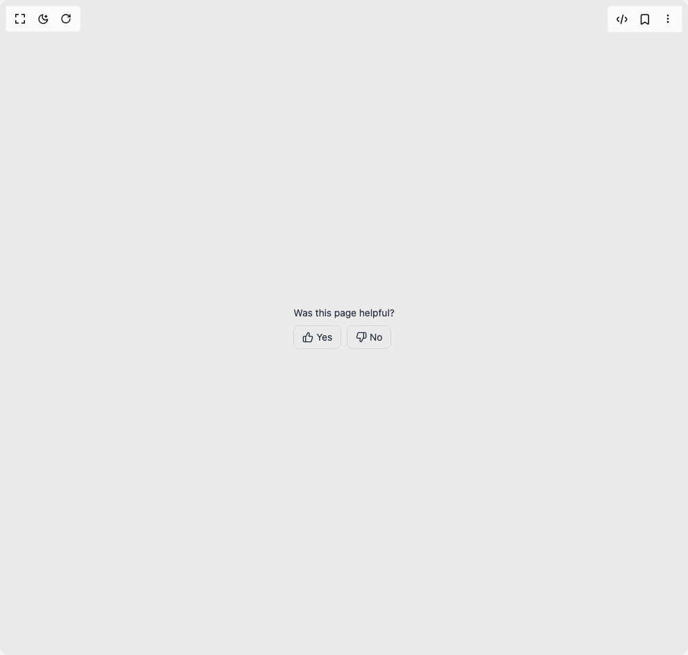

# Build Feedback Prompt in BuilderStudio

> Build this component in our Agentic IDE: [BuilderStudio](https://builderstudio.dev).
>
> Join the BuilderStudio community on [Discord](https://discord.gg/QdWeSGCqfe) and [Reddit](https://reddit.com/r/builderstudio).



## Component

- Author group: `samhimself`
- Component: `feedback-prompt`
- Variant: `default`
- Rendered HTML snapshot: [`rendered.html`](rendered.html)

## BuilderStudio prompt

You are implementing a React component based on a component reference.

## Component identity

- Author: samhimself
- Component slug: feedback-prompt
- Demo slug: default
- Title: feedback-prompt
- Description: 

## Goal

Recreate this component in a React + TypeScript + Tailwind CSS project. Preserve the visual layout, spacing, colors, border radius, shadows, interaction behavior, animation behavior, responsive behavior, and dark mode behavior shown in the rendered demo.

## Implementation requirements

- Use React and TypeScript.
- Use Tailwind CSS classes whenever possible.
- Keep the component self-contained unless the source files require helper components.
- If the source uses CSS variables, custom CSS, animations, or keyframes, include them.
- If the source uses external packages, list and use the required packages.
- Preserve accessibility attributes, button semantics, links, keyboard behavior, and ARIA attributes when visible in the source.
- Do not replace the component with a simplified placeholder.
- Return complete production-ready code.

## Dependencies

No reference metadata available.

## Rendered DOM snapshot

This is the rendered demo HTML extracted from the live preview. Use it to verify structure, class names, visible content, and layout.

```html
<div id="root"><div class="w-screen min-h-screen flex justify-center items-center"><div class="w-screen min-h-screen flex justify-center items-center"><div class="flex flex-col items-start gap-2 text-gray-800 dark:text-gray-200"><span class="text-sm">Was this page helpful?</span><div class="flex gap-2 animate-fade-in"><button class="flex items-center gap-1 rounded-md border px-3 py-1.5 text-sm transition-all duration-200 ease-out hover:scale-105 active:scale-95 border-gray-300 hover:border-gray-400 dark:border-gray-700 dark:hover:border-gray-600 hover:bg-gray-50 dark:hover:bg-gray-800"><svg xmlns="http://www.w3.org/2000/svg" width="24" height="24" viewBox="0 0 24 24" fill="none" stroke="currentColor" stroke-width="2" stroke-linecap="round" stroke-linejoin="round" class="lucide lucide-thumbs-up h-4 w-4" aria-hidden="true"><path d="M7 10v12"></path><path d="M15 5.88 14 10h5.83a2 2 0 0 1 1.92 2.56l-2.33 8A2 2 0 0 1 17.5 22H4a2 2 0 0 1-2-2v-8a2 2 0 0 1 2-2h2.76a2 2 0 0 0 1.79-1.11L12 2a3.13 3.13 0 0 1 3 3.88Z"></path></svg>Yes</button><button class="flex items-center gap-1 rounded-md border px-3 py-1.5 text-sm transition-all duration-200 ease-out hover:scale-105 active:scale-95 border-gray-300 hover:border-gray-400 dark:border-gray-700 dark:hover:border-gray-600 hover:bg-gray-50 dark:hover:bg-gray-800"><svg xmlns="http://www.w3.org/2000/svg" width="24" height="24" viewBox="0 0 24 24" fill="none" stroke="currentColor" stroke-width="2" stroke-linecap="round" stroke-linejoin="round" class="lucide lucide-thumbs-down h-4 w-4" aria-hidden="true"><path d="M17 14V2"></path><path d="M9 18.12 10 14H4.17a2 2 0 0 1-1.92-2.56l2.33-8A2 2 0 0 1 6.5 2H20a2 2 0 0 1 2 2v8a2 2 0 0 1-2 2h-2.76a2 2 0 0 0-1.79 1.11L12 22a3.13 3.13 0 0 1-3-3.88Z"></path></svg>No</button></div></div></div></div></div>
```

## Reference source files

No reference source files were available.
